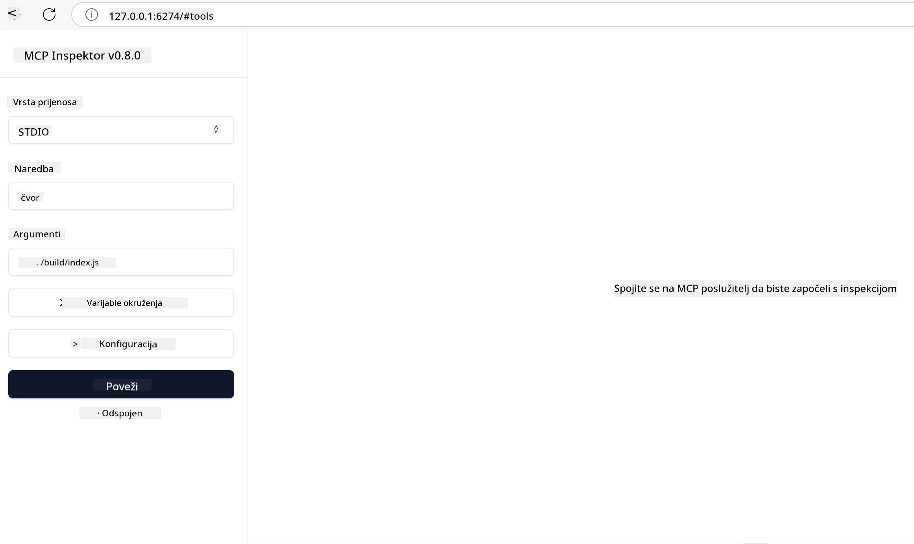

<!--
CO_OP_TRANSLATOR_METADATA:
{
  "original_hash": "717f34718a773f6cf52d8445e40a96bf",
  "translation_date": "2025-05-17T12:48:39+00:00",
  "source_file": "03-GettingStarted/07-testing/README.md",
  "language_code": "hr"
}
-->
## Testiranje i Debugiranje

Prije nego što započnete testiranje vašeg MCP servera, važno je razumjeti dostupne alate i najbolje prakse za debugiranje. Učinkovito testiranje osigurava da vaš server radi kako je očekivano i pomaže vam brzo identificirati i riješiti probleme. Sljedeći odjeljak opisuje preporučene pristupe za validaciju vaše MCP implementacije.

## Pregled

Ova lekcija pokriva kako odabrati pravi pristup testiranju i najučinkovitiji alat za testiranje.

## Ciljevi učenja

Na kraju ove lekcije, moći ćete:

- Opisati različite pristupe testiranju.
- Koristiti različite alate za učinkovito testiranje vašeg koda.

## Testiranje MCP servera

MCP pruža alate koji vam pomažu u testiranju i debugiranju vaših servera:

- **MCP Inspector**: Alat za komandnu liniju koji se može koristiti i kao CLI alat i kao vizualni alat.
- **Ručno testiranje**: Možete koristiti alat poput curl za pokretanje web zahtjeva, ali bilo koji alat sposoban za pokretanje HTTP-a će biti dobar.
- **Jedinično testiranje**: Moguće je koristiti vaš preferirani okvir za testiranje kako biste testirali značajke i servera i klijenta.

### Korištenje MCP Inspectora

Opisali smo korištenje ovog alata u prethodnim lekcijama, ali pričajmo o njemu malo na visokoj razini. To je alat izgrađen u Node.js-u i možete ga koristiti pozivanjem `npx` izvršnog programa koji će privremeno preuzeti i instalirati sam alat te će se očistiti nakon što završi s pokretanjem vašeg zahtjeva.

[MCP Inspector](https://github.com/modelcontextprotocol/inspector) vam pomaže:

- **Otkrivanje sposobnosti servera**: Automatski otkriva dostupne resurse, alate i upite
- **Testiranje izvršenja alata**: Isprobajte različite parametre i vidite odgovore u stvarnom vremenu
- **Pregled metapodataka servera**: Ispitajte informacije o serveru, sheme i konfiguracije

Tipično pokretanje alata izgleda ovako:

```bash
npx @modelcontextprotocol/inspector node build/index.js
```

Gore navedena naredba pokreće MCP i njegovu vizualnu sučelje te pokreće lokalno web sučelje u vašem pregledniku. Možete očekivati da ćete vidjeti kontrolnu ploču koja prikazuje vaše registrirane MCP servere, njihove dostupne alate, resurse i upite. Sučelje vam omogućuje interaktivno testiranje izvršenja alata, pregled metapodataka servera i pregled odgovora u stvarnom vremenu, što olakšava validaciju i debugiranje vaših MCP server implementacija.

Evo kako to može izgledati: 

Također možete pokrenuti ovaj alat u CLI načinu, u kojem slučaju dodajete atribut `--cli`. Evo primjera pokretanja alata u "CLI" načinu koji prikazuje sve alate na serveru:

```sh
npx @modelcontextprotocol/inspector --cli node build/index.js --method tools/list
```

### Ručno testiranje

Osim pokretanja alata za inspekciju za testiranje sposobnosti servera, drugi sličan pristup je pokretanje klijenta sposobnog za korištenje HTTP-a, kao što je curl.

S curlom, možete direktno testirati MCP servere koristeći HTTP zahtjeve:

```bash
# Example: Test server metadata
curl http://localhost:3000/v1/metadata

# Example: Execute a tool
curl -X POST http://localhost:3000/v1/tools/execute \
  -H "Content-Type: application/json" \
  -d '{"name": "calculator", "parameters": {"expression": "2+2"}}'
```

Kao što možete vidjeti iz gore navedenog korištenja curla, koristite POST zahtjev za pozivanje alata koristeći payload koji se sastoji od imena alata i njegovih parametara. Koristite pristup koji vam najbolje odgovara. CLI alati općenito su brži za korištenje i pogodni su za skriptiranje, što može biti korisno u CI/CD okruženju.

### Jedinično testiranje

Kreirajte jedinične testove za vaše alate i resurse kako biste osigurali da rade kako se očekuje. Evo nekog primjer koda za testiranje.

```python
import pytest

from mcp.server.fastmcp import FastMCP
from mcp.shared.memory import (
    create_connected_server_and_client_session as create_session,
)

# Mark the whole module for async tests
pytestmark = pytest.mark.anyio


async def test_list_tools_cursor_parameter():
    """Test that the cursor parameter is accepted for list_tools.

    Note: FastMCP doesn't currently implement pagination, so this test
    only verifies that the cursor parameter is accepted by the client.
    """

 server = FastMCP("test")

    # Create a couple of test tools
    @server.tool(name="test_tool_1")
    async def test_tool_1() -> str:
        """First test tool"""
        return "Result 1"

    @server.tool(name="test_tool_2")
    async def test_tool_2() -> str:
        """Second test tool"""
        return "Result 2"

    async with create_session(server._mcp_server) as client_session:
        # Test without cursor parameter (omitted)
        result1 = await client_session.list_tools()
        assert len(result1.tools) == 2

        # Test with cursor=None
        result2 = await client_session.list_tools(cursor=None)
        assert len(result2.tools) == 2

        # Test with cursor as string
        result3 = await client_session.list_tools(cursor="some_cursor_value")
        assert len(result3.tools) == 2

        # Test with empty string cursor
        result4 = await client_session.list_tools(cursor="")
        assert len(result4.tools) == 2
    
```

Prethodni kod radi sljedeće:

- Koristi pytest okvir koji vam omogućuje kreiranje testova kao funkcija i korištenje assert izjava.
- Kreira MCP server s dva različita alata.
- Koristi `assert` izjavu za provjeru da su određeni uvjeti ispunjeni.

Pogledajte [cijelu datoteku ovdje](https://github.com/modelcontextprotocol/python-sdk/blob/main/tests/client/test_list_methods_cursor.py)

S obzirom na gornju datoteku, možete testirati vlastiti server kako biste osigurali da su sposobnosti kreirane kako bi trebale.

Svi glavni SDK-ovi imaju slične sekcije za testiranje tako da se možete prilagoditi odabranom runtime-u.

## Primjeri

- [Java Calculator](../samples/java/calculator/README.md)
- [.Net Calculator](../../../../03-GettingStarted/samples/csharp)
- [JavaScript Calculator](../samples/javascript/README.md)
- [TypeScript Calculator](../samples/typescript/README.md)
- [Python Calculator](../../../../03-GettingStarted/samples/python)

## Dodatni resursi

- [Python SDK](https://github.com/modelcontextprotocol/python-sdk)

## Što je sljedeće

- Sljedeće: [Deployment](/03-GettingStarted/08-deployment/README.md)

**Odricanje od odgovornosti**:  
Ovaj dokument je preveden pomoću AI usluge za prevođenje [Co-op Translator](https://github.com/Azure/co-op-translator). Iako nastojimo postići točnost, molimo vas da budete svjesni da automatizirani prijevodi mogu sadržavati pogreške ili netočnosti. Izvorni dokument na izvornom jeziku treba smatrati autoritativnim izvorom. Za ključne informacije preporučuje se profesionalni ljudski prijevod. Ne odgovaramo za nesporazume ili pogrešna tumačenja koja proizlaze iz korištenja ovog prijevoda.