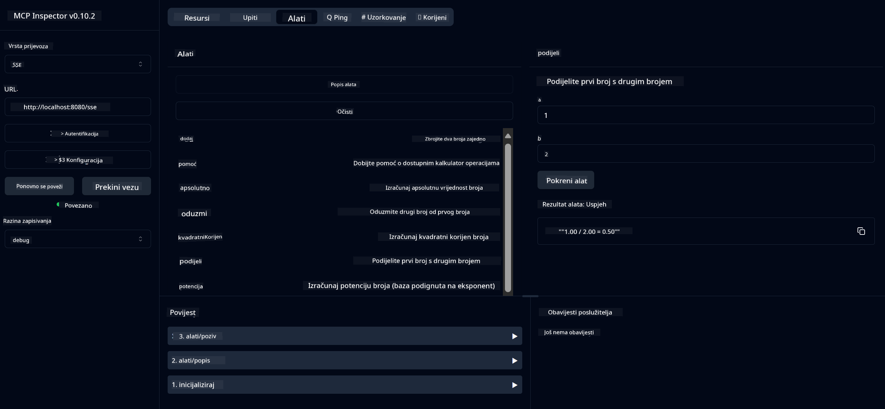

<!--
CO_OP_TRANSLATOR_METADATA:
{
  "original_hash": "13231e9951b68efd9df8c56bd5cdb27e",
  "translation_date": "2025-07-13T22:32:02+00:00",
  "source_file": "03-GettingStarted/samples/java/calculator/README.md",
  "language_code": "hr"
}
-->
# Basic Calculator MCP Service

Ova usluga pruža osnovne kalkulatorske operacije putem Model Context Protocol (MCP) koristeći Spring Boot s WebFlux transportom. Dizajnirana je kao jednostavan primjer za početnike koji uče o MCP implementacijama.

Za više informacija pogledajte [MCP Server Boot Starter](https://docs.spring.io/spring-ai/reference/api/mcp/mcp-server-boot-starter-docs.html) referentnu dokumentaciju.

## Pregled

Usluga prikazuje:
- Podršku za SSE (Server-Sent Events)
- Automatsku registraciju alata koristeći Spring AI `@Tool` anotaciju
- Osnovne kalkulatorske funkcije:
  - Zbrajanje, oduzimanje, množenje, dijeljenje
  - Izračun potencije i kvadratnog korijena
  - Modulus (ostatak) i apsolutna vrijednost
  - Pomoćna funkcija za opis operacija

## Značajke

Ova kalkulatorska usluga nudi sljedeće mogućnosti:

1. **Osnovne aritmetičke operacije**:
   - Zbrajanje dva broja
   - Oduzimanje jednog broja od drugog
   - Množenje dva broja
   - Dijeljenje jednog broja s drugim (uz provjeru dijeljenja s nulom)

2. **Napredne operacije**:
   - Izračun potencije (podizanje baze na eksponent)
   - Izračun kvadratnog korijena (uz provjeru negativnog broja)
   - Izračun modula (ostatka pri dijeljenju)
   - Izračun apsolutne vrijednosti

3. **Sustav pomoći**:
   - Ugrađena pomoć koja objašnjava sve dostupne operacije

## Korištenje usluge

Usluga izlaže sljedeće API endpoint-e putem MCP protokola:

- `add(a, b)`: Zbroji dva broja
- `subtract(a, b)`: Oduzmi drugi broj od prvog
- `multiply(a, b)`: Pomnoži dva broja
- `divide(a, b)`: Podijeli prvi broj s drugim (uz provjeru na nulu)
- `power(base, exponent)`: Izračunaj potenciju broja
- `squareRoot(number)`: Izračunaj kvadratni korijen (uz provjeru negativnog broja)
- `modulus(a, b)`: Izračunaj ostatak pri dijeljenju
- `absolute(number)`: Izračunaj apsolutnu vrijednost
- `help()`: Dohvati informacije o dostupnim operacijama

## Testni klijent

Jednostavan testni klijent uključen je u paket `com.microsoft.mcp.sample.client`. Klasa `SampleCalculatorClient` demonstrira dostupne operacije kalkulatorske usluge.

## Korištenje LangChain4j klijenta

Projekt uključuje primjer LangChain4j klijenta u `com.microsoft.mcp.sample.client.LangChain4jClient` koji pokazuje kako integrirati kalkulatorsku uslugu s LangChain4j i GitHub modelima:

### Preduvjeti

1. **Postavljanje GitHub tokena**:
   
   Za korištenje GitHub AI modela (kao što je phi-4), potreban vam je GitHub personalni pristupni token:

   a. Idite u postavke svog GitHub računa: https://github.com/settings/tokens
   
   b. Kliknite "Generate new token" → "Generate new token (classic)"
   
   c. Dajte tokenu opisno ime
   
   d. Odaberite sljedeće ovlasti:
      - `repo` (puna kontrola privatnih repozitorija)
      - `read:org` (čitanje članstva u organizacijama i timovima, čitanje projekata organizacije)
      - `gist` (kreiranje gistova)
      - `user:email` (pristup email adresama korisnika (samo za čitanje))
   
   e. Kliknite "Generate token" i kopirajte novi token
   
   f. Postavite ga kao varijablu okoline:
      
      Na Windowsu:
      ```
      set GITHUB_TOKEN=your-github-token
      ```
      
      Na macOS/Linuxu:
      ```bash
      export GITHUB_TOKEN=your-github-token
      ```

   g. Za trajno postavljanje, dodajte ga u varijable okoline kroz sistemske postavke

2. Dodajte LangChain4j GitHub ovisnost u svoj projekt (već uključeno u pom.xml):
   ```xml
   <dependency>
       <groupId>dev.langchain4j</groupId>
       <artifactId>langchain4j-github</artifactId>
       <version>${langchain4j.version}</version>
   </dependency>
   ```

3. Provjerite da kalkulatorski server radi na `localhost:8080`

### Pokretanje LangChain4j klijenta

Ovaj primjer pokazuje:
- Povezivanje na kalkulatorski MCP server putem SSE transporta
- Korištenje LangChain4j za kreiranje chat bota koji koristi kalkulatorske operacije
- Integraciju s GitHub AI modelima (sada koristeći phi-4 model)

Klijent šalje sljedeće primjere upita za demonstraciju funkcionalnosti:
1. Izračun zbroja dva broja
2. Pronalaženje kvadratnog korijena broja
3. Dohvaćanje pomoći o dostupnim kalkulatorskim operacijama

Pokrenite primjer i pratite izlaz u konzoli kako biste vidjeli kako AI model koristi kalkulatorske alate za odgovore.

### Konfiguracija GitHub modela

LangChain4j klijent je konfiguriran za korištenje GitHub phi-4 modela sa sljedećim postavkama:

```java
ChatLanguageModel model = GitHubChatModel.builder()
    .apiKey(System.getenv("GITHUB_TOKEN"))
    .timeout(Duration.ofSeconds(60))
    .modelName("phi-4")
    .logRequests(true)
    .logResponses(true)
    .build();
```

Za korištenje drugih GitHub modela, jednostavno promijenite parametar `modelName` na neki drugi podržani model (npr. "claude-3-haiku-20240307", "llama-3-70b-8192" itd.).

## Ovisnosti

Projekt zahtijeva sljedeće ključne ovisnosti:

```xml
<!-- For MCP Server -->
<dependency>
    <groupId>org.springframework.ai</groupId>
    <artifactId>spring-ai-starter-mcp-server-webflux</artifactId>
</dependency>

<!-- For LangChain4j integration -->
<dependency>
    <groupId>dev.langchain4j</groupId>
    <artifactId>langchain4j-mcp</artifactId>
    <version>${langchain4j.version}</version>
</dependency>

<!-- For GitHub models support -->
<dependency>
    <groupId>dev.langchain4j</groupId>
    <artifactId>langchain4j-github</artifactId>
    <version>${langchain4j.version}</version>
</dependency>
```

## Izgradnja projekta

Izgradite projekt koristeći Maven:
```bash
./mvnw clean install -DskipTests
```

## Pokretanje servera

### Korištenje Jave

```bash
java -jar target/calculator-server-0.0.1-SNAPSHOT.jar
```

### Korištenje MCP Inspectora

MCP Inspector je koristan alat za interakciju s MCP uslugama. Za korištenje s ovom kalkulatorskom uslugom:

1. **Instalirajte i pokrenite MCP Inspector** u novom terminalu:
   ```bash
   npx @modelcontextprotocol/inspector
   ```

2. **Pristupite web sučelju** klikom na URL koji aplikacija prikaže (obično http://localhost:6274)

3. **Konfigurirajte vezu**:
   - Postavite tip transporta na "SSE"
   - Postavite URL na SSE endpoint vašeg servera: `http://localhost:8080/sse`
   - Kliknite "Connect"

4. **Koristite alate**:
   - Kliknite "List Tools" za prikaz dostupnih kalkulatorskih operacija
   - Odaberite alat i kliknite "Run Tool" za izvršenje operacije



### Korištenje Dockera

Projekt uključuje Dockerfile za kontejneriziranu implementaciju:

1. **Izgradite Docker image**:
   ```bash
   docker build -t calculator-mcp-service .
   ```

2. **Pokrenite Docker kontejner**:
   ```bash
   docker run -p 8080:8080 calculator-mcp-service
   ```

Ovo će:
- Izgraditi višestepeni Docker image s Maven 3.9.9 i Eclipse Temurin 24 JDK
- Kreirati optimizirani kontejnerski image
- Izložiti uslugu na portu 8080
- Pokrenuti MCP kalkulatorsku uslugu unutar kontejnera

Usluga će biti dostupna na `http://localhost:8080` nakon što kontejner radi.

## Rješavanje problema

### Česti problemi s GitHub tokenom

1. **Problemi s dozvolama tokena**: Ako dobijete 403 Forbidden grešku, provjerite ima li vaš token ispravne dozvole kao što je navedeno u preduvjetima.

2. **Token nije pronađen**: Ako dobijete grešku "No API key found", provjerite je li varijabla okoline GITHUB_TOKEN pravilno postavljena.

3. **Ograničenje brzine (Rate Limiting)**: GitHub API ima ograničenja broja zahtjeva. Ako dobijete grešku ograničenja (status kod 429), pričekajte nekoliko minuta prije ponovnog pokušaja.

4. **Istek tokena**: GitHub tokeni mogu isteći. Ako nakon nekog vremena dobijete greške autentifikacije, generirajte novi token i ažurirajte varijablu okoline.

Ako trebate dodatnu pomoć, pogledajte [LangChain4j dokumentaciju](https://github.com/langchain4j/langchain4j) ili [GitHub API dokumentaciju](https://docs.github.com/en/rest).

**Odricanje od odgovornosti**:  
Ovaj dokument je preveden korištenjem AI usluge za prevođenje [Co-op Translator](https://github.com/Azure/co-op-translator). Iako nastojimo postići točnost, imajte na umu da automatski prijevodi mogu sadržavati pogreške ili netočnosti. Izvorni dokument na izvornom jeziku treba smatrati autoritativnim izvorom. Za kritične informacije preporučuje se profesionalni ljudski prijevod. Ne snosimo odgovornost za bilo kakva nesporazume ili pogrešna tumačenja koja proizlaze iz korištenja ovog prijevoda.