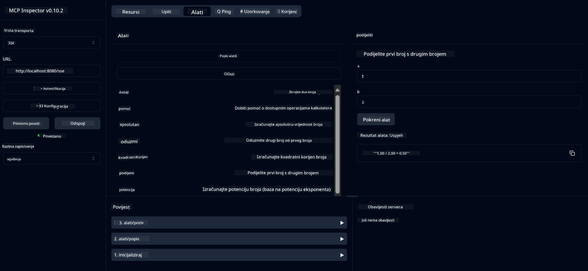

<!--
CO_OP_TRANSLATOR_METADATA:
{
  "original_hash": "13231e9951b68efd9df8c56bd5cdb27e",
  "translation_date": "2025-05-17T13:19:01+00:00",
  "source_file": "03-GettingStarted/samples/java/calculator/README.md",
  "language_code": "hr"
}
-->
# Osnovna Kalkulator MCP Usluga

Ova usluga pruža osnovne operacije kalkulatora putem Model Context Protocol (MCP) koristeći Spring Boot s WebFlux transportom. Dizajnirana je kao jednostavan primjer za početnike koji uče o MCP implementacijama.

Za više informacija, pogledajte referentnu dokumentaciju [MCP Server Boot Starter](https://docs.spring.io/spring-ai/reference/api/mcp/mcp-server-boot-starter-docs.html).

## Pregled

Usluga prikazuje:
- Podršku za SSE (Server-Sent Events)
- Automatsku registraciju alata koristeći Spring AI's `@Tool` anotaciju
- Osnovne funkcije kalkulatora:
  - Zbrajanje, oduzimanje, množenje, dijeljenje
  - Izračunavanje potencije i kvadratnog korijena
  - Modulus (ostatak) i apsolutna vrijednost
  - Pomoćna funkcija za opise operacija

## Značajke

Ova kalkulator usluga nudi sljedeće mogućnosti:

1. **Osnovne Aritmetičke Operacije**:
   - Zbrajanje dvaju brojeva
   - Oduzimanje jednog broja od drugog
   - Množenje dvaju brojeva
   - Dijeljenje jednog broja s drugim (s provjerom dijeljenja s nulom)

2. **Napredne Operacije**:
   - Izračunavanje potencije (podizanje baze na eksponent)
   - Izračunavanje kvadratnog korijena (s provjerom negativnih brojeva)
   - Izračunavanje modusa (ostatka)
   - Izračunavanje apsolutne vrijednosti

3. **Sustav Pomoći**:
   - Ugrađena pomoćna funkcija koja objašnjava sve dostupne operacije

## Korištenje Usluge

Usluga izlaže sljedeće API krajnje točke putem MCP protokola:

- `add(a, b)`: Zbroji dva broja
- `subtract(a, b)`: Oduzmi drugi broj od prvog
- `multiply(a, b)`: Pomnoži dva broja
- `divide(a, b)`: Podijeli prvi broj s drugim (s provjerom nule)
- `power(base, exponent)`: Izračunaj potenciju broja
- `squareRoot(number)`: Izračunaj kvadratni korijen (s provjerom negativnog broja)
- `modulus(a, b)`: Izračunaj ostatak pri dijeljenju
- `absolute(number)`: Izračunaj apsolutnu vrijednost
- `help()`: Dobij informacije o dostupnim operacijama

## Test Klijent

Jednostavan test klijent uključen je u `com.microsoft.mcp.sample.client` paket. `SampleCalculatorClient` klasa demonstrira dostupne operacije kalkulator usluge.

## Korištenje LangChain4j Klijenta

Projekt uključuje primjer klijenta LangChain4j u `com.microsoft.mcp.sample.client.LangChain4jClient` koji demonstrira kako integrirati kalkulator uslugu s LangChain4j i GitHub modelima:

### Preduvjeti

1. **Postavljanje GitHub Tokena**:
   
   Da biste koristili GitHub AI modele (poput phi-4), trebate GitHub osobni pristupni token:

   a. Idite na postavke svog GitHub računa: https://github.com/settings/tokens
   
   b. Kliknite "Generate new token" → "Generate new token (classic)"
   
   c. Dajte svom tokenu opisno ime
   
   d. Odaberite sljedeće opsege:
      - `repo` (Potpuna kontrola privatnih repozitorija)
      - `read:org` (Čitanje članstva u organizaciji i timu, čitanje projekata organizacije)
      - `gist` (Stvaranje gista)
      - `user:email` (Pristup korisničkim email adresama (samo za čitanje))
   
   e. Kliknite "Generate token" i kopirajte svoj novi token
   
   f. Postavite ga kao varijablu okruženja:
      
      Na Windowsu:
      ```
      set GITHUB_TOKEN=your-github-token
      ```
      
      Na macOS/Linux:
      ```bash
      export GITHUB_TOKEN=your-github-token
      ```

   g. Za trajno postavljanje, dodajte ga u varijable okruženja putem postavki sustava

2. Dodajte LangChain4j GitHub ovisnost u svoj projekt (već uključeno u pom.xml):
   ```xml
   <dependency>
       <groupId>dev.langchain4j</groupId>
       <artifactId>langchain4j-github</artifactId>
       <version>${langchain4j.version}</version>
   </dependency>
   ```

3. Osigurajte da kalkulator server radi na `localhost:8080`

### Pokretanje LangChain4j Klijenta

Ovaj primjer demonstrira:
- Povezivanje s kalkulator MCP serverom putem SSE transporta
- Korištenje LangChain4j za stvaranje chat bota koji koristi kalkulator operacije
- Integraciju s GitHub AI modelima (sada koristeći phi-4 model)

Klijent šalje sljedeće uzorke upita za demonstraciju funkcionalnosti:
1. Izračunavanje zbroja dvaju brojeva
2. Pronalaženje kvadratnog korijena broja
3. Dobivanje informacija o dostupnim kalkulator operacijama

Pokrenite primjer i provjerite izlaz u konzoli kako biste vidjeli kako AI model koristi alate kalkulatora za odgovaranje na upite.

### Konfiguracija GitHub Modela

LangChain4j klijent je konfiguriran za korištenje GitHub phi-4 modela sa sljedećim postavkama:

```java
ChatLanguageModel model = GitHubChatModel.builder()
    .apiKey(System.getenv("GITHUB_TOKEN"))
    .timeout(Duration.ofSeconds(60))
    .modelName("phi-4")
    .logRequests(true)
    .logResponses(true)
    .build();
```

Za korištenje različitih GitHub modela, jednostavno promijenite `modelName` parametar u drugi podržani model (npr. "claude-3-haiku-20240307", "llama-3-70b-8192", itd.).

## Ovisnosti

Projekt zahtijeva sljedeće ključne ovisnosti:

```xml
<!-- For MCP Server -->
<dependency>
    <groupId>org.springframework.ai</groupId>
    <artifactId>spring-ai-starter-mcp-server-webflux</artifactId>
</dependency>

<!-- For LangChain4j integration -->
<dependency>
    <groupId>dev.langchain4j</groupId>
    <artifactId>langchain4j-mcp</artifactId>
    <version>${langchain4j.version}</version>
</dependency>

<!-- For GitHub models support -->
<dependency>
    <groupId>dev.langchain4j</groupId>
    <artifactId>langchain4j-github</artifactId>
    <version>${langchain4j.version}</version>
</dependency>
```

## Izgradnja Projekta

Izgradite projekt koristeći Maven:
```bash
./mvnw clean install -DskipTests
```

## Pokretanje Servera

### Korištenje Java

```bash
java -jar target/calculator-server-0.0.1-SNAPSHOT.jar
```

### Korištenje MCP Inspectora

MCP Inspector je koristan alat za interakciju s MCP uslugama. Za korištenje s ovom kalkulator uslugom:

1. **Instalirajte i pokrenite MCP Inspector** u novom terminalskom prozoru:
   ```bash
   npx @modelcontextprotocol/inspector
   ```

2. **Pristupite web sučelju** klikom na URL prikazan od strane aplikacije (obično http://localhost:6274)

3. **Konfigurirajte vezu**:
   - Postavite tip transporta na "SSE"
   - Postavite URL na SSE krajnju točku vašeg pokrenutog servera: `http://localhost:8080/sse`
   - Kliknite "Connect"

4. **Koristite alate**:
   - Kliknite "List Tools" za prikaz dostupnih kalkulator operacija
   - Odaberite alat i kliknite "Run Tool" za izvršavanje operacije



### Korištenje Dockera

Projekt uključuje Dockerfile za kontejnersko postavljanje:

1. **Izgradite Docker sliku**:
   ```bash
   docker build -t calculator-mcp-service .
   ```

2. **Pokrenite Docker kontejner**:
   ```bash
   docker run -p 8080:8080 calculator-mcp-service
   ```

Ovo će:
- Izgraditi višestupanjsku Docker sliku s Maven 3.9.9 i Eclipse Temurin 24 JDK
- Stvoriti optimiziranu sliku kontejnera
- Izložiti uslugu na portu 8080
- Pokrenuti MCP kalkulator uslugu unutar kontejnera

Možete pristupiti usluzi na `http://localhost:8080` kada kontejner radi.

## Rješavanje Problema

### Uobičajeni Problemi s GitHub Tokenom

1. **Problemi s dozvolama tokena**: Ako dobijete 403 Forbidden grešku, provjerite da vaš token ima ispravne dozvole kako je navedeno u preduvjetima.

2. **Token nije pronađen**: Ako dobijete grešku "No API key found", osigurajte da je GITHUB_TOKEN varijabla okruženja ispravno postavljena.

3. **Ograničenje brzine**: GitHub API ima ograničenja brzine. Ako naiđete na grešku ograničenja brzine (statusni kod 429), pričekajte nekoliko minuta prije nego što pokušate ponovno.

4. **Istek tokena**: GitHub tokeni mogu isteći. Ako primite greške pri autentifikaciji nakon nekog vremena, generirajte novi token i ažurirajte svoju varijablu okruženja.

Ako trebate dodatnu pomoć, provjerite [LangChain4j dokumentaciju](https://github.com/langchain4j/langchain4j) ili [GitHub API dokumentaciju](https://docs.github.com/en/rest).

**Odricanje odgovornosti**:  
Ovaj dokument je preveden koristeći AI uslugu prevođenja [Co-op Translator](https://github.com/Azure/co-op-translator). Iako se trudimo da postignemo točnost, molimo vas da budete svjesni da automatski prijevodi mogu sadržavati greške ili netočnosti. Izvorni dokument na izvornom jeziku treba smatrati autoritativnim izvorom. Za ključne informacije preporučuje se profesionalni prijevod od strane ljudskog prevoditelja. Ne odgovaramo za nesporazume ili pogrešna tumačenja koja mogu proizaći iz korištenja ovog prijevoda.