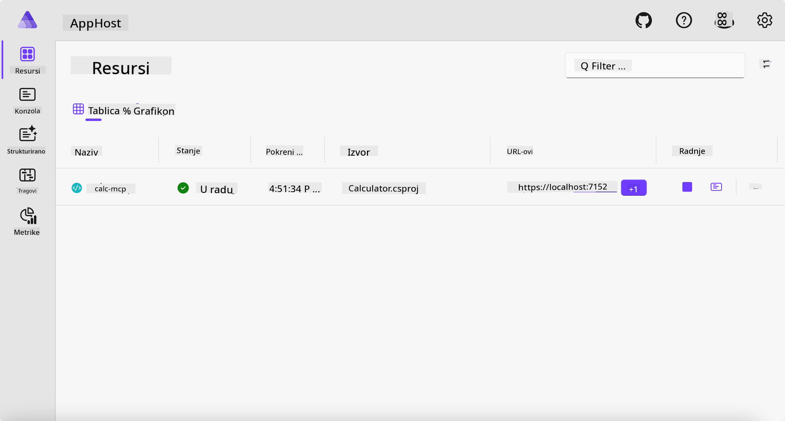
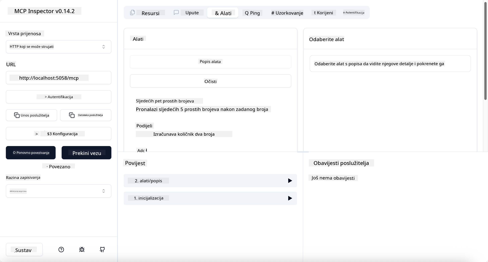
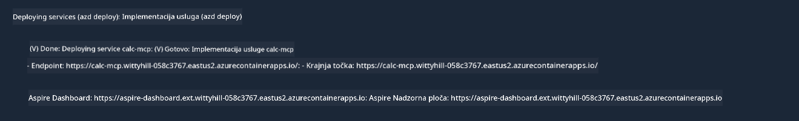

<!--
CO_OP_TRANSLATOR_METADATA:
{
  "original_hash": "0bc7bd48f55f1565f1d95ccb2c16f728",
  "translation_date": "2025-07-13T23:10:17+00:00",
  "source_file": "04-PracticalImplementation/samples/csharp/README.md",
  "language_code": "hr"
}
-->
# Primjer

Prethodni primjer pokazuje kako koristiti lokalni .NET projekt s tipom `stdio`. I kako pokrenuti server lokalno u kontejneru. Ovo je dobro rješenje u mnogim situacijama. Međutim, može biti korisno imati server koji radi udaljeno, primjerice u oblaku. Tu dolazi do izražaja tip `http`.

Gledajući rješenje u mapi `04-PracticalImplementation`, može izgledati puno složenije nego prethodno. Ali u stvarnosti nije tako. Ako pažljivo pogledate projekt `src/Calculator`, vidjet ćete da je uglavnom isti kod kao u prethodnom primjeru. Jedina razlika je što koristimo drugu biblioteku `ModelContextProtocol.AspNetCore` za rukovanje HTTP zahtjevima. Također mijenjamo metodu `IsPrime` da bude privatna, samo da pokažemo da u kodu možete imati privatne metode. Ostatak koda je isti kao prije.

Ostali projekti dolaze iz [.NET Aspire](https://learn.microsoft.com/dotnet/aspire/get-started/aspire-overview). Imati .NET Aspire u rješenju poboljšava iskustvo programera tijekom razvoja i testiranja te pomaže s promatranjem (observability). Nije obavezno za pokretanje servera, ali je dobra praksa imati ga u rješenju.

## Pokrenite server lokalno

1. Iz VS Code-a (s C# DevKit ekstenzijom), navigirajte do direktorija `04-PracticalImplementation/samples/csharp`.
1. Pokrenite sljedeću naredbu za pokretanje servera:

   ```bash
    dotnet watch run --project ./src/AppHost
   ```

1. Kada se u web pregledniku otvori .NET Aspire nadzorna ploča, zabilježite `http` URL. Trebao bi biti nešto poput `http://localhost:5058/`.

   

## Testirajte Streamable HTTP s MCP Inspectorom

Ako imate Node.js verziju 22.7.5 ili noviju, možete koristiti MCP Inspector za testiranje vašeg servera.

Pokrenite server i u terminalu izvršite sljedeću naredbu:

```bash
npx @modelcontextprotocol/inspector http://localhost:5058
```



- Odaberite `Streamable HTTP` kao tip Transporta.
- U polje Url unesite URL servera koji ste ranije zabilježili i dodajte `/mcp`. Trebao bi biti `http` (ne `https`), nešto poput `http://localhost:5058/mcp`.
- Kliknite na gumb Connect.

Lijepa stvar kod Inspectora je što pruža dobar uvid u ono što se događa.

- Pokušajte prikazati dostupne alate
- Isprobajte neke od njih, trebali bi raditi kao i prije.

## Testirajte MCP Server s GitHub Copilot Chatom u VS Code-u

Da biste koristili Streamable HTTP transport s GitHub Copilot Chatom, promijenite konfiguraciju `calc-mcp` servera koji ste ranije kreirali da izgleda ovako:

```jsonc
// .vscode/mcp.json
{
  "servers": {
    "calc-mcp": {
      "type": "http",
      "url": "http://localhost:5058/mcp"
    }
  }
}
```

Napravite nekoliko testova:

- Pitajte za "3 prosta broja nakon 6780". Primijetite kako Copilot koristi nove alate `NextFivePrimeNumbers` i vraća samo prva 3 prosta broja.
- Pitajte za "7 prostih brojeva nakon 111", da vidite što se događa.
- Pitajte "John ima 24 lizalice i želi ih podijeliti svojoj 3 djece. Koliko lizalica ima svako dijete?", da vidite što se događa.

## Postavite server na Azure

Postavimo server na Azure kako bi ga više ljudi moglo koristiti.

U terminalu, navigirajte do mape `04-PracticalImplementation/samples/csharp` i pokrenite sljedeću naredbu:

```bash
azd up
```

Nakon što se postavljanje završi, trebali biste vidjeti poruku poput ove:



Zabilježite URL i koristite ga u MCP Inspectoru i u GitHub Copilot Chatu.

```jsonc
// .vscode/mcp.json
{
  "servers": {
    "calc-mcp": {
      "type": "http",
      "url": "https://calc-mcp.gentleriver-3977fbcf.australiaeast.azurecontainerapps.io/mcp"
    }
  }
}
```

## Što slijedi?

Isprobali smo različite tipove transporta i alate za testiranje. Također smo postavili vaš MCP server na Azure. Ali što ako naš server treba pristupiti privatnim resursima? Na primjer, bazi podataka ili privatnom API-ju? U sljedećem poglavlju vidjet ćemo kako možemo poboljšati sigurnost našeg servera.

**Odricanje od odgovornosti**:  
Ovaj dokument je preveden korištenjem AI usluge za prevođenje [Co-op Translator](https://github.com/Azure/co-op-translator). Iako težimo točnosti, imajte na umu da automatski prijevodi mogu sadržavati pogreške ili netočnosti. Izvorni dokument na izvornom jeziku treba smatrati autoritativnim izvorom. Za kritične informacije preporučuje se profesionalni ljudski prijevod. Ne snosimo odgovornost za bilo kakva nesporazuma ili pogrešna tumačenja koja proizlaze iz korištenja ovog prijevoda.