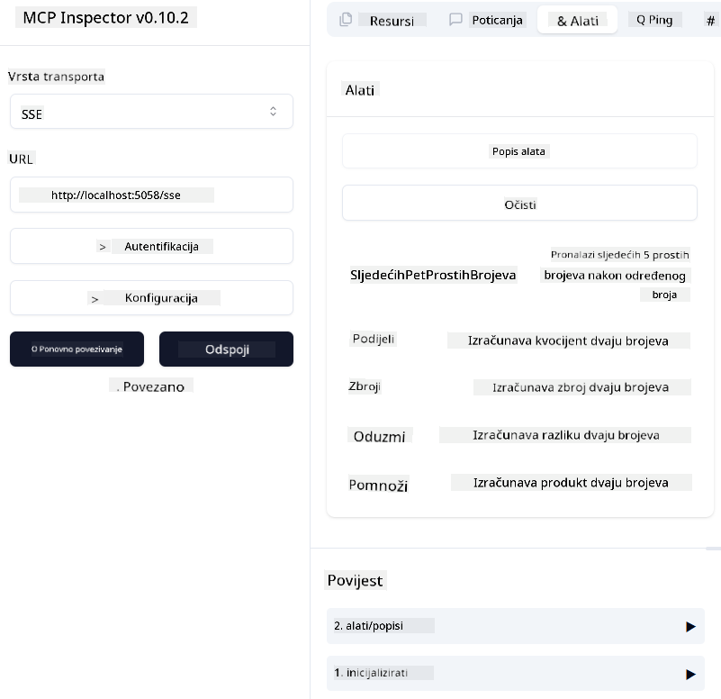

<!--
CO_OP_TRANSLATOR_METADATA:
{
  "original_hash": "5020a3e1a1c7f30c00f9e37f1fa208e3",
  "translation_date": "2025-05-17T14:13:05+00:00",
  "source_file": "04-PracticalImplementation/samples/csharp/README.md",
  "language_code": "hr"
}
-->
# Primjer

Prethodni primjer pokazuje kako koristiti lokalni .NET projekt s vrstom `sdio`. I kako pokrenuti poslužitelj lokalno u kontejneru. Ovo je dobro rješenje u mnogim situacijama. Međutim, može biti korisno da poslužitelj radi udaljeno, kao u oblaku. Tu dolazi vrsta `http`.

Gledajući rješenje u mapi `04-PracticalImplementation`, može izgledati mnogo složenije od prethodnog. Ali zapravo nije. Ako pažljivo pogledate projekt `src/mcpserver/mcpserver.csproj`, vidjet ćete da je uglavnom isti kod kao u prethodnom primjeru. Jedina razlika je što koristimo drugu biblioteku `ModelContextProtocol.AspNetCore` za obradu HTTP zahtjeva. I mijenjamo metodu `IsPrime` da bude privatna, samo da pokažemo da možete imati privatne metode u svom kodu. Ostatak koda je isti kao prije.

Drugi projekti su iz [.NET Aspire](https://learn.microsoft.com/dotnet/aspire/get-started/aspire-overview). Imati .NET Aspire u rješenju poboljšat će iskustvo programera tijekom razvoja i testiranja te pomoći u vidljivosti. Nije potrebno za pokretanje poslužitelja, ali je dobra praksa imati ga u svom rješenju.

## Pokrenite poslužitelj lokalno

1. Iz VS Code (s ekstenzijom C# DevKit), otvorite rješenje `04-PracticalImplementation\samples\csharp\src\Calculator-chap4.sln`.
2. Pritisnite `F5` za pokretanje poslužitelja. Trebao bi se otvoriti web preglednik s .NET Aspire nadzornom pločom.

ili

1. Iz terminala, navigirajte do mape `04-PracticalImplementation\samples\csharp\src`
2. Izvršite sljedeću naredbu za pokretanje poslužitelja:
   ```bash
    dotnet run --project .\AppHost
   ```

3. S nadzorne ploče, zabilježite URL `http`. Trebao bi biti nešto poput `http://localhost:5058/`.

## Test `SSE` s ModelContext Protocol Inspector

Ako imate Node.js 22.7.5 ili noviji, možete koristiti ModelContext Protocol Inspector za testiranje svog poslužitelja.

Pokrenite poslužitelj i izvršite sljedeću naredbu u terminalu:

```bash
npx @modelcontextprotocol/inspector@latest
```



- Odaberite `SSE` as the Transport type. SSE stand for Server-Sent Events. 
- In the Url field, enter the URL of the server noted earlier,and append `/sse`. Trebao bi biti `http` (ne `https`) something like `http://localhost:5058/sse`.
- select the Connect button.

A nice thing about the Inspector is that it provide a nice visibility on what is happening.

- Try listing the availables tools
- Try some of them, it should works just like before.


## Test `SSE` with Github Copilot Chat in VS Code

To use the `SSE` transport with Github Copilot Chat, change the configuration of the `mcp-calc` poslužitelj kreiran prethodno da izgleda ovako:

```json
"mcp-calc": {
    "type": "sse",
    "url": "http://localhost:5058/sse"
}
```

Napravite neke testove:
- Zatražite 3 prosta broja nakon 6780. Primijetite kako Copilot koristi nove alate `NextFivePrimeNumbers` i vraća samo prva 3 prosta broja.
- Zatražite 7 prostih brojeva nakon 111, da vidite što se događa.

# Postavljanje poslužitelja na Azure

Postavimo poslužitelj na Azure kako bi ga više ljudi moglo koristiti.

Iz terminala, navigirajte do mape `04-PracticalImplementation\samples\csharp\src` i pokrenite sljedeću naredbu:

```bash
azd init
```

Ovo će lokalno stvoriti nekoliko datoteka za spremanje konfiguracije Azure resursa i vašu infrastrukturu kao kod (IaC).

Zatim pokrenite sljedeću naredbu za postavljanje poslužitelja na Azure:

```bash
azd up
```

Kada postavljanje završi, trebali biste vidjeti poruku poput ove:


Navigirajte do Aspire nadzorne ploče i zabilježite `HTTP` URL kako biste ga koristili u MCP Inspector i u Github Copilot Chat.

## Što je sljedeće?

Isprobali smo različite vrste prijenosa, alate za testiranje i također postavili naš MCP poslužitelj na Azure. Ali što ako našem poslužitelju treba pristup privatnim resursima? Na primjer, bazi podataka ili privatnom API-ju? U sljedećem poglavlju ćemo vidjeti kako možemo poboljšati sigurnost našeg poslužitelja.

**Odricanje od odgovornosti**:  
Ovaj dokument je preveden koristeći AI uslugu za prevođenje [Co-op Translator](https://github.com/Azure/co-op-translator). Iako težimo ka točnosti, molimo vas da budete svjesni da automatski prijevodi mogu sadržavati pogreške ili netočnosti. Izvorni dokument na izvornom jeziku treba smatrati autoritativnim izvorom. Za ključne informacije preporučuje se profesionalni ljudski prijevod. Ne odgovaramo za nesporazume ili pogrešne interpretacije koje proizlaze iz korištenja ovog prijevoda.