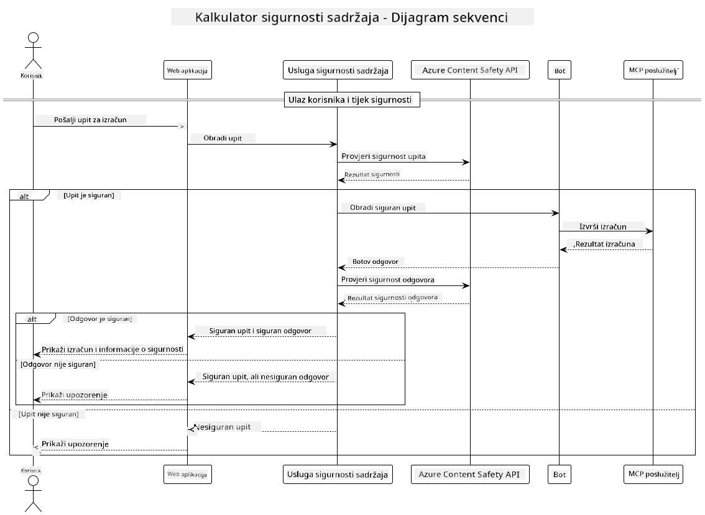

<!--
CO_OP_TRANSLATOR_METADATA:
{
  "original_hash": "e5ea5e7582f70008ea9bec3b3820f20a",
  "translation_date": "2025-07-13T23:20:45+00:00",
  "source_file": "04-PracticalImplementation/samples/java/containerapp/README.md",
  "language_code": "hr"
}
-->
## Arhitektura sustava

Ovaj projekt prikazuje web aplikaciju koja koristi provjeru sigurnosti sadržaja prije nego što korisničke upite proslijedi kalkulatoru putem Model Context Protocol (MCP).



### Kako funkcionira

1. **Korisnički unos**: Korisnik unosi upit za izračun u web sučelju  
2. **Provjera sigurnosti sadržaja (unos)**: Upit analizira Azure Content Safety API  
3. **Odluka o sigurnosti (unos)**:  
   - Ako je sadržaj siguran (ozbiljnost < 2 u svim kategorijama), nastavlja se prema kalkulatoru  
   - Ako je sadržaj označen kao potencijalno štetan, proces se zaustavlja i vraća upozorenje  
4. **Integracija kalkulatora**: Siguran sadržaj obrađuje LangChain4j koji komunicira s MCP kalkulator serverom  
5. **Provjera sigurnosti sadržaja (izlaz)**: Odgovor bota analizira Azure Content Safety API  
6. **Odluka o sigurnosti (izlaz)**:  
   - Ako je odgovor bota siguran, prikazuje se korisniku  
   - Ako je odgovor bota označen kao potencijalno štetan, zamjenjuje se upozorenjem  
7. **Odgovor**: Rezultati (ako su sigurni) prikazuju se korisniku zajedno s obje analize sigurnosti

## Korištenje Model Context Protocol (MCP) s kalkulatorskim uslugama

Ovaj projekt pokazuje kako koristiti Model Context Protocol (MCP) za pozivanje kalkulatorskih MCP usluga iz LangChain4j. Implementacija koristi lokalni MCP server na portu 8080 za pružanje kalkulatorskih operacija.

### Postavljanje Azure Content Safety servisa

Prije korištenja značajki sigurnosti sadržaja, potrebno je kreirati Azure Content Safety servis:

1. Prijavite se na [Azure Portal](https://portal.azure.com)  
2. Kliknite "Create a resource" i potražite "Content Safety"  
3. Odaberite "Content Safety" i kliknite "Create"  
4. Unesite jedinstveno ime za svoj resurs  
5. Odaberite pretplatu i grupu resursa (ili kreirajte novu)  
6. Odaberite podržanu regiju (pogledajte [Dostupnost regija](https://azure.microsoft.com/en-us/global-infrastructure/services/?products=cognitive-services) za detalje)  
7. Odaberite odgovarajući cjenovni plan  
8. Kliknite "Create" za implementaciju resursa  
9. Nakon završetka implementacije, kliknite "Go to resource"  
10. U lijevom izborniku, pod "Resource Management", odaberite "Keys and Endpoint"  
11. Kopirajte jedan od ključeva i URL krajnje točke za korištenje u sljedećem koraku

### Konfiguracija varijabli okoline

Postavite varijablu okoline `GITHUB_TOKEN` za autentifikaciju GitHub modela:  
```sh
export GITHUB_TOKEN=<your_github_token>
```

Za značajke sigurnosti sadržaja postavite:  
```sh
export CONTENT_SAFETY_ENDPOINT=<your_content_safety_endpoint>
export CONTENT_SAFETY_KEY=<your_content_safety_key>
```

Ove varijable okoline koristi aplikacija za autentifikaciju prema Azure Content Safety servisu. Ako varijable nisu postavljene, aplikacija će koristiti zamjenske vrijednosti za demonstraciju, no značajke sigurnosti sadržaja neće ispravno funkcionirati.

### Pokretanje MCP kalkulator servera

Prije pokretanja klijenta, potrebno je pokrenuti MCP kalkulator server u SSE načinu rada na localhost:8080.

## Opis projekta

Ovaj projekt prikazuje integraciju Model Context Protocol (MCP) s LangChain4j za pozivanje kalkulatorskih usluga. Ključne značajke uključuju:

- Korištenje MCP za povezivanje s kalkulatorskom uslugom za osnovne matematičke operacije  
- Dvostruka provjera sigurnosti sadržaja na korisničkim upitima i odgovorima bota  
- Integracija s GitHub-ovim gpt-4.1-nano modelom putem LangChain4j  
- Korištenje Server-Sent Events (SSE) za MCP prijenos podataka

## Integracija sigurnosti sadržaja

Projekt uključuje sveobuhvatne značajke sigurnosti sadržaja kako bi se osiguralo da su i korisnički unosi i odgovori sustava bez štetnog sadržaja:

1. **Provjera unosa**: Svi korisnički upiti analiziraju se na kategorije štetnog sadržaja poput govora mržnje, nasilja, samoozljeđivanja i seksualnog sadržaja prije obrade.

2. **Provjera izlaza**: Čak i kod korištenja potencijalno necenzuriranih modela, sustav provjerava sve generirane odgovore kroz iste filtre sigurnosti sadržaja prije prikaza korisniku.

Ovaj dvostruki pristup osigurava da sustav ostane siguran bez obzira na korišteni AI model, štiteći korisnike od štetnih unosa i potencijalno problematičnih AI generiranih odgovora.

## Web klijent

Aplikacija uključuje jednostavno web sučelje koje korisnicima omogućuje interakciju sa sustavom Content Safety Calculator:

### Značajke web sučelja

- Jednostavan i intuitivan obrazac za unos upita za izračun  
- Dvostruka provjera sigurnosti sadržaja (unos i izlaz)  
- Povratne informacije u stvarnom vremenu o sigurnosti upita i odgovora  
- Sigurnosni indikatori u bojama za lakše razumijevanje  
- Čist i responzivan dizajn koji radi na različitim uređajima  
- Primjeri sigurnih upita za pomoć korisnicima

### Korištenje web klijenta

1. Pokrenite aplikaciju:  
   ```sh
   mvn spring-boot:run
   ```

2. Otvorite preglednik i idite na `http://localhost:8087`

3. Unesite upit za izračun u predviđeno tekstualno polje (npr. "Izračunaj zbroj 24.5 i 17.3")

4. Kliknite "Submit" za obradu zahtjeva

5. Pregledajte rezultate, koji uključuju:  
   - Analizu sigurnosti vašeg upita  
   - Izračunati rezultat (ako je upit bio siguran)  
   - Analizu sigurnosti odgovora bota  
   - Upozorenja o sigurnosti ako je unos ili izlaz označen

Web klijent automatski upravlja oba procesa provjere sigurnosti sadržaja, osiguravajući da su sve interakcije sigurne i prikladne bez obzira na korišteni AI model.

**Odricanje od odgovornosti**:  
Ovaj dokument je preveden korištenjem AI usluge za prevođenje [Co-op Translator](https://github.com/Azure/co-op-translator). Iako težimo točnosti, imajte na umu da automatski prijevodi mogu sadržavati pogreške ili netočnosti. Izvorni dokument na izvornom jeziku treba smatrati službenim i autoritativnim izvorom. Za kritične informacije preporučuje se profesionalni ljudski prijevod. Ne snosimo odgovornost za bilo kakva nesporazuma ili pogrešna tumačenja koja proizlaze iz korištenja ovog prijevoda.