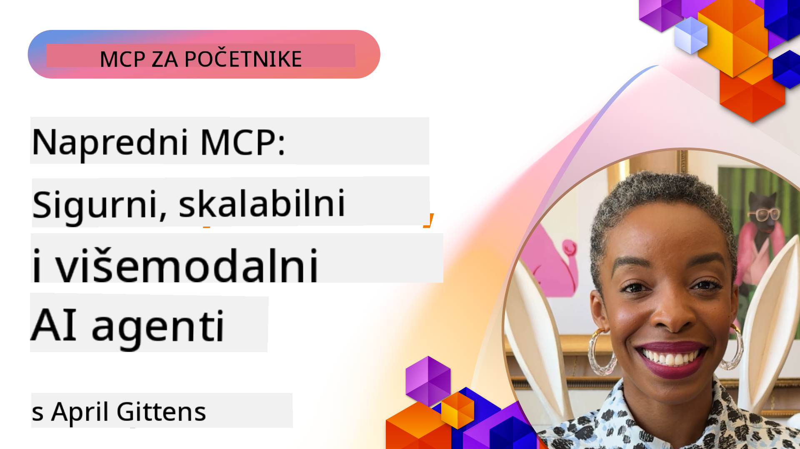

<!--
CO_OP_TRANSLATOR_METADATA:
{
  "original_hash": "d204bc94ea6027d06a703b21b711ca57",
  "translation_date": "2025-08-18T17:23:08+00:00",
  "source_file": "05-AdvancedTopics/README.md",
  "language_code": "hr"
}
-->
# Napredne teme u MCP-u

_(Kliknite na sliku iznad za pregled videa ove lekcije)_

Ovo poglavlje pokriva niz naprednih tema u implementaciji Model Context Protocola (MCP), uključujući multimodalnu integraciju, skalabilnost, najbolje prakse sigurnosti i integraciju u poslovne sustave. Ove teme su ključne za izgradnju robusnih i spremnih za produkciju MCP aplikacija koje mogu zadovoljiti zahtjeve modernih AI sustava.

## Pregled

Ova lekcija istražuje napredne koncepte u implementaciji Model Context Protocola, s naglaskom na multimodalnu integraciju, skalabilnost, najbolje prakse sigurnosti i integraciju u poslovne sustave. Ove teme su ključne za izgradnju MCP aplikacija spremnih za produkciju koje mogu podnijeti složene zahtjeve u poslovnim okruženjima.

## Ciljevi učenja

Na kraju ove lekcije, moći ćete:

- Implementirati multimodalne mogućnosti unutar MCP okvira
- Dizajnirati skalabilne MCP arhitekture za scenarije visokih zahtjeva
- Primijeniti najbolje prakse sigurnosti u skladu s MCP sigurnosnim principima
- Integrirati MCP s poslovnim AI sustavima i okvirima
- Optimizirati performanse i pouzdanost u produkcijskim okruženjima

## Lekcije i uzorci projekata

| Link | Naslov | Opis |
|------|-------|-------------|
| [5.1 Integracija s Azureom](./mcp-integration/README.md) | Integracija s Azureom | Naučite kako integrirati vaš MCP server na Azureu |
| [5.2 Multimodalni uzorak](./mcp-multi-modality/README.md) | MCP Multimodalni uzorci | Uzorci za audio, slike i multimodalne odgovore |
| [5.3 MCP OAuth2 uzorak](../../../05-AdvancedTopics/mcp-oauth2-demo) | MCP OAuth2 Demo | Minimalna Spring Boot aplikacija koja prikazuje OAuth2 s MCP-om, i kao Authorization i Resource Server. Demonstrira izdavanje sigurnih tokena, zaštićene krajnje točke, implementaciju na Azure Container Apps i integraciju s API Managementom. |
| [5.4 Root konteksti](./mcp-root-contexts/README.md) | Root konteksti | Saznajte više o root kontekstu i kako ih implementirati |
| [5.5 Usmjeravanje](./mcp-routing/README.md) | Usmjeravanje | Naučite različite vrste usmjeravanja |
| [5.6 Uzorkovanje](./mcp-sampling/README.md) | Uzorkovanje | Naučite kako raditi s uzorkovanjem |
| [5.7 Skaliranje](./mcp-scaling/README.md) | Skaliranje | Saznajte više o skaliranju |
| [5.8 Sigurnost](./mcp-security/README.md) | Sigurnost | Osigurajte vaš MCP server |
| [5.9 Uzorak pretraživanja weba](./web-search-mcp/README.md) | MCP pretraživanje weba | Python MCP server i klijent koji se integriraju sa SerpAPI za pretraživanje weba, vijesti, proizvoda i Q&A u stvarnom vremenu. Demonstrira orkestraciju više alata, integraciju vanjskih API-ja i robusno rukovanje greškama. |
| [5.10 Streaming u stvarnom vremenu](./mcp-realtimestreaming/README.md) | Streaming | Streaming podataka u stvarnom vremenu postao je ključan u današnjem svijetu vođenom podacima, gdje poslovanja i aplikacije zahtijevaju trenutni pristup informacijama za pravovremeno donošenje odluka. |
| [5.11 Pretraživanje weba u stvarnom vremenu](./mcp-realtimesearch/README.md) | Pretraživanje weba | Kako MCP transformira pretraživanje weba u stvarnom vremenu pružajući standardizirani pristup upravljanju kontekstom između AI modela, tražilica i aplikacija. |
| [5.12 Autentifikacija Entra ID za MCP servere](./mcp-security-entra/README.md) | Entra ID Autentifikacija | Microsoft Entra ID pruža robusno rješenje za upravljanje identitetom i pristupom u oblaku, pomažući osigurati da samo ovlašteni korisnici i aplikacije mogu komunicirati s vašim MCP serverom. |
| [5.13 Integracija Azure AI Foundry agenta](./mcp-foundry-agent-integration/README.md) | Integracija Azure AI Foundry | Naučite kako integrirati MCP servere s Azure AI Foundry agentima, omogućujući moćnu orkestraciju alata i poslovne AI mogućnosti sa standardiziranim povezivanjem vanjskih izvora podataka. |
| [5.14 Inženjering konteksta](./mcp-contextengineering/README.md) | Inženjering konteksta | Buduće mogućnosti tehnika inženjeringa konteksta za MCP servere, uključujući optimizaciju konteksta, dinamičko upravljanje kontekstom i strategije za učinkovito oblikovanje upita unutar MCP okvira. |

## Dodatne reference

Za najnovije informacije o naprednim MCP temama, pogledajte:
- [MCP Dokumentacija](https://modelcontextprotocol.io/)
- [MCP Specifikacija](https://spec.modelcontextprotocol.io/)
- [GitHub Repozitorij](https://github.com/modelcontextprotocol)

## Ključne točke

- Multimodalne MCP implementacije proširuju AI mogućnosti izvan obrade teksta
- Skalabilnost je ključna za poslovne implementacije i može se postići horizontalnim i vertikalnim skaliranjem
- Sveobuhvatne sigurnosne mjere štite podatke i osiguravaju pravilnu kontrolu pristupa
- Integracija u poslovne sustave poput Azure OpenAI i Microsoft AI Foundry poboljšava MCP mogućnosti
- Napredne MCP implementacije imaju koristi od optimiziranih arhitektura i pažljivog upravljanja resursima

## Vježba

Dizajnirajte MCP implementaciju poslovne klase za specifičan slučaj upotrebe:

1. Identificirajte multimodalne zahtjeve za vaš slučaj upotrebe
2. Navedite sigurnosne kontrole potrebne za zaštitu osjetljivih podataka
3. Dizajnirajte skalabilnu arhitekturu koja može podnijeti promjenjivo opterećenje
4. Planirajte točke integracije s poslovnim AI sustavima
5. Dokumentirajte potencijalne uska grla u performansama i strategije za njihovo ublažavanje

## Dodatni resursi

- [Azure OpenAI Dokumentacija](https://learn.microsoft.com/en-us/azure/ai-services/openai/)
- [Microsoft AI Foundry Dokumentacija](https://learn.microsoft.com/en-us/ai-services/)

---

## Što slijedi

- [5.1 MCP Integracija](./mcp-integration/README.md)

**Odricanje od odgovornosti**:  
Ovaj dokument je preveden korištenjem AI usluge za prevođenje [Co-op Translator](https://github.com/Azure/co-op-translator). Iako nastojimo osigurati točnost, imajte na umu da automatski prijevodi mogu sadržavati pogreške ili netočnosti. Izvorni dokument na izvornom jeziku treba smatrati mjerodavnim izvorom. Za ključne informacije preporučuje se profesionalni prijevod od strane stručnjaka. Ne preuzimamo odgovornost za bilo kakve nesporazume ili pogrešne interpretacije proizašle iz korištenja ovog prijevoda.