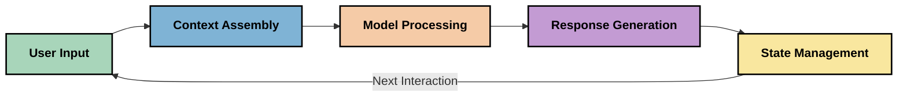
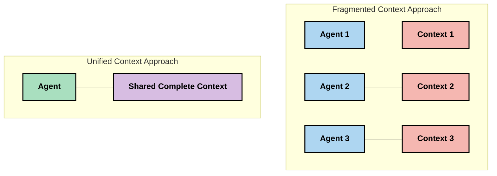
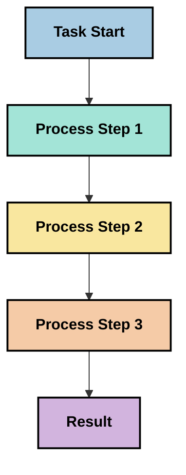
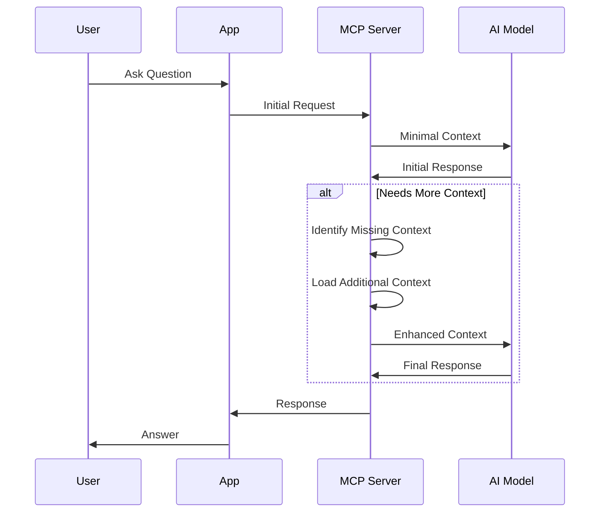
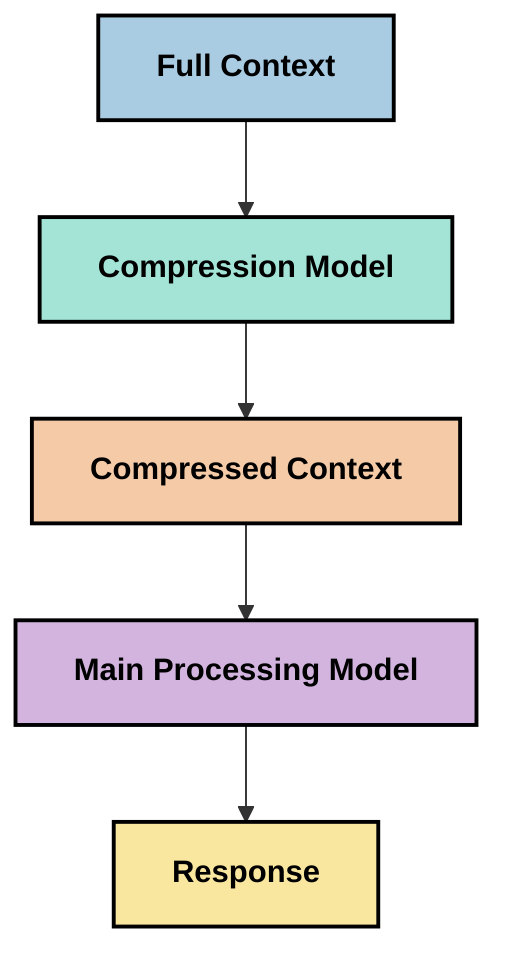

<!--
CO_OP_TRANSLATOR_METADATA:
{
  "original_hash": "fd169ca3071b81b5ee282e194bc823df",
  "translation_date": "2025-09-15T21:14:52+00:00",
  "source_file": "05-AdvancedTopics/mcp-contextengineering/README.md",
  "language_code": "hr"
}
-->
# Kontekstno inženjerstvo: Novi koncept u MCP ekosustavu

## Pregled

Kontekstno inženjerstvo je novi koncept u području umjetne inteligencije koji istražuje kako se informacije strukturiraju, dostavljaju i održavaju tijekom interakcija između klijenata i AI usluga. Kako se ekosustav Model Context Protocol (MCP) razvija, razumijevanje učinkovitog upravljanja kontekstom postaje sve važnije. Ovaj modul uvodi koncept kontekstnog inženjerstva i istražuje njegove potencijalne primjene u MCP implementacijama.

## Ciljevi učenja

Na kraju ovog modula moći ćete:

- Razumjeti novi koncept kontekstnog inženjerstva i njegovu potencijalnu ulogu u MCP aplikacijama
- Identificirati ključne izazove u upravljanju kontekstom koje MCP dizajn protokola rješava
- Istražiti tehnike za poboljšanje performansi modela kroz bolje upravljanje kontekstom
- Razmotriti pristupe za mjerenje i evaluaciju učinkovitosti konteksta
- Primijeniti ove nove koncepte za poboljšanje AI iskustava kroz MCP okvir

## Uvod u kontekstno inženjerstvo

Kontekstno inženjerstvo je novi koncept usmjeren na namjerno dizajniranje i upravljanje protokom informacija između korisnika, aplikacija i AI modela. Za razliku od etabliranih područja poput prompt inženjerstva, kontekstno inženjerstvo još uvijek definiraju praktičari dok rade na rješavanju jedinstvenih izazova pružanja AI modelima pravih informacija u pravo vrijeme.

Kako su se veliki jezični modeli (LLM) razvijali, važnost konteksta postala je sve očitija. Kvaliteta, relevantnost i struktura konteksta koji pružamo izravno utječu na izlaz modela. Kontekstno inženjerstvo istražuje ovaj odnos i nastoji razviti principe za učinkovito upravljanje kontekstom.

> "Godine 2025, modeli su izuzetno inteligentni. Ali čak ni najpametniji čovjek neće moći učinkovito obavljati svoj posao bez konteksta o tome što se od njega traži... 'Kontekstno inženjerstvo' je sljedeća razina prompt inženjerstva. Radi se o tome da se to radi automatski u dinamičkom sustavu." — Walden Yan, Cognition AI

Kontekstno inženjerstvo može obuhvaćati:

1. **Odabir konteksta**: Utvrđivanje koje su informacije relevantne za određeni zadatak
2. **Strukturiranje konteksta**: Organiziranje informacija kako bi se maksimiziralo razumijevanje modela
3. **Dostava konteksta**: Optimiziranje načina i vremena slanja informacija modelima
4. **Održavanje konteksta**: Upravljanje stanjem i evolucijom konteksta tijekom vremena
5. **Evaluacija konteksta**: Mjerenje i poboljšanje učinkovitosti konteksta

Ova područja fokusa posebno su relevantna za MCP ekosustav, koji pruža standardizirani način za aplikacije da pružaju kontekst LLM-ovima.

## Perspektiva putovanja konteksta

Jedan od načina vizualizacije kontekstnog inženjerstva je praćenje putovanja informacija kroz MCP sustav:



### Ključne faze u putovanju konteksta:

1. **Unos korisnika**: Sirove informacije od korisnika (tekst, slike, dokumenti)
2. **Sastavljanje konteksta**: Kombiniranje korisničkog unosa sa sustavnim kontekstom, poviješću razgovora i drugim dohvaćenim informacijama
3. **Obrada modela**: AI model obrađuje sastavljeni kontekst
4. **Generiranje odgovora**: Model proizvodi izlaze na temelju pruženog konteksta
5. **Upravljanje stanjem**: Sustav ažurira svoje interno stanje na temelju interakcije

Ova perspektiva naglašava dinamičku prirodu konteksta u AI sustavima i postavlja važna pitanja o tome kako najbolje upravljati informacijama u svakoj fazi.

## Novi principi u kontekstnom inženjerstvu

Kako se područje kontekstnog inženjerstva oblikuje, neki rani principi počinju se pojavljivati među praktičarima. Ovi principi mogu pomoći u donošenju odluka o MCP implementacijama:

### Princip 1: Dijelite kontekst u potpunosti

Kontekst bi trebao biti potpuno podijeljen između svih komponenti sustava, a ne fragmentiran među više agenata ili procesa. Kada je kontekst distribuiran, odluke donesene u jednom dijelu sustava mogu biti u sukobu s onima donesenima drugdje.



U MCP aplikacijama, ovo sugerira dizajniranje sustava u kojima kontekst teče neometano kroz cijeli proces, umjesto da bude podijeljen.

### Princip 2: Prepoznajte da akcije nose implicitne odluke

Svaka akcija koju model poduzme uključuje implicitne odluke o tome kako interpretirati kontekst. Kada više komponenti djeluje na različitim kontekstima, ove implicitne odluke mogu biti u sukobu, što dovodi do nedosljednih rezultata.

Ovaj princip ima važne implikacije za MCP aplikacije:
- Preferirajte linearno procesiranje složenih zadataka umjesto paralelne obrade s fragmentiranim kontekstom
- Osigurajte da sve točke donošenja odluka imaju pristup istim informacijama
- Dizajnirajte sustave u kojima kasniji koraci mogu vidjeti cijeli kontekst ranijih odluka

### Princip 3: Uravnotežite dubinu konteksta s ograničenjima prozora

Kako razgovori i procesi postaju dulji, prozori konteksta na kraju se prepunjavaju. Učinkovito kontekstno inženjerstvo istražuje pristupe za upravljanje ovom napetošću između sveobuhvatnog konteksta i tehničkih ograničenja.

Potencijalni pristupi koji se istražuju uključuju:
- Kompresiju konteksta koja zadržava bitne informacije uz smanjenje korištenja tokena
- Progresivno učitavanje konteksta na temelju relevantnosti za trenutne potrebe
- Sažimanje prethodnih interakcija uz očuvanje ključnih odluka i činjenica

## Izazovi konteksta i dizajn MCP protokola

Model Context Protocol (MCP) dizajniran je s osviještenošću o jedinstvenim izazovima upravljanja kontekstom. Razumijevanje ovih izazova pomaže objasniti ključne aspekte dizajna MCP protokola:

### Izazov 1: Ograničenja prozora konteksta
Većina AI modela ima fiksne veličine prozora konteksta, što ograničava količinu informacija koje mogu obraditi odjednom.

**Odgovor MCP dizajna:** 
- Protokol podržava strukturirani, resursno bazirani kontekst koji se može učinkovito referencirati
- Resursi se mogu paginirati i učitavati progresivno

### Izazov 2: Određivanje relevantnosti
Teško je odrediti koje su informacije najrelevantnije za uključivanje u kontekst.

**Odgovor MCP dizajna:**
- Fleksibilni alati omogućuju dinamičko dohvaćanje informacija prema potrebi
- Strukturirani promptovi omogućuju dosljednu organizaciju konteksta

### Izazov 3: Postojanost konteksta
Upravljanje stanjem kroz interakcije zahtijeva pažljivo praćenje konteksta.

**Odgovor MCP dizajna:**
- Standardizirano upravljanje sesijama
- Jasno definirani obrasci interakcije za evoluciju konteksta

### Izazov 4: Multimodalni kontekst
Različite vrste podataka (tekst, slike, strukturirani podaci) zahtijevaju različito rukovanje.

**Odgovor MCP dizajna:**
- Dizajn protokola prilagođava se različitim vrstama sadržaja
- Standardizirana reprezentacija multimodalnih informacija

### Izazov 5: Sigurnost i privatnost
Kontekst često sadrži osjetljive informacije koje moraju biti zaštićene.

**Odgovor MCP dizajna:**
- Jasne granice između odgovornosti klijenta i poslužitelja
- Opcije lokalne obrade za minimiziranje izloženosti podataka

Razumijevanje ovih izazova i kako MCP odgovara na njih pruža temelj za istraživanje naprednijih tehnika kontekstnog inženjerstva.

## Novi pristupi kontekstnom inženjerstvu

Kako se područje kontekstnog inženjerstva razvija, pojavljuju se nekoliko obećavajućih pristupa. Oni predstavljaju trenutna razmišljanja, a ne utvrđene najbolje prakse, i vjerojatno će se razvijati kako stječemo više iskustva s MCP implementacijama.

### 1. Linearna obrada u jednom nizu

Za razliku od arhitektura s više agenata koje distribuiraju kontekst, neki praktičari otkrivaju da linearna obrada u jednom nizu daje dosljednije rezultate. Ovo se slaže s principom održavanja jedinstvenog konteksta.



Iako se ovaj pristup može činiti manje učinkovitim od paralelne obrade, često daje koherentnije i pouzdanije rezultate jer svaki korak gradi na potpunom razumijevanju prethodnih odluka.

### 2. Razbijanje konteksta i prioritizacija

Razbijanje velikih konteksta na upravljive dijelove i prioritizacija najvažnijih informacija.

```python
# Conceptual Example: Context Chunking and Prioritization
def process_with_chunked_context(documents, query):
    # 1. Break documents into smaller chunks
    chunks = chunk_documents(documents)
    
    # 2. Calculate relevance scores for each chunk
    scored_chunks = [(chunk, calculate_relevance(chunk, query)) for chunk in chunks]
    
    # 3. Sort chunks by relevance score
    sorted_chunks = sorted(scored_chunks, key=lambda x: x[1], reverse=True)
    
    # 4. Use the most relevant chunks as context
    context = create_context_from_chunks([chunk for chunk, score in sorted_chunks[:5]])
    
    # 5. Process with the prioritized context
    return generate_response(context, query)
```

Gore navedeni koncept ilustrira kako možemo razbiti velike dokumente na upravljive dijelove i odabrati samo najrelevantnije dijelove za kontekst. Ovaj pristup može pomoći u radu unutar ograničenja prozora konteksta, a istovremeno koristiti velike baze znanja.

### 3. Progresivno učitavanje konteksta

Učitavanje konteksta progresivno prema potrebi, umjesto odjednom.



Progresivno učitavanje konteksta započinje s minimalnim kontekstom i proširuje se samo kada je potrebno. Ovo može značajno smanjiti korištenje tokena za jednostavne upite, a istovremeno zadržati sposobnost rješavanja složenih pitanja.

### 4. Kompresija i sažimanje konteksta

Smanjenje veličine konteksta uz očuvanje bitnih informacija.



Kompresija konteksta fokusira se na:
- Uklanjanje redundantnih informacija
- Sažimanje dugog sadržaja
- Izvlačenje ključnih činjenica i detalja
- Očuvanje kritičnih elemenata konteksta
- Optimizaciju za učinkovitost tokena

Ovaj pristup može biti posebno vrijedan za održavanje dugih razgovora unutar prozora konteksta ili za učinkovitu obradu velikih dokumenata. Neki praktičari koriste specijalizirane modele posebno za kompresiju konteksta i sažimanje povijesti razgovora.

## Istraživačke razmatranja u kontekstnom inženjerstvu

Dok istražujemo novo područje kontekstnog inženjerstva, nekoliko razmatranja vrijedi imati na umu pri radu s MCP implementacijama. Ovo nisu propisane najbolje prakse, već područja istraživanja koja mogu donijeti poboljšanja u vašem specifičnom slučaju.

### Razmotrite ciljeve konteksta

Prije implementacije složenih rješenja za upravljanje kontekstom, jasno definirajte što želite postići:
- Koje specifične informacije model treba da bi bio uspješan?
- Koje su informacije bitne, a koje dopunske?
- Koja su vaša ograničenja performansi (kašnjenje, ograničenja tokena, troškovi)?

### Istražite slojevite pristupe kontekstu

Neki praktičari postižu uspjeh s kontekstom organiziranim u konceptualne slojeve:
- **Osnovni sloj**: Bitne informacije koje model uvijek treba
- **Situacijski sloj**: Kontekst specifičan za trenutnu interakciju
- **Podržavajući sloj**: Dodatne informacije koje mogu biti korisne
- **Rezervni sloj**: Informacije koje se pristupaju samo kada su potrebne

### Istražite strategije dohvaćanja

Učinkovitost vašeg konteksta često ovisi o tome kako dohvaćate informacije:
- Semantičko pretraživanje i ugrađivanja za pronalaženje konceptualno relevantnih informacija
- Pretraživanje ključnih riječi za specifične činjenične detalje
- Hibridni pristupi koji kombiniraju više metoda dohvaćanja
- Filtriranje metapodataka za sužavanje opsega prema kategorijama, datumima ili izvorima

### Eksperimentirajte s koherencijom konteksta

Struktura i tok vašeg konteksta mogu utjecati na razumijevanje modela:
- Grupiranje povezanih informacija zajedno
- Korištenje dosljednog formatiranja i organizacije
- Održavanje logičnog ili kronološkog redoslijeda gdje je prikladno
- Izbjegavanje kontradiktornih informacija

### Razmotrite kompromis arhitektura s više agenata

Iako su arhitekture s više agenata popularne u mnogim AI okvirima, dolaze s značajnim izazovima za upravljanje kontekstom:
- Fragmentacija konteksta može dovesti do nedosljednih odluka među agentima
- Paralelna obrada može uvesti sukobe koje je teško pomiriti
- Komunikacijski troškovi između agenata mogu poništiti dobitke u performansama
- Kompleksno upravljanje stanjem potrebno je za održavanje koherencije

U mnogim slučajevima, pristup s jednim agentom uz sveobuhvatno upravljanje kontekstom može dati pouzdanije rezultate od više specijaliziranih agenata s fragmentiranim kontekstom.

### Razvijte metode evaluacije

Kako biste poboljšali kontekstno inženjerstvo tijekom vremena, razmotrite kako ćete mjeriti uspjeh:
- A/B testiranje različitih struktura konteksta
- Praćenje korištenja tokena i vremena odgovora
- Praćenje zadovoljstva korisnika i stopa dovršetka zadataka
- Analiza kada i zašto strategije konteksta ne uspijevaju

Ova razmatranja predstavljaju aktivna područja istraživanja u prostoru kontekstnog inženjerstva. Kako se područje razvija, vjerojatno će se pojaviti definiraniji obrasci i prakse.

## Mjerenje učinkovitosti konteksta: Razvijajući okvir

Kako kontekstno inženjerstvo postaje koncept, praktičari počinju istraživati kako bismo mogli mjeriti njegovu učinkovitost. Još ne postoji utvrđeni okvir, ali razmatraju se različite metrike koje bi mogle pomoći u usmjeravanju budućeg rada.

### Potencijalne dimenzije mjerenja

#### 1. Razmatranja učinkovitosti unosa

- **Omjer konteksta i odgovora**: Koliko je konteksta potrebno u odnosu na veličinu odgovora?
- **Iskorištenost tokena**: Koji postotak pruženih tokena konteksta utječe na odgovor?
- **Smanjenje konteksta**: Koliko učinkovito možemo komprimirati sirove informacije?

#### 2. Razmatranja performansi

- **Utjecaj na kašnjenje**: Kako upravljanje kontekstom utječe na vrijeme odgovora?
- **Ekonomija tokena**: Optimiziramo li učinkovito korištenje tokena?
- **Preciznost dohvaćanja**: Koliko su relevantne dohvaćene informacije?
- **Iskorištenost resursa**: Koji su računalni resursi potrebni?

#### 3. Razmatranja kvalitete

- **Relevantnost odgovora**: Koliko dobro odgovor odgovara upitu?
- **Činjenična točnost**: Poboljšava li upravljanje kontekstom činjeničnu točnost?
- **Dosljednost**: Jesu li odgovori dosljedni za slične upite?
- **Stopa halucinacija**: Smanjuje li bolji kontekst halucinacije modela?

#### 4. Razmatranja korisničkog iskustva

- **Stopa naknadnih upita**: Koliko često korisnici trebaju pojašnjenja?
- **Dovršavanje zadataka**: Uspijevaju li korisnici uspješno ostvariti svoje ciljeve?
- **Pokazatelji zadovoljstva**: Kako korisnici ocjenjuju svoje iskustvo?

### Istraživački pristupi mjerenju

Pri eksperimentiranju s kontekstnim inženjerstvom u MCP implementacijama, razmotrite ove istraživačke pristupe:

1. **Usporedbe osnovnih vrijednosti**: Uspostavite osnovnu vrijednost s jednostavnim pristupima kontekstu prije testiranja sofisticiranijih metoda

2. **Postupne promjene**: Mijenjajte jedan aspekt upravljanja kontekstom odjednom kako biste izolirali njegove učinke

3. **Evaluacija usmjerena na korisnika**: Kombinirajte kvantitativne metrike s kvalitativnim povratnim informacijama korisnika
- [Model Context Protocol Website](https://modelcontextprotocol.io/)
- [Model Context Protocol Specification](https://github.com/modelcontextprotocol/modelcontextprotocol)
- [MCP Dokumentacija](https://modelcontextprotocol.io/docs)
- [MCP C# SDK](https://github.com/modelcontextprotocol/csharp-sdk)
- [MCP Python SDK](https://github.com/modelcontextprotocol/python-sdk)
- [MCP TypeScript SDK](https://github.com/modelcontextprotocol/typescript-sdk)
- [MCP Inspector](https://github.com/modelcontextprotocol/inspector) - Alat za vizualno testiranje MCP servera

### Članci o kontekstnom inženjeringu
- [Ne gradite multi-agente: Principi kontekstnog inženjeringa](https://cognition.ai/blog/dont-build-multi-agents) - Walden Yanova razmišljanja o principima kontekstnog inženjeringa
- [Praktični vodič za izgradnju agenata](https://cdn.openai.com/business-guides-and-resources/a-practical-guide-to-building-agents.pdf) - OpenAI vodič za učinkovito dizajniranje agenata
- [Izgradnja učinkovitih agenata](https://www.anthropic.com/engineering/building-effective-agents) - Anthropicov pristup razvoju agenata

### Povezana istraživanja
- [Dinamičko proširenje pretraživanja za velike jezične modele](https://arxiv.org/abs/2310.01487) - Istraživanje o dinamičkim pristupima pretraživanju
- [Izgubljeni u sredini: Kako jezični modeli koriste duge kontekste](https://arxiv.org/abs/2307.03172) - Važno istraživanje o obrascima obrade konteksta
- [Hijerarhijsko generiranje slika uvjetovano tekstom pomoću CLIP latentnih varijabli](https://arxiv.org/abs/2204.06125) - DALL-E 2 rad s uvidima u strukturiranje konteksta
- [Istraživanje uloge konteksta u arhitekturama velikih jezičnih modela](https://aclanthology.org/2023.findings-emnlp.124/) - Nedavno istraživanje o upravljanju kontekstom
- [Suradnja više agenata: Pregled](https://arxiv.org/abs/2304.03442) - Istraživanje o sustavima s više agenata i njihovim izazovima

### Dodatni resursi
- [Tehnike optimizacije prozora konteksta](https://learn.microsoft.com/en-us/azure/ai-services/openai/concepts/context-window)
- [Napredne RAG tehnike](https://www.microsoft.com/en-us/research/blog/retrieval-augmented-generation-rag-and-frontier-models/)
- [Dokumentacija o semantičkom kernelu](https://github.com/microsoft/semantic-kernel)
- [AI alat za upravljanje kontekstom](https://github.com/microsoft/aitoolkit)

## Što slijedi 

- [5.15 MCP Prilagođeni transport](../mcp-transport/README.md)

---

**Odricanje od odgovornosti**:  
Ovaj dokument je preveden pomoću AI usluge za prevođenje [Co-op Translator](https://github.com/Azure/co-op-translator). Iako nastojimo osigurati točnost, imajte na umu da automatski prijevodi mogu sadržavati pogreške ili netočnosti. Izvorni dokument na izvornom jeziku treba smatrati autoritativnim izvorom. Za ključne informacije preporučuje se profesionalni prijevod od strane ljudskog prevoditelja. Ne preuzimamo odgovornost za nesporazume ili pogrešne interpretacije koje mogu proizaći iz korištenja ovog prijevoda.