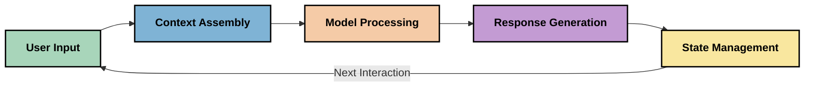
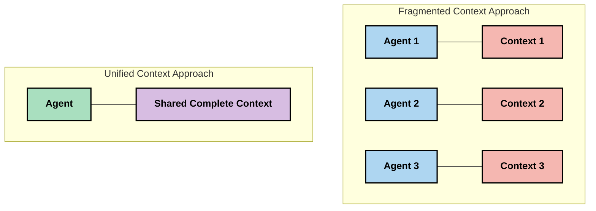
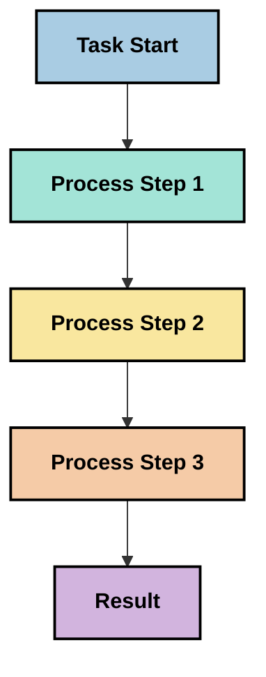
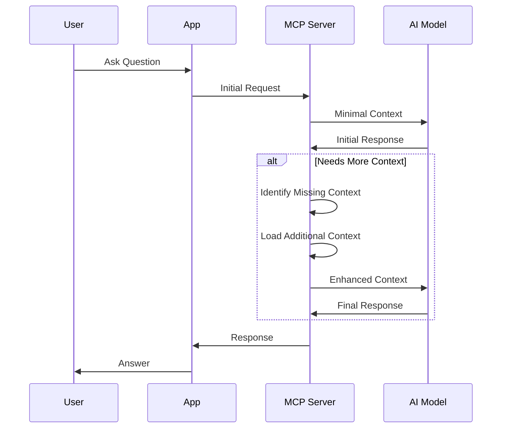
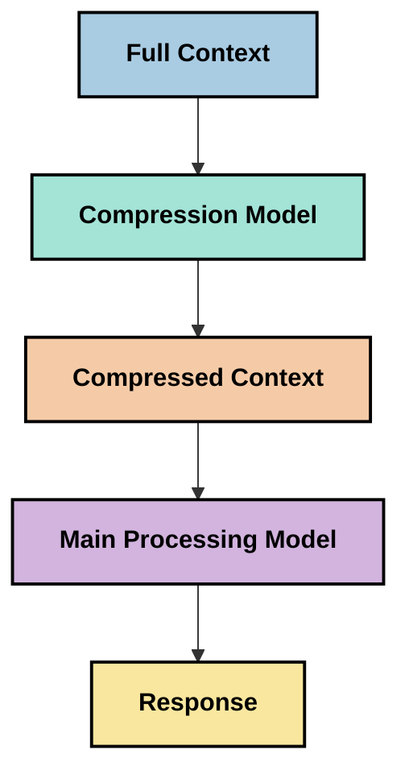

<!--
CO_OP_TRANSLATOR_METADATA:
{
  "original_hash": "5762e8e74dd99d8b7dbb31e69a82561e",
  "translation_date": "2025-07-17T13:23:26+00:00",
  "source_file": "05-AdvancedTopics/mcp-contextengineering/README.md",
  "language_code": "hr"
}
-->
# Context Engineering: Novi koncept u MCP ekosustavu

## Pregled

Context engineering je novi koncept u području umjetne inteligencije koji istražuje kako se informacije strukturiraju, prenose i održavaju tijekom interakcija između korisnika i AI servisa. Kako se Model Context Protocol (MCP) ekosustav razvija, razumijevanje učinkovitog upravljanja kontekstom postaje sve važnije. Ovaj modul uvodi pojam context engineeringa i istražuje njegove potencijalne primjene u MCP implementacijama.

## Ciljevi učenja

Na kraju ovog modula moći ćete:

- Razumjeti novi koncept context engineeringa i njegovu moguću ulogu u MCP aplikacijama
- Prepoznati ključne izazove u upravljanju kontekstom koje MCP protokol nastoji riješiti
- Istražiti tehnike za poboljšanje performansi modela kroz bolje upravljanje kontekstom
- Razmotriti pristupe za mjerenje i evaluaciju učinkovitosti konteksta
- Primijeniti ove nove koncepte za unapređenje AI iskustava kroz MCP okvir

## Uvod u Context Engineering

Context engineering je novi koncept usmjeren na namjerno dizajniranje i upravljanje protokom informacija između korisnika, aplikacija i AI modela. Za razliku od etabliranih područja poput prompt engineeringa, context engineering je još uvijek u fazi definiranja od strane praktičara koji rade na rješavanju jedinstvenih izazova pružanja pravih informacija AI modelima u pravom trenutku.

Kako su veliki jezični modeli (LLM) napredovali, važnost konteksta postala je sve očitija. Kvaliteta, relevantnost i struktura konteksta koji pružamo izravno utječu na izlaze modela. Context engineering istražuje ovaj odnos i nastoji razviti principe za učinkovito upravljanje kontekstom.

> "Godine 2025., modeli su iznimno inteligentni. Ali čak ni najpametniji čovjek neće moći učinkovito obaviti svoj posao bez konteksta onoga što se traži... 'Context engineering' je sljedeća razina prompt engineeringa. Radi se o automatskom upravljanju u dinamičkom sustavu." — Walden Yan, Cognition AI

Context engineering može obuhvaćati:

1. **Odabir konteksta**: Određivanje koje su informacije relevantne za određeni zadatak
2. **Strukturiranje konteksta**: Organiziranje informacija za maksimalno razumijevanje modela
3. **Dostava konteksta**: Optimizacija načina i vremena slanja informacija modelima
4. **Održavanje konteksta**: Upravljanje stanjem i razvojem konteksta tijekom vremena
5. **Evaluacija konteksta**: Mjerenje i poboljšanje učinkovitosti konteksta

Ova područja su posebno važna za MCP ekosustav, koji pruža standardizirani način da aplikacije dostave kontekst LLM-ovima.

## Perspektiva putovanja konteksta

Jedan od načina da se vizualizira context engineering je praćenje puta koji informacije prolaze kroz MCP sustav:



### Ključne faze u putovanju konteksta:

1. **Unos korisnika**: Sirove informacije od korisnika (tekst, slike, dokumenti)
2. **Sastavljanje konteksta**: Kombiniranje korisničkog unosa sa sustavnim kontekstom, poviješću razgovora i drugim dohvaćenim informacijama
3. **Obrada modela**: AI model obrađuje sastavljeni kontekst
4. **Generiranje odgovora**: Model proizvodi izlaze na temelju danog konteksta
5. **Upravljanje stanjem**: Sustav ažurira svoj interni status na temelju interakcije

Ova perspektiva ističe dinamičnu prirodu konteksta u AI sustavima i postavlja važna pitanja o tome kako najbolje upravljati informacijama u svakoj fazi.

## Novi principi u Context Engineeringu

Kako se područje context engineeringa razvija, neki rani principi počinju izlaziti iz prakse. Ti principi mogu pomoći u oblikovanju MCP implementacija:

### Princip 1: Dijelite kontekst u potpunosti

Kontekst bi trebao biti u potpunosti dijeljen između svih komponenti sustava, a ne fragmentiran između više agenata ili procesa. Kada je kontekst razdijeljen, odluke donesene u jednom dijelu sustava mogu biti u sukobu s onima u drugom.



U MCP aplikacijama to sugerira dizajniranje sustava u kojima kontekst neometano teče kroz cijeli proces, a ne da bude podijeljen u zasebne dijelove.

### Princip 2: Prepoznajte da akcije nose implicitne odluke

Svaka akcija koju model poduzme sadrži implicitne odluke o tome kako interpretirati kontekst. Kada više komponenti djeluje na različitim kontekstima, te implicitne odluke mogu biti u sukobu, što dovodi do nekonzistentnih rezultata.

Ovaj princip ima važne implikacije za MCP aplikacije:
- Preferirati linearno procesiranje složenih zadataka umjesto paralelnog izvođenja s fragmentiranim kontekstom
- Osigurati da svi odlučujući dijelovi imaju pristup istim informacijama o kontekstu
- Dizajnirati sustave u kojima kasniji koraci mogu vidjeti puni kontekst ranijih odluka

### Princip 3: Uravnotežite dubinu konteksta s ograničenjima prozora

Kako razgovori i procesi traju dulje, kontekstni prozori se na kraju prepunjavaju. Učinkovit context engineering istražuje pristupe za upravljanje ovim napetostima između sveobuhvatnog konteksta i tehničkih ograničenja.

Mogući pristupi uključuju:
- Kompresiju konteksta koja zadržava bitne informacije uz smanjenje broja tokena
- Postupno učitavanje konteksta prema relevantnosti za trenutne potrebe
- Sažimanje prethodnih interakcija uz očuvanje ključnih odluka i činjenica

## Izazovi konteksta i dizajn MCP protokola

Model Context Protocol (MCP) dizajniran je s osviještenošću o jedinstvenim izazovima upravljanja kontekstom. Razumijevanje tih izazova pomaže objasniti ključne aspekte dizajna MCP protokola:

### Izazov 1: Ograničenja kontekstnog prozora  
Većina AI modela ima fiksnu veličinu kontekstnog prozora, što ograničava količinu informacija koje mogu obraditi odjednom.

**Odgovor MCP dizajna:**  
- Protokol podržava strukturirani, resursno bazirani kontekst koji se može učinkovito referencirati  
- Resursi se mogu paginirati i učitavati postupno

### Izazov 2: Određivanje relevantnosti  
Teško je odrediti koje su informacije najvažnije za uključivanje u kontekst.

**Odgovor MCP dizajna:**  
- Fleksibilni alati omogućuju dinamičko dohvaćanje informacija prema potrebi  
- Strukturirani promptovi omogućuju dosljednu organizaciju konteksta

### Izazov 3: Očuvanje konteksta  
Upravljanje stanjem kroz interakcije zahtijeva pažljivo praćenje konteksta.

**Odgovor MCP dizajna:**  
- Standardizirano upravljanje sesijama  
- Jasno definirani obrasci interakcije za evoluciju konteksta

### Izazov 4: Višestruki modaliteti konteksta  
Različite vrste podataka (tekst, slike, strukturirani podaci) zahtijevaju različite pristupe.

**Odgovor MCP dizajna:**  
- Dizajn protokola podržava različite tipove sadržaja  
- Standardizirana reprezentacija višemodalnih informacija

### Izazov 5: Sigurnost i privatnost  
Kontekst često sadrži osjetljive informacije koje treba zaštititi.

**Odgovor MCP dizajna:**  
- Jasne granice između odgovornosti klijenta i servera  
- Opcije lokalne obrade za minimiziranje izloženosti podataka

Razumijevanje ovih izazova i načina na koji ih MCP rješava pruža temelj za istraživanje naprednijih tehnika context engineeringa.

## Novi pristupi u Context Engineeringu

Kako se područje context engineeringa razvija, pojavljuju se nekoliko obećavajućih pristupa. Oni predstavljaju trenutačne ideje, a ne uspostavljene najbolje prakse, i vjerojatno će se razvijati s iskustvom u MCP implementacijama.

### 1. Linearno procesiranje u jednom nizu

Za razliku od višestrukih agenata koji dijele kontekst, neki praktičari otkrivaju da linearno procesiranje u jednom nizu daje konzistentnije rezultate. To je u skladu s principom održavanja jedinstvenog konteksta.



Iako ovaj pristup može izgledati manje učinkovit od paralelnog procesiranja, često daje koherentnije i pouzdanije rezultate jer svaki korak gradi na potpunom razumijevanju prethodnih odluka.

### 2. Dijeljenje i prioritizacija konteksta

Razbijanje velikih konteksta na upravljive dijelove i davanje prioriteta najvažnijim informacijama.

```python
# Conceptual Example: Context Chunking and Prioritization
def process_with_chunked_context(documents, query):
    # 1. Break documents into smaller chunks
    chunks = chunk_documents(documents)
    
    # 2. Calculate relevance scores for each chunk
    scored_chunks = [(chunk, calculate_relevance(chunk, query)) for chunk in chunks]
    
    # 3. Sort chunks by relevance score
    sorted_chunks = sorted(scored_chunks, key=lambda x: x[1], reverse=True)
    
    # 4. Use the most relevant chunks as context
    context = create_context_from_chunks([chunk for chunk, score in sorted_chunks[:5]])
    
    # 5. Process with the prioritized context
    return generate_response(context, query)
```

Gornji koncept ilustrira kako možemo razbiti velike dokumente na manje dijelove i odabrati samo najrelevantnije za kontekst. Ovaj pristup pomaže raditi unutar ograničenja kontekstnog prozora, a istovremeno koristi velike baze znanja.

### 3. Postupno učitavanje konteksta

Učitavanje konteksta postupno, prema potrebi, umjesto odjednom.



Postupno učitavanje konteksta počinje s minimalnim kontekstom i širi se samo kad je potrebno. To može značajno smanjiti broj tokena za jednostavne upite, a zadržati sposobnost rješavanja složenih pitanja.

### 4. Kompresija i sažimanje konteksta

Smanjivanje veličine konteksta uz očuvanje bitnih informacija.



Kompresija konteksta fokusira se na:  
- Uklanjanje suvišnih informacija  
- Sažimanje dugog sadržaja  
- Izvlačenje ključnih činjenica i detalja  
- Očuvanje kritičnih elemenata konteksta  
- Optimizaciju za učinkovitost tokena

Ovaj pristup je posebno vrijedan za održavanje dugih razgovora unutar kontekstnih prozora ili za učinkovitu obradu velikih dokumenata. Neki praktičari koriste specijalizirane modele posebno za kompresiju i sažimanje povijesti razgovora.

## Razmatranja u istraživanju Context Engineeringa

Dok istražujemo novo područje context engineeringa, nekoliko razmatranja vrijedi imati na umu pri radu s MCP implementacijama. Ovo nisu propisane najbolje prakse, već područja istraživanja koja mogu donijeti poboljšanja u vašem specifičnom slučaju.

### Razmotrite svoje ciljeve konteksta

Prije implementacije složenih rješenja za upravljanje kontekstom, jasno definirajte što želite postići:  
- Koje specifične informacije model treba za uspjeh?  
- Koje su informacije ključne, a koje dodatne?  
- Koja su vaša ograničenja u performansama (kašnjenje, ograničenja tokena, troškovi)?

### Istražite slojevite pristupe kontekstu

Neki praktičari uspješno koriste kontekst organiziran u konceptualne slojeve:  
- **Temeljni sloj**: Ključne informacije koje model uvijek treba  
- **Situacijski sloj**: Kontekst specifičan za trenutnu interakciju  
- **Pomoćni sloj**: Dodatne informacije koje mogu biti korisne  
- **Rezervni sloj**: Informacije dostupne samo po potrebi

### Istražite strategije dohvaćanja

Učinkovitost vašeg konteksta često ovisi o načinu dohvaćanja informacija:  
- Semantičko pretraživanje i embeddings za pronalazak konceptualno relevantnih informacija  
- Pretraživanje po ključnim riječima za specifične činjenice  
- Hibridni pristupi koji kombiniraju više metoda dohvaćanja  
- Filtriranje metapodataka za sužavanje opsega prema kategorijama, datumima ili izvorima

### Eksperimentirajte s koherentnošću konteksta

Struktura i tok vašeg konteksta mogu utjecati na razumijevanje modela:  
- Grupiranje povezanih informacija  
- Korištenje dosljednog formatiranja i organizacije  
- Održavanje logičnog ili kronološkog reda gdje je prikladno  
- Izbjegavanje kontradiktornih informacija

### Procijenite kompromise višestrukih agenata

Iako su višestruki agenti popularni u mnogim AI okvirima, oni donose značajne izazove u upravljanju kontekstom:  
- Fragmentacija konteksta može dovesti do nekonzistentnih odluka među agentima  
- Paralelno procesiranje može uzrokovati sukobe koje je teško uskladiti  
- Troškovi komunikacije između agenata mogu poništiti dobitke u performansama  
- Potrebno je složeno upravljanje stanjem za održavanje koherentnosti

U mnogim slučajevima, pristup s jednim agentom i sveobuhvatnim upravljanjem kontekstom može dati pouzdanije rezultate od više specijaliziranih agenata s fragmentiranim kontekstom.

### Razvijajte metode evaluacije

Za poboljšanje context engineeringa tijekom vremena, razmotrite kako ćete mjeriti uspjeh:  
- A/B testiranje različitih struktura konteksta  
- Praćenje korištenja tokena i vremena odgovora  
- Praćenje zadovoljstva korisnika i stope dovršetka zadataka  
- Analiza kada i zašto strategije konteksta ne uspijevaju

Ova razmatranja predstavljaju aktivna područja istraživanja u prostoru context engineeringa. Kako se područje razvija, vjerojatno će se pojaviti jasniji obrasci i prakse.

## Mjerenje učinkovitosti konteksta: Razvijajući okvir

Kako context engineering postaje koncept, praktičari počinju istraživati kako bismo mogli mjeriti njegovu učinkovitost. Još ne postoji uspostavljeni okvir, ali razmatraju se različite metrike koje bi mogle usmjeriti budući rad.

### Potencijalne dimenzije mjerenja

#### 1. Razmatranja učinkovitosti unosa

- **Omjer konteksta i odgovora**: Koliko je konteksta potrebno u odnosu na veličinu odgovora?  
- **Iskorištenost tokena**: Koliki postotak tokena iz konteksta utječe na odgovor?  
- **Smanjenje konteksta**: Koliko učinkovito možemo komprimirati sirove informacije?

#### 2. Razmatranja performansi

- **Utjecaj na kašnjenje**: Kako upravljanje kontekstom utječe na vrijeme odgovora?  
- **Ekonomija tokena**: Optimiziramo li korištenje tokena?  
- **Preciznost dohvaćanja**: Koliko su relevantne dohvaćene informacije?  
- **Korištenje resursa**: Koji su zahtjevi za računalnim resursima?

#### 3. Razmatranja kvalitete

- **Relevantnost odgovora**: Koliko dobro odgovor zadovoljava upit?  
- **Činjenična točnost**: Poboljšava li upravljanje kontekstom točnost činjenica?  
- **Dosljednost**: Jesu li odgovori dosljedni za slične upite?  
- **Stopa halucinacija**: Smanjuje li bolji kontekst halucinacije modela?

#### 4. Razmatranja korisničkog iskustva

- **Stopa dodatnih pitanja**: Koliko često korisnici traže pojašnjenja?  
- **Dovršetak zadataka**: Ostvaruju li korisnici svoje ciljeve?  
- **Pokazatelji zadovoljstva**: Kako korisnici ocjenjuju svoje iskustvo?

### Istraživački pristupi mjerenju

Prilikom eksperimentiranja s context engineeringom u MCP implementacijama, razmotrite ove pristupe:

1. **Usporedbe s osnovnom linijom**: Uspostavite osnovu s jednostavnim pristupima prije testiranja složenijih metoda  
2. **Postupne promjene**: Mijenjajte jedan aspekt upravljanja kontekstom u jednom trenutku kako biste izolirali učinke  
3. **Evaluacija usmjerena na korisnika**: Kombinirajte kvantitativne metrike s kvalitativnim povratnim informacijama korisnika  
4. **Analiza neuspjeha**: Istražite slučajeve kada strategije konteksta ne uspijevaju kako biste razumjeli moguće poboljšanja  
5. **Višedimenzionalna procjena**: Razmotrite kompromise između učinkovitosti, kvalitete i korisničkog iskustva

Ovaj eksperimentalni, višestruki pristup mjerenju usklađen je s novom prirodom context engineeringa.

## Završne misli

Context engineering je novo područje istraživanja koje bi moglo postati ključno za učinkovite MCP aplikacije. Pažljivim razmatranjem protoka informacija kroz vaš sustav možete stvoriti AI iskustva koja su učinkovitija, točnija i korisnija za korisnike.

Tehnike
- [Model Context Protocol Website](https://modelcontextprotocol.io/)
- [Model Context Protocol Specification](https://github.com/modelcontextprotocol/modelcontextprotocol)
- [MCP Documentation](https://modelcontextprotocol.io/docs)
- [MCP C# SDK](https://github.com/modelcontextprotocol/csharp-sdk)
- [MCP Python SDK](https://github.com/modelcontextprotocol/python-sdk)
- [MCP TypeScript SDK](https://github.com/modelcontextprotocol/typescript-sdk)
- [MCP Inspector](https://github.com/modelcontextprotocol/inspector) - Vizualni alat za testiranje MCP servera

### Članci o Context Engineeringu
- [Nemojte graditi višestruke agente: principi Context Engineeringa](https://cognition.ai/blog/dont-build-multi-agents) - Walden Yanovi uvidi o principima Context Engineeringa
- [Praktični vodič za izgradnju agenata](https://cdn.openai.com/business-guides-and-resources/a-practical-guide-to-building-agents.pdf) - OpenAI vodič za učinkoviti dizajn agenata
- [Izgradnja učinkovitih agenata](https://www.anthropic.com/engineering/building-effective-agents) - Anthropicov pristup razvoju agenata

### Povezana istraživanja
- [Dinamičko poboljšanje pretraživanja za velike jezične modele](https://arxiv.org/abs/2310.01487) - Istraživanje o dinamičkim pristupima pretraživanju
- [Izgubljeni u sredini: kako jezični modeli koriste dugi kontekst](https://arxiv.org/abs/2307.03172) - Važno istraživanje o obrascima obrade konteksta
- [Hijerarhijska generacija slika uvjetovana tekstom s CLIP latentima](https://arxiv.org/abs/2204.06125) - DALL-E 2 rad s uvidima u strukturiranje konteksta
- [Istraživanje uloge konteksta u arhitekturama velikih jezičnih modela](https://aclanthology.org/2023.findings-emnlp.124/) - Najnovije istraživanje o upravljanju kontekstom
- [Suradnja višestrukih agenata: pregled](https://arxiv.org/abs/2304.03442) - Istraživanje o sustavima višestrukih agenata i njihovim izazovima

### Dodatni resursi
- [Tehnike optimizacije kontekstnog prozora](https://learn.microsoft.com/en-us/azure/ai-services/openai/concepts/context-window)
- [Napredne RAG tehnike](https://www.microsoft.com/en-us/research/blog/retrieval-augmented-generation-rag-and-frontier-models/)
- [Dokumentacija Semantic Kernel](https://github.com/microsoft/semantic-kernel)
- [AI alat za upravljanje kontekstom](https://github.com/microsoft/aitoolkit)

## Što slijedi
- [6. Doprinosi zajednice](../../06-CommunityContributions/README.md)

**Odricanje od odgovornosti**:  
Ovaj dokument je preveden korištenjem AI usluge za prevođenje [Co-op Translator](https://github.com/Azure/co-op-translator). Iako težimo točnosti, imajte na umu da automatski prijevodi mogu sadržavati pogreške ili netočnosti. Izvorni dokument na izvornom jeziku treba smatrati autoritativnim izvorom. Za kritične informacije preporučuje se profesionalni ljudski prijevod. Ne snosimo odgovornost za bilo kakva nesporazuma ili pogrešna tumačenja koja proizlaze iz korištenja ovog prijevoda.