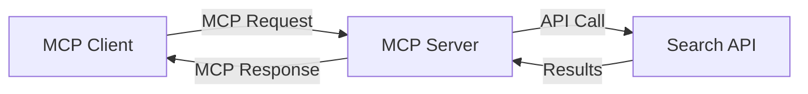
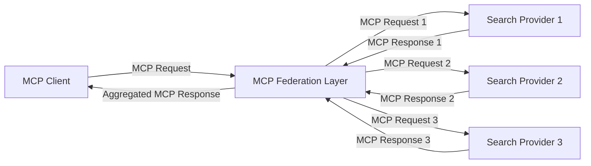
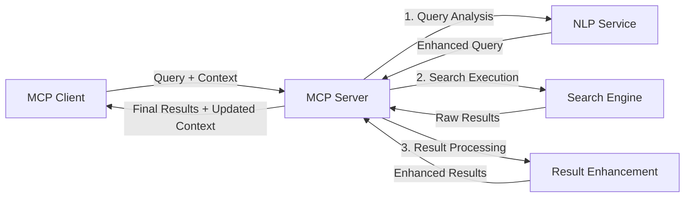

<!--
CO_OP_TRANSLATOR_METADATA:
{
  "original_hash": "eb12652eb7bd17f2193b835a344425c6",
  "translation_date": "2025-06-26T14:25:49+00:00",
  "source_file": "05-AdvancedTopics/mcp-realtimesearch/README.md",
  "language_code": "hr"
}
-->
## Odricanje od odgovornosti za primjere koda

> **Važna napomena**: Primjeri koda u nastavku prikazuju integraciju Model Context Protocol-a (MCP) s funkcionalnošću web pretraživanja. Iako slijede obrasce i strukture službenih MCP SDK-ova, pojednostavljeni su u edukativne svrhe.
> 
> Ovi primjeri prikazuju:
> 
> 1. **Python implementaciju**: FastMCP server koji pruža alat za web pretraživanje i povezuje se s vanjskim API-jem za pretraživanje. Ovaj primjer demonstrira pravilno upravljanje životnim ciklusom, rukovanje kontekstom i implementaciju alata slijedeći obrasce [službenog MCP Python SDK-a](https://github.com/modelcontextprotocol/python-sdk). Server koristi preporučeni Streamable HTTP transport koji je zamijenio stariji SSE transport za produkcijska okruženja.
> 
> 2. **JavaScript implementaciju**: TypeScript/JavaScript implementaciju koristeći FastMCP obrazac iz [službenog MCP TypeScript SDK-a](https://github.com/modelcontextprotocol/typescript-sdk) za kreiranje servera za pretraživanje s pravilnim definicijama alata i klijentskim vezama. Slijedi najnovije preporučene obrasce za upravljanje sesijama i očuvanje konteksta.
> 
> Ovi primjeri zahtijevaju dodatno rukovanje pogreškama, autentifikaciju i specifičnu integraciju API-ja za produkcijsku upotrebu. Prikazani API endpointi za pretraživanje (`https://api.search-service.example/search`) su rezervirani i trebali bi se zamijeniti stvarnim endpointima usluga za pretraživanje.
> 
> Za potpune detalje implementacije i najnovije pristupe, molimo pogledajte [službenu MCP specifikaciju](https://spec.modelcontextprotocol.io/) i dokumentaciju SDK-a.

## Osnovni pojmovi

### Okvir Model Context Protocol (MCP)

U svojoj srži, Model Context Protocol pruža standardizirani način za razmjenu konteksta između AI modela, aplikacija i servisa. U realnom vremenu web pretraživanja, ovaj okvir je ključan za stvaranje koherentnih, višekratnih iskustava pretraživanja. Ključne komponente uključuju:

1. **Klijent-server arhitektura**: MCP uspostavlja jasnu podjelu između klijenata za pretraživanje (zahtjevača) i servera za pretraživanje (pružatelja), omogućujući fleksibilne modele implementacije.

2. **JSON-RPC komunikacija**: Protokol koristi JSON-RPC za razmjenu poruka, što ga čini kompatibilnim s web tehnologijama i lakim za implementaciju na različitim platformama.

3. **Upravljanje kontekstom**: MCP definira strukturirane metode za održavanje, ažuriranje i korištenje konteksta pretraživanja kroz višestruke interakcije.

4. **Definicije alata**: Mogućnosti pretraživanja izlažu se kao standardizirani alati s dobro definiranim parametrima i povratnim vrijednostima.

5. **Podrška za streaming**: Protokol podržava streaming rezultata, što je ključno za pretraživanje u realnom vremenu gdje rezultati mogu stizati postepeno.

### Obrasci integracije web pretraživanja

Prilikom integracije MCP-a s web pretraživanjem, pojavljuju se sljedeći obrasci:

#### 1. Izravna integracija pružatelja pretraživanja

U ovom obrascu, MCP server izravno komunicira s jednim ili više API-ja za pretraživanje, prevodeći MCP zahtjeve u API-specifične pozive i formatirajući rezultate kao MCP odgovore.

#### 2. Federirano pretraživanje s očuvanjem konteksta

Ovaj obrazac distribuira upite za pretraživanje preko više MCP-kompatibilnih pružatelja pretraživanja, od kojih se svaki može specijalizirati za različite vrste sadržaja ili mogućnosti pretraživanja, dok se održava jedinstveni kontekst.

#### 3. Lanac pretraživanja s poboljšanim kontekstom

U ovom obrascu, proces pretraživanja podijeljen je u više faza, pri čemu se kontekst obogaćuje u svakom koraku, rezultirajući progresivno relevantnijim rezultatima.

### Komponente konteksta pretraživanja

U MCP-baziranom web pretraživanju, kontekst obično uključuje:

- **Povijest upita**: Prethodni upiti u sesiji
- **Korisničke postavke**: Jezik, regija, postavke sigurnog pretraživanja
- **Povijest interakcija**: Koji su rezultati kliknuti, vrijeme provedeno na rezultatima
- **Parametri pretraživanja**: Filteri, redoslijed sortiranja i drugi modifikatori pretraživanja
- **Znanje o domeni**: Kontekst specifičan za temu relevantnu za pretraživanje
- **Vremenski kontekst**: Faktori relevantnosti povezani s vremenom
- **Preferencije izvora**: Pouzdani ili preferirani izvori informacija

## Primjeri upotrebe i primjene

### Istraživanje i prikupljanje informacija

MCP poboljšava radne tokove istraživanja:

- Očuvanjem konteksta istraživanja kroz sesije pretraživanja
- Omogućavanjem sofisticiranijih i kontekstualno relevantnih upita
- Podržavanjem federacije pretraživanja s više izvora
- Olakšavanjem ekstrakcije znanja iz rezultata pretraživanja

### Praćenje vijesti i trendova u realnom vremenu

Pretraživanje vođeno MCP-om nudi prednosti za praćenje vijesti:

- Otkrivanje vijesti u gotovo stvarnom vremenu
- Kontekstualno filtriranje relevantnih informacija
- Praćenje tema i entiteta preko više izvora
- Personalizirane vijesti temeljem korisničkog konteksta

### Pretraživanje i istraživanje uz podršku AI-a

MCP otvara nove mogućnosti za AI-podržano pregledavanje:

- Kontekstualni prijedlozi pretraživanja temeljem trenutne aktivnosti u pregledniku
- Besprijekorna integracija web pretraživanja s LLM-pokretanim asistentima
- Višekratno usavršavanje pretraživanja uz očuvani kontekst
- Poboljšano provjeravanje činjenica i verifikacija informacija

## Budući trendovi i inovacije

### Evolucija MCP-a u web pretraživanju

U budućnosti očekujemo da će MCP odgovoriti na:

- **Multimodalno pretraživanje**: Integracija teksta, slike, zvuka i videa uz očuvani kontekst
- **Decentralizirano pretraživanje**: Podrška za distribuirane i federirane pretraživačke ekosustave
- **Privatnost pretraživanja**: Mehanizmi očuvanja privatnosti s osviještenim kontekstom
- **Razumijevanje upita**: Dubinska semantička analiza prirodnog jezika upita za pretraživanje

### Potencijalni tehnološki napreci

Nove tehnologije koje će oblikovati budućnost MCP pretraživanja:

1. **Neuralne arhitekture pretraživanja**: Sustavi pretraživanja temeljeni na ugradnjama optimizirani za MCP
2. **Personalizirani kontekst pretraživanja**: Učenje individualnih obrazaca pretraživanja korisnika tijekom vremena
3. **Integracija znanstvenih grafova**: Kontekstualno pretraživanje potpomognuto domen-specifičnim znanstvenim grafovima
4. **Kros-modalni kontekst**: Očuvanje konteksta kroz različite modalitete pretraživanja

## Praktične vježbe

### Vježba 1: Postavljanje osnovne MCP pretraživačke cijevi

U ovoj vježbi naučit ćete kako:
- Konfigurirati osnovno MCP pretraživačko okruženje
- Implementirati rukovatelje kontekstom za web pretraživanje
- Testirati i potvrditi očuvanje konteksta kroz iteracije pretraživanja

### Vježba 2: Izrada asistenta za istraživanje s MCP pretraživanjem

Izradite kompletnu aplikaciju koja:
- Procesira prirodno jezična istraživačka pitanja
- Izvodi pretraživanja weba s osviještenim kontekstom
- Sintetizira informacije iz više izvora
- Prikazuje organizirane rezultate istraživanja

### Vježba 3: Implementacija federacije pretraživanja s više izvora uz MCP

Napredna vježba koja pokriva:
- Kontekstualno usmjeravanje upita prema više tražilica
- Rangiranje i agregaciju rezultata
- Kontekstualnu deduplikaciju rezultata pretraživanja
- Rukovanje metapodacima specifičnim za izvor

## Dodatni resursi

- [Model Context Protocol Specification](https://spec.modelcontextprotocol.io/) - Službena MCP specifikacija i detaljna dokumentacija protokola
- [Model Context Protocol Documentation](https://modelcontextprotocol.io/) - Detaljni tutorijali i vodiči za implementaciju
- [MCP Python SDK](https://github.com/modelcontextprotocol/python-sdk) - Službena Python implementacija MCP protokola
- [MCP TypeScript SDK](https://github.com/modelcontextprotocol/typescript-sdk) - Službena TypeScript implementacija MCP protokola
- [MCP Reference Servers](https://github.com/modelcontextprotocol/servers) - Referentne implementacije MCP servera
- [Bing Web Search API Documentation](https://learn.microsoft.com/en-us/bing/search-apis/bing-web-search/overview) - Microsoftov API za web pretraživanje
- [Google Custom Search JSON API](https://developers.google.com/custom-search/v1/overview) - Googleov programabilni pretraživač
- [SerpAPI Documentation](https://serpapi.com/search-api) - API za rezultate pretraživača
- [Meilisearch Documentation](https://www.meilisearch.com/docs) - Open-source tražilica
- [Elasticsearch Documentation](https://www.elastic.co/guide/index.html) - Distribuirani sustav za pretraživanje i analitiku
- [LangChain Documentation](https://python.langchain.com/docs/get_started/introduction) - Izrada aplikacija s LLM-ovima

## Ishodi učenja

Nakon završetka ovog modula moći ćete:

- Razumjeti osnove real-time web pretraživanja i njegove izazove
- Objasniti kako Model Context Protocol (MCP) poboljšava mogućnosti real-time web pretraživanja
- Implementirati MCP-bazirane pretraživačke sustave koristeći popularne okvire i API-je
- Dizajnirati i implementirati skalabilne, visokoučinkovite arhitekture pretraživanja s MCP-om
- Primijeniti MCP koncepte na različite slučajeve korištenja uključujući semantičko pretraživanje, asistenciju u istraživanju i AI-podržano pregledavanje
- Procijeniti nove trendove i buduće inovacije u MCP-baziranim tehnologijama pretraživanja

### Razmatranja o povjerenju i sigurnosti

Prilikom implementacije MCP-baziranih rješenja za web pretraživanje, imajte na umu sljedeća važna načela iz MCP specifikacije:

1. **Slažem korisnika i kontrola**: Korisnici moraju izričito dati pristanak i razumjeti sve pristupe podacima i operacije. Ovo je osobito važno za implementacije web pretraživanja koje mogu pristupati vanjskim izvorima podataka.

2. **Privatnost podataka**: Osigurajte odgovarajuće rukovanje upitima i rezultatima pretraživanja, posebno ako sadrže osjetljive informacije. Implementirajte odgovarajuće kontrole pristupa za zaštitu korisničkih podataka.

3. **Sigurnost alata**: Implementirajte pravilnu autorizaciju i validaciju za alate za pretraživanje, jer predstavljaju potencijalne sigurnosne rizike kroz izvođenje proizvoljnog koda. Opisi ponašanja alata trebaju se smatrati nepouzdanim osim ako nisu dobiveni s pouzdanog servera.

4. **Jasna dokumentacija**: Osigurajte jasnu dokumentaciju o mogućnostima, ograničenjima i sigurnosnim razmatranjima vaše MCP-bazirane implementacije pretraživanja, slijedeći smjernice iz MCP specifikacije.

5. **Robusni procesi pristanka**: Izgradite robusne procese pristanka i autorizacije koji jasno objašnjavaju što svaki alat radi prije nego što mu se dozvoli korištenje, osobito za alate koji komuniciraju s vanjskim web resursima.

Za potpune detalje o sigurnosti i razmatranjima povjerenja MCP-a, pogledajte [službenu dokumentaciju](https://modelcontextprotocol.io/specification/2025-03-26#security-and-trust-%26-safety).

## Što slijedi

- [5.11 Entra ID Authentication for Model Context Protocol Servers](../mcp-security-entra/README.md)

**Odricanje od odgovornosti**:  
Ovaj dokument preveden je pomoću AI usluge za prevođenje [Co-op Translator](https://github.com/Azure/co-op-translator). Iako nastojimo osigurati točnost, imajte na umu da automatski prijevodi mogu sadržavati pogreške ili netočnosti. Izvorni dokument na izvornom jeziku treba smatrati autoritativnim izvorom. Za kritične informacije preporučuje se profesionalni ljudski prijevod. Ne snosimo odgovornost za bilo kakva nesporazuma ili pogrešna tumačenja koja proizlaze iz korištenja ovog prijevoda.