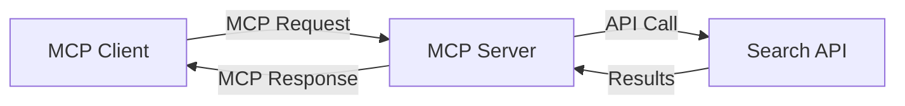
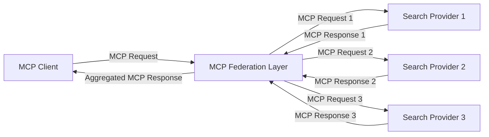
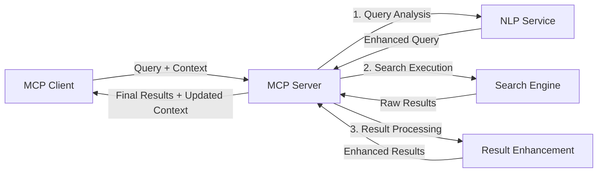

<!--
CO_OP_TRANSLATOR_METADATA:
{
  "original_hash": "333a03e51f90bdf3e6f1ba1694c73f36",
  "translation_date": "2025-07-17T12:08:40+00:00",
  "source_file": "05-AdvancedTopics/mcp-realtimesearch/README.md",
  "language_code": "hr"
}
-->
## Odricanje od odgovornosti za primjere koda

> **Važna napomena**: Primjeri koda u nastavku pokazuju integraciju Model Context Protocol (MCP) s funkcionalnošću web pretraživanja. Iako slijede obrasce i strukture službenih MCP SDK-ova, pojednostavljeni su u edukativne svrhe.
> 
> Ovi primjeri prikazuju:
> 
> 1. **Python implementaciju**: FastMCP server koji pruža alat za web pretraživanje i povezuje se s vanjskim API-jem za pretraživanje. Ovaj primjer pokazuje pravilno upravljanje životnim ciklusom, rukovanje kontekstom i implementaciju alata prema obrascima [službenog MCP Python SDK-a](https://github.com/modelcontextprotocol/python-sdk). Server koristi preporučeni Streamable HTTP transport koji je zamijenio stariji SSE transport za produkcijska okruženja.
> 
> 2. **JavaScript implementaciju**: TypeScript/JavaScript implementaciju koristeći FastMCP obrazac iz [službenog MCP TypeScript SDK-a](https://github.com/modelcontextprotocol/typescript-sdk) za kreiranje servera za pretraživanje s pravilnim definicijama alata i klijentskim vezama. Slijedi najnovije preporučene obrasce za upravljanje sesijama i očuvanje konteksta.
> 
> Ovi primjeri zahtijevali bi dodatno rukovanje greškama, autentifikaciju i specifičnu integraciju API-ja za produkcijsku upotrebu. Prikazani API endpointi za pretraživanje (`https://api.search-service.example/search`) su rezervirani i trebali bi se zamijeniti stvarnim endpointima usluga pretraživanja.
> 
> Za potpune detalje implementacije i najnovije pristupe, molimo pogledajte [službenu MCP specifikaciju](https://spec.modelcontextprotocol.io/) i dokumentaciju SDK-a.

## Osnovni pojmovi

### Okvir Model Context Protocol (MCP)

U svojoj osnovi, Model Context Protocol pruža standardizirani način za razmjenu konteksta između AI modela, aplikacija i servisa. U realnom vremenu web pretraživanja, ovaj okvir je ključan za stvaranje koherentnih iskustava pretraživanja s više koraka. Ključne komponente uključuju:

1. **Klijent-server arhitektura**: MCP uspostavlja jasnu podjelu između klijenata za pretraživanje (zahtjevača) i servera za pretraživanje (pružatelja), omogućujući fleksibilne modele implementacije.

2. **JSON-RPC komunikacija**: Protokol koristi JSON-RPC za razmjenu poruka, što ga čini kompatibilnim s web tehnologijama i jednostavnim za implementaciju na različitim platformama.

3. **Upravljanje kontekstom**: MCP definira strukturirane metode za održavanje, ažuriranje i korištenje konteksta pretraživanja kroz više interakcija.

4. **Definicije alata**: Mogućnosti pretraživanja izlažu se kao standardizirani alati s jasno definiranim parametrima i povratnim vrijednostima.

5. **Podrška za streaming**: Protokol podržava streaming rezultata, što je ključno za pretraživanje u stvarnom vremenu gdje rezultati mogu stizati postupno.

### Obrasci integracije web pretraživanja

Prilikom integracije MCP-a s web pretraživanjem, pojavljuju se nekoliko obrazaca:

#### 1. Izravna integracija pružatelja pretraživanja

U ovom obrascu, MCP server izravno komunicira s jednim ili više API-ja za pretraživanje, prevodeći MCP zahtjeve u specifične API pozive i formatirajući rezultate kao MCP odgovore.

#### 2. Federirano pretraživanje s očuvanjem konteksta

Ovaj obrazac raspoređuje upite za pretraživanje preko više MCP-kompatibilnih pružatelja pretraživanja, od kojih svaki može biti specijaliziran za različite vrste sadržaja ili mogućnosti pretraživanja, dok se održava jedinstveni kontekst.

#### 3. Lanac pretraživanja s poboljšanim kontekstom

U ovom obrascu, proces pretraživanja podijeljen je u više faza, pri čemu se kontekst obogaćuje u svakom koraku, što rezultira postupno relevantnijim rezultatima.

### Komponente konteksta pretraživanja

U MCP-baziranom web pretraživanju, kontekst obično uključuje:

- **Povijest upita**: Prethodni upiti u sesiji
- **Korisničke postavke**: Jezik, regija, postavke sigurnog pretraživanja
- **Povijest interakcija**: Koji su rezultati kliknuti, vrijeme provedeno na rezultatima
- **Parametri pretraživanja**: Filtri, redoslijedi sortiranja i drugi modifikatori pretraživanja
- **Stručno znanje**: Kontekst specifičan za temu relevantnu za pretraživanje
- **Vremenski kontekst**: Faktori relevantnosti vezani uz vrijeme
- **Preferencije izvora**: Pouzdani ili preferirani izvori informacija

## Primjeri upotrebe i primjene

### Istraživanje i prikupljanje informacija

MCP poboljšava radne tokove istraživanja kroz:

- Očuvanje konteksta istraživanja kroz sesije pretraživanja
- Omogućavanje sofisticiranijih i kontekstualno relevantnijih upita
- Podršku za federirano pretraživanje iz više izvora
- Olakšavanje izvlačenja znanja iz rezultata pretraživanja

### Praćenje vijesti i trendova u stvarnom vremenu

Pretraživanje pokretano MCP-om nudi prednosti za praćenje vijesti:

- Otkrivanje novih vijesti gotovo u stvarnom vremenu
- Kontekstualno filtriranje relevantnih informacija
- Praćenje tema i entiteta preko više izvora
- Personalizirane obavijesti o vijestima temeljene na korisničkom kontekstu

### AI-podržano pregledavanje i istraživanje

MCP otvara nove mogućnosti za AI-podržano pregledavanje:

- Kontekstualni prijedlozi pretraživanja temeljeni na trenutnoj aktivnosti preglednika
- Besprijekorna integracija web pretraživanja s asistentima pokretanim velikim jezičnim modelima (LLM)
- Višekratno usavršavanje pretraživanja uz održavanje konteksta
- Poboljšano provjeravanje činjenica i verifikacija informacija

## Budući trendovi i inovacije

### Evolucija MCP-a u web pretraživanju

Gledajući unaprijed, očekujemo da će MCP evoluirati kako bi obuhvatio:

- **Multimodalno pretraživanje**: Integraciju pretraživanja teksta, slika, zvuka i videa uz očuvani kontekst
- **Decentralizirano pretraživanje**: Podršku za distribuirane i federirane pretraživačke ekosustave
- **Privatnost pretraživanja**: Mehanizmi pretraživanja koji čuvaju privatnost uz svijest o kontekstu  
- **Razumijevanje upita**: Dubinska semantička analiza prirodnih jezičnih upita za pretraživanje

### Potencijalni tehnološki napredci

Nove tehnologije koje će oblikovati budućnost MCP pretraživanja:

1. **Neuronske arhitekture pretraživanja**: Sustavi pretraživanja temeljeni na ugradnjama optimizirani za MCP  
2. **Personalizirani kontekst pretraživanja**: Učenje obrazaca pretraživanja pojedinih korisnika tijekom vremena  
3. **Integracija znanstvenih grafova**: Kontekstualno pretraživanje unaprijeđeno domen-specifičnim znanstvenim grafovima  
4. **Kros-modalni kontekst**: Održavanje konteksta kroz različite modalitete pretraživanja

## Praktične vježbe

### Vježba 1: Postavljanje osnovnog MCP pretraživačkog sustava

U ovoj vježbi naučit ćete kako:  
- Konfigurirati osnovno MCP pretraživačko okruženje  
- Implementirati upravitelje konteksta za web pretraživanje  
- Testirati i potvrditi očuvanje konteksta kroz iteracije pretraživanja

### Vježba 2: Izrada istraživačkog asistenta s MCP pretraživanjem

Izradite kompletnu aplikaciju koja:  
- Obradjuje istraživačka pitanja na prirodnom jeziku  
- Izvodi pretraživanja na webu uz svijest o kontekstu  
- Sintetizira informacije iz više izvora  
- Prikazuje organizirane rezultate istraživanja

### Vježba 3: Implementacija federacije pretraživanja iz više izvora s MCP

Napredna vježba koja obuhvaća:  
- Kontekstualno usmjeravanje upita prema više tražilica  
- Rangiranje i agregaciju rezultata  
- Kontekstualno uklanjanje duplikata rezultata pretraživanja  
- Rukovanje metapodacima specifičnim za izvor

## Dodatni resursi

- [Model Context Protocol Specification](https://spec.modelcontextprotocol.io/) - Službena MCP specifikacija i detaljna dokumentacija protokola  
- [Model Context Protocol Documentation](https://modelcontextprotocol.io/) - Detaljni tutorijali i vodiči za implementaciju  
- [MCP Python SDK](https://github.com/modelcontextprotocol/python-sdk) - Službena Python implementacija MCP protokola  
- [MCP TypeScript SDK](https://github.com/modelcontextprotocol/typescript-sdk) - Službena TypeScript implementacija MCP protokola  
- [MCP Reference Servers](https://github.com/modelcontextprotocol/servers) - Referentne implementacije MCP servera  
- [Bing Web Search API Documentation](https://learn.microsoft.com/en-us/bing/search-apis/bing-web-search/overview) - Microsoftov API za web pretraživanje  
- [Google Custom Search JSON API](https://developers.google.com/custom-search/v1/overview) - Googleov programabilni tražilac  
- [SerpAPI Documentation](https://serpapi.com/search-api) - API za rezultate tražilica  
- [Meilisearch Documentation](https://www.meilisearch.com/docs) - Open-source tražilica  
- [Elasticsearch Documentation](https://www.elastic.co/guide/index.html) - Distribuirani sustav za pretraživanje i analitiku  
- [LangChain Documentation](https://python.langchain.com/docs/get_started/introduction) - Izrada aplikacija s LLM-ovima

## Ishodi učenja

Nakon završetka ovog modula moći ćete:

- Razumjeti osnove pretraživanja weba u stvarnom vremenu i njegove izazove  
- Objasniti kako Model Context Protocol (MCP) poboljšava mogućnosti pretraživanja u stvarnom vremenu  
- Implementirati pretraživačka rješenja temeljena na MCP koristeći popularne okvire i API-je  
- Dizajnirati i implementirati skalabilne, visokoučinkovite arhitekture pretraživanja s MCP-om  
- Primijeniti MCP koncepte u različitim slučajevima upotrebe uključujući semantičko pretraživanje, asistenciju u istraživanju i AI-podržano pregledavanje  
- Procijeniti nove trendove i buduće inovacije u tehnologijama pretraživanja temeljenim na MCP-u

### Razmatranja o povjerenju i sigurnosti

Prilikom implementacije MCP-based web pretraživačkih rješenja, imajte na umu ove važne principe iz MCP specifikacije:

1. **Slažem se i kontrola korisnika**: Korisnici moraju izričito pristati i razumjeti sve pristupe podacima i operacije. Ovo je posebno važno za implementacije web pretraživanja koje mogu pristupati vanjskim izvorima podataka.

2. **Privatnost podataka**: Osigurajte odgovarajuće rukovanje upitima i rezultatima pretraživanja, osobito ako mogu sadržavati osjetljive informacije. Implementirajte odgovarajuće kontrole pristupa za zaštitu korisničkih podataka.

3. **Sigurnost alata**: Implementirajte pravilnu autorizaciju i validaciju za alate za pretraživanje, jer oni predstavljaju potencijalne sigurnosne rizike zbog mogućnosti izvršavanja proizvoljnog koda. Opisi ponašanja alata trebaju se smatrati nepouzdanim osim ako nisu dobiveni s pouzdanog servera.

4. **Jasna dokumentacija**: Osigurajte jasnu dokumentaciju o mogućnostima, ograničenjima i sigurnosnim aspektima vaše MCP implementacije, slijedeći smjernice iz MCP specifikacije.

5. **Robusni procesi pristanka**: Izgradite robusne procese pristanka i autorizacije koji jasno objašnjavaju što svaki alat radi prije nego što mu se odobri korištenje, osobito za alate koji komuniciraju s vanjskim web resursima.

Za potpune detalje o sigurnosti i povjerenju u MCP, pogledajte [službenu dokumentaciju](https://modelcontextprotocol.io/specification/2025-03-26#security-and-trust-%26-safety).

## Što slijedi

- [5.12 Entra ID Authentication for Model Context Protocol Servers](../mcp-security-entra/README.md)

**Odricanje od odgovornosti**:  
Ovaj dokument je preveden korištenjem AI usluge za prevođenje [Co-op Translator](https://github.com/Azure/co-op-translator). Iako nastojimo postići točnost, imajte na umu da automatski prijevodi mogu sadržavati pogreške ili netočnosti. Izvorni dokument na izvornom jeziku treba smatrati autoritativnim izvorom. Za kritične informacije preporučuje se profesionalni ljudski prijevod. Ne snosimo odgovornost za bilo kakva nesporazume ili pogrešna tumačenja koja proizlaze iz korištenja ovog prijevoda.