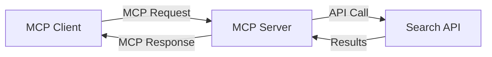
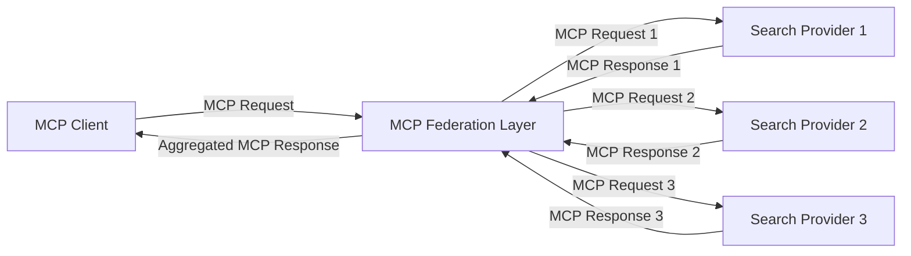
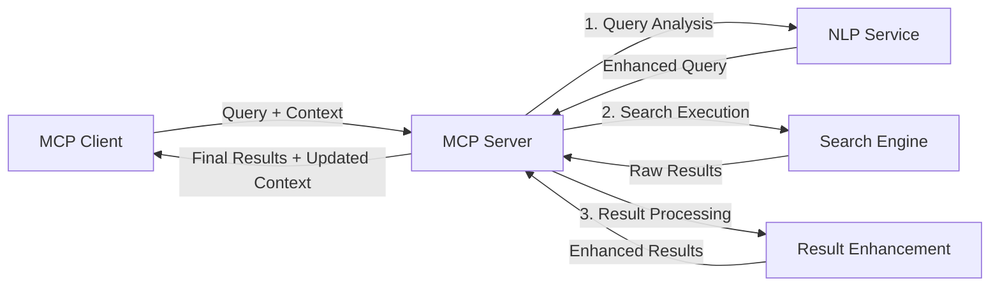

<!--
CO_OP_TRANSLATOR_METADATA:
{
  "original_hash": "16bef2c93c6a86d4ca6a8ce9e120e384",
  "translation_date": "2025-06-13T03:05:33+00:00",
  "source_file": "05-AdvancedTopics/mcp-realtimesearch/README.md",
  "language_code": "hr"
}
-->
## Ograničenje primjera koda

> **Važna napomena**: Primjeri koda u nastavku prikazuju integraciju Model Context Protocol (MCP) s funkcionalnošću web pretraživanja. Iako slijede obrasce i strukture službenih MCP SDK-ova, pojednostavljeni su u edukativne svrhe.
> 
> Ovi primjeri prikazuju:
> 
> 1. **Python implementacija**: FastMCP server koji pruža alat za web pretraživanje i povezuje se s vanjskim API-jem za pretraživanje. Ovaj primjer pokazuje pravilno upravljanje životnim ciklusom, rukovanje kontekstom i implementaciju alata, slijedeći obrasce iz [službenog MCP Python SDK-a](https://github.com/modelcontextprotocol/python-sdk). Server koristi preporučeni Streamable HTTP transport koji je zamijenio stariji SSE transport za produkcijska okruženja.
> 
> 2. **JavaScript implementacija**: TypeScript/JavaScript implementacija koristeći FastMCP obrazac iz [službenog MCP TypeScript SDK-a](https://github.com/modelcontextprotocol/typescript-sdk) za kreiranje servera za pretraživanje s pravilnim definicijama alata i povezivanjem klijenta. Slijedi najnovije preporučene obrasce za upravljanje sesijama i očuvanje konteksta.
> 
> Ovi primjeri zahtijevaju dodatno rukovanje greškama, autentifikaciju i specifičnu integraciju API-ja za produkcijsku upotrebu. Prikazane krajnje točke pretraživačkog API-ja (`https://api.search-service.example/search`) su rezervirane i trebale bi biti zamijenjene stvarnim adresama usluga za pretraživanje.
> 
> Za potpune detalje implementacije i najnovije pristupe, molimo pogledajte [službenu MCP specifikaciju](https://spec.modelcontextprotocol.io/) i dokumentaciju SDK-a.

## Osnovni pojmovi

### Okvir Model Context Protocol (MCP)

U svojoj osnovi, Model Context Protocol pruža standardizirani način za razmjenu konteksta između AI modela, aplikacija i servisa. U realnom vremenu web pretraživanja, ovaj okvir je ključan za stvaranje koherentnih iskustava pretraživanja u više koraka. Ključne komponente uključuju:

1. **Klijent-server arhitektura**: MCP uspostavlja jasnu podjelu između klijenata za pretraživanje (zahtjevača) i servera za pretraživanje (pružatelja), omogućujući fleksibilne modele implementacije.

2. **JSON-RPC komunikacija**: Protokol koristi JSON-RPC za razmjenu poruka, što ga čini kompatibilnim s web tehnologijama i jednostavnim za implementaciju na različitim platformama.

3. **Upravljanje kontekstom**: MCP definira strukturirane metode za održavanje, ažuriranje i korištenje konteksta pretraživanja kroz višestruke interakcije.

4. **Definicije alata**: Mogućnosti pretraživanja izlažu se kao standardizirani alati s jasno definiranim parametrima i povratnim vrijednostima.

5. **Podrška za streaming**: Protokol podržava streaming rezultata, što je ključno za pretraživanje u realnom vremenu gdje rezultati mogu stizati postupno.

### Obrasci integracije web pretraživanja

Prilikom integracije MCP-a s web pretraživanjem, pojavljuje se nekoliko obrazaca:

#### 1. Direktna integracija pružatelja pretraživanja

U ovom obrascu MCP server izravno komunicira s jednim ili više pretraživačkih API-ja, prevodeći MCP zahtjeve u API-specifične pozive i formatirajući rezultate kao MCP odgovore.

#### 2. Federirano pretraživanje s očuvanjem konteksta

Ovaj obrazac distribuira pretraživačke upite preko više MCP-kompatibilnih pružatelja pretraživanja, pri čemu svaki može biti specijaliziran za različite vrste sadržaja ili mogućnosti pretraživanja, dok se održava jedinstveni kontekst.

#### 3. Lanac pretraživanja s poboljšanim kontekstom

U ovom obrascu proces pretraživanja podijeljen je u više faza, gdje se kontekst obogaćuje u svakom koraku, rezultirajući postupno relevantnijim rezultatima.

### Komponente konteksta pretraživanja

U MCP-u za web pretraživanje, kontekst obično uključuje:

- **Povijest upita**: Prethodni pretraživački upiti u sesiji
- **Korisničke postavke**: Jezik, regija, postavke sigurnog pretraživanja
- **Povijest interakcija**: Koje su rezultate korisnici kliknuli, vrijeme provedeno na rezultatima
- **Parametri pretraživanja**: Filteri, redoslijed sortiranja i drugi modifikatori pretraživanja
- **Stručno znanje**: Kontekst specifičan za predmet relevantan za pretraživanje
- **Vremenski kontekst**: Faktori relevantnosti vezani uz vrijeme
- **Preferencije izvora**: Pouzdani ili preferirani izvori informacija

## Primjeri upotrebe i primjene

### Istraživanje i prikupljanje informacija

MCP unapređuje istraživačke tijekove rada kroz:

- Očuvanje istraživačkog konteksta tijekom sesija pretraživanja
- Omogućavanje sofisticiranijih i kontekstualno relevantnih upita
- Podršku za federirano pretraživanje iz više izvora
- Olakšavanje ekstrakcije znanja iz rezultata pretraživanja

### Praćenje vijesti i trendova u realnom vremenu

Pretraživanje s podrškom MCP-a nudi prednosti za praćenje vijesti:

- Otkrivanje novih vijesti gotovo u stvarnom vremenu
- Kontekstualno filtriranje relevantnih informacija
- Praćenje tema i entiteta preko više izvora
- Personalizirane obavijesti o vijestima temeljene na korisničkom kontekstu

### Pretraživanje uz AI podršku i asistenciju

MCP otvara nove mogućnosti za pretraživanje uz AI asistenciju:

- Kontekstualni prijedlozi pretraživanja temeljeni na trenutnoj aktivnosti u pregledniku
- Besprijekorna integracija web pretraživanja s asistentima pokretanim LLM-ovima
- Višekratno rafiniranje pretraživanja uz održavanje konteksta
- Poboljšano provjeravanje činjenica i verifikacija informacija

## Budući trendovi i inovacije

### Evolucija MCP-a u web pretraživanju

U budućnosti očekujemo da će MCP evoluirati kako bi obuhvatio:

- **Multimodalno pretraživanje**: Integracija pretraživanja teksta, slike, zvuka i videa uz očuvanje konteksta
- **Decentralizirano pretraživanje**: Podrška za distribuirane i federirane pretraživačke ekosustave
- **Privatnost pretraživanja**: Mehanizmi pretraživanja koji štite privatnost uz svijest o kontekstu
- **Razumijevanje upita**: Duboka semantička analiza prirodnog jezika u pretraživačkim upitima

### Potencijalni tehnološki napreci

Nove tehnologije koje će oblikovati budućnost MCP pretraživanja:

1. **Neuralne arhitekture pretraživanja**: Sustavi pretraživanja temeljeni na ugradnjama optimizirani za MCP
2. **Personalizirani kontekst pretraživanja**: Učenje obrazaca pretraživanja pojedinog korisnika tijekom vremena
3. **Integracija grafova znanja**: Kontekstualno pretraživanje potpomognuto domen-specifičnim grafovima znanja
4. **Kros-modalni kontekst**: Očuvanje konteksta kroz različite modalitete pretraživanja

## Praktične vježbe

### Vježba 1: Postavljanje osnovnog MCP pretraživačkog kanala

U ovoj vježbi naučit ćete kako:
- Konfigurirati osnovno MCP okruženje za pretraživanje
- Implementirati upravitelje konteksta za web pretraživanje
- Testirati i potvrditi očuvanje konteksta kroz iteracije pretraživanja

### Vježba 2: Izgradnja istraživačkog asistenta s MCP pretraživanjem

Kreirajte kompletnu aplikaciju koja:
- Procesira istraživačka pitanja u prirodnom jeziku
- Izvodi pretraživanja na webu uz svijest o kontekstu
- Sintetizira informacije iz više izvora
- Prikazuje organizirane rezultate istraživanja

### Vježba 3: Implementacija federiranog pretraživanja iz više izvora s MCP-om

Napredna vježba koja obuhvaća:
- Kontekstualno usmjeravanje upita prema više pretraživačkih sustava
- Rangiranje i agregaciju rezultata
- Kontekstualnu deduplikaciju rezultata pretraživanja
- Rukovanje metapodacima specifičnim za izvore

## Dodatni resursi

- [Model Context Protocol Specifikacija](https://spec.modelcontextprotocol.io/) - Službena MCP specifikacija i detaljna dokumentacija protokola
- [Model Context Protocol Dokumentacija](https://modelcontextprotocol.io/) - Detaljni tutorijali i vodiči za implementaciju
- [MCP Python SDK](https://github.com/modelcontextprotocol/python-sdk) - Službena Python implementacija MCP protokola
- [MCP TypeScript SDK](https://github.com/modelcontextprotocol/typescript-sdk) - Službena TypeScript implementacija MCP protokola
- [MCP Referentni serveri](https://github.com/modelcontextprotocol/servers) - Referentne implementacije MCP servera
- [Bing Web Search API Dokumentacija](https://learn.microsoft.com/en-us/bing/search-apis/bing-web-search/overview) - Microsoftov API za web pretraživanje
- [Google Custom Search JSON API](https://developers.google.com/custom-search/v1/overview) - Googleov programabilni pretraživač
- [SerpAPI Dokumentacija](https://serpapi.com/search-api) - API za rezultate pretraživačkih stranica
- [Meilisearch Dokumentacija](https://www.meilisearch.com/docs) - Open-source pretraživač
- [Elasticsearch Dokumentacija](https://www.elastic.co/guide/index.html) - Distribuirani pretraživački i analitički sustav
- [LangChain Dokumentacija](https://python.langchain.com/docs/get_started/introduction) - Izgradnja aplikacija s LLM-ovima

## Ishodi učenja

Nakon završetka ovog modula, moći ćete:

- Razumjeti osnove pretraživanja weba u realnom vremenu i njegove izazove
- Objasniti kako Model Context Protocol (MCP) unapređuje mogućnosti pretraživanja u realnom vremenu
- Implementirati pretraživačka rješenja temeljena na MCP-u koristeći popularne okvire i API-je
- Dizajnirati i implementirati skalabilne, visokoučinkovite pretraživačke arhitekture s MCP-om
- Primijeniti MCP koncepte u različitim slučajevima upotrebe uključujući semantičko pretraživanje, istraživačku asistenciju i pretraživanje uz AI podršku
- Procijeniti nove trendove i buduće inovacije u MCP tehnologijama za pretraživanje

### Razmatranja o povjerenju i sigurnosti

Prilikom implementacije rješenja za web pretraživanje temeljena na MCP-u, imajte na umu ove važne principe iz MCP specifikacije:

1. **Slažem korisnika i kontrola**: Korisnici moraju izričito pristati i razumjeti pristup i sve operacije nad podacima. Ovo je posebno važno za implementacije web pretraživanja koje mogu pristupati vanjskim izvorima podataka.

2. **Privatnost podataka**: Osigurajte primjereno rukovanje upitima i rezultatima pretraživanja, osobito kada mogu sadržavati osjetljive informacije. Implementirajte odgovarajuće kontrole pristupa za zaštitu korisničkih podataka.

3. **Sigurnost alata**: Implementirajte ispravnu autorizaciju i validaciju za pretraživačke alate, jer predstavljaju potencijalne sigurnosne rizike zbog mogućnosti izvršavanja proizvoljnog koda. Opisi ponašanja alata trebaju se smatrati nepouzdanim osim ako nisu dobiveni sa pouzdanog servera.

4. **Jasna dokumentacija**: Osigurajte jasnu dokumentaciju o mogućnostima, ograničenjima i sigurnosnim razmatranjima vaše MCP implementacije za pretraživanje, slijedeći smjernice MCP specifikacije.

5. **Robusni procesi pristanka**: Izgradite robusne procese pristanka i autorizacije koji jasno objašnjavaju što svaki alat radi prije nego što se odobri njegova upotreba, posebno za alate koji komuniciraju s vanjskim web resursima.

Za potpune informacije o sigurnosti i razmatranjima povjerenja u MCP-u, pogledajte [službenu dokumentaciju](https://modelcontextprotocol.io/specification/2025-03-26#security-and-trust-%26-safety).

## Što slijedi

- [6. Doprinosi zajednice](../../06-CommunityContributions/README.md)

**Odricanje od odgovornosti**:  
Ovaj dokument preveden je korištenjem AI usluge za prijevod [Co-op Translator](https://github.com/Azure/co-op-translator). Iako nastojimo postići točnost, imajte na umu da automatski prijevodi mogu sadržavati pogreške ili netočnosti. Izvorni dokument na izvornom jeziku treba smatrati autoritativnim izvorom. Za kritične informacije preporučuje se profesionalni ljudski prijevod. Ne snosimo odgovornost za bilo kakva nesporazuma ili pogrešna tumačenja proizašla iz korištenja ovog prijevoda.