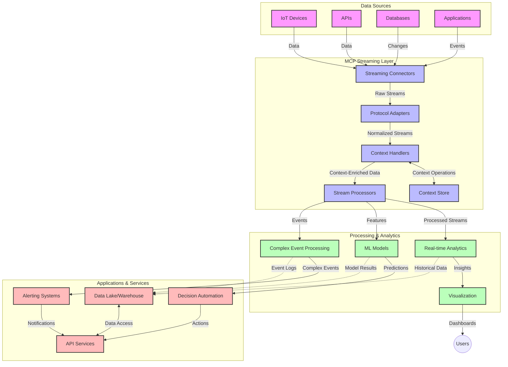

<!--
CO_OP_TRANSLATOR_METADATA:
{
  "original_hash": "195f7287638b77a549acadd96c8f981c",
  "translation_date": "2025-07-14T01:53:39+00:00",
  "source_file": "05-AdvancedTopics/mcp-realtimestreaming/README.md",
  "language_code": "hr"
}
-->
# Model Context Protocol za streaming podataka u stvarnom vremenu

## Pregled

Streaming podataka u stvarnom vremenu postao je ključan u današnjem svijetu vođenom podacima, gdje tvrtke i aplikacije zahtijevaju trenutni pristup informacijama za pravovremene odluke. Model Context Protocol (MCP) predstavlja značajan napredak u optimizaciji ovih procesa streaminga u stvarnom vremenu, poboljšavajući učinkovitost obrade podataka, održavajući kontekstualni integritet i unapređujući ukupne performanse sustava.

Ovaj modul istražuje kako MCP transformira streaming podataka u stvarnom vremenu pružajući standardizirani pristup upravljanju kontekstom između AI modela, streaming platformi i aplikacija.

## Uvod u streaming podataka u stvarnom vremenu

Streaming podataka u stvarnom vremenu tehnološki je pristup koji omogućuje kontinuirani prijenos, obradu i analizu podataka čim se generiraju, dopuštajući sustavima da odmah reagiraju na nove informacije. Za razliku od tradicionalne obrade u serijama koja radi na statičnim skupovima podataka, streaming obrađuje podatke u pokretu, pružajući uvide i akcije s minimalnim kašnjenjem.

### Osnovni pojmovi streaminga podataka u stvarnom vremenu:

- **Kontinuirani tok podataka**: Podaci se obrađuju kao neprekidan, beskonačan tok događaja ili zapisa.
- **Obrada s niskim kašnjenjem**: Sustavi su dizajnirani da minimiziraju vrijeme između generiranja i obrade podataka.
- **Skalabilnost**: Streaming arhitekture moraju podnijeti varijabilne količine i brzine podataka.
- **Otpornost na pogreške**: Sustavi trebaju biti otporni na kvarove kako bi osigurali neprekidan tok podataka.
- **Obrada sa stanjem**: Održavanje konteksta kroz događaje ključno je za smisleniju analizu.

### Model Context Protocol i streaming u stvarnom vremenu

Model Context Protocol (MCP) rješava nekoliko ključnih izazova u okruženjima streaminga u stvarnom vremenu:

1. **Kontekstualna kontinuitet**: MCP standardizira način održavanja konteksta kroz distribuirane streaming komponente, osiguravajući da AI modeli i čvorovi za obradu imaju pristup relevantnom povijesnom i okolišnom kontekstu.

2. **Učinkovito upravljanje stanjem**: Pružajući strukturirane mehanizme za prijenos konteksta, MCP smanjuje opterećenje upravljanja stanjem u streaming cjevovodima.

3. **Interoperabilnost**: MCP stvara zajednički jezik za dijeljenje konteksta između različitih streaming tehnologija i AI modela, omogućujući fleksibilnije i proširivije arhitekture.

4. **Streaming-optimizirani kontekst**: Implementacije MCP-a mogu prioritizirati koje su kontekstualne informacije najvažnije za donošenje odluka u stvarnom vremenu, optimizirajući i performanse i točnost.

5. **Adaptivna obrada**: Uz pravilno upravljanje kontekstom kroz MCP, streaming sustavi mogu dinamički prilagođavati obradu na temelju promjenjivih uvjeta i obrazaca u podacima.

U modernim aplikacijama, od IoT mreža senzora do financijskih platformi za trgovanje, integracija MCP-a sa streaming tehnologijama omogućuje inteligentniju, kontekstualno osviještenu obradu koja može adekvatno reagirati na složene, promjenjive situacije u stvarnom vremenu.

## Ciljevi učenja

Na kraju ovog poglavlja moći ćete:

- Razumjeti osnove streaminga podataka u stvarnom vremenu i njegove izazove
- Objasniti kako Model Context Protocol (MCP) poboljšava streaming podataka u stvarnom vremenu
- Implementirati streaming rješenja temeljena na MCP-u koristeći popularne okvire poput Kafka i Pulsar
- Dizajnirati i implementirati otpornije i visokoučinkovite streaming arhitekture s MCP-om
- Primijeniti MCP koncepte u IoT, financijskom trgovanju i AI-analitici
- Procijeniti nove trendove i buduće inovacije u MCP-temeljenim streaming tehnologijama

### Definicija i značaj

Streaming podataka u stvarnom vremenu uključuje kontinuiranu generaciju, obradu i isporuku podataka s minimalnim kašnjenjem. Za razliku od obrade u serijama, gdje se podaci prikupljaju i obrađuju u skupinama, streaming podaci obrađuju se inkrementalno čim stignu, omogućujući trenutne uvide i akcije.

Ključne karakteristike streaminga podataka u stvarnom vremenu uključuju:

- **Nisko kašnjenje**: Obrada i analiza podataka u milisekundama do sekundi
- **Kontinuirani tok**: Neprekidni tokovi podataka iz različitih izvora
- **Neposredna obrada**: Analiza podataka čim stignu, a ne u skupinama
- **Arhitektura vođena događajima**: Reakcija na događaje čim se dogode

### Izazovi u tradicionalnom streamingu podataka

Tradicionalni pristupi streamingu podataka suočavaju se s nekoliko ograničenja:

1. **Gubitak konteksta**: Teškoće u održavanju konteksta kroz distribuirane sustave
2. **Problemi sa skalabilnošću**: Izazovi u skaliranju za rukovanje velikim količinama i brzinama podataka
3. **Složenost integracije**: Problemi s interoperabilnošću između različitih sustava
4. **Upravljanje kašnjenjem**: Balansiranje propusnosti i vremena obrade
5. **Konzistentnost podataka**: Osiguravanje točnosti i potpunosti podataka kroz tok

## Razumijevanje Model Context Protocola (MCP)

### Što je MCP?

Model Context Protocol (MCP) je standardizirani komunikacijski protokol dizajniran za olakšavanje učinkovite interakcije između AI modela i aplikacija. U kontekstu streaminga podataka u stvarnom vremenu, MCP pruža okvir za:

- Očuvanje konteksta kroz cijeli podatkovni cjevovod
- Standardizaciju formata razmjene podataka
- Optimizaciju prijenosa velikih skupova podataka
- Poboljšanje komunikacije model-model i model-aplikacija

### Glavne komponente i arhitektura

Arhitektura MCP-a za streaming u stvarnom vremenu sastoji se od nekoliko ključnih komponenti:

1. **Upravitelji konteksta**: Upravljaju i održavaju kontekstualne informacije kroz streaming cjevovod
2. **Procesori streama**: Obradjuju dolazne tokove podataka koristeći tehnike osviještene o kontekstu
3. **Protokol adapteri**: Pretvaraju između različitih streaming protokola uz očuvanje konteksta
4. **Spremište konteksta**: Učinkovito pohranjuje i dohvaća kontekstualne informacije
5. **Streaming konektori**: Povezuju se s različitim streaming platformama (Kafka, Pulsar, Kinesis itd.)



### Kako MCP poboljšava obradu podataka u stvarnom vremenu

MCP rješava tradicionalne izazove streaminga kroz:

- **Kontekstualni integritet**: Održavanje odnosa između podataka kroz cijeli cjevovod
- **Optimizirani prijenos**: Smanjenje redundancije u razmjeni podataka inteligentnim upravljanjem kontekstom
- **Standardizirani sučelja**: Pružanje dosljednih API-ja za streaming komponente
- **Smanjeno kašnjenje**: Minimiziranje opterećenja obrade kroz učinkovito upravljanje kontekstom
- **Poboljšana skalabilnost**: Podrška horizontalnom skaliranju uz očuvanje konteksta

## Integracija i implementacija

Sustavi za streaming podataka u stvarnom vremenu zahtijevaju pažljiv arhitektonski dizajn i implementaciju kako bi održali i performanse i kontekstualni integritet. Model Context Protocol nudi standardizirani pristup integraciji AI modela i streaming tehnologija, omogućujući sofisticiranije, kontekstualno osviještene cjevovode za obradu.

### Pregled integracije MCP-a u streaming arhitekture

Implementacija MCP-a u okruženjima streaminga u stvarnom vremenu uključuje nekoliko ključnih aspekata:

1. **Serijalizacija i prijenos konteksta**: MCP pruža učinkovite mehanizme za kodiranje kontekstualnih informacija unutar streaming paketa podataka, osiguravajući da ključni kontekst prati podatke kroz cijeli cjevovod obrade. To uključuje standardizirane formate serijalizacije optimizirane za streaming prijenos.

2. **Obrada streama sa stanjem**: MCP omogućuje inteligentniju obradu sa stanjem održavajući dosljednu reprezentaciju konteksta kroz čvorove za obradu. Ovo je posebno vrijedno u distribuiranim streaming arhitekturama gdje je upravljanje stanjem tradicionalno izazovno.

3. **Vrijeme događaja nasuprot vremenu obrade**: Implementacije MCP-a u streaming sustavima moraju adresirati uobičajeni izazov razlikovanja kada su se događaji dogodili i kada se obrađuju. Protokol može uključiti vremenski kontekst koji čuva semantiku vremena događaja.

4. **Upravljanje povratnim pritiskom (backpressure)**: Standardizacijom upravljanja kontekstom, MCP pomaže u upravljanju povratnim pritiskom u streaming sustavima, dopuštajući komponentama da komuniciraju svoje mogućnosti obrade i prilagode tok podataka.

5. **Prozori i agregacija konteksta**: MCP olakšava sofisticiranije operacije prozora pružajući strukturirane prikaze vremenskog i relacijskog konteksta, omogućujući smislenije agregacije kroz tokove događaja.

6. **Obrada točno jednom (exactly-once)**: U streaming sustavima koji zahtijevaju semantiku točno jednom, MCP može uključiti metapodatke obrade za praćenje i verifikaciju statusa obrade kroz distribuirane komponente.

Implementacija MCP-a preko različitih streaming tehnologija stvara jedinstveni pristup upravljanju kontekstom, smanjujući potrebu za prilagođenim integracijskim kodom i poboljšavajući sposobnost sustava da održava smisleni kontekst dok podaci prolaze kroz cjevovod.

### MCP u različitim okvirima za streaming podataka

Ovi primjeri slijede trenutnu MCP specifikaciju koja se temelji na JSON-RPC protokolu s različitim mehanizmima prijenosa. Kod pokazuje kako implementirati prilagođene transportne slojeve koji integriraju streaming platforme poput Kafka i Pulsar, uz potpunu kompatibilnost s MCP protokolom.

Primjeri su osmišljeni da pokažu kako se streaming platforme mogu integrirati s MCP-om za pružanje obrade podataka u stvarnom vremenu uz očuvanje kontekstualne svijesti koja je središnja za MCP. Ovaj pristup osigurava da primjeri koda točno odražavaju trenutačno stanje MCP specifikacije zaključno s lipnjem 2025.

MCP se može integrirati s popularnim streaming okvirima uključujući:

#### Integracija Apache Kafka

```python
import asyncio
import json
from typing import Dict, Any, Optional
from confluent_kafka import Consumer, Producer, KafkaError
from mcp.client import Client, ClientCapabilities
from mcp.core.message import JsonRpcMessage
from mcp.core.transports import Transport

# Custom transport class to bridge MCP with Kafka
class KafkaMCPTransport(Transport):
    def __init__(self, bootstrap_servers: str, input_topic: str, output_topic: str):
        self.bootstrap_servers = bootstrap_servers
        self.input_topic = input_topic
        self.output_topic = output_topic
        self.producer = Producer({'bootstrap.servers': bootstrap_servers})
        self.consumer = Consumer({
            'bootstrap.servers': bootstrap_servers,
            'group.id': 'mcp-client-group',
            'auto.offset.reset': 'earliest'
        })
        self.message_queue = asyncio.Queue()
        self.running = False
        self.consumer_task = None
        
    async def connect(self):
        """Connect to Kafka and start consuming messages"""
        self.consumer.subscribe([self.input_topic])
        self.running = True
        self.consumer_task = asyncio.create_task(self._consume_messages())
        return self
        
    async def _consume_messages(self):
        """Background task to consume messages from Kafka and queue them for processing"""
        while self.running:
            try:
                msg = self.consumer.poll(1.0)
                if msg is None:
                    await asyncio.sleep(0.1)
                    continue
                
                if msg.error():
                    if msg.error().code() == KafkaError._PARTITION_EOF:
                        continue
                    print(f"Consumer error: {msg.error()}")
                    continue
                
                # Parse the message value as JSON-RPC
                try:
                    message_str = msg.value().decode('utf-8')
                    message_data = json.loads(message_str)
                    mcp_message = JsonRpcMessage.from_dict(message_data)
                    await self.message_queue.put(mcp_message)
                except Exception as e:
                    print(f"Error parsing message: {e}")
            except Exception as e:
                print(f"Error in consumer loop: {e}")
                await asyncio.sleep(1)
    
    async def read(self) -> Optional[JsonRpcMessage]:
        """Read the next message from the queue"""
        try:
            message = await self.message_queue.get()
            return message
        except Exception as e:
            print(f"Error reading message: {e}")
            return None
    
    async def write(self, message: JsonRpcMessage) -> None:
        """Write a message to the Kafka output topic"""
        try:
            message_json = json.dumps(message.to_dict())
            self.producer.produce(
                self.output_topic,
                message_json.encode('utf-8'),
                callback=self._delivery_report
            )
            self.producer.poll(0)  # Trigger callbacks
        except Exception as e:
            print(f"Error writing message: {e}")
    
    def _delivery_report(self, err, msg):
        """Kafka producer delivery callback"""
        if err is not None:
            print(f'Message delivery failed: {err}')
        else:
            print(f'Message delivered to {msg.topic()} [{msg.partition()}]')
    
    async def close(self) -> None:
        """Close the transport"""
        self.running = False
        if self.consumer_task:
            self.consumer_task.cancel()
            try:
                await self.consumer_task
            except asyncio.CancelledError:
                pass
        self.consumer.close()
        self.producer.flush()

# Example usage of the Kafka MCP transport
async def kafka_mcp_example():
    # Create MCP client with Kafka transport
    client = Client(
        {"name": "kafka-mcp-client", "version": "1.0.0"},
        ClientCapabilities({})
    )
    
    # Create and connect the Kafka transport
    transport = KafkaMCPTransport(
        bootstrap_servers="localhost:9092",
        input_topic="mcp-responses",
        output_topic="mcp-requests"
    )
    
    await client.connect(transport)
    
    try:
        # Initialize the MCP session
        await client.initialize()
        
        # Example of executing a tool via MCP
        response = await client.execute_tool(
            "process_data",
            {
                "data": "sample data",
                "metadata": {
                    "source": "sensor-1",
                    "timestamp": "2025-06-12T10:30:00Z"
                }
            }
        )
        
        print(f"Tool execution response: {response}")
        
        # Clean shutdown
        await client.shutdown()
    finally:
        await transport.close()

# Run the example
if __name__ == "__main__":
    asyncio.run(kafka_mcp_example())
```

#### Implementacija Apache Pulsar

```python
import asyncio
import json
import pulsar
from typing import Dict, Any, Optional
from mcp.core.message import JsonRpcMessage
from mcp.core.transports import Transport
from mcp.server import Server, ServerOptions
from mcp.server.tools import Tool, ToolExecutionContext, ToolMetadata

# Create a custom MCP transport that uses Pulsar
class PulsarMCPTransport(Transport):
    def __init__(self, service_url: str, request_topic: str, response_topic: str):
        self.service_url = service_url
        self.request_topic = request_topic
        self.response_topic = response_topic
        self.client = pulsar.Client(service_url)
        self.producer = self.client.create_producer(response_topic)
        self.consumer = self.client.subscribe(
            request_topic,
            "mcp-server-subscription",
            consumer_type=pulsar.ConsumerType.Shared
        )
        self.message_queue = asyncio.Queue()
        self.running = False
        self.consumer_task = None
    
    async def connect(self):
        """Connect to Pulsar and start consuming messages"""
        self.running = True
        self.consumer_task = asyncio.create_task(self._consume_messages())
        return self
    
    async def _consume_messages(self):
        """Background task to consume messages from Pulsar and queue them for processing"""
        while self.running:
            try:
                # Non-blocking receive with timeout
                msg = self.consumer.receive(timeout_millis=500)
                
                # Process the message
                try:
                    message_str = msg.data().decode('utf-8')
                    message_data = json.loads(message_str)
                    mcp_message = JsonRpcMessage.from_dict(message_data)
                    await self.message_queue.put(mcp_message)
                    
                    # Acknowledge the message
                    self.consumer.acknowledge(msg)
                except Exception as e:
                    print(f"Error processing message: {e}")
                    # Negative acknowledge if there was an error
                    self.consumer.negative_acknowledge(msg)
            except Exception as e:
                # Handle timeout or other exceptions
                await asyncio.sleep(0.1)
    
    async def read(self) -> Optional[JsonRpcMessage]:
        """Read the next message from the queue"""
        try:
            message = await self.message_queue.get()
            return message
        except Exception as e:
            print(f"Error reading message: {e}")
            return None
    
    async def write(self, message: JsonRpcMessage) -> None:
        """Write a message to the Pulsar output topic"""
        try:
            message_json = json.dumps(message.to_dict())
            self.producer.send(message_json.encode('utf-8'))
        except Exception as e:
            print(f"Error writing message: {e}")
    
    async def close(self) -> None:
        """Close the transport"""
        self.running = False
        if self.consumer_task:
            self.consumer_task.cancel()
            try:
                await self.consumer_task
            except asyncio.CancelledError:
                pass
        self.consumer.close()
        self.producer.close()
        self.client.close()

# Define a sample MCP tool that processes streaming data
@Tool(
    name="process_streaming_data",
    description="Process streaming data with context preservation",
    metadata=ToolMetadata(
        required_capabilities=["streaming"]
    )
)
async def process_streaming_data(
    ctx: ToolExecutionContext,
    data: str,
    source: str,
    priority: str = "medium"
) -> Dict[str, Any]:
    """
    Process streaming data while preserving context
    
    Args:
        ctx: Tool execution context
        data: The data to process
        source: The source of the data
        priority: Priority level (low, medium, high)
        
    Returns:
        Dict containing processed results and context information
    """
    # Example processing that leverages MCP context
    print(f"Processing data from {source} with priority {priority}")
    
    # Access conversation context from MCP
    conversation_id = ctx.conversation_id if hasattr(ctx, 'conversation_id') else "unknown"
    
    # Return results with enhanced context
    return {
        "processed_data": f"Processed: {data}",
        "context": {
            "conversation_id": conversation_id,
            "source": source,
            "priority": priority,
            "processing_timestamp": ctx.get_current_time_iso()
        }
    }

# Example MCP server implementation using Pulsar transport
async def run_mcp_server_with_pulsar():
    # Create MCP server
    server = Server(
        {"name": "pulsar-mcp-server", "version": "1.0.0"},
        ServerOptions(
            capabilities={"streaming": True}
        )
    )
    
    # Register our tool
    server.register_tool(process_streaming_data)
    
    # Create and connect Pulsar transport
    transport = PulsarMCPTransport(
        service_url="pulsar://localhost:6650",
        request_topic="mcp-requests",
        response_topic="mcp-responses"
    )
    
    try:
        # Start the server with the Pulsar transport
        await server.run(transport)
    finally:
        await transport.close()

# Run the server
if __name__ == "__main__":
    asyncio.run(run_mcp_server_with_pulsar())
```

### Najbolje prakse za implementaciju

Prilikom implementacije MCP-a za streaming u stvarnom vremenu:

1. **Dizajnirajte za otpornost na pogreške**:
   - Implementirajte pravilno rukovanje pogreškama
   - Koristite dead-letter queue za neuspjele poruke
   - Dizajnirajte idempotentne procesore

2. **Optimizirajte performanse**:
   - Konfigurirajte odgovarajuće veličine međuspremnika
   - Koristite grupiranje (batching) gdje je prikladno
   - Implementirajte mehanizme za upravljanje povratnim pritiskom

3. **Nadzor i praćenje**:
   - Pratite metrike obrade streama
   - Nadzirite propagaciju konteksta
   - Postavite upozorenja za anomalije

4. **Osigurajte svoje tokove**:
   - Implementirajte enkripciju za osjetljive podatke
   - Koristite autentikaciju i autorizaciju
   - Primijenite odgovarajuće kontrole pristupa

### MCP u IoT i Edge računarstvu

MCP poboljšava IoT streaming kroz:

- Očuvanje konteksta uređaja kroz cjevovod obrade
- Omogućavanje učinkovitog streaminga podataka s edge uređaja u cloud
- Podršku za analitiku u stvarnom vremenu na IoT tokovima podataka
- Olakšavanje komunikacije uređaj-uređaj s kontekstom

Primjer: Mreže senzora u pametnim gradovima  
```
Sensors → Edge Gateways → MCP Stream Processors → Real-time Analytics → Automated Responses
```

### Uloga u financijskim transakcijama i trgovanju visokih frekvencija

MCP pruža značajne prednosti za streaming financijskih podataka:

- Ultra-nisko kašnjenje obrade za trgovačke odluke
- Očuvanje konteksta transakcija kroz cijelu obradu
- Podrška složenoj obradi događaja s kontekstualnom sviješću
- Osiguravanje konzistentnosti podataka u distribuiranim trgovačkim sustavima

### Unapređenje AI-pokretane analitike podataka

MCP otvara nove mogućnosti za streaming analitiku:

- Trening i izvođenje modela u stvarnom vremenu
- Kontinuirano učenje iz streaming podataka
- Ekstrakcija značajki osviještena o kontekstu
- Višestruki modeli u cjevovodima izvođenja s očuvanim kontekstom

## Budući trendovi i inovacije

### Evolucija MCP-a u okruženjima stvarnog vremena

Gledajući unaprijed, očekujemo da će MCP evoluirati kako bi adresirao:

- **Integraciju kvantnog računarstva**: Priprema za streaming sustave temeljene na kvantnom računanju
- **Edge-native obradu**: Premještanje više kontekstualno osviještene obrade na edge uređaje
- **Autonomno upravljanje streamom**: Samooptimizirajući streaming cjevovodi
- **Federirani streaming**: Distribuirana obrada uz očuvanje privatnosti

### Potencijalni tehnološki napreci

Nove tehnologije koje će oblikovati budućnost MCP streaminga:

1. **AI-optimizirani streaming protokoli**: Prilagođeni protokoli posebno dizajnirani za AI radne opterećenja
2. **Integracija neuromorfnih računala**: Računala inspirirana mozgom za obradu streama
3. **Serverless streaming**: Event-driven, skalabilni streaming bez upravljanja infrastrukturom
4. **Distribuirana spremišta konteksta**: Globalno distribuirano, a ipak visoko konzistentno upravljanje kontekstom

## Praktične vježbe

### Vježba 1: Postavljanje osnovnog MCP streaming cjevovoda

U ovoj vježbi naučit ćete kako:
- Konfigurirati osnovno MCP streaming okruženje
- Implementirati upravitelje konteksta za obradu streama
- Testirati i potvrditi očuvanje konteksta

### Vježba 2: Izrada nadzorne ploče za analitiku u stvarnom vremenu

Izradite kompletnu aplikaciju koja:
- Prima streaming podatke koristeći MCP
- Obradjuje tok podataka uz održavanje konteksta
- Vizualizira rezultate u stvarnom vremenu

### Vježba 3: Implementacija složene obrade događaja s MCP-om

Napredna vježba koja pokriva:
- Detekciju obrazaca u tokovima
- Kontekstualnu korelaciju između više tokova
- Generiranje složenih događaja uz očuvani kontekst

## Dodatni resursi

- [Model Context Protocol Specification](https://github.com/modelcontextprotocol) - Službena MCP specifikacija i dokumentacija
- [Apache Kafka Documentation](https://kafka.apache.org/documentation/) - Učenje o Kafka za obradu streama
- [Apache Pulsar](https://pulsar.apache.org/) - Jedinstvena platforma za poruke i streaming
- [Streaming Systems: The What, Where, When, and How of Large-Scale Data Processing](https://www.oreilly.com/library/view/streaming-systems/9781491983867/) - Sveobuhvatna knjiga o streaming arhitekturama
- [Microsoft Azure Event Hubs](https://learn.microsoft.com/azure/event-hubs/event-hubs-about) - Upravljačka usluga za event streaming
- [MLflow Documentation](https://mlflow.org/docs/latest/index.html) - Za praćenje i implementaciju ML modela
- [Real-Time Analytics with Apache Storm](https://storm.apache.org/releases/current/index.html) - Okvir za obradu u stvarnom vremenu
- [Flink ML](https://nightlies.apache.org/flink/flink-ml-docs-master/) - Biblioteka za strojno učenje za Apache Flink
- [LangChain Documentation](https://python.langchain.com/docs/get_started/introduction) - Izrada aplikacija s LLM-ovima

## Ishodi učenja

Nakon završetka ovog modula moći ćete:

- Razumjeti osnove streaminga podataka u stvarnom vremenu i njegove izaz

**Odricanje od odgovornosti**:  
Ovaj dokument je preveden korištenjem AI usluge za prevođenje [Co-op Translator](https://github.com/Azure/co-op-translator). Iako težimo točnosti, imajte na umu da automatski prijevodi mogu sadržavati pogreške ili netočnosti. Izvorni dokument na izvornom jeziku treba smatrati službenim i autoritativnim izvorom. Za kritične informacije preporučuje se profesionalni ljudski prijevod. Ne snosimo odgovornost za bilo kakva nesporazuma ili pogrešna tumačenja koja proizlaze iz korištenja ovog prijevoda.