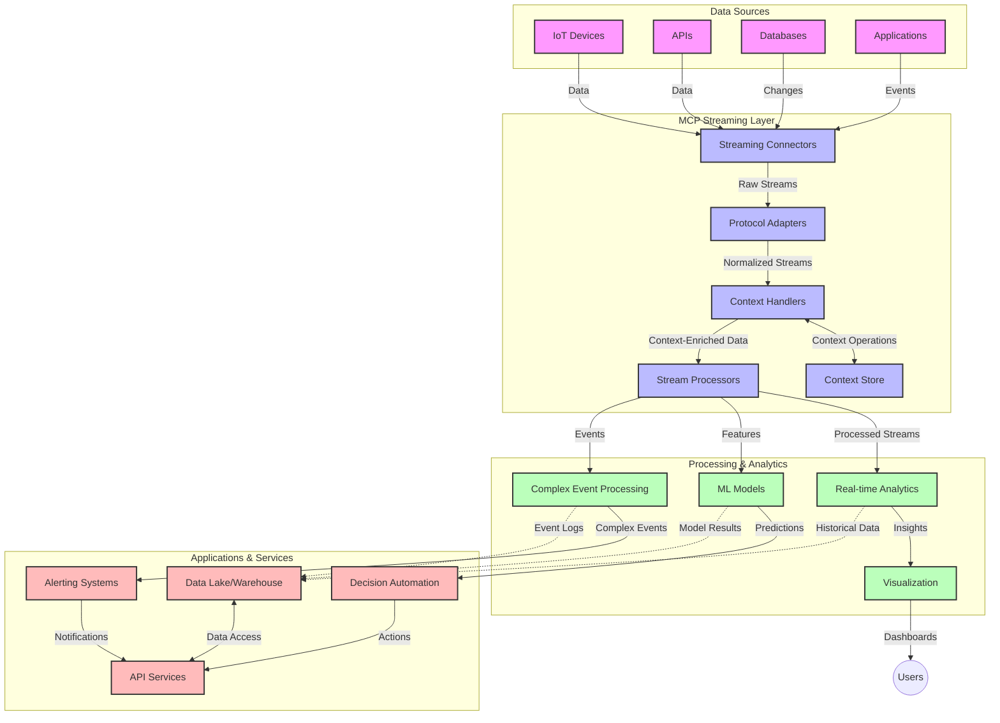

<!--
CO_OP_TRANSLATOR_METADATA:
{
  "original_hash": "68c518dbff8a3b127ed2aa934054c56c",
  "translation_date": "2025-06-11T17:33:52+00:00",
  "source_file": "05-AdvancedTopics/mcp-realtimestreaming/README.md",
  "language_code": "hr"
}
-->
# Protokol Model Context za streaming podataka u stvarnom vremenu

## Pregled

Streaming podataka u stvarnom vremenu postao je ključan u današnjem svijetu vođenom podacima, gdje tvrtke i aplikacije zahtijevaju trenutni pristup informacijama kako bi donosile pravovremene odluke. Protokol Model Context (MCP) predstavlja značajan napredak u optimizaciji ovih procesa streaminga, poboljšavajući učinkovitost obrade podataka, održavajući kontekstualni integritet i unapređujući ukupne performanse sustava.

Ovaj modul istražuje kako MCP mijenja streaming podataka u stvarnom vremenu pružajući standardizirani pristup upravljanju kontekstom između AI modela, streaming platformi i aplikacija.

## Uvod u streaming podataka u stvarnom vremenu

Streaming podataka u stvarnom vremenu je tehnološki pristup koji omogućuje kontinuirani prijenos, obradu i analizu podataka čim se generiraju, omogućujući sustavima da odmah reagiraju na nove informacije. Za razliku od tradicionalne obrade u serijama koja radi na statičnim skupovima podataka, streaming obrađuje podatke u pokretu, pružajući uvide i akcije s minimalnim kašnjenjem.

### Temeljni pojmovi streaminga podataka u stvarnom vremenu:

- **Kontinuirani tok podataka**: Podaci se obrađuju kao neprekidan, beskonačan tok događaja ili zapisa.
- **Obrada s niskim kašnjenjem**: Sustavi su dizajnirani da minimiziraju vrijeme između generiranja i obrade podataka.
- **Skalabilnost**: Streaming arhitekture moraju podnijeti varijabilne količine i brzine podataka.
- **Otpornost na pogreške**: Sustavi trebaju biti otporni na kvarove kako bi osigurali neprekidan protok podataka.
- **Obrada sa stanjem**: Održavanje konteksta kroz događaje ključno je za smisleniju analizu.

### Protokol Model Context i streaming u stvarnom vremenu

Protokol Model Context (MCP) rješava nekoliko ključnih izazova u okruženjima streaminga u stvarnom vremenu:

1. **Kontekstualna kontinuitet**: MCP standardizira način održavanja konteksta kroz distribuirane streaming komponente, osiguravajući da AI modeli i čvorovi za obradu imaju pristup relevantnom povijesnom i okolišnom kontekstu.

2. **Učinkovito upravljanje stanjem**: Pružajući strukturirane mehanizme za prijenos konteksta, MCP smanjuje opterećenje upravljanja stanjem u streaming pipeline-ovima.

3. **Interoperabilnost**: MCP stvara zajednički jezik za dijeljenje konteksta između različitih streaming tehnologija i AI modela, omogućujući fleksibilnije i proširive arhitekture.

4. **Streaming-Optimizirani kontekst**: Implementacije MCP-a mogu prioritetizirati koje su kontekstualne informacije najvažnije za donošenje odluka u stvarnom vremenu, optimizirajući i performanse i točnost.

5. **Adaptivna obrada**: Uz pravilno upravljanje kontekstom kroz MCP, streaming sustavi mogu dinamički prilagođavati obradu na temelju promjenjivih uvjeta i obrazaca u podacima.

U modernim aplikacijama, od IoT mreža senzora do financijskih platformi za trgovanje, integracija MCP-a sa streaming tehnologijama omogućuje inteligentniju, kontekstualno osviještenu obradu koja može adekvatno odgovoriti na složene i promjenjive situacije u stvarnom vremenu.

## Ciljevi učenja

Na kraju ovog poglavlja moći ćete:

- Razumjeti osnove streaminga podataka u stvarnom vremenu i njegove izazove
- Objasniti kako Protokol Model Context (MCP) poboljšava streaming podataka u stvarnom vremenu
- Implementirati streaming rješenja temeljena na MCP-u koristeći popularne okvire poput Kafka i Pulsar
- Dizajnirati i implementirati otpornije i visoko-performantne streaming arhitekture s MCP-om
- Primijeniti koncepte MCP-a u slučajevima korištenja za IoT, financijsko trgovanje i AI analitiku
- Procijeniti nove trendove i buduće inovacije u tehnologijama streaminga temeljenim na MCP-u

### Definicija i značaj

Streaming podataka u stvarnom vremenu uključuje kontinuiranu generaciju, obradu i isporuku podataka s minimalnim kašnjenjem. Za razliku od obrade u serijama, gdje se podaci prikupljaju i obrađuju u skupinama, streaming podaci obrađuju se inkrementalno čim stignu, omogućujući trenutne uvide i akcije.

Ključne karakteristike streaminga podataka u stvarnom vremenu uključuju:

- **Nisko kašnjenje**: Obrada i analiza podataka unutar milisekundi do sekundi
- **Kontinuirani tok**: Neprekidni tokovi podataka iz različitih izvora
- **Trenutna obrada**: Analiza podataka čim stignu, a ne u skupinama
- **Arhitektura vođena događajima**: Reagiranje na događaje čim se dogode

### Izazovi u tradicionalnom streamingu podataka

Tradicionalni pristupi streamingu podataka suočavaju se s nekoliko ograničenja:

1. **Gubitak konteksta**: Teškoće u održavanju konteksta kroz distribuirane sustave
2. **Problemi skalabilnosti**: Izazovi u skaliranju za obradu velikih količina i brzih podataka
3. **Kompleksnost integracije**: Problemi interoperabilnosti između različitih sustava
4. **Upravljanje kašnjenjem**: Balansiranje propusnosti i vremena obrade
5. **Konzistentnost podataka**: Osiguravanje točnosti i potpunosti podataka kroz tok

## Razumijevanje Protokola Model Context (MCP)

### Što je MCP?

Protokol Model Context (MCP) je standardizirani komunikacijski protokol osmišljen za olakšavanje učinkovite interakcije između AI modela i aplikacija. U kontekstu streaminga podataka u stvarnom vremenu, MCP pruža okvir za:

- Očuvanje konteksta kroz cijeli podatkovni pipeline
- Standardizaciju formata razmjene podataka
- Optimizaciju prijenosa velikih skupova podataka
- Unapređenje komunikacije model-model i model-aplikacija

### Temeljne komponente i arhitektura

Arhitektura MCP-a za streaming u stvarnom vremenu sastoji se od nekoliko ključnih komponenti:

1. **Context Handlers**: Upravljaju i održavaju kontekstualne informacije kroz streaming pipeline
2. **Stream Processors**: Obradjuju dolazne tokove podataka koristeći tehnike osviještene o kontekstu
3. **Protocol Adapters**: Pretvaraju između različitih streaming protokola pritom čuvajući kontekst
4. **Context Store**: Efikasno pohranjuje i dohvaća kontekstualne informacije
5. **Streaming Connectors**: Povezuju se s različitim streaming platformama (Kafka, Pulsar, Kinesis itd.)



### Kako MCP poboljšava obradu podataka u stvarnom vremenu

MCP rješava tradicionalne izazove streaminga kroz:

- **Kontekstualni integritet**: Održavanje veza između podataka kroz cijeli pipeline
- **Optimizirani prijenos**: Smanjenje redundantnosti u razmjeni podataka inteligentnim upravljanjem kontekstom
- **Standardizirani sučelja**: Pružanje konzistentnih API-ja za streaming komponente
- **Smanjeno kašnjenje**: Minimiziranje troškova obrade kroz učinkovito rukovanje kontekstom
- **Poboljšana skalabilnost**: Podrška horizontalnom skaliranju uz očuvanje konteksta

## Integracija i implementacija

Sustavi za streaming podataka u stvarnom vremenu zahtijevaju pažljiv arhitektonski dizajn i implementaciju kako bi održali i performanse i kontekstualni integritet. Protokol Model Context nudi standardizirani pristup integraciji AI modela i streaming tehnologija, omogućujući sofisticiranije i kontekstualno osviještene pipeline-ove za obradu.

### Pregled integracije MCP-a u streaming arhitekture

Implementacija MCP-a u okruženjima streaminga u stvarnom vremenu uključuje nekoliko ključnih aspekata:

1. **Serijalizacija i prijenos konteksta**: MCP pruža učinkovite mehanizme za kodiranje kontekstualnih informacija unutar streaming podatkovnih paketa, osiguravajući da bitni kontekst prati podatke kroz cijeli pipeline obrade. To uključuje standardizirane formate serijalizacije optimizirane za streaming prijenos.

2. **Obrada toka sa stanjem**: MCP omogućuje inteligentniju obradu sa stanjem održavajući konzistentnu reprezentaciju konteksta kroz čvorove za obradu. Ovo je posebno vrijedno u distribuiranim streaming arhitekturama gdje je upravljanje stanjem tradicionalno izazovno.

3. **Vrijeme događaja naspram vremena obrade**: Implementacije MCP-a u streaming sustavima moraju adresirati čest izazov razlikovanja kada su se događaji dogodili i kada su obrađeni. Protokol može uključiti vremenski kontekst koji čuva semantiku vremena događaja.

4. **Upravljanje povratnim pritiskom (backpressure)**: Standardiziranjem rukovanja kontekstom, MCP pomaže u upravljanju povratnim pritiskom u streaming sustavima, dopuštajući komponentama da komuniciraju svoje kapacitete obrade i prilagođavaju protok podataka.

5. **Kontekstualno prozorsko grupiranje i agregacija**: MCP olakšava sofisticiranije operacije prozora pružajući strukturirane reprezentacije vremenskog i relacijskog konteksta, omogućujući smislenije agregacije kroz tokove događaja.

6. **Obrada točno jednom (Exactly-Once)**: U streaming sustavima koji zahtijevaju semantiku točno jednom, MCP može uključiti metapodatke obrade za praćenje i potvrdu statusa obrade kroz distribuirane komponente.

Implementacija MCP-a preko različitih streaming tehnologija stvara jedinstven pristup upravljanju kontekstom, smanjujući potrebu za prilagođenim integracijskim kodom i poboljšavajući sposobnost sustava da održava smisleni kontekst dok podaci prolaze kroz pipeline.

### MCP u različitim okvirima za streaming podataka

MCP se može integrirati s popularnim streaming okvirima uključujući:

#### Integracija Apache Kafka

```python
from mcp_streaming import MCPKafkaConnector

# Initialize MCP Kafka connector
connector = MCPKafkaConnector(
    bootstrap_servers='localhost:9092',
    context_preservation=True
)

# Create a context-aware consumer
consumer = connector.create_consumer('input-topic')

# Process streaming data with context
for message in consumer:
    context = message.get_context()
    data = message.get_value()
    
    # Process with context awareness
    result = process_with_context(data, context)
    
    # Produce output with preserved context
    connector.produce('output-topic', result, context=context)
```

#### Implementacija Apache Pulsar

```python
from mcp_streaming import MCPPulsarClient

# Initialize MCP Pulsar client
client = MCPPulsarClient('pulsar://localhost:6650')

# Subscribe with context awareness
consumer = client.subscribe('input-topic', 'subscription-name', 
                           context_enabled=True)

# Process messages with context preservation
while True:
    message = consumer.receive()
    context = message.get_context()
    
    # Process with context
    result = process_with_context(message.data(), context)
    
    # Acknowledge the message
    consumer.acknowledge(message)
    
    # Send result with preserved context
    producer = client.create_producer('output-topic')
    producer.send(result, context=context)
```

### Najbolje prakse za implementaciju

Prilikom implementacije MCP-a za streaming u stvarnom vremenu:

1. **Dizajnirajte za otpornost na pogreške**:
   - Implementirajte pravilno rukovanje pogreškama
   - Koristite dead-letter queue za neuspjele poruke
   - Dizajnirajte idempotentne procesore

2. **Optimizirajte performanse**:
   - Konfigurirajte odgovarajuće veličine međuspremnika
   - Koristite batch obradu gdje je prikladno
   - Implementirajte mehanizme povratnog pritiska

3. **Nadzor i praćenje**:
   - Pratite metrike obrade toka
   - Nadzirite propagaciju konteksta
   - Postavite alarme za anomalije

4. **Osigurajte svoje tokove**:
   - Implementirajte enkripciju za osjetljive podatke
   - Koristite autentifikaciju i autorizaciju
   - Primijenite odgovarajuće kontrole pristupa

### MCP u IoT-u i Edge računarstvu

MCP poboljšava streaming u IoT-u kroz:

- Očuvanje konteksta uređaja kroz pipeline obrade
- Omogućavanje učinkovite edge-to-cloud streaming veze
- Podršku za analitiku u stvarnom vremenu na IoT tokovima podataka
- Olakšavanje komunikacije uređaj-uređaj uz kontekst

Primjer: Mreže senzora u pametnim gradovima  
```
Sensors → Edge Gateways → MCP Stream Processors → Real-time Analytics → Automated Responses
```

### Uloga u financijskim transakcijama i trgovanju velikom brzinom

MCP donosi značajne prednosti za streaming financijskih podataka:

- Ultra-nisko kašnjenje obrade za trgovačke odluke
- Održavanje konteksta transakcija kroz obradu
- Podrška za složenu obradu događaja s kontekstualnom sviješću
- Osiguravanje konzistentnosti podataka kroz distribuirane trgovačke sustave

### Unapređenje AI-pokretane analitike podataka

MCP otvara nove mogućnosti za streaming analitiku:

- Trening i izvođenje modela u stvarnom vremenu
- Kontinuirano učenje iz streaming podataka
- Ekstrakcija značajki osviještena o kontekstu
- Pipeline-ovi za izvođenje više modela s očuvanim kontekstom

## Budući trendovi i inovacije

### Evolucija MCP-a u okruženjima stvarnog vremena

U budućnosti očekujemo da će MCP adresirati:

- **Integraciju kvantnog računarstva**: Priprema za streaming sustave bazirane na kvantnoj tehnologiji
- **Edge-native obradu**: Premještanje više kontekstualno osviještene obrade na edge uređaje
- **Autonomno upravljanje streamom**: Samooptimizirajući streaming pipeline-ovi
- **Federirani streaming**: Distribuirana obrada uz očuvanje privatnosti

### Potencijalni tehnološki napredci

Nove tehnologije koje će oblikovati budućnost MCP streaminga:

1. **AI-optimizirani streaming protokoli**: Prilagođeni protokoli dizajnirani posebno za AI radne zadatke
2. **Integracija neuromorfnih računala**: Računarstvo inspirirano radom mozga za obradu tokova
3. **Serverless streaming**: Streaming vođen događajima, skalabilan bez upravljanja infrastrukturom
4. **Distribuirane pohrane konteksta**: Globalno distribuirano, ali visoko konzistentno upravljanje kontekstom

## Praktične vježbe

### Vježba 1: Postavljanje osnovnog MCP streaming pipeline-a

U ovoj vježbi naučit ćete kako:
- Konfigurirati osnovno MCP streaming okruženje
- Implementirati context handlere za obradu toka
- Testirati i potvrditi očuvanje konteksta

### Vježba 2: Izrada nadzorne ploče za analitiku u stvarnom vremenu

Izradite kompletnu aplikaciju koja:
- Prima streaming podatke koristeći MCP
- Obrađuje tok uz održavanje konteksta
- Vizualizira rezultate u stvarnom vremenu

### Vježba 3: Implementacija složene obrade događaja s MCP-om

Napredna vježba koja pokriva:
- Detekciju obrazaca u tokovima
- Kontekstualnu korelaciju preko više tokova
- Generiranje složenih događaja uz očuvani kontekst

## Dodatni resursi

- [Model Context Protocol Specification](https://github.com/microsoft/model-context-protocol) - Službena specifikacija i dokumentacija MCP-a
- [Apache Kafka Documentation](https://kafka.apache.org/documentation/) - Učenje o Kafka za obradu streamova
- [Apache Pulsar](https://pulsar.apache.org/) - Jedinstvena platforma za poruke i streaming
- [Streaming Systems: The What, Where, When, and How of Large-Scale Data Processing](https://www.oreilly.com/library/view/streaming-systems/9781491983867/) - Sveobuhvatna knjiga o streaming arhitekturama
- [Microsoft Azure Event Hubs](https://learn.microsoft.com/en-us/azure/event-hubs/event-hubs-about) - Usluga upravljanog event streaminga
- [MLflow Documentation](https://mlflow.org/docs/latest/index.html) - Za praćenje i implementaciju ML modela
- [Real-Time Analytics with Apache Storm](https://storm.apache.org/releases/current/index.html) - Framework za obradu u stvarnom vremenu
- [Flink ML](https://nightlies.apache.org/flink/flink-ml-docs-master/) - Biblioteka za strojno učenje za Apache Flink
- [LangChain Documentation](https://python.langchain.com/docs/get_started/introduction) - Izrada aplikacija s LLM-ovima

## Ishodi učenja

Nakon završetka ovog modula moći ćete:

- Razumjeti osnove streaminga podataka u stvarnom vremenu i njegove izazove
- Objasniti kako Protokol Model Context (MCP) poboljšava streaming podataka u stvarnom vremenu
- Implementirati streaming rješenja temeljena na MCP-u koristeći popularne okvire poput Kafka i Pulsar
- Dizajnirati i implementirati otpornije i visoko-performantne streaming arhitekture s MCP-om
- Primijeniti koncepte MCP-a u slučajevima korištenja za IoT, financijsko trgovanje i AI analitiku
- Procijeniti nove trendove i buduće inovacije u tehnologijama streaminga temeljenim na MCP-u

## Što slijedi

- [6. Community Contributions](../../06-CommunityContributions/README.md)

**Odricanje od odgovornosti**:  
Ovaj dokument preveden je pomoću AI usluge za prevođenje [Co-op Translator](https://github.com/Azure/co-op-translator). Iako težimo točnosti, imajte na umu da automatski prijevodi mogu sadržavati pogreške ili netočnosti. Izvorni dokument na izvornom jeziku treba smatrati autoritativnim izvorom. Za kritične informacije preporučuje se profesionalni ljudski prijevod. Ne snosimo odgovornost za bilo kakva nesporazuma ili pogrešne interpretacije koje proizlaze iz korištenja ovog prijevoda.