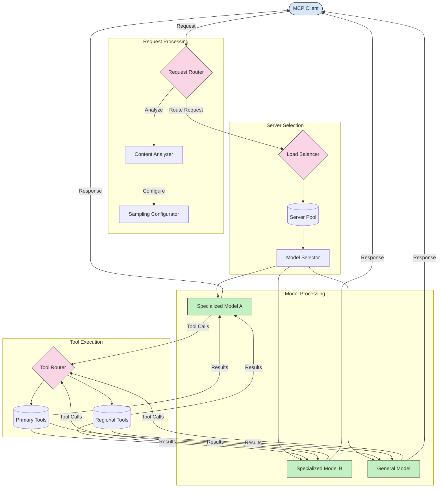

<!--
CO_OP_TRANSLATOR_METADATA:
{
  "original_hash": "2f1b473818b5a6cc9a9bbf777fffa6d4",
  "translation_date": "2025-07-14T21:51:31+00:00",
  "source_file": "05-AdvancedTopics/mcp-routing/README.md",
  "language_code": "hr"
}
-->
## Uzorkovanje i arhitektura usmjeravanja u MCP-u

Uzorkovanje je ključna komponenta Model Context Protocola (MCP) koja omogućuje učinkovitu obradu i usmjeravanje zahtjeva. Uključuje analizu dolaznih zahtjeva kako bi se odredio najprikladniji model ili usluga za njihovu obradu, na temelju različitih kriterija poput vrste sadržaja, korisničkog konteksta i opterećenja sustava.

Uzorkovanje i usmjeravanje mogu se kombinirati kako bi se stvorila robusna arhitektura koja optimizira iskorištavanje resursa i osigurava visoku dostupnost. Proces uzorkovanja može se koristiti za klasifikaciju zahtjeva, dok ih usmjeravanje vodi prema odgovarajućim modelima ili uslugama.

Dijagram ispod ilustrira kako uzorkovanje i usmjeravanje zajedno funkcioniraju u sveobuhvatnoj MCP arhitekturi:

## Što slijedi

- [5.6 Sampling](../mcp-sampling/README.md)

**Odricanje od odgovornosti**:  
Ovaj dokument je preveden korištenjem AI usluge za prevođenje [Co-op Translator](https://github.com/Azure/co-op-translator). Iako nastojimo postići točnost, imajte na umu da automatski prijevodi mogu sadržavati pogreške ili netočnosti. Izvorni dokument na izvornom jeziku treba smatrati autoritativnim izvorom. Za kritične informacije preporučuje se profesionalni ljudski prijevod. Ne snosimo odgovornost za bilo kakve nesporazume ili pogrešna tumačenja koja proizlaze iz korištenja ovog prijevoda.