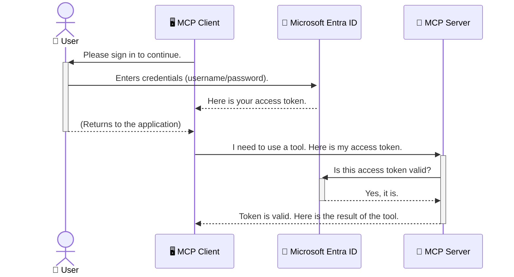

<!--
CO_OP_TRANSLATOR_METADATA:
{
  "original_hash": "6e562d7e5a77c8982da4aa8f762ad1d8",
  "translation_date": "2025-07-14T03:18:18+00:00",
  "source_file": "05-AdvancedTopics/mcp-security-entra/README.md",
  "language_code": "hr"
}
-->
# Osiguravanje AI tijekova rada: Entra ID autentikacija za Model Context Protocol servere

## Uvod  
Osigurati svoj Model Context Protocol (MCP) server jednako je važno kao zaključati ulazna vrata kuće. Ostaviti MCP server otvorenim znači izložiti svoje alate i podatke neovlaštenom pristupu, što može dovesti do sigurnosnih propusta. Microsoft Entra ID pruža snažno rješenje za upravljanje identitetima i pristupom u oblaku, pomažući da samo ovlašteni korisnici i aplikacije mogu komunicirati s vašim MCP serverom. U ovom dijelu naučit ćete kako zaštititi svoje AI tijekove rada koristeći Entra ID autentikaciju.

## Ciljevi učenja  
Na kraju ovog dijela moći ćete:

- Razumjeti važnost osiguranja MCP servera.  
- Objasniti osnove Microsoft Entra ID i OAuth 2.0 autentikacije.  
- Prepoznati razliku između javnih i povjerljivih klijenata.  
- Implementirati Entra ID autentikaciju u lokalnim (javni klijent) i udaljenim (povjerljivi klijent) MCP server scenarijima.  
- Primijeniti najbolje sigurnosne prakse pri razvoju AI tijekova rada.

## Sigurnost i MCP  

Baš kao što ne biste ostavili ulazna vrata kuće otključana, ne biste trebali ostaviti MCP server otvoren za pristup svima. Osiguranje AI tijekova rada ključno je za izgradnju robusnih, pouzdanih i sigurnih aplikacija. Ovaj će vam odjeljak pokazati kako koristiti Microsoft Entra ID za zaštitu MCP servera, osiguravajući da samo ovlašteni korisnici i aplikacije mogu pristupiti vašim alatima i podacima.

## Zašto je sigurnost važna za MCP servere  

Zamislite da vaš MCP server ima alat koji može slati e-poštu ili pristupati bazi podataka kupaca. Nesiguran server znači da bilo tko može koristiti taj alat, što može dovesti do neovlaštenog pristupa podacima, neželjene pošte ili drugih zlonamjernih aktivnosti.

Implementacijom autentikacije osiguravate da je svaki zahtjev prema serveru provjeren, potvrđujući identitet korisnika ili aplikacije koja šalje zahtjev. Ovo je prvi i najvažniji korak u osiguravanju vaših AI tijekova rada.

## Uvod u Microsoft Entra ID  

[**Microsoft Entra ID**](https://adoption.microsoft.com/microsoft-security/entra/) je usluga za upravljanje identitetima i pristupom u oblaku. Zamislite ga kao univerzalnog čuvara sigurnosti za vaše aplikacije. On upravlja složenim procesom provjere identiteta korisnika (autentikacija) i određivanjem što im je dopušteno raditi (autorizacija).

Korištenjem Entra ID-a možete:

- Omogućiti siguran prijavu korisnicima.  
- Zaštititi API-je i usluge.  
- Upravljati pravilima pristupa s jedne centralne lokacije.

Za MCP servere, Entra ID pruža snažno i široko prihvaćeno rješenje za upravljanje pristupom vašim mogućnostima servera.

---

## Razumijevanje čarolije: Kako Entra ID autentikacija funkcionira  

Entra ID koristi otvorene standarde poput **OAuth 2.0** za upravljanje autentikacijom. Iako detalji mogu biti složeni, osnovni koncept je jednostavan i može se objasniti analogijom.

### Blagi uvod u OAuth 2.0: Ključ za parkiranje  

Zamislite OAuth 2.0 kao uslugu parkiranja za vaš automobil. Kad stignete u restoran, ne dajete parkirnom službeniku glavni ključ. Umjesto toga, dajete mu **ključ za parkiranje** koji ima ograničene ovlasti – može upaliti auto i zaključati vrata, ali ne može otvoriti prtljažnik ili pretinac za rukavice.

U ovoj analogiji:

- **Vi** ste **Korisnik**.  
- **Vaš auto** je **MCP Server** s vrijednim alatima i podacima.  
- **Parkirni službenik** je **Microsoft Entra ID**.  
- **Osoblje za parkiranje** je **MCP Klijent** (aplikacija koja pokušava pristupiti serveru).  
- **Ključ za parkiranje** je **Access Token**.

Access token je siguran niz znakova koji MCP klijent dobiva od Entra ID-a nakon što se prijavite. Klijent zatim šalje ovaj token MCP serveru sa svakim zahtjevom. Server može provjeriti token kako bi potvrdio da je zahtjev legitiman i da klijent ima potrebne ovlasti, a da pritom nikada ne mora rukovati vašim stvarnim vjerodajnicama (poput lozinke).

### Tijek autentikacije  

Evo kako proces funkcionira u praksi:



### Uvod u Microsoft Authentication Library (MSAL)  

Prije nego što zaronimo u kod, važno je upoznati ključnu komponentu koju ćete vidjeti u primjerima: **Microsoft Authentication Library (MSAL)**.

MSAL je biblioteka koju je razvio Microsoft i koja programerima znatno olakšava upravljanje autentikacijom. Umjesto da sami pišete sav složeni kod za upravljanje sigurnosnim tokenima, prijavama i osvježavanjem sesija, MSAL obavlja taj težak posao.

Korištenje biblioteke poput MSAL-a se snažno preporučuje jer:

- **Sigurna je:** Implementira industrijske standarde i najbolje sigurnosne prakse, smanjujući rizik od ranjivosti u vašem kodu.  
- **Pojednostavljuje razvoj:** Apstrahira složenost OAuth 2.0 i OpenID Connect protokola, omogućujući vam da dodate robusnu autentikaciju u aplikaciju s nekoliko redaka koda.  
- **Održava se:** Microsoft aktivno održava i ažurira MSAL kako bi odgovorio na nove sigurnosne prijetnje i promjene platformi.

MSAL podržava širok spektar jezika i razvojnih okvira, uključujući .NET, JavaScript/TypeScript, Python, Java, Go i mobilne platforme poput iOS-a i Androida. To znači da možete koristiti iste dosljedne obrasce autentikacije kroz cijeli svoj tehnološki stack.

Za više informacija o MSAL-u, pogledajte službenu [MSAL preglednu dokumentaciju](https://learn.microsoft.com/entra/identity-platform/msal-overview).

---

## Osiguravanje vašeg MCP servera s Entra ID: vodič korak po korak  

Sada ćemo proći kroz postupak osiguranja lokalnog MCP servera (koji komunicira preko `stdio`) koristeći Entra ID. Ovaj primjer koristi **javni klijent**, što je prikladno za aplikacije koje se izvode na korisničkom računalu, poput desktop aplikacije ili lokalnog razvojog servera.

### Scenarij 1: Osiguravanje lokalnog MCP servera (s javnim klijentom)  

U ovom scenariju pogledat ćemo MCP server koji radi lokalno, komunicira preko `stdio` i koristi Entra ID za autentikaciju korisnika prije nego što mu dopusti pristup alatima. Server će imati jedan alat koji dohvaća informacije o korisničkom profilu iz Microsoft Graph API-ja.

#### 1. Postavljanje aplikacije u Entra ID  

Prije nego što počnete pisati kod, morate registrirati svoju aplikaciju u Microsoft Entra ID. Time Entra ID-u kažete za vašu aplikaciju i dajete joj dopuštenje za korištenje autentikacijske usluge.

1. Idite na **[Microsoft Entra portal](https://entra.microsoft.com/)**.  
2. Otvorite **App registrations** i kliknite **New registration**.  
3. Dajte aplikaciji ime (npr. "My Local MCP Server").  
4. Za **Supported account types** odaberite **Accounts in this organizational directory only**.  
5. Za ovaj primjer možete ostaviti **Redirect URI** praznim.  
6. Kliknite **Register**.

Nakon registracije, zabilježite **Application (client) ID** i **Directory (tenant) ID**. Trebat će vam u kodu.

#### 2. Kod: analiza  

Pogledajmo ključne dijelove koda koji upravljaju autentikacijom. Cijeli kod ovog primjera dostupan je u mapi [Entra ID - Local - WAM](https://github.com/Azure-Samples/mcp-auth-servers/tree/main/src/entra-id-local-wam) na [mcp-auth-servers GitHub repozitoriju](https://github.com/Azure-Samples/mcp-auth-servers).

**`AuthenticationService.cs`**

Ova klasa je zadužena za interakciju s Entra ID-om.

- **`CreateAsync`**: Ova metoda inicijalizira `PublicClientApplication` iz MSAL-a. Konfigurirana je s `clientId` i `tenantId` vaše aplikacije.  
- **`WithBroker`**: Omogućuje korištenje brokera (kao što je Windows Web Account Manager), koji pruža sigurnije i besprijekorno iskustvo jedinstvene prijave.  
- **`AcquireTokenAsync`**: Ovo je glavna metoda. Prvo pokušava tiho dohvatiti token (što znači da korisnik neće morati ponovno unositi podatke ako već ima valjanu sesiju). Ako tiho dohvaćanje nije moguće, traži od korisnika interaktivnu prijavu.

```csharp
// Simplified for clarity
public static async Task<AuthenticationService> CreateAsync(ILogger<AuthenticationService> logger)
{
    var msalClient = PublicClientApplicationBuilder
        .Create(_clientId) // Your Application (client) ID
        .WithAuthority(AadAuthorityAudience.AzureAdMyOrg)
        .WithTenantId(_tenantId) // Your Directory (tenant) ID
        .WithBroker(new BrokerOptions(BrokerOptions.OperatingSystems.Windows))
        .Build();

    // ... cache registration ...

    return new AuthenticationService(logger, msalClient);
}

public async Task<string> AcquireTokenAsync()
{
    try
    {
        // Try silent authentication first
        var accounts = await _msalClient.GetAccountsAsync();
        var account = accounts.FirstOrDefault();

        AuthenticationResult? result = null;

        if (account != null)
        {
            result = await _msalClient.AcquireTokenSilent(_scopes, account).ExecuteAsync();
        }
        else
        {
            // If no account, or silent fails, go interactive
            result = await _msalClient.AcquireTokenInteractive(_scopes).ExecuteAsync();
        }

        return result.AccessToken;
    }
    catch (Exception ex)
    {
        _logger.LogError(ex, "An error occurred while acquiring the token.");
        throw; // Optionally rethrow the exception for higher-level handling
    }
}
```

**`Program.cs`**

Ovdje se postavlja MCP server i integrira servis za autentikaciju.

- **`AddSingleton<AuthenticationService>`**: Registrira `AuthenticationService` u kontejner za ovisnosti, tako da ga mogu koristiti drugi dijelovi aplikacije (poput našeg alata).  
- **`GetUserDetailsFromGraph` alat**: Ovaj alat zahtijeva instancu `AuthenticationService`. Prije nego što nešto učini, poziva `authService.AcquireTokenAsync()` da dobije valjani access token. Ako je autentikacija uspješna, koristi token za poziv Microsoft Graph API-ja i dohvaća korisničke podatke.

```csharp
// Simplified for clarity
[McpServerTool(Name = "GetUserDetailsFromGraph")]
public static async Task<string> GetUserDetailsFromGraph(
    AuthenticationService authService)
{
    try
    {
        // This will trigger the authentication flow
        var accessToken = await authService.AcquireTokenAsync();

        // Use the token to create a GraphServiceClient
        var graphClient = new GraphServiceClient(
            new BaseBearerTokenAuthenticationProvider(new TokenProvider(authService)));

        var user = await graphClient.Me.GetAsync();

        return System.Text.Json.JsonSerializer.Serialize(user);
    }
    catch (Exception ex)
    {
        return $"Error: {ex.Message}";
    }
}
```

#### 3. Kako sve funkcionira zajedno  

1. Kad MCP klijent pokuša koristiti alat `GetUserDetailsFromGraph`, alat prvo poziva `AcquireTokenAsync`.  
2. `AcquireTokenAsync` pokreće MSAL biblioteku da provjeri postoji li valjani token.  
3. Ako token nije pronađen, MSAL preko brokera traži od korisnika da se prijavi sa svojim Entra ID računom.  
4. Nakon prijave, Entra ID izdaje access token.  
5. Alat prima token i koristi ga za siguran poziv Microsoft Graph API-ju.  
6. Korisnički podaci vraćaju se MCP klijentu.

Ovaj proces osigurava da samo autentificirani korisnici mogu koristiti alat, učinkovito štiteći vaš lokalni MCP server.

### Scenarij 2: Osiguravanje udaljenog MCP servera (s povjerljivim klijentom)  

Kada vaš MCP server radi na udaljenom računalu (npr. u oblaku) i komunicira preko protokola poput HTTP Streaminga, sigurnosni zahtjevi su drugačiji. U tom slučaju trebate koristiti **povjerljivog klijenta** i **Authorization Code Flow**. Ovo je sigurnija metoda jer se tajne aplikacije nikada ne izlažu pregledniku.

Ovaj primjer koristi MCP server baziran na TypeScriptu koji koristi Express.js za rukovanje HTTP zahtjevima.

#### 1. Postavljanje aplikacije u Entra ID  

Postavljanje u Entra ID je slično kao za javnog klijenta, ali s jednom ključnom razlikom: morate kreirati **client secret**.

1. Idite na **[Microsoft Entra portal](https://entra.microsoft.com/)**.  
2. U registraciji aplikacije otvorite karticu **Certificates & secrets**.  
3. Kliknite **New client secret**, dajte mu opis i kliknite **Add**.  
4. **Važno:** Odmah kopirajte vrijednost tajne. Nećete je moći ponovno vidjeti.  
5. Također morate konfigurirati **Redirect URI**. Idite na karticu **Authentication**, kliknite **Add a platform**, odaberite **Web** i unesite redirect URI za vašu aplikaciju (npr. `http://localhost:3001/auth/callback`).

> **⚠️ Važna sigurnosna napomena:** Za produkcijske aplikacije Microsoft snažno preporučuje korištenje **autentikacije bez tajni** poput **Managed Identity** ili **Workload Identity Federation** umjesto client secreta. Client secret može biti izložen ili kompromitiran, što predstavlja sigurnosni rizik. Managed identity pruža sigurniji pristup eliminirajući potrebu za pohranom vjerodajnica u kodu ili konfiguraciji.  
>  
> Za više informacija o managed identity i kako ih implementirati, pogledajte [Pregled Managed identities za Azure resurse](https://learn.microsoft.com/entra/identity/managed-identities-azure-resources/overview).

#### 2. Kod: analiza  

Ovaj primjer koristi pristup temeljen na sesiji. Kad se korisnik autentificira, server pohranjuje access token i refresh token u sesiju te korisniku daje token sesije. Taj se token koristi za daljnje zahtjeve. Cijeli kod ovog primjera dostupan je u mapi [Entra ID - Confidential client](https://github.com/Azure-Samples/mcp-auth-servers/tree/main/src/entra-id-cca-session) na [mcp-auth-servers GitHub repozitoriju](https://github.com/Azure-Samples/mcp-auth-servers).

**`Server.ts`**

Ova datoteka postavlja Express server i MCP transportni sloj.

- **`requireBearerAuth`**: Middleware koji štiti `/sse` i `/message` endpointove. Provjerava postoji li valjani bearer token u `Authorization` zaglavlju zahtjeva.  
- **`EntraIdServerAuthProvider`**: Prilagođena klasa koja implementira sučelje `McpServerAuthorizationProvider`. Odgovorna je za upravljanje OAuth 2.0 protokom.  
- **`/auth/callback`**: Endpoint koji obrađuje preusmjeravanje iz Entra ID-a nakon što se korisnik autentificira. Razmjenjuje authorization code za access token i refresh token.

```typescript
// Simplified for clarity
const app = express();
const { server } = createServer();
const provider = new EntraIdServerAuthProvider();

// Protect the SSE endpoint
app.get("/sse", requireBearerAuth({
  provider,
  requiredScopes: ["User.Read"]
}), async (req, res) => {
  // ... connect to the transport ...
});

// Protect the message endpoint
app.post("/message", requireBearerAuth({
  provider,
  requiredScopes: ["User.Read"]
}), async (req, res) => {
  // ... handle the message ...
});

// Handle the OAuth 2.0 callback
app.get("/auth/callback", (req, res) => {
  provider.handleCallback(req.query.code, req.query.state)
    .then(result => {
      // ... handle success or failure ...
    });
});
```

**`Tools.ts`**

Ova datoteka definira alate koje MCP server pruža. Alat `getUserDetails` je sličan onom iz prethodnog primjera, ali dohvaća access token iz sesije.

```typescript
// Simplified for clarity
server.setRequestHandler(CallToolRequestSchema, async (request) => {
  const { name } = request.params;
  const context = request.params?.context as { token?: string } | undefined;
  const sessionToken = context?.token;

  if (name === ToolName.GET_USER_DETAILS) {
    if (!sessionToken) {
      throw new AuthenticationError("Authentication token is missing or invalid. Ensure the token is provided in the request context.");
    }

    // Get the Entra ID token from the session store
    const tokenData = tokenStore.getToken(sessionToken);
    const entraIdToken = tokenData.accessToken;

    const graphClient = Client.init({
      authProvider: (done) => {
        done(null, entraIdToken);
      }
    });

    const user = await graphClient.api('/me').get();

    // ... return user details ...
  }
});
```

**`auth/EntraIdServerAuthProvider.ts`**

Ova klasa upravlja logikom za:

- Preusmjeravanje korisnika na Entra ID stranicu za prijavu.  
- Razmjenu authorization code za access token.  
- Pohranu tokena u `tokenStore`.  
- Osvježavanje access tokena kad istekne.

#### 3. Kako sve funkcionira zajedno  

1. Kad se korisnik prvi put pokuša spojiti na MCP server, middleware `requireBearerAuth` će primijetiti da nema valjanu sesiju i preusmjerit će ga na Entra ID stranicu za prijavu.  
2. Korisnik se prijavi sa svojim Entra ID računom.  
3. Entra ID preusmjerava korisnika natrag na endpoint `/auth/callback` s authorization code-om.
4. Poslužitelj razmjenjuje kod za pristupni token i osvježavajući token, pohranjuje ih i stvara token sesije koji se šalje klijentu.  
5. Klijent sada može koristiti ovaj token sesije u zaglavlju `Authorization` za sve buduće zahtjeve prema MCP poslužitelju.  
6. Kada se pozove alat `getUserDetails`, koristi token sesije za pronalazak Entra ID pristupnog tokena, a zatim ga koristi za pozivanje Microsoft Graph API-ja.

Ovaj tijek je složeniji od tijeka za javnog klijenta, ali je potreban za krajnje točke dostupne preko interneta. Budući da su udaljeni MCP poslužitelji dostupni preko javnog interneta, potrebne su snažnije sigurnosne mjere za zaštitu od neovlaštenog pristupa i potencijalnih napada.


## Najbolje sigurnosne prakse

- **Uvijek koristite HTTPS**: Šifrirajte komunikaciju između klijenta i poslužitelja kako biste zaštitili tokene od presretanja.  
- **Implementirajte kontrolu pristupa temeljenu na ulogama (RBAC)**: Nemojte samo provjeravati *je li* korisnik autentificiran; provjerite *što* smije raditi. U Entra ID možete definirati uloge i provjeravati ih na vašem MCP poslužitelju.  
- **Nadzor i revizija**: Zabilježite sve događaje autentifikacije kako biste mogli otkriti i reagirati na sumnjive aktivnosti.  
- **Rukovanje ograničenjem brzine i usporavanjem**: Microsoft Graph i drugi API-ji primjenjuju ograničenja brzine kako bi spriječili zloupotrebu. Implementirajte eksponencijalno odgađanje i logiku ponovnog pokušaja u vašem MCP poslužitelju za elegantno rukovanje HTTP 429 (Previše zahtjeva) odgovorima. Razmislite o keširanju često korištenih podataka kako biste smanjili broj API poziva.  
- **Sigurna pohrana tokena**: Pohranjujte pristupne i osvježavajuće tokene sigurno. Za lokalne aplikacije koristite sigurnosne mehanizme sustava. Za poslužiteljske aplikacije razmotrite korištenje šifrirane pohrane ili sigurnih usluga za upravljanje ključevima poput Azure Key Vaulta.  
- **Rukovanje istekom tokena**: Pristupni tokeni imaju ograničeno trajanje. Implementirajte automatsko osvježavanje tokena pomoću osvježavajućih tokena kako biste osigurali neprekidan korisnički doživljaj bez potrebe za ponovnom autentifikacijom.  
- **Razmotrite korištenje Azure API Managementa**: Iako implementacija sigurnosti izravno u vašem MCP poslužitelju pruža detaljnu kontrolu, API Gatewayi poput Azure API Managementa mogu automatski riješiti mnoge sigurnosne izazove, uključujući autentifikaciju, autorizaciju, ograničenje brzine i nadzor. Oni pružaju centralizirani sigurnosni sloj između vaših klijenata i MCP poslužitelja. Za više detalja o korištenju API Gatewaya s MCP-om pogledajte naš [Azure API Management Your Auth Gateway For MCP Servers](https://techcommunity.microsoft.com/blog/integrationsonazureblog/azure-api-management-your-auth-gateway-for-mcp-servers/4402690).


## Ključne poruke

- Zaštita vašeg MCP poslužitelja ključna je za sigurnost vaših podataka i alata.  
- Microsoft Entra ID pruža robusno i skalabilno rješenje za autentifikaciju i autorizaciju.  
- Koristite **javnog klijenta** za lokalne aplikacije i **povjerljivog klijenta** za udaljene poslužitelje.  
- **Authorization Code Flow** je najsigurnija opcija za web aplikacije.


## Vježba

1. Razmislite o MCP poslužitelju koji biste mogli izgraditi. Bi li to bio lokalni ili udaljeni poslužitelj?  
2. Na temelju vašeg odgovora, biste li koristili javnog ili povjerljivog klijenta?  
3. Koju bi dozvolu vaš MCP poslužitelj tražio za izvođenje radnji prema Microsoft Graphu?


## Praktične vježbe

### Vježba 1: Registrirajte aplikaciju u Entra ID  
Idite na Microsoft Entra portal.  
Registrirajte novu aplikaciju za vaš MCP poslužitelj.  
Zabilježite Application (client) ID i Directory (tenant) ID.

### Vježba 2: Osigurajte lokalni MCP poslužitelj (javnog klijenta)  
- Slijedite primjer koda za integraciju MSAL-a (Microsoft Authentication Library) za autentifikaciju korisnika.  
- Testirajte tijek autentifikacije pozivom MCP alata koji dohvaća korisničke podatke iz Microsoft Grapha.

### Vježba 3: Osigurajte udaljeni MCP poslužitelj (povjerljivog klijenta)  
- Registrirajte povjerljivog klijenta u Entra ID i kreirajte klijentsku tajnu.  
- Konfigurirajte vaš Express.js MCP poslužitelj da koristi Authorization Code Flow.  
- Testirajte zaštićene krajnje točke i potvrdite pristup temeljen na tokenima.

### Vježba 4: Primijenite najbolje sigurnosne prakse  
- Omogućite HTTPS za vaš lokalni ili udaljeni poslužitelj.  
- Implementirajte kontrolu pristupa temeljenu na ulogama (RBAC) u logici poslužitelja.  
- Dodajte rukovanje istekom tokena i sigurnu pohranu tokena.

## Resursi

1. **MSAL Pregled dokumentacije**  
   Saznajte kako Microsoft Authentication Library (MSAL) omogućuje sigurno dobivanje tokena na različitim platformama:  
   [MSAL Overview on Microsoft Learn](https://learn.microsoft.com/en-gb/entra/msal/overview)

2. **Azure-Samples/mcp-auth-servers GitHub repozitorij**  
   Referentne implementacije MCP poslužitelja koji demonstriraju tijekove autentifikacije:  
   [Azure-Samples/mcp-auth-servers on GitHub](https://github.com/Azure-Samples/mcp-auth-servers)

3. **Pregled Managed Identities za Azure resurse**  
   Razumite kako eliminirati tajne korištenjem sustavom ili korisnikom dodijeljenih upravljanih identiteta:  
   [Managed Identities Overview on Microsoft Learn](https://learn.microsoft.com/en-us/entra/identity/managed-identities-azure-resources/)

4. **Azure API Management: Vaš Auth Gateway za MCP poslužitelje**  
   Detaljan prikaz korištenja APIM-a kao sigurnog OAuth2 gatewaya za MCP poslužitelje:  
   [Azure API Management Your Auth Gateway For MCP Servers](https://techcommunity.microsoft.com/blog/integrationsonazureblog/azure-api-management-your-auth-gateway-for-mcp-servers/4402690)

5. **Microsoft Graph referenca dozvola**  
   Sveobuhvatan popis delegiranih i aplikacijskih dozvola za Microsoft Graph:  
   [Microsoft Graph Permissions Reference](https://learn.microsoft.com/zh-tw/graph/permissions-reference)


## Ishodi učenja  
Nakon završetka ovog dijela moći ćete:

- Objasniti zašto je autentifikacija ključna za MCP poslužitelje i AI tijekove rada.  
- Postaviti i konfigurirati Entra ID autentifikaciju za lokalne i udaljene MCP poslužitelje.  
- Odabrati odgovarajući tip klijenta (javni ili povjerljivi) ovisno o implementaciji vašeg poslužitelja.  
- Primijeniti sigurne prakse kodiranja, uključujući pohranu tokena i autorizaciju temeljenu na ulogama.  
- Sigurno zaštititi vaš MCP poslužitelj i njegove alate od neovlaštenog pristupa.

## Što slijedi

- [5.13 Model Context Protocol (MCP) integracija s Azure AI Foundry](../mcp-foundry-agent-integration/README.md)

**Odricanje od odgovornosti**:  
Ovaj dokument je preveden korištenjem AI usluge za prevođenje [Co-op Translator](https://github.com/Azure/co-op-translator). Iako težimo točnosti, imajte na umu da automatski prijevodi mogu sadržavati pogreške ili netočnosti. Izvorni dokument na izvornom jeziku treba smatrati službenim i autoritativnim izvorom. Za kritične informacije preporučuje se profesionalni ljudski prijevod. Ne snosimo odgovornost za bilo kakve nesporazume ili pogrešna tumačenja koja proizlaze iz korištenja ovog prijevoda.