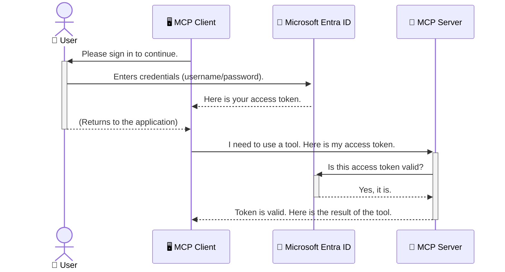

<!--
CO_OP_TRANSLATOR_METADATA:
{
  "original_hash": "6e562d7e5a77c8982da4aa8f762ad1d8",
  "translation_date": "2025-07-02T10:01:10+00:00",
  "source_file": "05-AdvancedTopics/mcp-security-entra/README.md",
  "language_code": "hr"
}
-->
# Osiguravanje AI tijekova rada: Entra ID autentikacija za Model Context Protocol (MCP) poslužitelje

## Uvod  
Osiguravanje vašeg Model Context Protocol (MCP) poslužitelja jednako je važno kao i zaključavanje ulaznih vrata vašeg doma. Ostaviti MCP poslužitelj otvorenim znači izlagati svoje alate i podatke neovlaštenom pristupu, što može dovesti do sigurnosnih propusta. Microsoft Entra ID pruža snažno rješenje za upravljanje identitetom i pristupom u oblaku, pomažući da samo ovlašteni korisnici i aplikacije mogu komunicirati s vašim MCP poslužiteljem. U ovom dijelu naučit ćete kako zaštititi svoje AI tijekove rada koristeći Entra ID autentikaciju.

## Ciljevi učenja  
Na kraju ovog dijela moći ćete:

- Razumjeti važnost osiguranja MCP poslužitelja.
- Objasniti osnove Microsoft Entra ID i OAuth 2.0 autentikacije.
- Prepoznati razliku između javnih i povjerljivih klijenata.
- Implementirati Entra ID autentikaciju u lokalnim (javni klijent) i udaljenim (povjerljivi klijent) MCP poslužiteljskim scenarijima.
- Primijeniti najbolje sigurnosne prakse pri razvoju AI tijekova rada.

## Sigurnost i MCP

Baš kao što ne biste ostavili ulazna vrata svog doma otključana, ne biste trebali ostaviti MCP poslužitelj otvoren za pristup svima. Osiguranje vaših AI tijekova rada ključno je za izgradnju robusnih, pouzdanih i sigurnih aplikacija. Ovaj će vas odjeljak upoznati s korištenjem Microsoft Entra ID za zaštitu vaših MCP poslužitelja, osiguravajući da samo ovlašteni korisnici i aplikacije mogu pristupiti vašim alatima i podacima.

## Zašto je sigurnost važna za MCP poslužitelje

Zamislite da vaš MCP poslužitelj ima alat koji može slati e-poštu ili pristupiti bazi podataka korisnika. Nesiguran poslužitelj značio bi da svatko može koristiti taj alat, što može dovesti do neovlaštenog pristupa podacima, neželjene pošte ili drugih zlonamjernih aktivnosti.

Implementacijom autentikacije osiguravate da je svaki zahtjev prema vašem poslužitelju provjeren, potvrđujući identitet korisnika ili aplikacije koji šalju zahtjev. Ovo je prvi i najvažniji korak u osiguravanju vaših AI tijekova rada.

## Uvod u Microsoft Entra ID

[**Microsoft Entra ID**](https://adoption.microsoft.com/microsoft-security/entra/) je usluga za upravljanje identitetima i pristupom u oblaku. Zamislite ga kao univerzalnog čuvara sigurnosti za vaše aplikacije. On upravlja složenim procesom provjere identiteta korisnika (autentikacija) i određivanjem što im je dopušteno raditi (autorizacija).

Korištenjem Entra ID-a možete:

- Omogućiti siguran prijavu korisnicima.
- Zaštititi API-je i usluge.
- Upravljati pravilima pristupa s jednog mjesta.

Za MCP poslužitelje, Entra ID pruža pouzdano i široko prihvaćeno rješenje za upravljanje pristupom vašim poslužiteljskim funkcionalnostima.

---

## Razumijevanje čarolije: Kako funkcionira Entra ID autentikacija

Entra ID koristi otvorene standarde poput **OAuth 2.0** za upravljanje autentikacijom. Iako detalji mogu biti složeni, osnovni koncept je jednostavan i može se razumjeti kroz analogiju.

### Nježno upoznavanje s OAuth 2.0: Ključ za parkiranje

Zamislite OAuth 2.0 kao uslugu parkiranja za vaš automobil. Kada stignete u restoran, ne dajete parkirnom službeniku glavni ključ. Umjesto toga, dajete **ključ za parkiranje** koji ima ograničena dopuštenja — može upaliti auto i zaključati vrata, ali ne može otvoriti prtljažnik ili pretinac za rukavice.

U ovoj analogiji:

- **Vi** ste **Korisnik**.
- **Vaš automobil** je **MCP poslužitelj** s vrijednim alatima i podacima.
- **Parkirni službenik** je **Microsoft Entra ID**.
- **Osoblje za parkiranje** je **MCP klijent** (aplikacija koja pokušava pristupiti poslužitelju).
- **Ključ za parkiranje** je **Access Token**.

Access token je siguran tekstualni niz koji MCP klijent dobiva od Entra ID-a nakon što se prijavite. Klijent zatim šalje ovaj token poslužitelju pri svakom zahtjevu. Poslužitelj može provjeriti token kako bi osigurao da je zahtjev legitiman i da klijent ima potrebne ovlasti, a da pritom nikada ne mora rukovati vašim stvarnim vjerodajnicama (poput lozinke).

### Tijek autentikacije

Evo kako proces funkcionira u praksi:



### Uvod u Microsoft Authentication Library (MSAL)

Prije nego što zaronimo u kod, važno je upoznati ključnu komponentu koju ćete vidjeti u primjerima: **Microsoft Authentication Library (MSAL)**.

MSAL je biblioteka koju je razvio Microsoft i koja programerima znatno olakšava upravljanje autentikacijom. Umjesto da sami pišete sav složeni kod za rukovanje sigurnosnim tokenima, upravljanje prijavama i osvježavanje sesija, MSAL obavlja sav taj težak posao.

Preporučuje se korištenje biblioteke poput MSAL jer:

- **Sigurna je:** Implementira industrijske standarde i najbolje sigurnosne prakse, smanjujući rizik od ranjivosti u vašem kodu.
- **Pojednostavljuje razvoj:** Apstrahira složenost OAuth 2.0 i OpenID Connect protokola, omogućujući vam da s nekoliko redaka koda dodate robusnu autentikaciju u svoju aplikaciju.
- **Održava ju Microsoft:** Microsoft aktivno održava i ažurira MSAL kako bi se nosio s novim sigurnosnim prijetnjama i promjenama platformi.

MSAL podržava širok raspon jezika i razvojnih okvira, uključujući .NET, JavaScript/TypeScript, Python, Java, Go, te mobilne platforme poput iOS-a i Androida. To znači da možete koristiti iste konzistentne obrasce autentikacije kroz cijeli svoj tehnološki sloj.

Za više informacija o MSAL-u, možete pogledati službenu [MSAL preglednu dokumentaciju](https://learn.microsoft.com/entra/identity-platform/msal-overview).

---

## Osiguravanje vašeg MCP poslužitelja s Entra ID: korak-po-korak vodič

Sada ćemo proći kroz korake kako osigurati lokalni MCP poslužitelj (onaj koji komunicira preko `stdio`):

**AuthenticationService.cs** koristi metodu **CreateAsync** za kreiranje instance **PublicClientApplication** s parametrima **clientId**, **tenantId** i **WithBroker**.  
Metoda **AcquireTokenAsync** je ključna. Prvo pokušava tiho dobiti token (što znači da korisnik neće morati ponovno unositi podatke ako već ima valjanu sesiju). Ako tihi token nije dostupan, zahtijeva interaktivnu prijavu korisnika.

```csharp
// Simplified for clarity
public static async Task<AuthenticationService> CreateAsync(ILogger<AuthenticationService> logger)
{
    var msalClient = PublicClientApplicationBuilder
        .Create(_clientId) // Your Application (client) ID
        .WithAuthority(AadAuthorityAudience.AzureAdMyOrg)
        .WithTenantId(_tenantId) // Your Directory (tenant) ID
        .WithBroker(new BrokerOptions(BrokerOptions.OperatingSystems.Windows))
        .Build();

    // ... cache registration ...

    return new AuthenticationService(logger, msalClient);
}

public async Task<string> AcquireTokenAsync()
{
    try
    {
        // Try silent authentication first
        var accounts = await _msalClient.GetAccountsAsync();
        var account = accounts.FirstOrDefault();

        AuthenticationResult? result = null;

        if (account != null)
        {
            result = await _msalClient.AcquireTokenSilent(_scopes, account).ExecuteAsync();
        }
        else
        {
            // If no account, or silent fails, go interactive
            result = await _msalClient.AcquireTokenInteractive(_scopes).ExecuteAsync();
        }

        return result.AccessToken;
    }
    catch (Exception ex)
    {
        _logger.LogError(ex, "An error occurred while acquiring the token.");
        throw; // Optionally rethrow the exception for higher-level handling
    }
}
```

U **Program.cs**, instancira se singleton za **AuthenticationService**, a zatim se koristi metoda **authService.AcquireTokenAsync()** za dobivanje valjanog pristupnog tokena. Ako je autentikacija uspješna, koristi se token za poziv Microsoft Graph API-ja i dohvaćanje korisničkih podataka.

```csharp
// Simplified for clarity
[McpServerTool(Name = "GetUserDetailsFromGraph")]
public static async Task<string> GetUserDetailsFromGraph(
    AuthenticationService authService)
{
    try
    {
        // This will trigger the authentication flow
        var accessToken = await authService.AcquireTokenAsync();

        // Use the token to create a GraphServiceClient
        var graphClient = new GraphServiceClient(
            new BaseBearerTokenAuthenticationProvider(new TokenProvider(authService)));

        var user = await graphClient.Me.GetAsync();

        return System.Text.Json.JsonSerializer.Serialize(user);
    }
    catch (Exception ex)
    {
        return $"Error: {ex.Message}";
    }
}
```

#### 3. Kako sve to funkcionira zajedno

1. Kada MCP klijent pozove alat `GetUserDetailsFromGraph`, koristi **AcquireTokenAsync** da dobije pristupni token.
2. Endpoint `/auth/callback` prima preusmjeravanje od Entra ID nakon što se korisnik autentificirao. Ovdje se zamjenjuje authorization code za pristupni i osvježavajući token.

```typescript
// Simplified for clarity
const app = express();
const { server } = createServer();
const provider = new EntraIdServerAuthProvider();

// Protect the SSE endpoint
app.get("/sse", requireBearerAuth({
  provider,
  requiredScopes: ["User.Read"]
}), async (req, res) => {
  // ... connect to the transport ...
});

// Protect the message endpoint
app.post("/message", requireBearerAuth({
  provider,
  requiredScopes: ["User.Read"]
}), async (req, res) => {
  // ... handle the message ...
});

// Handle the OAuth 2.0 callback
app.get("/auth/callback", (req, res) => {
  provider.handleCallback(req.query.code, req.query.state)
    .then(result => {
      // ... handle success or failure ...
    });
});
```

Alat `getUserDetails` u **Tools.ts** je sličan prethodnom primjeru, ali pristupni token uzima iz sesije.

```typescript
// Simplified for clarity
server.setRequestHandler(CallToolRequestSchema, async (request) => {
  const { name } = request.params;
  const context = request.params?.context as { token?: string } | undefined;
  const sessionToken = context?.token;

  if (name === ToolName.GET_USER_DETAILS) {
    if (!sessionToken) {
      throw new AuthenticationError("Authentication token is missing or invalid. Ensure the token is provided in the request context.");
    }

    // Get the Entra ID token from the session store
    const tokenData = tokenStore.getToken(sessionToken);
    const entraIdToken = tokenData.accessToken;

    const graphClient = Client.init({
      authProvider: (done) => {
        done(null, entraIdToken);
      }
    });

    const user = await graphClient.api('/me').get();

    // ... return user details ...
  }
});
```

Kada se pozove alat `getUserDetails` u **auth/EntraIdServerAuthProvider.ts**, koristi se token iz sesije za pronalazak Entra ID pristupnog tokena, koji se potom koristi za poziv Microsoft Graph API-ja.

Ovaj tijek je složeniji od tijeka za javnog klijenta, ali je potreban za internetom dostupne endpointove. Budući da su udaljeni MCP poslužitelji dostupni preko javnog interneta, potrebne su snažnije sigurnosne mjere kako bi se zaštitili od neovlaštenog pristupa i potencijalnih napada.

## Najbolje sigurnosne prakse

- **Uvijek koristite HTTPS:** Šifrirajte komunikaciju između klijenta i poslužitelja kako biste zaštitili tokene od presretanja.
- **Implementirajte kontrolu pristupa temeljenu na ulogama (RBAC):** Ne provjeravajte samo *je li* korisnik autentificiran, već i *što* mu je dopušteno raditi. U Entra ID-u možete definirati uloge i provjeravati ih u MCP poslužitelju.
- **Nadzor i revizija:** Bilježite sve događaje autentikacije kako biste mogli detektirati i reagirati na sumnjive aktivnosti.
- **Rukovanje ograničenjima i usporavanjem zahtjeva:** Microsoft Graph i drugi API-ji imaju ograničenja broja zahtjeva. Implementirajte eksponencijalni povratak i logiku ponovnog pokušaja u vašem MCP poslužitelju za elegantno rukovanje HTTP 429 (Previše zahtjeva) odgovorima. Razmotrite keširanje često korištenih podataka kako biste smanjili broj API poziva.
- **Sigurno pohranjivanje tokena:** Pristupne i osvježavajuće tokene pohranite sigurno. Za lokalne aplikacije koristite sustavne mehanizme za sigurnu pohranu. Za poslužiteljske aplikacije razmotrite enkriptiranu pohranu ili usluge za upravljanje ključevima poput Azure Key Vaulta.
- **Rukovanje istekom tokena:** Pristupni tokeni imaju ograničeno trajanje. Implementirajte automatsko osvježavanje tokena pomoću osvježavajućih tokena kako biste osigurali neprekidan korisnički doživljaj bez potrebe za ponovnom autentikacijom.
- **Razmislite o korištenju Azure API Managementa:** Iako implementacija sigurnosti direktno u MCP poslužitelju pruža detaljnu kontrolu, API Gateway rješenja poput Azure API Managementa mogu automatski riješiti mnoge sigurnosne izazove, uključujući autentikaciju, autorizaciju, ograničavanje zahtjeva i nadzor. Oni pružaju centralizirani sigurnosni sloj između vaših klijenata i MCP poslužitelja. Više o korištenju API Gatewaya s MCP pogledajte u [Azure API Management Your Auth Gateway For MCP Servers](https://techcommunity.microsoft.com/blog/integrationsonazureblog/azure-api-management-your-auth-gateway-for-mcp-servers/4402690).

## Ključne spoznaje

- Osiguravanje MCP poslužitelja ključno je za zaštitu vaših podataka i alata.
- Microsoft Entra ID pruža snažno i skalabilno rješenje za autentikaciju i autorizaciju.
- Koristite **javni klijent** za lokalne aplikacije i **povjerljivi klijent** za udaljene poslužitelje.
- **Authorization Code Flow** je najsigurnija opcija za web aplikacije.

## Vježba

1. Razmislite o MCP poslužitelju koji biste mogli izgraditi. Hoće li biti lokalni ili udaljeni poslužitelj?
2. Na temelju svog odgovora, biste li koristili javnog ili povjerljivog klijenta?
3. Koju bi dozvolu vaš MCP poslužitelj tražio za izvođenje radnji prema Microsoft Graphu?

## Praktične vježbe

### Vježba 1: Registracija aplikacije u Entra ID  
Idite na Microsoft Entra portal.  
Registrirajte novu aplikaciju za vaš MCP poslužitelj.  
Zabilježite Application (client) ID i Directory (tenant) ID.

### Vježba 2: Osigurajte lokalni MCP poslužitelj (javni klijent)  
- Slijedite primjer koda za integraciju MSAL-a (Microsoft Authentication Library) za autentikaciju korisnika.  
- Testirajte tijek autentikacije pozivom MCP alata koji dohvaća korisničke podatke iz Microsoft Grapha.

### Vježba 3: Osigurajte udaljeni MCP poslužitelj (povjerljivi klijent)  
- Registrirajte povjerljivog klijenta u Entra ID i kreirajte klijentsku tajnu.  
- Konfigurirajte vaš Express.js MCP poslužitelj za korištenje Authorization Code Flow.  
- Testirajte zaštićene endpointove i potvrdite pristup temeljen na tokenima.

### Vježba 4: Primijenite najbolje sigurnosne prakse  
- Omogućite HTTPS za vaš lokalni ili udaljeni poslužitelj.  
- Implementirajte kontrolu pristupa temeljenu na ulogama (RBAC) u logici poslužitelja.  
- Dodajte rukovanje istekom tokena i sigurnu pohranu tokena.

## Resursi

1. **MSAL pregledna dokumentacija**  
   Saznajte kako Microsoft Authentication Library (MSAL) omogućava sigurno dobivanje tokena na različitim platformama:  
   [MSAL Overview on Microsoft Learn](https://learn.microsoft.com/en-gb/entra/msal/overview)

2. **Azure-Samples/mcp-auth-servers GitHub repozitorij**  
   Referentne implementacije MCP poslužitelja koji demonstriraju tijekove autentikacije:  
   [Azure-Samples/mcp-auth-servers on GitHub](https://github.com/Azure-Samples/mcp-auth-servers)

3. **Pregled Managed Identities za Azure resurse**  
   Razumite kako eliminirati tajne korištenjem sistemski ili korisnički dodijeljenih upravljanih identiteta:  
   [Managed Identities Overview on Microsoft Learn](https://learn.microsoft.com/en-us/entra/identity/managed-identities-azure-resources/)

4. **Azure API Management: Vaš Auth Gateway za MCP poslužitelje**  
   Dubinski pregled korištenja APIM-a kao sigurnog OAuth2 gatewaya za MCP poslužitelje:  
   [Azure API Management Your Auth Gateway For MCP Servers](https://techcommunity.microsoft.com/blog/integrationsonazureblog/azure-api-management-your-auth-gateway-for-mcp-servers/4402690)

5. **Microsoft Graph Permissions Reference**  
   Sveobuhvatan popis delegiranih i aplikacijskih dozvola za Microsoft Graph:  
   [Microsoft Graph Permissions Reference](https://learn.microsoft.com/zh-tw/graph/permissions-reference)

## Ishodi učenja  
Nakon završetka ovog dijela, moći ćete:

- Objasniti zašto je autentikacija ključna za MCP poslužitelje i AI tijekove rada.  
- Postaviti i konfigurirati Entra ID autentikaciju za lokalne i udaljene MCP poslužiteljske scenarije.  
- Izabrati odgovarajući tip klijenta (javni ili povjerljivi) ovisno o implementaciji poslužitelja.  
- Implementirati sigurne razvojne prakse, uključujući pohranu tokena i autorizaciju temeljenu na ulogama.  
- S pouzdanjem zaštititi svoj MCP poslužitelj i njegove alate od neovlaštenog pristupa.

## Što slijedi

- [5.13 Model Context Protocol (MCP) integracija s Azure AI Foundry](../mcp-foundry-agent-integration/README.md)

**Odricanje od odgovornosti**:  
Ovaj dokument preveden je korištenjem AI usluge prevođenja [Co-op Translator](https://github.com/Azure/co-op-translator). Iako težimo točnosti, imajte na umu da automatski prijevodi mogu sadržavati pogreške ili netočnosti. Izvorni dokument na izvornom jeziku treba smatrati autoritativnim izvorom. Za važne informacije preporučuje se profesionalni ljudski prijevod. Ne odgovaramo za bilo kakva nesporazuma ili kriva tumačenja koja proizlaze iz korištenja ovog prijevoda.