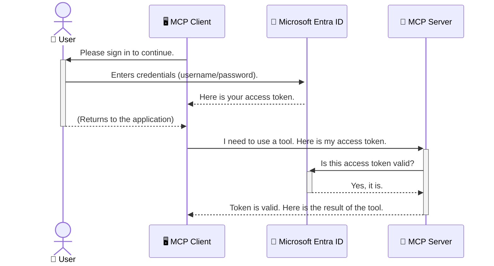

<!--
CO_OP_TRANSLATOR_METADATA:
{
  "original_hash": "0abf26a6c4dbe905d5d49ccdc0ccfe92",
  "translation_date": "2025-06-26T16:42:12+00:00",
  "source_file": "05-AdvancedTopics/mcp-security-entra/README.md",
  "language_code": "hr"
}
-->
# Osiguravanje AI radnih tokova: Entra ID autentikacija za Model Context Protocol servere

## Uvod  
Osiguravanje vašeg Model Context Protocol (MCP) servera jednako je važno kao zaključavanje ulaznih vrata kuće. Ostaviti MCP server otvorenim znači izložiti vaše alate i podatke neovlaštenom pristupu, što može dovesti do sigurnosnih propusta. Microsoft Entra ID pruža snažno rješenje za upravljanje identitetima i pristupom u oblaku, pomažući da samo ovlašteni korisnici i aplikacije mogu komunicirati s vašim MCP serverom. U ovom dijelu naučit ćete kako zaštititi svoje AI radne tokove koristeći Entra ID autentikaciju.

## Ciljevi učenja  
Na kraju ovog dijela moći ćete:

- Razumjeti važnost osiguranja MCP servera.  
- Objasniti osnove Microsoft Entra ID i OAuth 2.0 autentikacije.  
- Prepoznati razliku između javnih i povjerljivih klijenata.  
- Implementirati Entra ID autentikaciju u lokalnim (javni klijent) i udaljenim (povjerljivi klijent) scenarijima MCP servera.  
- Primijeniti najbolje sigurnosne prakse pri razvoju AI radnih tokova.

## Sigurnost i MCP

Baš kao što ne biste ostavili ulazna vrata kuće otključana, ne biste trebali ostaviti MCP server otvoren za pristup svima. Osiguravanje AI radnih tokova ključno je za izgradnju pouzdanih, sigurnih i vjerodostojnih aplikacija. Ovaj će vam dio pokazati kako koristiti Microsoft Entra ID za zaštitu MCP servera, osiguravajući da samo ovlašteni korisnici i aplikacije imaju pristup vašim alatima i podacima.

## Zašto je sigurnost važna za MCP servere

Zamislite da vaš MCP server ima alat koji može slati e-poštu ili pristupiti bazi podataka korisnika. Nesiguran server znači da bi svatko mogao koristiti taj alat, što može dovesti do neovlaštenog pristupa podacima, neželjene pošte ili drugih zlonamjernih aktivnosti.

Implementacijom autentikacije osiguravate da je svaki zahtjev prema serveru provjeren, potvrđujući identitet korisnika ili aplikacije koja šalje zahtjev. Ovo je prvi i najvažniji korak u zaštiti vaših AI radnih tokova.

## Uvod u Microsoft Entra ID

[**Microsoft Entra ID**](https://adoption.microsoft.com/microsoft-security/entra/) je usluga upravljanja identitetima i pristupom u oblaku. Zamislite ga kao univerzalnog čuvara sigurnosti za vaše aplikacije. On upravlja složenim procesom provjere identiteta korisnika (autentikacija) i određivanja što im je dopušteno raditi (autorizacija).

Korištenjem Entra ID-a možete:

- Omogućiti siguran prijavu za korisnike.  
- Zaštititi API-je i servise.  
- Upravljati pravilima pristupa s jednog mjesta.

Za MCP servere, Entra ID pruža snažno i široko prihvaćeno rješenje za upravljanje pristupom i ovlaštenjima.

---

## Razumijevanje čarolije: Kako Entra ID autentikacija funkcionira

Entra ID koristi otvorene standarde poput **OAuth 2.0** za upravljanje autentikacijom. Iako detalji mogu biti složeni, osnovni koncept je jednostavan i može se objasniti analogijom.

### Blagi uvod u OAuth 2.0: Ključ za parkiranje

Zamislite OAuth 2.0 kao uslugu parkiranja za vaš automobil. Kad stignete u restoran, ne dajete parkirnom serviseru glavni ključ. Umjesto toga, dajete **ključ za parkiranje** s ograničenim ovlastima – može upaliti auto i zaključati vrata, ali ne može otvoriti prtljažnik ili pretinac za rukavice.

U ovoj analogiji:

- **Vi** ste **Korisnik**.  
- **Vaš automobil** je **MCP server** s vrijednim alatima i podacima.  
- **Parkirni serviser** je **Microsoft Entra ID**.  
- **Osoblje za parkiranje** je **MCP klijent** (aplikacija koja pokušava pristupiti serveru).  
- **Ključ za parkiranje** je **Access Token**.

Access token je siguran niz znakova koji MCP klijent dobiva od Entra ID-a nakon vaše prijave. Klijent zatim s tim tokenom pristupa MCP serveru pri svakom zahtjevu. Server može provjeriti token kako bi osigurao da je zahtjev legitimni i da klijent ima potrebna dopuštenja, a da pritom nikada ne mora rukovati vašim stvarnim vjerodajnicama (kao što je lozinka).

### Tijek autentikacije

Evo kako proces funkcionira u praksi:



### Uvod u Microsoft Authentication Library (MSAL)

Prije nego što prijeđemo na kod, važno je predstaviti ključnu komponentu koju ćete vidjeti u primjerima: **Microsoft Authentication Library (MSAL)**.

MSAL je biblioteka koju je razvio Microsoft i koja znatno olakšava programerima upravljanje autentikacijom. Umjesto da sami pišete sav složeni kod za rukovanje sigurnosnim tokenima, prijavama i osvježavanjem sesija, MSAL obavlja taj težak dio posla.

Korištenje biblioteke poput MSAL-a je vrlo preporučljivo jer:

- **Sigurna je:** Implementira industrijske standarde i najbolje sigurnosne prakse, smanjujući rizik od ranjivosti u vašem kodu.  
- **Pojednostavljuje razvoj:** Apstrahira složenost OAuth 2.0 i OpenID Connect protokola, omogućujući vam da dodate robusnu autentikaciju u aplikaciju s nekoliko linija koda.  
- **Održava se:** Microsoft aktivno održava i ažurira MSAL kako bi odgovorio na nove sigurnosne prijetnje i promjene platformi.

MSAL podržava širok raspon programskih jezika i okvira, uključujući .NET, JavaScript/TypeScript, Python, Java, Go, te mobilne platforme poput iOS-a i Androida. To znači da možete koristiti iste obrasce autentikacije kroz cijeli tehnološki sloj.

Za više informacija o MSAL-u, pogledajte službenu [MSAL preglednu dokumentaciju](https://learn.microsoft.com/entra/identity-platform/msal-overview).

---

## Osiguravanje vašeg MCP servera s Entra ID: korak-po-korak vodič

Sada ćemo proći kroz postupak osiguravanja lokalnog MCP servera (koji komunicira preko `stdio`) using Entra ID. This example uses a **public client**, which is suitable for applications running on a user's machine, like a desktop app or a local development server.

### Scenario 1: Securing a Local MCP Server (with a Public Client)

In this scenario, we'll look at an MCP server that runs locally, communicates over `stdio`, and uses Entra ID to authenticate the user before allowing access to its tools. The server will have a single tool that fetches the user's profile information from the Microsoft Graph API.

#### 1. Setting Up the Application in Entra ID

Before writing any code, you need to register your application in Microsoft Entra ID. This tells Entra ID about your application and grants it permission to use the authentication service.

1. Navigate to the **[Microsoft Entra portal](https://entra.microsoft.com/)**.
2. Go to **App registrations** and click **New registration**.
3. Give your application a name (e.g., "My Local MCP Server").
4. For **Supported account types**, select **Accounts in this organizational directory only**.
5. You can leave the **Redirect URI** blank for this example.
6. Click **Register**.

Once registered, take note of the **Application (client) ID** and **Directory (tenant) ID**. You'll need these in your code.

#### 2. The Code: A Breakdown

Let's look at the key parts of the code that handle authentication. The full code for this example is available in the [Entra ID - Local - WAM](https://github.com/Azure-Samples/mcp-auth-servers/tree/main/src/entra-id-local-wam) folder of the [mcp-auth-servers GitHub repository](https://github.com/Azure-Samples/mcp-auth-servers).

**`AuthenticationService.cs`**

This class is responsible for handling the interaction with Entra ID.

- **`CreateAsync`**: This method initializes the `PublicClientApplication` from the MSAL (Microsoft Authentication Library). It's configured with your application's `clientId` and `tenantId`.
- **`WithBroker`**: This enables the use of a broker (like the Windows Web Account Manager), which provides a more secure and seamless single sign-on experience.
- **`AcquireTokenAsync`**: Ovo je ključna metoda. Prvo pokušava tiho (silent) dobiti token (što znači da korisnik neće morati ponovno unositi podatke ako već ima valjanu sesiju). Ako tiho dobivanje tokena nije moguće, traži od korisnika da se prijavi interaktivno.

```csharp
// Simplified for clarity
public static async Task<AuthenticationService> CreateAsync(ILogger<AuthenticationService> logger)
{
    var msalClient = PublicClientApplicationBuilder
        .Create(_clientId) // Your Application (client) ID
        .WithAuthority(AadAuthorityAudience.AzureAdMyOrg)
        .WithTenantId(_tenantId) // Your Directory (tenant) ID
        .WithBroker(new BrokerOptions(BrokerOptions.OperatingSystems.Windows))
        .Build();

    // ... cache registration ...

    return new AuthenticationService(logger, msalClient);
}

public async Task<string> AcquireTokenAsync()
{
    try
    {
        // Try silent authentication first
        var accounts = await _msalClient.GetAccountsAsync();
        var account = accounts.FirstOrDefault();

        AuthenticationResult? result = null;

        if (account != null)
        {
            result = await _msalClient.AcquireTokenSilent(_scopes, account).ExecuteAsync();
        }
        else
        {
            // If no account, or silent fails, go interactive
            result = await _msalClient.AcquireTokenInteractive(_scopes).ExecuteAsync();
        }

        return result.AccessToken;
    }
    catch (Exception ex)
    {
        _logger.LogError(ex, "An error occurred while acquiring the token.");
        throw; // Optionally rethrow the exception for higher-level handling
    }
}
```

**`Program.cs`**

This is where the MCP server is set up and the authentication service is integrated.

- **`AddSingleton<AuthenticationService>`**: This registers the `AuthenticationService` with the dependency injection container, so it can be used by other parts of the application (like our tool).
- **`GetUserDetailsFromGraph` tool**: This tool requires an instance of `AuthenticationService`. Before it does anything, it calls `authService.AcquireTokenAsync()` koristi se za dobivanje valjanog access tokena. Ako je autentikacija uspješna, token se koristi za pozivanje Microsoft Graph API-ja i dohvaćanje korisničkih podataka.

```csharp
// Simplified for clarity
[McpServerTool(Name = "GetUserDetailsFromGraph")]
public static async Task<string> GetUserDetailsFromGraph(
    AuthenticationService authService)
{
    try
    {
        // This will trigger the authentication flow
        var accessToken = await authService.AcquireTokenAsync();

        // Use the token to create a GraphServiceClient
        var graphClient = new GraphServiceClient(
            new BaseBearerTokenAuthenticationProvider(new TokenProvider(authService)));

        var user = await graphClient.Me.GetAsync();

        return System.Text.Json.JsonSerializer.Serialize(user);
    }
    catch (Exception ex)
    {
        return $"Error: {ex.Message}";
    }
}
```

#### 3. Kako sve to funkcionira zajedno

1. Kada MCP klijent pokuša koristiti `GetUserDetailsFromGraph` tool, the tool first calls `AcquireTokenAsync`.
2. `AcquireTokenAsync` triggers the MSAL library to check for a valid token.
3. If no token is found, MSAL, through the broker, will prompt the user to sign in with their Entra ID account.
4. Once the user signs in, Entra ID issues an access token.
5. The tool receives the token and uses it to make a secure call to the Microsoft Graph API.
6. The user's details are returned to the MCP client.

This process ensures that only authenticated users can use the tool, effectively securing your local MCP server.

### Scenario 2: Securing a Remote MCP Server (with a Confidential Client)

When your MCP server is running on a remote machine (like a cloud server) and communicates over a protocol like HTTP Streaming, the security requirements are different. In this case, you should use a **confidential client** and the **Authorization Code Flow**. This is a more secure method because the application's secrets are never exposed to the browser.

This example uses a TypeScript-based MCP server that uses Express.js to handle HTTP requests.

#### 1. Setting Up the Application in Entra ID

The setup in Entra ID is similar to the public client, but with one key difference: you need to create a **client secret**.

1. Navigate to the **[Microsoft Entra portal](https://entra.microsoft.com/)**.
2. In your app registration, go to the **Certificates & secrets** tab.
3. Click **New client secret**, give it a description, and click **Add**.
4. **Important:** Copy the secret value immediately. You will not be able to see it again.
5. You also need to configure a **Redirect URI**. Go to the **Authentication** tab, click **Add a platform**, select **Web**, and enter the redirect URI for your application (e.g., `http://localhost:3001/auth/callback`).

> **⚠️ Important Security Note:** For production applications, Microsoft strongly recommends using **secretless authentication** methods such as **Managed Identity** or **Workload Identity Federation** instead of client secrets. Client secrets pose security risks as they can be exposed or compromised. Managed identities provide a more secure approach by eliminating the need to store credentials in your code or configuration.
>
> For more information about managed identities and how to implement them, see the [Managed identities for Azure resources overview](https://learn.microsoft.com/entra/identity/managed-identities-azure-resources/overview).

#### 2. The Code: A Breakdown

This example uses a session-based approach. When the user authenticates, the server stores the access token and refresh token in a session and gives the user a session token. This session token is then used for subsequent requests. The full code for this example is available in the [Entra ID - Confidential client](https://github.com/Azure-Samples/mcp-auth-servers/tree/main/src/entra-id-cca-session) folder of the [mcp-auth-servers GitHub repository](https://github.com/Azure-Samples/mcp-auth-servers).

**`Server.ts`**

This file sets up the Express server and the MCP transport layer.

- **`requireBearerAuth`**: This is middleware that protects the `/sse` and `/message` endpoints. It checks for a valid bearer token in the `Authorization` header of the request.
- **`EntraIdServerAuthProvider`**: This is a custom class that implements the `McpServerAuthorizationProvider` interface. It's responsible for handling the OAuth 2.0 flow.
- **`/auth/callback`**: Ovaj endpoint obrađuje preusmjeravanje s Entra ID-a nakon što se korisnik autentificirao. On mijenja autorizacijski kod za access token i refresh token.

```typescript
// Simplified for clarity
const app = express();
const { server } = createServer();
const provider = new EntraIdServerAuthProvider();

// Protect the SSE endpoint
app.get("/sse", requireBearerAuth({
  provider,
  requiredScopes: ["User.Read"]
}), async (req, res) => {
  // ... connect to the transport ...
});

// Protect the message endpoint
app.post("/message", requireBearerAuth({
  provider,
  requiredScopes: ["User.Read"]
}), async (req, res) => {
  // ... handle the message ...
});

// Handle the OAuth 2.0 callback
app.get("/auth/callback", (req, res) => {
  provider.handleCallback(req.query.code, req.query.state)
    .then(result => {
      // ... handle success or failure ...
    });
});
```

**`Tools.ts`**

This file defines the tools that the MCP server provides. The `getUserDetails` alat je sličan onom iz prethodnog primjera, ali dohvaća access token iz sesije.

```typescript
// Simplified for clarity
server.setRequestHandler(CallToolRequestSchema, async (request) => {
  const { name } = request.params;
  const context = request.params?.context as { token?: string } | undefined;
  const sessionToken = context?.token;

  if (name === ToolName.GET_USER_DETAILS) {
    if (!sessionToken) {
      throw new AuthenticationError("Authentication token is missing or invalid. Ensure the token is provided in the request context.");
    }

    // Get the Entra ID token from the session store
    const tokenData = tokenStore.getToken(sessionToken);
    const entraIdToken = tokenData.accessToken;

    const graphClient = Client.init({
      authProvider: (done) => {
        done(null, entraIdToken);
      }
    });

    const user = await graphClient.api('/me').get();

    // ... return user details ...
  }
});
```

**`auth/EntraIdServerAuthProvider.ts`**

This class handles the logic for:

- Redirecting the user to the Entra ID sign-in page.
- Exchanging the authorization code for an access token.
- Storing the tokens in the `tokenStore`.
- Refreshing the access token when it expires.

#### 3. How It All Works Together

1. When a user first tries to connect to the MCP server, the `requireBearerAuth` middleware will see that they don't have a valid session and will redirect them to the Entra ID sign-in page.
2. The user signs in with their Entra ID account.
3. Entra ID redirects the user back to the `/auth/callback` endpoint with an authorization code.
4. The server exchanges the code for an access token and a refresh token, stores them, and creates a session token which is sent to the client.
5. The client can now use this session token in the `Authorization` header for all future requests to the MCP server.
6. When the `getUserDetails` alat se poziva koristeći token iz sesije da pronađe Entra ID access token, a zatim ga koristi za pozivanje Microsoft Graph API-ja.

Ovaj tijek je složeniji od tijeka javnog klijenta, ali je potreban za internetom dostupne endpoint-e. Budući da su udaljeni MCP serveri dostupni preko javnog interneta, potrebne su snažnije sigurnosne mjere za zaštitu od neovlaštenog pristupa i potencijalnih napada.

## Najbolje sigurnosne prakse

- **Uvijek koristite HTTPS**: Šifrirajte komunikaciju između klijenta i servera kako biste zaštitili tokene od presretanja.  
- **Implementirajte kontrolu pristupa temeljenu na ulogama (RBAC)**: Nemojte samo provjeravati *je li* korisnik autentificiran, već i *što* smije raditi. U Entra ID-u možete definirati uloge i provjeravati ih u vašem MCP serveru.  
- **Nadzor i revizija**: Zabilježite sve događaje autentikacije kako biste mogli otkriti i reagirati na sumnjive aktivnosti.  
- **Rukovanje ograničenjem brzine i ograničenjem zahtjeva**: Microsoft Graph i drugi API-ji imaju ograničenja kako bi spriječili zloupotrebu. Implementirajte eksponencijalno čekanje i logiku ponovnog pokušaja u MCP serveru kako biste elegantno reagirali na HTTP 429 (Previše zahtjeva). Razmislite o keširanju često korištenih podataka da smanjite broj API poziva.  
- **Sigurno pohranjivanje tokena**: Pohranjujte access i refresh tokene sigurno. Za lokalne aplikacije koristite sigurnosne mehanizme sustava. Za server aplikacije razmotrite enkriptiranu pohranu ili usluge upravljanja ključevima poput Azure Key Vault.  
- **Rukovanje istekom tokena**: Access tokeni imaju ograničen rok trajanja. Implementirajte automatsko osvježavanje tokena pomoću refresh tokena kako biste osigurali neprekidan korisnički doživljaj bez potrebe za ponovnom prijavom.  
- **Razmotrite korištenje Azure API Management**: Iako implementacija sigurnosti izravno u MCP serveru pruža finu kontrolu, API Gateway poput Azure API Management može automatski upravljati mnogim sigurnosnim aspektima, uključujući autentikaciju, autorizaciju, ograničenje brzine i nadzor. Oni pružaju centraliziranu sigurnosnu razinu između vaših klijenata i MCP servera. Za više detalja o korištenju API Gateway-a s MCP-om pogledajte naš [Azure API Management Your Auth Gateway For MCP Servers](https://techcommunity.microsoft.com/blog/integrationsonazureblog/azure-api-management-your-auth-gateway-for-mcp-servers/4402690).

## Ključni zaključci

- Osiguravanje MCP servera ključno je za zaštitu vaših podataka i alata.  
- Microsoft Entra ID pruža snažno i skalabilno rješenje za autentikaciju i autorizaciju.  
- Koristite **javni klijent** za lokalne aplikacije i **povjerljivi klijent** za udaljene servere.  
- **Authorization Code Flow** je najsigurnija opcija za web aplikacije.

## Vježba

1. Razmislite o MCP serveru koji biste mogli izgraditi. Bi li to bio lokalni ili udaljeni server?  
2. Na temelju odgovora, biste li koristili javnog ili povjerljivog klijenta?  
3. Koju bi dozvolu vaš MCP server tražio za rad s Microsoft Graphom?

## Praktične vježbe

### Vježba 1: Registrirajte aplikaciju u Entra ID  
- Idite na Microsoft Entra portal.  
- Registrirajte novu aplikaciju za vaš MCP server.  
- Zabilježite Application (client) ID i Directory (tenant) ID.

### Vježba 2: Osigurajte lokalni MCP server (javni klijent)  
- Slijedite primjer koda za integraciju MSAL-a (Microsoft Authentication Library) za autentikaciju korisnika.  
- Testirajte tijek autentikacije pozivom MCP alata koji dohvaća korisničke podatke iz Microsoft Grapha.

### Vježba 3: Osigurajte udaljeni MCP server (povjerljivi klijent)  
- Registrirajte povjerljivog klijenta u Entra ID i kreirajte client secret.  
- Konfigurirajte vaš Express.js MCP server za korištenje Authorization Code Flow.  
- Testirajte zaštićene endpoint-e i potvrdite pristup temeljen na tokenu.

### Vježba 4: Primijenite najbolje sigurnosne prakse  
- Omogućite HTTPS za lokalni ili udaljeni server.  
- Implementirajte kontrolu pristupa temeljenu na ulogama (RBAC) u logici servera.  
- Dodajte rukovanje istekom tokena i sigurnu pohranu tokena.

## Resursi

1. **MSAL pregledna dokumentacija**  
   Naučite kako Microsoft Authentication Library (MSAL) omogućuje sigurno dobivanje tokena na različitim platformama:  
   [MSAL Overview on Microsoft Learn](https://learn.microsoft.com/en-gb/entra/msal/overview)

2. **Azure-Samples/mcp-auth-servers GitHub repozitorij**  
   Referentne implementacije MCP servera koje pokazuju tijekove autentikacije:  
   [Azure-Samples/mcp-auth-servers on GitHub](https://github.com/Azure-Samples/mcp-auth-servers)

3. **Pregled Managed Identities za Azure resurse**  
   Razumite kako ukloniti tajne koristeći sustavom ili korisnikom dodijeljene managed identitete:  
   [Managed Identities Overview on Microsoft Learn](https://learn.microsoft.com/en-us/entra/identity/managed-identities-azure-resources/)

4. **Azure API Management: Vaš Auth Gateway za MCP servere**  
   Detaljan pregled korištenja APIM-a kao sigurnog OAuth2 gatewaya za MCP servere:  
   [Azure API Management Your Auth Gateway For MCP Servers](https://techcommunity.microsoft.com/blog/integrationsonazureblog/azure-api-management-your-auth-gateway-for-mcp-servers/4402690)

5. **Microsoft Graph Permissions Reference**  
   Sveobuhvatan popis delegiranih i aplikacijskih dozvola za Microsoft Graph:  
   [Microsoft Graph Permissions Reference](https://learn.microsoft.com/zh-tw/graph/permissions-reference)

## Ishodi učenja  
Nakon završetka ovog dijela moći ćete:

- Objasniti zašto je autentikacija ključna za MCP servere i AI radne tokove.  
- Postaviti i konfigurirati Entra ID autentikaciju za lokalne i udaljene MCP servere.  
- Odabrati odgovarajući tip klijenta (javni ili povjerljivi) prema načinu implementacije servera.  
- Implementirati sigurne prakse kodiranja, uključujući pohranu tokena i autorizaciju temeljenu na ulogama.  
- Pouzdano zaštititi vaš MCP server i njegove alate od neovlaštenog pristupa.

## Što slijedi

- [6. Zajednički doprinosi](../../06-CommunityContributions/README.md)

**Izjava o odricanju od odgovornosti**:  
Ovaj dokument preveden je korištenjem AI usluge prevođenja [Co-op Translator](https://github.com/Azure/co-op-translator). Iako nastojimo postići točnost, molimo imajte na umu da automatski prijevodi mogu sadržavati pogreške ili netočnosti. Izvorni dokument na izvornom jeziku treba smatrati autoritativnim izvorom. Za kritične informacije preporučuje se profesionalni ljudski prijevod. Ne odgovaramo za bilo kakva nesporazume ili pogrešna tumačenja koja proizlaze iz korištenja ovog prijevoda.