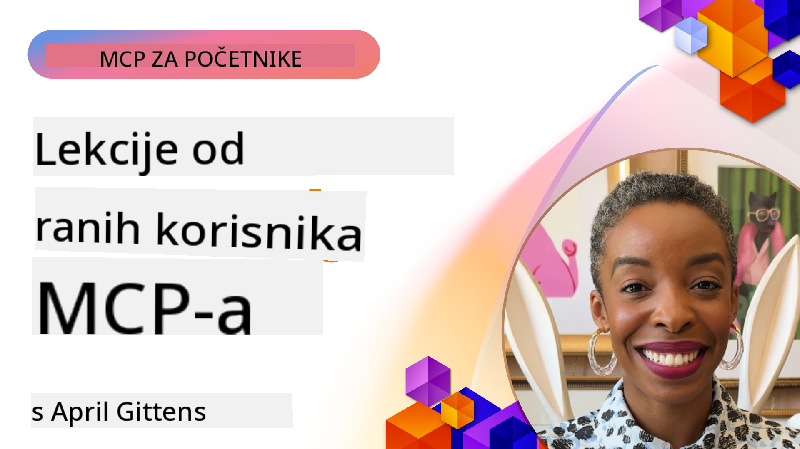

<!--
CO_OP_TRANSLATOR_METADATA:
{
  "original_hash": "41f16dac486d2086a53bc644a01cbe42",
  "translation_date": "2025-08-19T17:42:48+00:00",
  "source_file": "07-LessonsfromEarlyAdoption/README.md",
  "language_code": "hr"
}
-->
# 🌟 Lekcije od ranih korisnika

[](https://youtu.be/jds7dSmNptE)

_(Kliknite na sliku iznad za pregled videa ove lekcije)_

## 🎯 Što ovaj modul pokriva

Ovaj modul istražuje kako stvarne organizacije i programeri koriste Model Context Protocol (MCP) za rješavanje stvarnih izazova i poticanje inovacija. Kroz detaljne studije slučaja i praktične primjere, otkrit ćete kako MCP omogućuje sigurnu i skalabilnu AI integraciju koja povezuje jezične modele, alate i podatke poduzeća.

### 📚 Pogledajte MCP u akciji

Želite vidjeti kako se ovi principi primjenjuju na alate spremne za proizvodnju? Pogledajte naš [**Vodič o 10 Microsoft MCP servera koji transformiraju produktivnost programera**](microsoft-mcp-servers.md), koji prikazuje stvarne Microsoft MCP servere koje možete koristiti već danas.

## Pregled

Ova lekcija istražuje kako su rani korisnici iskoristili Model Context Protocol (MCP) za rješavanje stvarnih izazova i poticanje inovacija u različitim industrijama. Kroz detaljne studije slučaja i praktične projekte, vidjet ćete kako MCP omogućuje standardiziranu, sigurnu i skalabilnu AI integraciju—povezujući velike jezične modele, alate i podatke poduzeća u jedinstvenom okviru. Steći ćete praktično iskustvo u dizajniranju i izgradnji rješenja temeljenih na MCP-u, učiti iz dokazanih obrazaca implementacije i otkriti najbolje prakse za implementaciju MCP-a u proizvodnim okruženjima. Lekcija također ističe nove trendove, buduće smjerove i resurse otvorenog koda kako biste ostali na čelu MCP tehnologije i njenog ekosustava u razvoju.

## Ciljevi učenja

- Analizirati stvarne implementacije MCP-a u različitim industrijama
- Dizajnirati i izgraditi kompletne aplikacije temeljene na MCP-u
- Istražiti nove trendove i buduće smjerove u MCP tehnologiji
- Primijeniti najbolje prakse u stvarnim razvojnim scenarijima

## Stvarne implementacije MCP-a

### Studija slučaja 1: Automatizacija korisničke podrške u poduzeću

Multinacionalna korporacija implementirala je rješenje temeljeno na MCP-u kako bi standardizirala AI interakcije u svojim sustavima korisničke podrške. Ovo im je omogućilo:

- Stvaranje jedinstvenog sučelja za više LLM pružatelja
- Održavanje dosljednog upravljanja promptovima među odjelima
- Implementaciju robusnih sigurnosnih i usklađenih kontrola
- Jednostavno prebacivanje između različitih AI modela prema specifičnim potrebama

**Tehnička implementacija:**

```python
# Python MCP server implementation for customer support
import logging
import asyncio
from modelcontextprotocol import create_server, ServerConfig
from modelcontextprotocol.server import MCPServer
from modelcontextprotocol.transports import create_http_transport
from modelcontextprotocol.resources import ResourceDefinition
from modelcontextprotocol.prompts import PromptDefinition
from modelcontextprotocol.tool import ToolDefinition

# Configure logging
logging.basicConfig(level=logging.INFO)

async def main():
    # Create server configuration
    config = ServerConfig(
        name="Enterprise Customer Support Server",
        version="1.0.0",
        description="MCP server for handling customer support inquiries"
    )
    
    # Initialize MCP server
    server = create_server(config)
    
    # Register knowledge base resources
    server.resources.register(
        ResourceDefinition(
            name="customer_kb",
            description="Customer knowledge base documentation"
        ),
        lambda params: get_customer_documentation(params)
    )
    
    # Register prompt templates
    server.prompts.register(
        PromptDefinition(
            name="support_template",
            description="Templates for customer support responses"
        ),
        lambda params: get_support_templates(params)
    )
    
    # Register support tools
    server.tools.register(
        ToolDefinition(
            name="ticketing",
            description="Create and update support tickets"
        ),
        handle_ticketing_operations
    )
    
    # Start server with HTTP transport
    transport = create_http_transport(port=8080)
    await server.run(transport)

if __name__ == "__main__":
    asyncio.run(main())
```

**Rezultati:** 30% smanjenje troškova modela, 45% poboljšanje dosljednosti odgovora i poboljšana usklađenost u globalnim operacijama.

### Studija slučaja 2: Asistent za medicinsku dijagnostiku

Pružatelj zdravstvenih usluga razvio je MCP infrastrukturu za integraciju više specijaliziranih medicinskih AI modela uz osiguranje zaštite osjetljivih podataka pacijenata:

- Besprijekorno prebacivanje između općih i specijaliziranih medicinskih modela
- Stroge kontrole privatnosti i evidencije revizije
- Integracija s postojećim sustavima elektroničkih zdravstvenih kartona (EHR)
- Dosljedno upravljanje promptovima za medicinsku terminologiju

**Tehnička implementacija:**

```csharp
// C# MCP host application implementation in healthcare application
using Microsoft.Extensions.DependencyInjection;
using ModelContextProtocol.SDK.Client;
using ModelContextProtocol.SDK.Security;
using ModelContextProtocol.SDK.Resources;

public class DiagnosticAssistant
{
    private readonly MCPHostClient _mcpClient;
    private readonly PatientContext _patientContext;
    
    public DiagnosticAssistant(PatientContext patientContext)
    {
        _patientContext = patientContext;
        
        // Configure MCP client with healthcare-specific settings
        var clientOptions = new ClientOptions
        {
            Name = "Healthcare Diagnostic Assistant",
            Version = "1.0.0",
            Security = new SecurityOptions
            {
                Encryption = EncryptionLevel.Medical,
                AuditEnabled = true
            }
        };
        
        _mcpClient = new MCPHostClientBuilder()
            .WithOptions(clientOptions)
            .WithTransport(new HttpTransport("https://healthcare-mcp.example.org"))
            .WithAuthentication(new HIPAACompliantAuthProvider())
            .Build();
    }
    
    public async Task<DiagnosticSuggestion> GetDiagnosticAssistance(
        string symptoms, string patientHistory)
    {
        // Create request with appropriate resources and tool access
        var resourceRequest = new ResourceRequest
        {
            Name = "patient_records",
            Parameters = new Dictionary<string, object>
            {
                ["patientId"] = _patientContext.PatientId,
                ["requestingProvider"] = _patientContext.ProviderId
            }
        };
        
        // Request diagnostic assistance using appropriate prompt
        var response = await _mcpClient.SendPromptRequestAsync(
            promptName: "diagnostic_assistance",
            parameters: new Dictionary<string, object>
            {
                ["symptoms"] = symptoms,
                patientHistory = patientHistory,
                relevantGuidelines = _patientContext.GetRelevantGuidelines()
            });
            
        return DiagnosticSuggestion.FromMCPResponse(response);
    }
}
```

**Rezultati:** Poboljšane dijagnostičke sugestije za liječnike uz potpuno poštivanje HIPAA standarda i značajno smanjenje prebacivanja između sustava.

### Studija slučaja 3: Analiza rizika u financijskim uslugama

Financijska institucija implementirala je MCP kako bi standardizirala procese analize rizika u različitim odjelima:

- Stvoreno jedinstveno sučelje za modele kreditnog rizika, otkrivanja prijevara i investicijskog rizika
- Implementirane stroge kontrole pristupa i verzioniranje modela
- Osigurana revizorska sljedivost svih AI preporuka
- Održana dosljednost formata podataka u različitim sustavima

**Tehnička implementacija:**

```java
// Java MCP server for financial risk assessment
import org.mcp.server.*;
import org.mcp.security.*;

public class FinancialRiskMCPServer {
    public static void main(String[] args) {
        // Create MCP server with financial compliance features
        MCPServer server = new MCPServerBuilder()
            .withModelProviders(
                new ModelProvider("risk-assessment-primary", new AzureOpenAIProvider()),
                new ModelProvider("risk-assessment-audit", new LocalLlamaProvider())
            )
            .withPromptTemplateDirectory("./compliance/templates")
            .withAccessControls(new SOCCompliantAccessControl())
            .withDataEncryption(EncryptionStandard.FINANCIAL_GRADE)
            .withVersionControl(true)
            .withAuditLogging(new DatabaseAuditLogger())
            .build();
            
        server.addRequestValidator(new FinancialDataValidator());
        server.addResponseFilter(new PII_RedactionFilter());
        
        server.start(9000);
        
        System.out.println("Financial Risk MCP Server running on port 9000");
    }
}
```

**Rezultati:** Poboljšana regulatorna usklađenost, 40% brži ciklusi implementacije modela i poboljšana dosljednost procjene rizika među odjelima.

### Studija slučaja 4: Microsoft Playwright MCP Server za automatizaciju preglednika

Microsoft je razvio [Playwright MCP server](https://github.com/microsoft/playwright-mcp) kako bi omogućio sigurnu, standardiziranu automatizaciju preglednika putem Model Context Protocola. Ovaj server spreman za proizvodnju omogućuje AI agentima i LLM-ovima interakciju s web preglednicima na kontroliran, revizibilan i proširiv način—omogućujući slučajeve upotrebe poput automatiziranog testiranja weba, ekstrakcije podataka i end-to-end tijekova rada.

> **🎯 Alat spreman za proizvodnju**
> 
> Ova studija slučaja prikazuje stvarni MCP server koji možete koristiti već danas! Saznajte više o Playwright MCP serveru i 9 drugih Microsoft MCP servera spremnih za proizvodnju u našem [**Vodiču o Microsoft MCP serverima**](microsoft-mcp-servers.md#8--playwright-mcp-server).

**Ključne značajke:**
- Omogućuje funkcionalnosti automatizacije preglednika (navigacija, popunjavanje obrazaca, snimanje zaslona itd.) kao MCP alate
- Implementira stroge kontrole pristupa i sandboxing kako bi spriječio neovlaštene radnje
- Pruža detaljne evidencije revizije za sve interakcije s preglednikom
- Podržava integraciju s Azure OpenAI i drugim LLM pružateljima za automatizaciju vođenu agentima
- Pokreće mogućnosti pregledavanja GitHub Copilot Coding Agenta

**Tehnička implementacija:**

```typescript
// TypeScript: Registering Playwright browser automation tools in an MCP server
import { createServer, ToolDefinition } from 'modelcontextprotocol';
import { launch } from 'playwright';

const server = createServer({
  name: 'Playwright MCP Server',
  version: '1.0.0',
  description: 'MCP server for browser automation using Playwright'
});

// Register a tool for navigating to a URL and capturing a screenshot
server.tools.register(
  new ToolDefinition({
    name: 'navigate_and_screenshot',
    description: 'Navigate to a URL and capture a screenshot',
    parameters: {
      url: { type: 'string', description: 'The URL to visit' }
    }
  }),
  async ({ url }) => {
    const browser = await launch();
    const page = await browser.newPage();
    await page.goto(url);
    const screenshot = await page.screenshot();
    await browser.close();
    return { screenshot };
  }
);

// Start the MCP server
server.listen(8080);
```

**Rezultati:**

- Omogućena sigurna, programabilna automatizacija preglednika za AI agente i LLM-ove
- Smanjen ručni napor testiranja i poboljšana pokrivenost testiranja za web aplikacije
- Pružena ponovno upotrebljiva, proširiva infrastruktura za integraciju alata temeljenih na pregledniku u poslovnim okruženjima
- Pokreće mogućnosti pregledavanja GitHub Copilota

**Reference:**

- [Playwright MCP Server GitHub repozitorij](https://github.com/microsoft/playwright-mcp)
- [Microsoft AI i rješenja za automatizaciju](https://azure.microsoft.com/en-us/products/ai-services/)

### Studija slučaja 5: Azure MCP – Model Context Protocol na razini poduzeća kao usluga

Azure MCP Server ([https://aka.ms/azmcp](https://aka.ms/azmcp)) je Microsoftova upravljana, enterprise-grade implementacija Model Context Protocola, dizajnirana za pružanje skalabilnih, sigurnih i usklađenih MCP server mogućnosti kao cloud usluge. Azure MCP omogućuje organizacijama brzo implementiranje, upravljanje i integraciju MCP servera s Azure AI, podacima i sigurnosnim uslugama, smanjujući operativne troškove i ubrzavajući usvajanje AI tehnologije.

> **🎯 Alat spreman za proizvodnju**
> 
> Ovo je stvarni MCP server koji možete koristiti već danas! Saznajte više o Azure AI Foundry MCP serveru u našem [**Vodiču o Microsoft MCP serverima**](microsoft-mcp-servers.md).

- Potpuno upravljano MCP server hosting s ugrađenim skaliranjem, nadzorom i sigurnošću
- Izvorna integracija s Azure OpenAI, Azure AI Search i drugim Azure uslugama
- Enterprise autentifikacija i autorizacija putem Microsoft Entra ID-a
- Podrška za prilagođene alate, predloške promptova i konektore resursa
- Usklađenost s sigurnosnim i regulatornim zahtjevima poduzeća

**Tehnička implementacija:**

```yaml
# Example: Azure MCP server deployment configuration (YAML)
apiVersion: mcp.microsoft.com/v1
kind: McpServer
metadata:
  name: enterprise-mcp-server
spec:
  modelProviders:
    - name: azure-openai
      type: AzureOpenAI
      endpoint: https://<your-openai-resource>.openai.azure.com/
      apiKeySecret: <your-azure-keyvault-secret>
  tools:
    - name: document_search
      type: AzureAISearch
      endpoint: https://<your-search-resource>.search.windows.net/
      apiKeySecret: <your-azure-keyvault-secret>
  authentication:
    type: EntraID
    tenantId: <your-tenant-id>
  monitoring:
    enabled: true
    logAnalyticsWorkspace: <your-log-analytics-id>
```

**Rezultati:**  
- Smanjeno vrijeme do vrijednosti za AI projekte u poduzećima pružanjem spremne, usklađene MCP server platforme
- Pojednostavljena integracija LLM-ova, alata i izvora podataka poduzeća
- Poboljšana sigurnost, preglednost i operativna učinkovitost za MCP radna opterećenja
- Poboljšana kvaliteta koda s najboljim praksama Azure SDK-a i trenutnim obrascima autentifikacije

**Reference:**  
- [Azure MCP Dokumentacija](https://aka.ms/azmcp)
- [Azure MCP Server GitHub repozitorij](https://github.com/Azure/azure-mcp)
- [Azure AI usluge](https://azure.microsoft.com/en-us/products/ai-services/)
- [Microsoft MCP Centar](https://mcp.azure.com)

### Studija slučaja 6: NLWeb

MCP (Model Context Protocol) je novi protokol za chatbotove i AI asistente za interakciju s alatima. Svaka NLWeb instanca također je MCP server, koji podržava jednu osnovnu metodu, ask, koja se koristi za postavljanje pitanja web stranici na prirodnom jeziku. Vraćeni odgovor koristi schema.org, široko korišteni vokabular za opisivanje web podataka. Pojednostavljeno, MCP je za NLWeb ono što je Http za HTML. NLWeb kombinira protokole, Schema.org formate i uzorke koda kako bi pomogao stranicama brzo stvoriti ove krajnje točke, koristeći prednosti i za ljude kroz sučelja za razgovor i za strojeve kroz prirodnu interakciju agent-agenta.

Postoje dvije različite komponente NLWeb-a:
- Protokol, vrlo jednostavan za početak, za interakciju sa stranicom na prirodnom jeziku i format, koristeći json i schema.org za vraćeni odgovor. Pogledajte dokumentaciju o REST API-ju za više detalja.
- Jednostavna implementacija (1) koja koristi postojeće oznake, za stranice koje se mogu apstrahirati kao popisi stavki (proizvodi, recepti, atrakcije, recenzije itd.). Zajedno s nizom widgeta korisničkog sučelja, stranice mogu lako pružiti sučelja za razgovor sa svojim sadržajem. Pogledajte dokumentaciju o životnom ciklusu upita za razgovor za više detalja o tome kako ovo funkcionira.

**Reference:**  
- [Azure MCP Dokumentacija](https://aka.ms/azmcp)  
- [NLWeb](https://github.com/microsoft/NlWeb)  

### Studija slučaja 7: Azure AI Foundry MCP Server – Integracija AI agenata na razini poduzeća

Azure AI Foundry MCP serveri pokazuju kako se MCP može koristiti za orkestraciju i upravljanje AI agentima i tijekovima rada u poslovnim okruženjima. Integracijom MCP-a s Azure AI Foundry, organizacije mogu standardizirati interakcije agenata, iskoristiti Foundryjevo upravljanje tijekovima rada i osigurati sigurne, skalabilne implementacije.

> **🎯 Alat spreman za proizvodnju**
> 
> Ovo je stvarni MCP server koji možete koristiti već danas! Saznajte više o Azure AI Foundry MCP serveru u našem [**Vodiču o Microsoft MCP serverima**](microsoft-mcp-servers.md#9--azure-ai-foundry-mcp-server).

**Ključne značajke:**
- Sveobuhvatan pristup Azure AI ekosustavu, uključujući kataloge modela i upravljanje implementacijom
- Indeksiranje znanja s Azure AI Search za RAG aplikacije
- Alati za evaluaciju performansi i osiguranje kvalitete AI modela
- Integracija s Azure AI Foundry katalogom i laboratorijima za najnovije istraživačke modele
- Upravljanje agentima i mogućnosti evaluacije za proizvodne scenarije

**Rezultati:**
- Brzo prototipiranje i robusno praćenje tijekova rada AI agenata
- Besprijekorna integracija s Azure AI uslugama za napredne scenarije
- Jedinstveno sučelje za izgradnju, implementaciju i praćenje agent pipeline-ova
- Poboljšana sigurnost, usklađenost i operativna učinkovitost za poduzeća
- Ubrzano usvajanje AI tehnologije uz zadržavanje kontrole nad složenim procesima vođenim agentima

**Reference:**
- [Azure AI Foundry MCP Server GitHub repozitorij](https://github.com/azure-ai-foundry/mcp-foundry)
- [Integracija Azure AI agenata s MCP-om (Microsoft Foundry Blog)](https://devblogs.microsoft.com/foundry/integrating-azure-ai-agents-mcp/)

### Studija slučaja 8: Foundry MCP Playground – Eksperimentiranje i prototipiranje

Foundry MCP Playground nudi spremno okruženje za eksperimentiranje s MCP serverima i integracijama Azure AI Foundry. Programeri mogu brzo prototipirati, testirati i evaluirati AI modele i tijekove rada agenata koristeći resurse iz Azure AI Foundry kataloga i laboratorija. Playground pojednostavljuje postavljanje, pruža uzorke projekata i podržava suradnički razvoj, čineći istraživanje najboljih praksi i novih scenarija jednostavnim uz minimalne troškove. Posebno je koristan za timove koji žele validirati ideje, dijeliti eksperimente i ubrzati učenje bez potrebe za složenom infrastrukturom. Smanjenjem prepreka za ulazak, playground potiče inovacije i doprinos zajednice u MCP i Azure AI Foundry ekosustavu.

**Reference:**

- [Foundry MCP Playground GitHub repozitorij](https://github.com/azure-ai-foundry/foundry-mcp-playground)

### Studija slučaja 9: Microsoft Learn Docs MCP Server – AI-pogonjen pristup dokumentaciji

Microsoft Learn Docs MCP Server je cloud-hostirana usluga koja AI asistentima omogućuje pristup službenoj Microsoft dokumentaciji u stvarnom vremenu putem Model Context Protocola. Ovaj server spreman za proizvodnju povezuje se s opsežnim Microsoft Learn ekosustavom i omogućuje semantičko pretraživanje svih službenih Microsoft izvora.
> **🎯 Alat spreman za proizvodnju**  
>  
> Ovo je pravi MCP poslužitelj koji možete koristiti već danas! Saznajte više o MCP poslužiteljima u dokumentaciji Microsoft Learn u našem [**Vodiču za Microsoft MCP poslužitelje**](microsoft-mcp-servers.md#1--microsoft-learn-docs-mcp-server).
**Ključne značajke:**
- Pristup službenoj Microsoft dokumentaciji, Azure dokumentima i Microsoft 365 dokumentaciji u stvarnom vremenu
- Napredne semantičke mogućnosti pretraživanja koje razumiju kontekst i namjeru
- Uvijek ažurirane informacije kako se sadržaj na Microsoft Learn objavljuje
- Sveobuhvatna pokrivenost kroz Microsoft Learn, Azure dokumentaciju i Microsoft 365 izvore
- Vraća do 10 visokokvalitetnih dijelova sadržaja s naslovima članaka i URL-ovima

**Zašto je to važno:**
- Rješava problem "zastarjelog AI znanja" za Microsoft tehnologije
- Osigurava da AI asistenti imaju pristup najnovijim značajkama .NET-a, C#-a, Azure-a i Microsoft 365-a
- Pruža autoritativne, prvoklasne informacije za točno generiranje koda
- Ključno za programere koji rade s brzo razvijajućim Microsoft tehnologijama

**Rezultati:**
- Značajno poboljšana točnost AI-generiranog koda za Microsoft tehnologije
- Smanjeno vrijeme provedeno u traženju aktualne dokumentacije i najboljih praksi
- Povećana produktivnost programera uz dohvat dokumentacije svjesne konteksta
- Besprijekorna integracija s razvojnim tijekovima rada bez napuštanja IDE-a

**Reference:**
- [Microsoft Learn Docs MCP Server GitHub Repository](https://github.com/MicrosoftDocs/mcp)
- [Microsoft Learn Documentation](https://learn.microsoft.com/)

## Praktični projekti

### Projekt 1: Izgradnja MCP poslužitelja s više pružatelja usluga

**Cilj:** Stvoriti MCP poslužitelj koji može usmjeravati zahtjeve prema različitim pružateljima AI modela na temelju specifičnih kriterija.

**Zahtjevi:**

- Podrška za najmanje tri različita pružatelja modela (npr. OpenAI, Anthropic, lokalni modeli)
- Implementacija mehanizma usmjeravanja na temelju metapodataka zahtjeva
- Izrada sustava konfiguracije za upravljanje vjerodajnicama pružatelja usluga
- Dodavanje predmemoriranja za optimizaciju performansi i troškova
- Izrada jednostavne nadzorne ploče za praćenje korištenja

**Koraci implementacije:**

1. Postavljanje osnovne infrastrukture MCP poslužitelja
2. Implementacija adaptera za pružatelje usluga AI modela
3. Izrada logike usmjeravanja na temelju atributa zahtjeva
4. Dodavanje mehanizama predmemoriranja za česte zahtjeve
5. Razvoj nadzorne ploče za praćenje
6. Testiranje s različitim uzorcima zahtjeva

**Tehnologije:** Odaberite između Python-a (.NET/Java/Python prema vašim preferencijama), Redis za predmemoriranje i jednostavnog web okvira za nadzornu ploču.

### Projekt 2: Sustav za upravljanje promptovima na razini poduzeća

**Cilj:** Razviti sustav temeljen na MCP-u za upravljanje, verzioniranje i implementaciju predložaka promptova unutar organizacije.

**Zahtjevi:**

- Stvaranje centraliziranog repozitorija za predloške promptova
- Implementacija verzioniranja i tijekova odobravanja
- Izrada mogućnosti testiranja predložaka s uzorcima unosa
- Razvoj kontrole pristupa temeljenog na ulogama
- Stvaranje API-ja za dohvat i implementaciju predložaka

**Koraci implementacije:**

1. Dizajniranje sheme baze podataka za pohranu predložaka
2. Izrada osnovnog API-ja za CRUD operacije predložaka
3. Implementacija sustava verzioniranja
4. Razvoj tijeka odobravanja
5. Izrada okvira za testiranje
6. Stvaranje jednostavnog web sučelja za upravljanje
7. Integracija s MCP poslužiteljem

**Tehnologije:** Vaš izbor backend okvira, SQL ili NoSQL baze podataka i frontend okvira za upravljačko sučelje.

### Projekt 3: Platforma za generiranje sadržaja temeljena na MCP-u

**Cilj:** Izgraditi platformu za generiranje sadržaja koja koristi MCP za pružanje dosljednih rezultata za različite vrste sadržaja.

**Zahtjevi:**

- Podrška za više formata sadržaja (blogovi, društvene mreže, marketinški tekstovi)
- Implementacija generiranja temeljenog na predlošcima s opcijama prilagodbe
- Stvaranje sustava za pregled i povratne informacije o sadržaju
- Praćenje metrika izvedbe sadržaja
- Podrška za verzioniranje i iteraciju sadržaja

**Koraci implementacije:**

1. Postavljanje infrastrukture MCP klijenta
2. Izrada predložaka za različite vrste sadržaja
3. Izgradnja cjevovoda za generiranje sadržaja
4. Implementacija sustava za pregled
5. Razvoj sustava za praćenje metrika
6. Stvaranje korisničkog sučelja za upravljanje predlošcima i generiranje sadržaja

**Tehnologije:** Vaš preferirani programski jezik, web okvir i sustav baze podataka.

## Budući smjerovi za MCP tehnologiju

### Novi trendovi

1. **Višemodalni MCP**
   - Proširenje MCP-a za standardizaciju interakcija s modelima za slike, zvuk i video
   - Razvoj sposobnosti za međumodalno zaključivanje
   - Standardizirani formati promptova za različite modalitete

2. **Federirana MCP infrastruktura**
   - Distribuirane MCP mreže koje mogu dijeliti resurse između organizacija
   - Standardizirani protokoli za sigurno dijeljenje modela
   - Tehnike privatnog računanja

3. **MCP tržišta**
   - Ekosustavi za dijeljenje i monetizaciju MCP predložaka i dodataka
   - Procesi osiguranja kvalitete i certifikacije
   - Integracija s tržištima modela

4. **MCP za rubno računalstvo**
   - Prilagodba MCP standarda za uređaje s ograničenim resursima
   - Optimizirani protokoli za okruženja s niskom propusnošću
   - Specijalizirane MCP implementacije za IoT ekosustave

5. **Regulatorni okviri**
   - Razvoj MCP proširenja za usklađenost s regulativama
   - Standardizirani tragovi revizije i sučelja za objašnjivost
   - Integracija s novim okvirima za upravljanje AI-jem

### MCP rješenja iz Microsofta

Microsoft i Azure razvili su nekoliko open-source repozitorija kako bi pomogli programerima implementirati MCP u različitim scenarijima:

#### Microsoft organizacija

1. [playwright-mcp](https://github.com/microsoft/playwright-mcp) - Playwright MCP poslužitelj za automatizaciju preglednika i testiranje
2. [files-mcp-server](https://github.com/microsoft/files-mcp-server) - Implementacija OneDrive MCP poslužitelja za lokalno testiranje i doprinos zajednice
3. [NLWeb](https://github.com/microsoft/NlWeb) - NLWeb je zbirka otvorenih protokola i povezanih alata otvorenog koda. Fokus je na uspostavljanju osnovnog sloja za AI Web

#### Azure-Samples organizacija

1. [mcp](https://github.com/Azure-Samples/mcp) - Poveznice na primjere, alate i resurse za izgradnju i integraciju MCP poslužitelja na Azure-u koristeći više jezika
2. [mcp-auth-servers](https://github.com/Azure-Samples/mcp-auth-servers) - Referentni MCP poslužitelji koji demonstriraju autentifikaciju s trenutnom specifikacijom Model Context Protocol-a
3. [remote-mcp-functions](https://github.com/Azure-Samples/remote-mcp-functions) - Početna stranica za implementacije Remote MCP poslužitelja u Azure Functions s poveznicama na jezično specifične repozitorije
4. [remote-mcp-functions-python](https://github.com/Azure-Samples/remote-mcp-functions-python) - Predložak za brzo pokretanje za izgradnju i implementaciju prilagođenih remote MCP poslužitelja koristeći Azure Functions s Python-om
5. [remote-mcp-functions-dotnet](https://github.com/Azure-Samples/remote-mcp-functions-dotnet) - Predložak za brzo pokretanje za izgradnju i implementaciju prilagođenih remote MCP poslužitelja koristeći Azure Functions s .NET/C#
6. [remote-mcp-functions-typescript](https://github.com/Azure-Samples/remote-mcp-functions-typescript) - Predložak za brzo pokretanje za izgradnju i implementaciju prilagođenih remote MCP poslužitelja koristeći Azure Functions s TypeScript-om
7. [remote-mcp-apim-functions-python](https://github.com/Azure-Samples/remote-mcp-apim-functions-python) - Azure API Management kao AI Gateway za Remote MCP poslužitelje koristeći Python
8. [AI-Gateway](https://github.com/Azure-Samples/AI-Gateway) - APIM ❤️ AI eksperimenti uključujući MCP mogućnosti, integraciju s Azure OpenAI i AI Foundry

Ovi repozitoriji pružaju različite implementacije, predloške i resurse za rad s Model Context Protocol-om u različitim programskim jezicima i Azure uslugama. Pokrivaju niz slučajeva upotrebe, od osnovnih implementacija poslužitelja do autentifikacije, implementacije u oblaku i scenarija integracije na razini poduzeća.

#### MCP Resursi

Direktorij [MCP Resources](https://github.com/microsoft/mcp/tree/main/Resources) u službenom Microsoft MCP repozitoriju nudi kuriranu zbirku uzoraka resursa, predložaka promptova i definicija alata za korištenje s Model Context Protocol poslužiteljima. Ovaj direktorij pomaže programerima brzo započeti s MCP-om nudeći ponovno iskoristive građevne blokove i primjere najboljih praksi za:

- **Predloške promptova:** Gotovi predlošci promptova za uobičajene AI zadatke i scenarije, koji se mogu prilagoditi za vlastite MCP implementacije.
- **Definicije alata:** Primjeri shema alata i metapodataka za standardizaciju integracije i pozivanja alata na različitim MCP poslužiteljima.
- **Uzorci resursa:** Primjeri definicija resursa za povezivanje s izvorima podataka, API-jima i vanjskim uslugama unutar MCP okvira.
- **Referentne implementacije:** Praktični primjeri koji pokazuju kako strukturirati i organizirati resurse, promptove i alate u stvarnim MCP projektima.

Ovi resursi ubrzavaju razvoj, promiču standardizaciju i pomažu osigurati najbolje prakse pri izgradnji i implementaciji rješenja temeljenih na MCP-u.

#### MCP Resursi

- [MCP Resources (Uzorci promptova, alati i definicije resursa)](https://github.com/microsoft/mcp/tree/main/Resources)

### Istraživačke prilike

- Učinkovite tehnike optimizacije promptova unutar MCP okvira
- Sigurnosni modeli za višekorisničke MCP implementacije
- Benchmarking performansi različitih MCP implementacija
- Formalne metode verifikacije za MCP poslužitelje

## Zaključak

Model Context Protocol (MCP) brzo oblikuje budućnost standardizirane, sigurne i interoperabilne AI integracije u različitim industrijama. Kroz studije slučaja i praktične projekte u ovoj lekciji, vidjeli ste kako rani korisnici—uključujući Microsoft i Azure—koriste MCP za rješavanje stvarnih izazova, ubrzavanje usvajanja AI-ja i osiguravanje usklađenosti, sigurnosti i skalabilnosti. Modularni pristup MCP-a omogućuje organizacijama povezivanje velikih jezičnih modela, alata i podataka poduzeća u jedinstven, revizibilan okvir. Kako MCP nastavlja evoluirati, angažman s zajednicom, istraživanje open-source resursa i primjena najboljih praksi bit će ključni za izgradnju robusnih, budućnosti spremnih AI rješenja.

## Dodatni resursi

- [MCP Foundry GitHub Repository](https://github.com/azure-ai-foundry/mcp-foundry)
- [Foundry MCP Playground](https://github.com/azure-ai-foundry/foundry-mcp-playground)
- [Integracija Azure AI agenata s MCP-om (Microsoft Foundry Blog)](https://devblogs.microsoft.com/foundry/integrating-azure-ai-agents-mcp/)
- [MCP GitHub Repository (Microsoft)](https://github.com/microsoft/mcp)
- [MCP Resources Directory (Uzorci promptova, alati i definicije resursa)](https://github.com/microsoft/mcp/tree/main/Resources)
- [MCP Zajednica i Dokumentacija](https://modelcontextprotocol.io/introduction)
- [Azure MCP Dokumentacija](https://aka.ms/azmcp)
- [Playwright MCP Server GitHub Repository](https://github.com/microsoft/playwright-mcp)
- [Files MCP Server (OneDrive)](https://github.com/microsoft/files-mcp-server)
- [Azure-Samples MCP](https://github.com/Azure-Samples/mcp)
- [MCP Auth Servers (Azure-Samples)](https://github.com/Azure-Samples/mcp-auth-servers)
- [Remote MCP Functions (Azure-Samples)](https://github.com/Azure-Samples/remote-mcp-functions)
- [Remote MCP Functions Python (Azure-Samples)](https://github.com/Azure-Samples/remote-mcp-functions-python)
- [Remote MCP Functions .NET (Azure-Samples)](https://github.com/Azure-Samples/remote-mcp-functions-dotnet)
- [Remote MCP Functions TypeScript (Azure-Samples)](https://github.com/Azure-Samples/remote-mcp-functions-typescript)
- [Remote MCP APIM Functions Python (Azure-Samples)](https://github.com/Azure-Samples/remote-mcp-apim-functions-python)
- [AI-Gateway (Azure-Samples)](https://github.com/Azure-Samples/AI-Gateway)
- [Microsoft AI i rješenja za automatizaciju](https://azure.microsoft.com/en-us/products/ai-services/)

## Vježbe

1. Analizirajte jednu od studija slučaja i predložite alternativni pristup implementaciji.
2. Odaberite jednu od ideja za projekte i izradite detaljnu tehničku specifikaciju.
3. Istražite industriju koja nije pokrivena u studijama slučaja i opišite kako MCP može riješiti njezine specifične izazove.
4. Istražite jedan od budućih smjerova i osmislite koncept za novo MCP proširenje koje ga podržava.

Sljedeće: [Microsoft MCP Server](../07-LessonsfromEarlyAdoption/microsoft-mcp-servers.md)

**Odricanje od odgovornosti**:  
Ovaj dokument je preveden korištenjem AI usluge za prevođenje [Co-op Translator](https://github.com/Azure/co-op-translator). Iako nastojimo osigurati točnost, imajte na umu da automatski prijevodi mogu sadržavati pogreške ili netočnosti. Izvorni dokument na izvornom jeziku treba smatrati mjerodavnim izvorom. Za ključne informacije preporučuje se profesionalni prijevod od strane stručnjaka. Ne preuzimamo odgovornost za bilo kakve nesporazume ili pogrešne interpretacije proizašle iz korištenja ovog prijevoda.