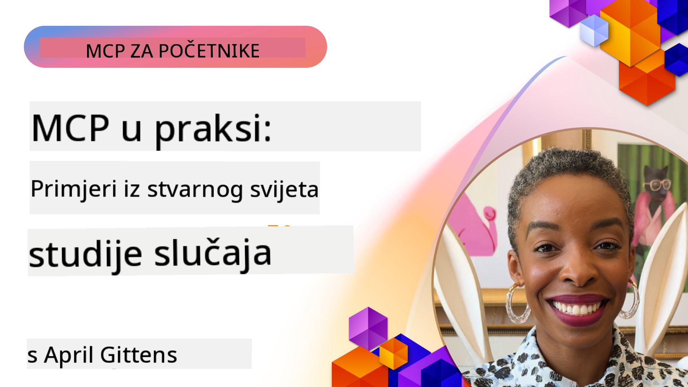

<!--
CO_OP_TRANSLATOR_METADATA:
{
  "original_hash": "1611dc5f6a2a35a789fc4c95fc5bfbe8",
  "translation_date": "2025-09-26T19:14:42+00:00",
  "source_file": "09-CaseStudy/README.md",
  "language_code": "hr"
}
-->
# MCP u praksi: Studije slučaja iz stvarnog svijeta

_(Kliknite na sliku iznad za pregled videa ove lekcije)_

Model Context Protocol (MCP) mijenja način na koji AI aplikacije komuniciraju s podacima, alatima i uslugama. Ovaj odjeljak donosi studije slučaja iz stvarnog svijeta koje prikazuju praktične primjene MCP-a u raznim poslovnim scenarijima.

## Pregled

Ovaj odjeljak prikazuje konkretne primjere implementacije MCP-a, naglašavajući kako organizacije koriste ovaj protokol za rješavanje složenih poslovnih izazova. Analizom ovih studija slučaja steći ćete uvid u svestranost, skalabilnost i praktične prednosti MCP-a u stvarnim situacijama.

## Ključni ciljevi učenja

Kroz ove studije slučaja, naučit ćete:

- Kako primijeniti MCP za rješavanje specifičnih poslovnih problema
- Različite obrasce integracije i arhitektonske pristupe
- Najbolje prakse za implementaciju MCP-a u poslovnim okruženjima
- Izazove i rješenja s kojima su se susrele organizacije u stvarnim implementacijama
- Kako primijeniti slične obrasce u vlastitim projektima

## Istaknute studije slučaja

### 1. [Azure AI Travel Agents – Referentna implementacija](./travelagentsample.md)

Ova studija slučaja analizira Microsoftovo sveobuhvatno referentno rješenje koje pokazuje kako izgraditi AI aplikaciju za planiranje putovanja s više agenata koristeći MCP, Azure OpenAI i Azure AI Search. Projekt uključuje:

- Orkestraciju više agenata putem MCP-a
- Integraciju poslovnih podataka s Azure AI Search
- Sigurnu i skalabilnu arhitekturu temeljenu na Azure uslugama
- Proširive alate s ponovnom upotrebom MCP komponenti
- Konverzacijsko korisničko iskustvo podržano Azure OpenAI-jem

Arhitektura i detalji implementacije pružaju vrijedne uvide u izgradnju složenih sustava s više agenata, gdje MCP služi kao sloj koordinacije.

### 2. [Ažuriranje Azure DevOps stavki pomoću podataka s YouTubea](./UpdateADOItemsFromYT.md)

Ova studija slučaja prikazuje praktičnu primjenu MCP-a za automatizaciju radnih procesa. Pokazuje kako MCP alati mogu:

- Izvući podatke s online platformi (YouTube)
- Ažurirati stavke u sustavima Azure DevOps
- Stvoriti ponovljive automatizirane radne procese
- Integrirati podatke između različitih sustava

Ovaj primjer ilustrira kako čak i relativno jednostavne implementacije MCP-a mogu donijeti značajne uštede vremena automatizacijom rutinskih zadataka i poboljšanjem konzistentnosti podataka.

### 3. [Dohvaćanje dokumentacije u stvarnom vremenu pomoću MCP-a](./docs-mcp/README.md)

Ova studija slučaja vodi vas kroz povezivanje Python konzolnog klijenta s MCP serverom za dohvaćanje i bilježenje kontekstualno svjesne Microsoftove dokumentacije u stvarnom vremenu. Naučit ćete kako:

- Povezati se s MCP serverom koristeći Python klijent i službeni MCP SDK
- Koristiti streaming HTTP klijente za učinkovito dohvaćanje podataka u stvarnom vremenu
- Pozivati alate za dokumentaciju na serveru i bilježiti odgovore izravno u konzolu
- Integrirati ažuriranu Microsoftovu dokumentaciju u svoj radni proces bez napuštanja terminala

Poglavlje uključuje praktični zadatak, minimalni radni uzorak koda i poveznice na dodatne resurse za dublje učenje. Pogledajte cijeli vodič i kod u povezanom poglavlju kako biste razumjeli kako MCP može transformirati pristup dokumentaciji i produktivnost programera u konzolnim okruženjima.

### 4. [Interaktivna web aplikacija za generiranje plana učenja pomoću MCP-a](./docs-mcp/README.md)

Ova studija slučaja prikazuje kako izgraditi interaktivnu web aplikaciju koristeći Chainlit i MCP za generiranje personaliziranih planova učenja za bilo koju temu. Korisnici mogu odabrati predmet (npr. "AI-900 certifikacija") i trajanje učenja (npr. 8 tjedana), a aplikacija će pružiti tjedni raspored preporučenog sadržaja. Chainlit omogućuje konverzacijsko sučelje, čineći iskustvo zanimljivim i prilagodljivim.

- Konverzacijska web aplikacija podržana Chainlitom
- Korisnički definirani upiti za temu i trajanje
- Tjedne preporuke sadržaja koristeći MCP
- Odgovori u stvarnom vremenu u chat sučelju

Projekt ilustrira kako se konverzacijski AI i MCP mogu kombinirati za stvaranje dinamičnih, korisnički vođenih edukativnih alata u modernom web okruženju.

### 5. [Dokumentacija unutar uređivača pomoću MCP servera u VS Codeu](./docs-mcp/README.md)

Ova studija slučaja pokazuje kako možete donijeti Microsoft Learn dokumentaciju izravno u svoje VS Code okruženje koristeći MCP server—bez potrebe za prebacivanjem između kartica preglednika! Naučit ćete kako:

- Trenutno pretraživati i čitati dokumentaciju unutar VS Codea koristeći MCP panel ili naredbenu paletu
- Referencirati dokumentaciju i umetati poveznice izravno u README ili markdown datoteke
- Koristiti GitHub Copilot i MCP zajedno za besprijekorne radne procese dokumentacije i koda
- Validirati i poboljšati dokumentaciju uz povratne informacije u stvarnom vremenu i točnost iz Microsoftovih izvora
- Integrirati MCP s GitHub radnim procesima za kontinuiranu validaciju dokumentacije

Implementacija uključuje:

- Primjer `.vscode/mcp.json` konfiguracije za jednostavno postavljanje
- Vodiče sa snimkama zaslona za iskustvo unutar uređivača
- Savjete za kombiniranje Copilota i MCP-a za maksimalnu produktivnost

Ovaj scenarij je idealan za autore tečajeva, pisce dokumentacije i programere koji žele ostati fokusirani u svom uređivaču dok rade s dokumentacijom, Copilotom i alatima za validaciju—sve to uz podršku MCP-a.

### 6. [Kreiranje MCP servera pomoću APIM-a](./apimsample.md)

Ova studija slučaja pruža korak-po-korak vodič za kreiranje MCP servera koristeći Azure API Management (APIM). Pokriva:

- Postavljanje MCP servera u Azure API Management
- Izlaganje API operacija kao MCP alata
- Konfiguriranje politika za ograničavanje brzine i sigurnost
- Testiranje MCP servera koristeći Visual Studio Code i GitHub Copilot

Ovaj primjer ilustrira kako iskoristiti Azureove mogućnosti za kreiranje robusnog MCP servera koji se može koristiti u raznim aplikacijama, poboljšavajući integraciju AI sustava s poslovnim API-ima.

### 7. [GitHub MCP Registry — Ubrzavanje agentičke integracije](https://github.com/mcp)

Ova studija slučaja analizira kako GitHubov MCP Registry, lansiran u rujnu 2025., rješava ključni izazov u AI ekosustavu: fragmentirano otkrivanje i implementaciju MCP servera.

#### Pregled
**MCP Registry** rješava problem raspršenih MCP servera po različitim repozitorijima i registrima, što je ranije usporavalo i otežavalo integraciju. Ovi serveri omogućuju AI agentima interakciju s vanjskim sustavima poput API-ja, baza podataka i izvora dokumentacije.

#### Izazovi
Razvojni timovi koji grade agentičke radne procese suočavali su se s nekoliko problema:
- **Loša dostupnost** MCP servera na različitim platformama
- **Redundantna pitanja o postavljanju** raspršena po forumima i dokumentaciji
- **Sigurnosni rizici** od neprovjerenih i nepouzdanih izvora
- **Nedostatak standardizacije** u kvaliteti i kompatibilnosti servera

#### Rješenje
GitHubov MCP Registry centralizira pouzdane MCP servere s ključnim značajkama:
- **Jednostavna instalacija** putem VS Codea za brzo postavljanje
- **Sortiranje po relevantnosti** prema zvjezdicama, aktivnosti i validaciji zajednice
- **Izravna integracija** s GitHub Copilotom i drugim MCP-kompatibilnim alatima
- **Otvoreni model doprinosa** koji omogućuje zajednici i poslovnim partnerima da doprinesu

#### Poslovni utjecaj
Registar je donio mjerljiva poboljšanja:
- **Brže uvođenje** za programere koristeći alate poput Microsoft Learn MCP Servera, koji prenosi službenu dokumentaciju izravno u agente
- **Povećana produktivnost** putem specijaliziranih servera poput `github-mcp-server`, omogućujući prirodni jezik za GitHub automatizaciju (kreiranje PR-ova, ponavljanje CI-a, skeniranje koda)
- **Jače povjerenje u ekosustav** kroz kurirane popise i transparentne standarde konfiguracije

#### Strateška vrijednost
Za stručnjake koji se bave upravljanjem životnim ciklusom agenata i reproducibilnim radnim procesima, MCP Registry pruža:
- **Modularnu implementaciju agenata** sa standardiziranim komponentama
- **Evaluacijske procese podržane registrom** za dosljedno testiranje i validaciju
- **Interoperabilnost alata** za besprijekornu integraciju na različitim AI platformama

Ova studija slučaja pokazuje da MCP Registry nije samo direktorij—već temeljna platforma za skalabilnu, stvarnu integraciju modela i implementaciju agentičkih sustava.

## Zaključak

Ovih sedam sveobuhvatnih studija slučaja demonstriraju izvanrednu svestranost i praktične primjene Model Context Protocola u raznim stvarnim scenarijima. Od složenih sustava za planiranje putovanja s više agenata i upravljanja poslovnim API-ima do pojednostavljenih radnih procesa dokumentacije i revolucionarnog GitHub MCP Registryja, ovi primjeri pokazuju kako MCP pruža standardiziran, skalabilan način povezivanja AI sustava s alatima, podacima i uslugama potrebnim za isporuku iznimne vrijednosti.

Studije slučaja pokrivaju više dimenzija implementacije MCP-a:
- **Poslovna integracija**: Automatizacija s Azure API Managementom i Azure DevOpsom
- **Orkestracija više agenata**: Planiranje putovanja s koordiniranim AI agentima
- **Produktivnost programera**: Integracija s VS Codeom i pristup dokumentaciji u stvarnom vremenu
- **Razvoj ekosustava**: GitHub MCP Registry kao temeljna platforma
- **Edukativne aplikacije**: Interaktivni generatori planova učenja i konverzacijska sučelja

Analizom ovih implementacija, steći ćete ključne uvide u:
- **Arhitektonske obrasce** za različite razmjere i slučajeve upotrebe
- **Strategije implementacije** koje balansiraju funkcionalnost i održivost
- **Sigurnosne i skalabilne** aspekte za produkcijska okruženja
- **Najbolje prakse** za razvoj MCP servera i integraciju klijenata
- **Razmišljanje o ekosustavu** za izgradnju međusobno povezanih AI rješenja

Ovi primjeri kolektivno pokazuju da MCP nije samo teorijski okvir, već zreo, spreman za produkciju protokol koji omogućuje praktična rješenja za složene poslovne izazove. Bilo da gradite jednostavne alate za automatizaciju ili sofisticirane sustave s više agenata, obrasci i pristupi prikazani ovdje pružaju čvrstu osnovu za vaše vlastite MCP projekte.

## Dodatni resursi

- [Azure AI Travel Agents GitHub repozitorij](https://github.com/Azure-Samples/azure-ai-travel-agents)
- [Azure DevOps MCP alat](https://github.com/microsoft/azure-devops-mcp)
- [Playwright MCP alat](https://github.com/microsoft/playwright-mcp)
- [Microsoft Docs MCP Server](https://github.com/MicrosoftDocs/mcp)
- [GitHub MCP Registry — Ubrzavanje agentičke integracije](https://github.com/mcp)
- [Primjeri MCP zajednice](https://github.com/microsoft/mcp)

Sljedeće: Praktična radionica [Pojednostavljivanje AI radnih procesa: Izgradnja MCP servera s AI alatima](../10-StreamliningAIWorkflowsBuildingAnMCPServerWithAIToolkit/README.md)

---

