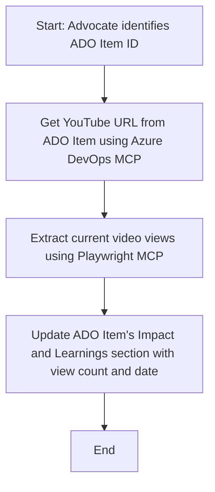

<!--
CO_OP_TRANSLATOR_METADATA:
{
  "original_hash": "14a2dfbea55ef735660a06bd6bdfe5f3",
  "translation_date": "2025-06-13T21:39:18+00:00",
  "source_file": "09-CaseStudy/UpdateADOItemsFromYT.md",
  "language_code": "hr"
}
-->
# Case Study: Ažuriranje Azure DevOps stavki podacima s YouTubea pomoću MCP-a

> **Disclaimer:** Postoje postojeći online alati i izvještaji koji mogu automatizirati proces ažuriranja Azure DevOps stavki podacima s platformi poput YouTubea. Sljedeći scenarij je dan isključivo kao primjer kako se MCP alati mogu koristiti za automatizaciju i integracijske zadatke.

## Pregled

Ova studija slučaja pokazuje jedan primjer kako se Model Context Protocol (MCP) i njegovi alati mogu koristiti za automatizaciju procesa ažuriranja Azure DevOps (ADO) radnih stavki informacijama dobivenim s online platformi, poput YouTubea. Opisani scenarij je samo ilustracija šireg spektra mogućnosti ovih alata, koji se mogu prilagoditi mnogim sličnim potrebama automatizacije.

U ovom primjeru, Advocate prati online sesije koristeći ADO stavke, gdje svaka stavka uključuje URL YouTube videa. Korištenjem MCP alata, Advocate može održavati ADO stavke ažurnima s najnovijim metrikama videozapisa, poput broja pregleda, na ponovljiv i automatiziran način. Ovaj pristup se može generalizirati i za druge slučajeve gdje je potrebno integrirati informacije s online izvora u ADO ili druge sustave.

## Scenarij

Advocate je odgovoran za praćenje utjecaja online sesija i angažmana zajednice. Svaka sesija se bilježi kao ADO radna stavka u projektu 'DevRel', a radna stavka sadrži polje za URL YouTube videa. Kako bi točno izvijestio o dosegu sesije, Advocate mora ažurirati ADO stavku s trenutnim brojem pregleda videa i datumom kada su ti podaci dohvaćeni.

## Korišteni alati

- [Azure DevOps MCP](https://github.com/microsoft/azure-devops-mcp): Omogućuje programski pristup i ažuriranje ADO radnih stavki putem MCP-a.
- [Playwright MCP](https://github.com/microsoft/playwright-mcp): Automatizira radnje u pregledniku za izvlačenje živih podataka s web stranica, poput statistika YouTube videa.

## Korak-po-korak tijek rada

1. **Identificirajte ADO stavku**: Počnite s ID-jem ADO radne stavke (npr. 1234) u projektu 'DevRel'.
2. **Dohvatite YouTube URL**: Koristite Azure DevOps MCP alat za dohvat YouTube URL-a iz radne stavke.
3. **Izvucite broj pregleda videa**: Koristite Playwright MCP alat za navigaciju do YouTube URL-a i dohvat trenutnog broja pregleda.
4. **Ažurirajte ADO stavku**: Upisujte najnoviji broj pregleda i datum dohvaćanja u odjeljak 'Impact and Learnings' radne stavke koristeći Azure DevOps MCP alat.

## Primjer prompta

```bash
- Work with the ADO Item ID: 1234
- The project is '2025-Awesome'
- Get the YouTube URL for the ADO item
- Use Playwright to get the current views from the YouTube video
- Update the ADO item with the current video views and the updated date of the information
```

## Mermaid dijagram toka



## Tehnička implementacija

- **MCP orkestracija**: Tijek rada orkestrira MCP server koji koordinira korištenje Azure DevOps MCP i Playwright MCP alata.
- **Automatizacija**: Proces se može pokrenuti ručno ili zakazati da se izvodi u redovitim intervalima kako bi ADO stavke bile ažurirane.
- **Proširivost**: Isti obrazac se može proširiti za ažuriranje ADO stavki drugim online metrima (npr. lajkovi, komentari) ili s drugih platformi.

## Rezultati i utjecaj

- **Učinkovitost**: Smanjuje ručni rad Advocata automatizacijom dohvaćanja i ažuriranja metrika videa.
- **Točnost**: Osigurava da ADO stavke odražavaju najnovije dostupne podatke s online izvora.
- **Ponovljivost**: Pruža ponovljiv tijek rada za slične scenarije koji uključuju druge izvore podataka ili metrike.

## Reference

- [Azure DevOps MCP](https://github.com/microsoft/azure-devops-mcp)
- [Playwright MCP](https://github.com/microsoft/playwright-mcp)
- [Model Context Protocol (MCP)](https://modelcontextprotocol.io/)

**Odricanje od odgovornosti**:  
Ovaj dokument preveden je pomoću AI usluge za prevođenje [Co-op Translator](https://github.com/Azure/co-op-translator). Iako težimo točnosti, imajte na umu da automatski prijevodi mogu sadržavati pogreške ili netočnosti. Izvorni dokument na izvornom jeziku treba smatrati autoritativnim izvorom. Za važne informacije preporučuje se profesionalni ljudski prijevod. Ne snosimo odgovornost za bilo kakva nesporazume ili kriva tumačenja koja proizlaze iz korištenja ovog prijevoda.