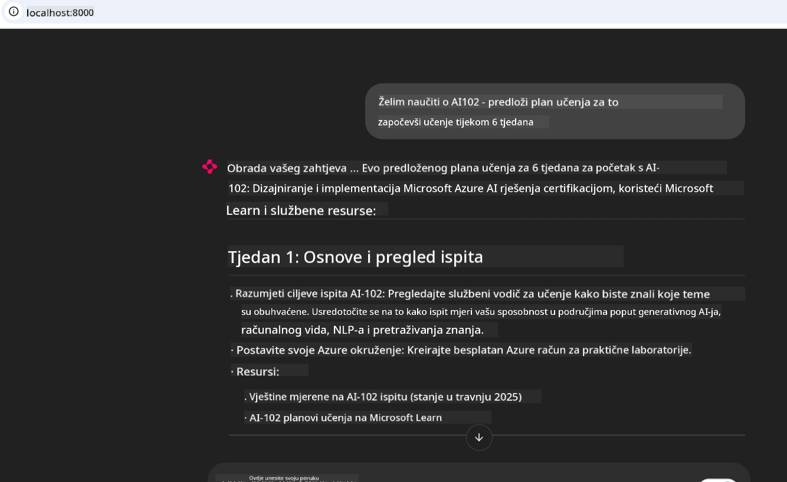

<!--
CO_OP_TRANSLATOR_METADATA:
{
  "original_hash": "4319d291c9d124ecafea52b3d04bfa0e",
  "translation_date": "2025-07-14T06:30:18+00:00",
  "source_file": "09-CaseStudy/docs-mcp/README.md",
  "language_code": "hr"
}
-->
# Case Study: Povezivanje s Microsoft Learn Docs MCP serverom iz klijentske aplikacije

Jeste li se ikada našli kako istovremeno koristite stranice s dokumentacijom, Stack Overflow i bezbroj kartica pretraživača, dok pokušavate riješiti problem u svom kodu? Možda imate drugi monitor samo za dokumentaciju ili stalno prebacujete između IDE-a i preglednika. Zar ne bi bilo bolje da dokumentaciju imate integriranu izravno u svoj radni tijek—u svoje aplikacije, IDE ili čak vlastite prilagođene alate? U ovoj studiji slučaja pokazat ćemo kako to napraviti povezivanjem izravno na Microsoft Learn Docs MCP server iz vlastite klijentske aplikacije.

## Pregled

Moderni razvoj nije samo pisanje koda—radi se o pronalaženju pravih informacija u pravom trenutku. Dokumentacija je svuda, ali rijetko tamo gdje vam je najpotrebnija: unutar vaših alata i radnih procesa. Integriranjem dohvaćanja dokumentacije izravno u vaše aplikacije možete uštedjeti vrijeme, smanjiti prebacivanje konteksta i povećati produktivnost. U ovom dijelu pokazat ćemo vam kako povezati klijenta s Microsoft Learn Docs MCP serverom, kako biste mogli pristupiti dokumentaciji u stvarnom vremenu, prilagođenoj kontekstu, bez napuštanja aplikacije.

Proći ćemo kroz proces uspostavljanja veze, slanja zahtjeva i učinkovitog rukovanja streaming odgovorima. Ovaj pristup ne samo da pojednostavljuje vaš radni tijek, već otvara vrata za izgradnju pametnijih i korisnijih razvojnih alata.

## Ciljevi učenja

Zašto to radimo? Zato što su najbolja iskustva za developere ona koja uklanjaju prepreke. Zamislite svijet u kojem vaš uređivač koda, chatbot ili web aplikacija mogu odmah odgovoriti na vaša pitanja o dokumentaciji, koristeći najnoviji sadržaj s Microsoft Learn. Do kraja ovog poglavlja znat ćete kako:

- Razumjeti osnove komunikacije MCP server-klijent za dokumentaciju
- Implementirati konzolnu ili web aplikaciju za povezivanje s Microsoft Learn Docs MCP serverom
- Koristiti streaming HTTP klijente za dohvaćanje dokumentacije u stvarnom vremenu
- Bilježiti i interpretirati odgovore dokumentacije u svojoj aplikaciji

Vidjet ćete kako vam ove vještine mogu pomoći u izgradnji alata koji nisu samo reaktivni, već i stvarno interaktivni i prilagođeni kontekstu.

## Scenarij 1 - Dohvaćanje dokumentacije u stvarnom vremenu s MCP-om

U ovom scenariju pokazat ćemo vam kako povezati klijenta s Microsoft Learn Docs MCP serverom, kako biste mogli pristupiti dokumentaciji u stvarnom vremenu, prilagođenoj kontekstu, bez napuštanja aplikacije.

Idemo to staviti u praksu. Vaš zadatak je napisati aplikaciju koja se povezuje na Microsoft Learn Docs MCP server, poziva alat `microsoft_docs_search` i bilježi streaming odgovor u konzolu.

### Zašto ovaj pristup?
Zato što je to temelj za izgradnju naprednijih integracija—bilo da želite pokretati chatbota, proširenje za IDE ili web nadzornu ploču.

Kod i upute za ovaj scenarij nalaze se u mapi [`solution`](./solution/README.md) unutar ove studije slučaja. Koraci će vas voditi kroz postavljanje veze:
- Koristite službeni MCP SDK i streaming HTTP klijent za povezivanje
- Pozovite alat `microsoft_docs_search` s parametrom upita za dohvaćanje dokumentacije
- Implementirajte pravilno bilježenje i rukovanje pogreškama
- Kreirajte interaktivno konzolno sučelje koje korisnicima omogućuje unos više upita za pretraživanje

Ovaj scenarij pokazuje kako:
- Povezati se na Docs MCP server
- Poslati upit
- Parsirati i ispisati rezultate

Evo kako bi pokretanje rješenja moglo izgledati:

```
Prompt> What is Azure Key Vault?
Answer> Azure Key Vault is a cloud service for securely storing and accessing secrets. ...
```

Ispod je minimalni primjer rješenja. Cijeli kod i detalji dostupni su u mapi rješenja.

<details>
<summary>Python</summary>

```python
import asyncio
from mcp.client.streamable_http import streamablehttp_client
from mcp import ClientSession

async def main():
    async with streamablehttp_client("https://learn.microsoft.com/api/mcp") as (read_stream, write_stream, _):
        async with ClientSession(read_stream, write_stream) as session:
            await session.initialize()
            result = await session.call_tool("microsoft_docs_search", {"query": "Azure Functions best practices"})
            print(result.content)

if __name__ == "__main__":
    asyncio.run(main())
```

- Za kompletnu implementaciju i bilježenje pogledajte [`scenario1.py`](../../../../09-CaseStudy/docs-mcp/solution/python/scenario1.py).
- Za upute o instalaciji i korištenju pogledajte datoteku [`README.md`](./solution/python/README.md) u istoj mapi.
</details>

## Scenarij 2 - Interaktivna web aplikacija za generiranje plana učenja s MCP-om

U ovom scenariju naučit ćete kako integrirati Docs MCP u web razvojni projekt. Cilj je omogućiti korisnicima pretraživanje Microsoft Learn dokumentacije izravno s web sučelja, čineći dokumentaciju odmah dostupnom unutar vaše aplikacije ili stranice.

Vidjet ćete kako:
- Postaviti web aplikaciju
- Povezati se na Docs MCP server
- Obraditi korisnički unos i prikazati rezultate

Evo kako bi pokretanje rješenja moglo izgledati:

```
User> I want to learn about AI102 - so suggest the roadmap to get it started from learn for 6 weeks

Assistant> Here’s a detailed 6-week roadmap to start your preparation for the AI-102: Designing and Implementing a Microsoft Azure AI Solution certification, using official Microsoft resources and focusing on exam skills areas:

---
## Week 1: Introduction & Fundamentals
- **Understand the Exam**: Review the [AI-102 exam skills outline](https://learn.microsoft.com/en-us/credentials/certifications/exams/ai-102/).
- **Set up Azure**: Sign up for a free Azure account if you don't have one.
- **Learning Path**: [Introduction to Azure AI services](https://learn.microsoft.com/en-us/training/modules/intro-to-azure-ai/)
- **Focus**: Get familiar with Azure portal, AI capabilities, and necessary tools.

....more weeks of the roadmap...

Let me know if you want module-specific recommendations or need more customized weekly tasks!
```

Ispod je minimalni primjer rješenja. Cijeli kod i detalji dostupni su u mapi rješenja.



<details>
<summary>Python (Chainlit)</summary>

Chainlit je okvir za izradu konverzacijskih AI web aplikacija. Omogućuje jednostavno stvaranje interaktivnih chatbotova i asistenata koji mogu pozivati MCP alate i prikazivati rezultate u stvarnom vremenu. Idealan je za brzi prototip i korisnička sučelja.

```python
import chainlit as cl
import requests

MCP_URL = "https://learn.microsoft.com/api/mcp"

@cl.on_message
def handle_message(message):
    query = {"question": message}
    response = requests.post(MCP_URL, json=query)
    if response.ok:
        result = response.json()
        cl.Message(content=result.get("answer", "No answer found.")).send()
    else:
        cl.Message(content="Error: " + response.text).send()
```

- Za kompletnu implementaciju pogledajte [`scenario2.py`](../../../../09-CaseStudy/docs-mcp/solution/python/scenario2.py).
- Za upute o postavljanju i pokretanju pogledajte [`README.md`](./solution/python/README.md).
</details>

## Scenarij 3: Dokumentacija unutar uređivača s MCP serverom u VS Codeu

Ako želite imati Microsoft Learn Docs izravno u VS Codeu (umjesto da stalno mijenjate kartice preglednika), možete koristiti MCP server u svom uređivaču. To vam omogućuje:
- Pretraživanje i čitanje dokumentacije u VS Codeu bez napuštanja okruženja za kodiranje.
- Referenciranje dokumentacije i umetanje poveznica izravno u README ili datoteke tečaja.
- Korištenje GitHub Copilota i MCP-a zajedno za besprijekoran, AI-pokretan radni tijek dokumentacije.

**Vidjet ćete kako:**
- Dodati valjanu `.vscode/mcp.json` datoteku u korijen radnog prostora (pogledajte primjer dolje).
- Otvoriti MCP panel ili koristiti paletu naredbi u VS Codeu za pretraživanje i umetanje dokumenata.
- Referencirati dokumentaciju izravno u markdown datotekama dok radite.
- Kombinirati ovaj radni tijek s GitHub Copilotom za još veću produktivnost.

Evo primjera kako postaviti MCP server u VS Codeu:

```json
{
  "servers": {
    "LearnDocsMCP": {
      "url": "https://learn.microsoft.com/api/mcp"
    }
  }
}
```

</details>

> Za detaljan vodič sa snimkama zaslona i korak-po-korak uputama pogledajte [`README.md`](./solution/scenario3/README.md).


Ovaj pristup je idealan za sve koji izrađuju tehničke tečajeve, pišu dokumentaciju ili razvijaju kod s čestim potrebama za referencama.

## Ključne poruke

Integracija dokumentacije izravno u vaše alate nije samo praktičnost—ona mijenja pravila igre za produktivnost. Povezujući se na Microsoft Learn Docs MCP server iz svog klijenta, možete:

- Eliminirati prebacivanje konteksta između koda i dokumentacije
- Dohvatiti ažuriranu, kontekstualno prilagođenu dokumentaciju u stvarnom vremenu
- Izgraditi pametnije, interaktivnije razvojne alate

Ove vještine pomoći će vam da kreirate rješenja koja nisu samo učinkovita, već i ugodna za korištenje.

## Dodatni resursi

Za dublje razumijevanje istražite ove službene izvore:

- [Microsoft Learn Docs MCP Server (GitHub)](https://github.com/MicrosoftDocs/mcp)
- [Get started with Azure MCP Server (mcp-python)](https://learn.microsoft.com/en-us/azure/developer/azure-mcp-server/get-started#create-the-python-app)
- [What is the Azure MCP Server?](https://learn.microsoft.com/en-us/azure/developer/azure-mcp-server/)
- [Model Context Protocol (MCP) Introduction](https://modelcontextprotocol.io/introduction)
- [Add plugins from a MCP Server (Python)](https://learn.microsoft.com/en-us/semantic-kernel/concepts/plugins/adding-mcp-plugins)

**Odricanje od odgovornosti**:  
Ovaj dokument je preveden korištenjem AI usluge za prevođenje [Co-op Translator](https://github.com/Azure/co-op-translator). Iako nastojimo postići točnost, imajte na umu da automatski prijevodi mogu sadržavati pogreške ili netočnosti. Izvorni dokument na izvornom jeziku treba smatrati autoritativnim izvorom. Za kritične informacije preporučuje se profesionalni ljudski prijevod. Ne snosimo odgovornost za bilo kakve nesporazume ili pogrešna tumačenja koja proizlaze iz korištenja ovog prijevoda.