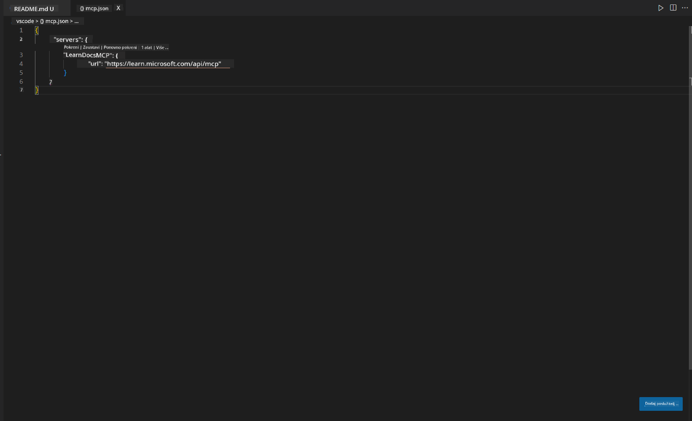
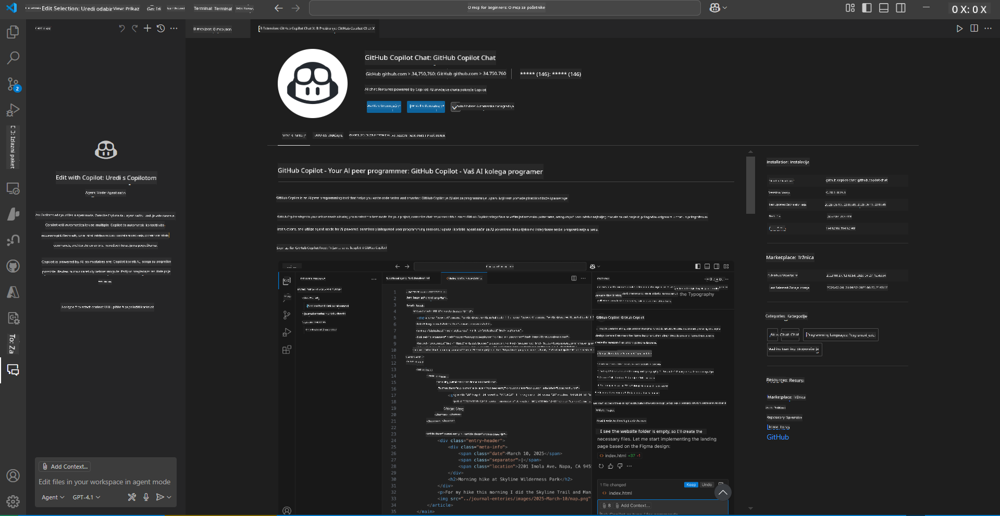
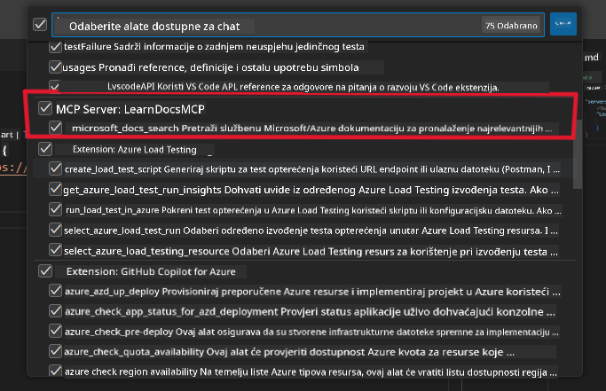
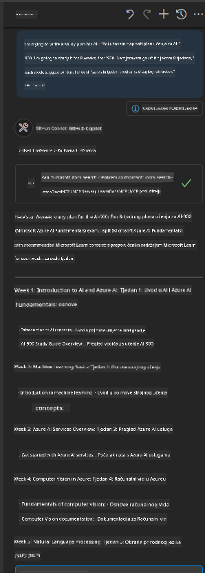
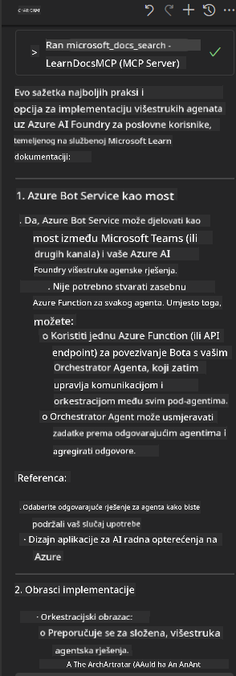

<!--
CO_OP_TRANSLATOR_METADATA:
{
  "original_hash": "db532b1ec386c9ce38c791653dc3c881",
  "translation_date": "2025-07-14T06:56:44+00:00",
  "source_file": "09-CaseStudy/docs-mcp/solution/scenario3/README.md",
  "language_code": "hr"
}
-->
# Scenarij 3: Dokumentacija unutar uređivača s MCP serverom u VS Codeu

## Pregled

U ovom scenariju naučit ćete kako donijeti Microsoft Learn dokumentaciju izravno u vaše Visual Studio Code okruženje koristeći MCP server. Umjesto stalnog prebacivanja između kartica preglednika kako biste tražili dokumentaciju, možete pristupiti, pretraživati i referencirati službenu dokumentaciju izravno unutar uređivača. Ovaj pristup pojednostavljuje vaš radni tijek, pomaže vam da ostanete fokusirani i omogućuje besprijekornu integraciju s alatima poput GitHub Copilota.

- Pretražujte i čitajte dokumentaciju unutar VS Codea bez napuštanja okruženja za kodiranje.
- Referencirajte dokumentaciju i umetnite poveznice izravno u vaše README ili datoteke tečaja.
- Koristite GitHub Copilot i MCP zajedno za besprijekoran radni tijek s AI podrškom za dokumentaciju.

## Ciljevi učenja

Do kraja ovog poglavlja razumjet ćete kako postaviti i koristiti MCP server unutar VS Codea kako biste unaprijedili svoj radni tijek dokumentacije i razvoja. Moći ćete:

- Konfigurirati radni prostor za korištenje MCP servera za pretraživanje dokumentacije.
- Pretraživati i umetati dokumentaciju izravno unutar VS Codea.
- Kombinirati snagu GitHub Copilota i MCP-a za produktivniji radni tijek s AI podrškom.

Ove vještine pomoći će vam da ostanete fokusirani, poboljšate kvalitetu dokumentacije i povećate produktivnost kao programer ili tehnički pisac.

## Rješenje

Da biste omogućili pristup dokumentaciji unutar uređivača, slijedit ćete niz koraka koji integriraju MCP server s VS Codeom i GitHub Copilotom. Ovo rješenje je idealno za autore tečajeva, pisce dokumentacije i programere koji žele ostati fokusirani u uređivaču dok rade s dokumentacijom i Copilotom.

- Brzo dodajte referentne poveznice u README dok pišete dokumentaciju za tečaj ili projekt.
- Koristite Copilot za generiranje koda i MCP za trenutno pronalaženje i citiranje relevantne dokumentacije.
- Ostanite fokusirani u uređivaču i povećajte produktivnost.

### Vodič korak po korak

Za početak, slijedite ove korake. Za svaki korak možete dodati snimku zaslona iz mape assets kako biste vizualno prikazali proces.

1. **Dodajte MCP konfiguraciju:**  
   U korijenu vašeg projekta kreirajte datoteku `.vscode/mcp.json` i dodajte sljedeću konfiguraciju:  
   ```json
   {
     "servers": {
       "LearnDocsMCP": {
         "url": "https://learn.microsoft.com/api/mcp"
       }
     }
   }
   ```  
   Ova konfiguracija govori VS Codeu kako se povezati s [`Microsoft Learn Docs MCP serverom`](https://github.com/MicrosoftDocs/mcp).
   
   
    
2. **Otvorite GitHub Copilot Chat panel:**  
   Ako još nemate instaliran GitHub Copilot dodatak, otvorite pregled dodataka u VS Codeu i instalirajte ga. Možete ga preuzeti izravno s [Visual Studio Code Marketplacea](https://marketplace.visualstudio.com/items?itemName=GitHub.copilot-chat). Zatim otvorite Copilot Chat panel sa bočne trake.

   

3. **Omogućite agent mode i provjerite alate:**  
   U Copilot Chat panelu omogućite agent mode.

   

   Nakon što omogućite agent mode, provjerite je li MCP server naveden kao jedan od dostupnih alata. To osigurava da Copilot agent može pristupiti dokumentacijskom serveru i dohvatiti relevantne informacije.
   
   

4. **Pokrenite novi chat i postavite upit agentu:**  
   Otvorite novi chat u Copilot Chat panelu. Sada možete postavljati agentu pitanja vezana uz dokumentaciju. Agent će koristiti MCP server za dohvat i prikaz relevantne Microsoft Learn dokumentacije izravno u vašem uređivaču.

   - *"Pokušavam napisati plan učenja za temu X. Planiram učiti 8 tjedana, za svaki tjedan predloži sadržaj koji bih trebao obraditi."*

   

5. **Live upiti:**

   > Pogledajmo jedan stvarni upit iz [#get-help](https://discord.gg/D6cRhjHWSC) sekcije na Azure AI Foundry Discordu ([pogledaj originalnu poruku](https://discord.com/channels/1113626258182504448/1385498306720829572)):
   
   *"Tražim odgovore o tome kako implementirati multi-agent rješenje s AI agentima razvijenim na Azure AI Foundry. Vidim da ne postoji direktna metoda implementacije, poput Copilot Studio kanala. Koji su različiti načini za implementaciju za enterprise korisnike da mogu surađivati i obaviti posao?  
Postoji mnogo članaka/blogova koji tvrde da možemo koristiti Azure Bot servis kao most između MS Teams i Azure AI Foundry agenata, hoće li to funkcionirati ako postavim Azure bota koji se povezuje s Orchestrator Agentom na Azure AI Foundry putem Azure funkcije za orkestraciju ili trebam kreirati Azure funkciju za svakog AI agenta u multi-agent rješenju da bi orkestracija bila na Bot frameworku? Svaki drugi prijedlog je dobrodošao."*

   

   Agent će odgovoriti s relevantnim poveznicama na dokumentaciju i sažecima koje zatim možete izravno umetnuti u svoje markdown datoteke ili koristiti kao reference u kodu.

### Primjeri upita

Evo nekoliko primjera upita koje možete isprobati. Ovi upiti pokazuju kako MCP server i Copilot mogu zajedno pružiti trenutnu, kontekstualno prilagođenu dokumentaciju i reference bez napuštanja VS Codea:

- "Pokaži mi kako koristiti Azure Functions okidače."
- "Umetni poveznicu na službenu dokumentaciju za Azure Key Vault."
- "Koje su najbolje prakse za osiguranje Azure resursa?"
- "Pronađi quickstart za Azure AI usluge."

Ovi upiti demonstriraju kako MCP server i Copilot mogu zajedno pružiti trenutnu, kontekstualno prilagođenu dokumentaciju i reference bez napuštanja VS Codea.

---

**Odricanje od odgovornosti**:  
Ovaj dokument preveden je korištenjem AI usluge za prevođenje [Co-op Translator](https://github.com/Azure/co-op-translator). Iako težimo točnosti, imajte na umu da automatski prijevodi mogu sadržavati pogreške ili netočnosti. Izvorni dokument na izvornom jeziku treba smatrati službenim i autoritativnim izvorom. Za važne informacije preporučuje se profesionalni ljudski prijevod. Ne snosimo odgovornost za bilo kakva nesporazuma ili pogrešna tumačenja koja proizlaze iz korištenja ovog prijevoda.