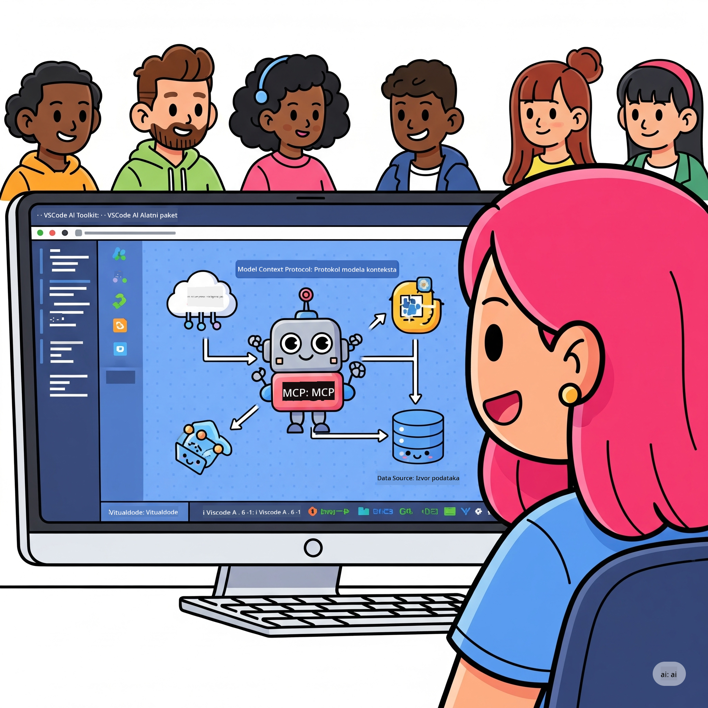
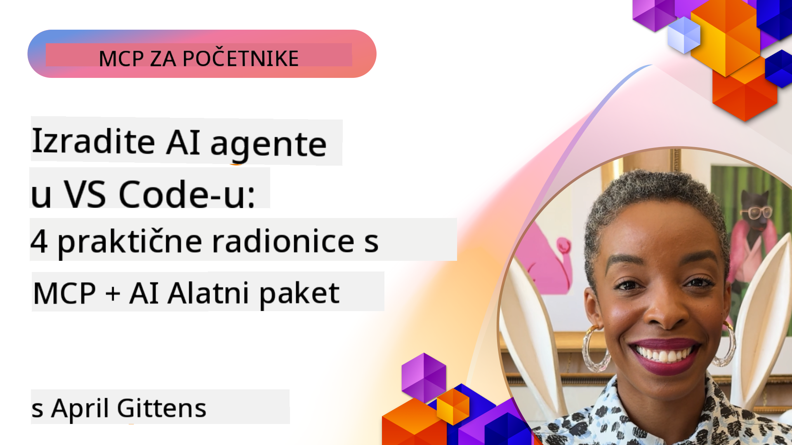

<!--
CO_OP_TRANSLATOR_METADATA:
{
  "original_hash": "1b000fd6e1b04c047578bfc5d07d54eb",
  "translation_date": "2025-08-19T18:01:03+00:00",
  "source_file": "10-StreamliningAIWorkflowsBuildingAnMCPServerWithAIToolkit/README.md",
  "language_code": "hr"
}
-->
# Optimizacija AI Radnih Tokova: Izgradnja MCP Servera s AI Toolkitom

## 🎯 Pregled

_(Kliknite na sliku iznad za pregled videa ove lekcije)_

Dobrodošli na **Model Context Protocol (MCP) Radionicu**! Ova sveobuhvatna praktična radionica kombinira dvije napredne tehnologije kako bi revolucionirala razvoj AI aplikacija:

- **🔗 Model Context Protocol (MCP)**: Otvoreni standard za besprijekornu integraciju AI alata
- **🛠️ AI Toolkit za Visual Studio Code (AITK)**: Microsoftov moćni dodatak za razvoj AI-a

### 🎓 Što ćete naučiti

Do kraja ove radionice, savladat ćete umjetnost izgradnje inteligentnih aplikacija koje povezuju AI modele s alatima i uslugama iz stvarnog svijeta. Od automatiziranog testiranja do prilagođenih API integracija, steći ćete praktične vještine za rješavanje složenih poslovnih izazova.

## 🏗️ Tehnološki Stack

### 🔌 Model Context Protocol (MCP)

MCP je **"USB-C za AI"** - univerzalni standard koji povezuje AI modele s vanjskim alatima i izvorima podataka.

**✨ Ključne Značajke:**

- 🔄 **Standardizirana Integracija**: Univerzalno sučelje za povezivanje AI alata
- 🏛️ **Fleksibilna Arhitektura**: Lokalni i udaljeni serveri putem stdio/SSE transporta
- 🧰 **Bogati Ekosustav**: Alati, upiti i resursi u jednom protokolu
- 🔒 **Spremno za Poduzeća**: Ugrađena sigurnost i pouzdanost

**🎯 Zašto MCP Važno:**
Baš kao što je USB-C eliminirao kaos s kablovima, MCP eliminira složenost AI integracija. Jedan protokol, beskrajne mogućnosti.

### 🤖 AI Toolkit za Visual Studio Code (AITK)

Microsoftov vodeći dodatak za razvoj AI-a koji pretvara VS Code u AI platformu.

**🚀 Osnovne Mogućnosti:**

- 📦 **Katalog Modela**: Pristup modelima iz Azure AI, GitHub-a, Hugging Face-a, Ollama
- ⚡ **Lokalna Inferencija**: ONNX-optimizirano izvođenje na CPU/GPU/NPU
- 🏗️ **Agent Builder**: Vizualni razvoj AI agenata s MCP integracijom
- 🎭 **Multi-modalno**: Podrška za tekst, viziju i strukturirani izlaz

**💡 Prednosti Razvoja:**

- Implementacija modela bez konfiguracije
- Vizualno oblikovanje upita
- Testiranje u stvarnom vremenu
- Besprijekorna integracija MCP servera

## 📚 Put Učenja

### [🚀 Modul 1: Osnove AI Toolkita](./lab1/README.md)

**Trajanje**: 15 minuta

- 🛠️ Instalirajte i konfigurirajte AI Toolkit za VS Code
- 🗂️ Istražite Katalog Modela (100+ modela s GitHub-a, ONNX-a, OpenAI-a, Anthropica, Google-a)
- 🎮 Savladajte Interaktivno Igralište za testiranje modela u stvarnom vremenu
- 🤖 Izgradite svog prvog AI agenta s Agent Builderom
- 📊 Procijenite performanse modela s ugrađenim metrikama (F1, relevantnost, sličnost, koherentnost)
- ⚡ Naučite mogućnosti obrade u serijama i podršku za multi-modalne funkcije

**🎯 Ishod Učenja**: Kreirajte funkcionalnog AI agenta uz sveobuhvatno razumijevanje mogućnosti AITK-a

### [🌐 Modul 2: Osnove MCP-a s AI Toolkitom](./lab2/README.md)

**Trajanje**: 20 minuta

- 🧠 Savladajte arhitekturu i koncepte Model Context Protocol-a (MCP)
- 🌐 Istražite Microsoftov ekosustav MCP servera
- 🤖 Izgradite agenta za automatizaciju preglednika koristeći Playwright MCP server
- 🔧 Integrirajte MCP servere s AI Toolkit Agent Builderom
- 📊 Konfigurirajte i testirajte MCP alate unutar svojih agenata
- 🚀 Izvezite i implementirajte agente s MCP-om za produkcijsku upotrebu

**🎯 Ishod Učenja**: Implementirajte AI agenta pojačanog vanjskim alatima putem MCP-a

### [🔧 Modul 3: Napredni Razvoj MCP-a s AI Toolkitom](./lab3/README.md)

**Trajanje**: 20 minuta

- 💻 Kreirajte prilagođene MCP servere koristeći AI Toolkit
- 🐍 Konfigurirajte i koristite najnoviji MCP Python SDK (v1.9.3)
- 🔍 Postavite i koristite MCP Inspector za otklanjanje grešaka
- 🛠️ Izgradite Weather MCP Server s profesionalnim radnim tokovima za otklanjanje grešaka
- 🧪 Otklonite greške MCP servera u Agent Builderu i Inspector okruženjima

**🎯 Ishod Učenja**: Razvijte i otklonite greške prilagođenih MCP servera koristeći moderni alat

### [🐙 Modul 4: Praktični Razvoj MCP-a - Prilagođeni GitHub Clone Server](./lab4/README.md)

**Trajanje**: 30 minuta

- 🏗️ Izgradite stvarni GitHub Clone MCP Server za razvojne radne tokove
- 🔄 Implementirajte pametno kloniranje repozitorija s validacijom i rukovanjem greškama
- 📁 Kreirajte inteligentno upravljanje direktorijima i integraciju s VS Code-om
- 🤖 Koristite GitHub Copilot Agent Mode s prilagođenim MCP alatima
- 🛡️ Primijenite pouzdanost spremnu za produkciju i kompatibilnost na više platformi

**🎯 Ishod Učenja**: Implementirajte MCP server spreman za produkciju koji optimizira stvarne radne tokove razvoja

## 💡 Primjene u Stvarnom Svijetu i Utjecaj

### 🏢 Primjeri iz Poduzeća

#### 🔄 Automatizacija DevOps-a

Transformirajte svoj razvojni radni tok s inteligentnom automatizacijom:

- **Pametno Upravljanje Repozitorijima**: AI-pokretana revizija koda i odluke o spajanju
- **Inteligentni CI/CD**: Automatizirana optimizacija pipeline-a na temelju promjena u kodu
- **Razvrstavanje Problema**: Automatska klasifikacija i dodjela bugova

#### 🧪 Revolucija Osiguranja Kvalitete

Poboljšajte testiranje uz AI-pokretanu automatizaciju:

- **Pametno Generiranje Testova**: Automatsko kreiranje sveobuhvatnih testnih paketa
- **Vizualno Testiranje Regresije**: AI-pokretano otkrivanje promjena u UI-u
- **Praćenje Performansi**: Proaktivna identifikacija i rješavanje problema

#### 📊 Inteligencija Podatkovnih Tokova

Izgradite pametnije radne tokove obrade podataka:

- **Adaptivni ETL Procesi**: Samooptimizirajuće transformacije podataka
- **Otkrivanje Anomalija**: Praćenje kvalitete podataka u stvarnom vremenu
- **Pametno Usmjeravanje**: Inteligentno upravljanje protokom podataka

#### 🎧 Poboljšanje Iskustva Kupaca

Stvorite izvanredne interakcije s kupcima:

- **Podrška Svjesna Konteksta**: AI agenti s pristupom povijesti kupaca
- **Proaktivno Rješavanje Problema**: Prediktivna korisnička podrška
- **Integracija Više Kanala**: Jedinstveno AI iskustvo na svim platformama

## 🛠️ Preduvjeti i Postavljanje

### 💻 Sistemski Zahtjevi

| Komponenta | Zahtjev | Napomene |
|------------|---------|----------|
| **Operativni Sustav** | Windows 10+, macOS 10.15+, Linux | Bilo koji moderni OS |
| **Visual Studio Code** | Najnovija stabilna verzija | Potrebno za AITK |
| **Node.js** | v18.0+ i npm | Za razvoj MCP servera |
| **Python** | 3.10+ | Opcionalno za Python MCP servere |
| **Memorija** | Minimalno 8GB RAM-a | Preporučeno 16GB za lokalne modele |

### 🔧 Razvojno Okruženje

#### Preporučeni Dodaci za VS Code

- **AI Toolkit** (ms-windows-ai-studio.windows-ai-studio)
- **Python** (ms-python.python)
- **Python Debugger** (ms-python.debugpy)
- **GitHub Copilot** (GitHub.copilot) - Opcionalno, ali korisno

#### Opcionalni Alati

- **uv**: Moderni Python upravitelj paketa
- **MCP Inspector**: Vizualni alat za otklanjanje grešaka MCP servera
- **Playwright**: Za primjere web automatizacije

## 🎖️ Ishodi Učenja i Certifikacijski Put

### 🏆 Popis Vještina

Završetkom ove radionice, postići ćete stručnost u:

#### 🎯 Osnovne Kompetencije

- [ ] **Majstorstvo MCP Protokola**: Duboko razumijevanje arhitekture i obrazaca implementacije
- [ ] **AITK Stručnost**: Ekspertna razina korištenja AI Toolkita za brzi razvoj
- [ ] **Razvoj Prilagođenih Servera**: Izgradnja, implementacija i održavanje produkcijskih MCP servera
- [ ] **Izvrsna Integracija Alata**: Besprijekorno povezivanje AI-a s postojećim radnim tokovima razvoja
- [ ] **Primjena Rješavanja Problema**: Primjena naučenih vještina na stvarne poslovne izazove

#### 🔧 Tehničke Vještine

- [ ] Postavljanje i konfiguracija AI Toolkita u VS Code-u
- [ ] Dizajn i implementacija prilagođenih MCP servera
- [ ] Integracija GitHub modela s MCP arhitekturom
- [ ] Izgradnja automatiziranih testnih radnih tokova s Playwrightom
- [ ] Implementacija AI agenata za produkcijsku upotrebu
- [ ] Otklanjanje grešaka i optimizacija performansi MCP servera

#### 🚀 Napredne Sposobnosti

- [ ] Arhitektura AI integracija na razini poduzeća
- [ ] Implementacija sigurnosnih najboljih praksi za AI aplikacije
- [ ] Dizajn skalabilnih MCP server arhitektura
- [ ] Kreiranje prilagođenih lanaca alata za specifične domene
- [ ] Mentoriranje drugih u razvoju AI aplikacija

## 📖 Dodatni Resursi

- [MCP Specifikacija](https://modelcontextprotocol.io/docs)
- [AI Toolkit GitHub Repozitorij](https://github.com/microsoft/vscode-ai-toolkit)
- [Kolekcija Primjera MCP Servera](https://github.com/modelcontextprotocol/servers)
- [Vodič za Najbolje Prakse](https://modelcontextprotocol.io/docs/best-practices)

---

**🚀 Spremni za revoluciju u razvoju AI radnih tokova?**

Izgradimo budućnost inteligentnih aplikacija zajedno s MCP-om i AI Toolkitom!

**Odricanje od odgovornosti**:  
Ovaj dokument je preveden korištenjem AI usluge za prevođenje [Co-op Translator](https://github.com/Azure/co-op-translator). Iako nastojimo osigurati točnost, imajte na umu da automatski prijevodi mogu sadržavati pogreške ili netočnosti. Izvorni dokument na izvornom jeziku treba smatrati mjerodavnim izvorom. Za ključne informacije preporučuje se profesionalni prijevod od strane stručnjaka. Ne preuzimamo odgovornost za bilo kakve nesporazume ili pogrešne interpretacije proizašle iz korištenja ovog prijevoda.