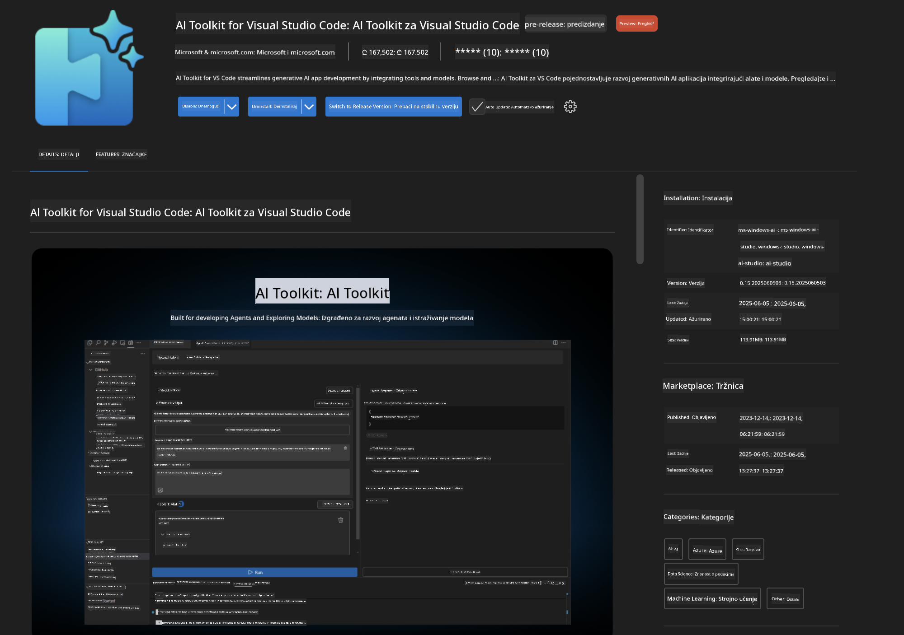
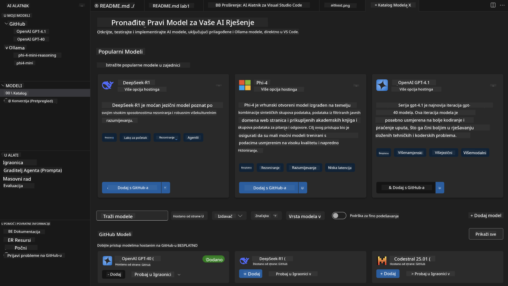
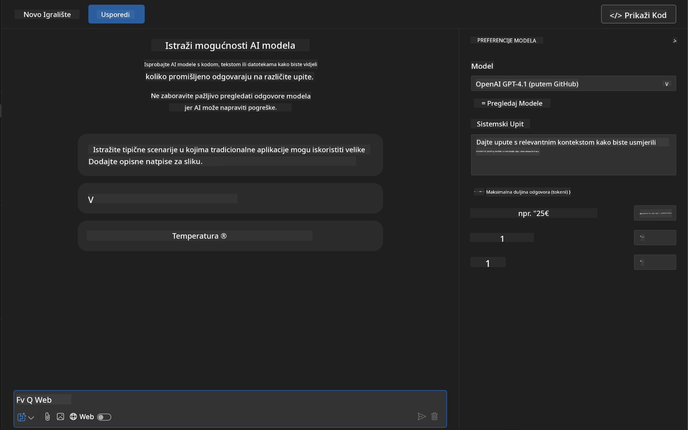
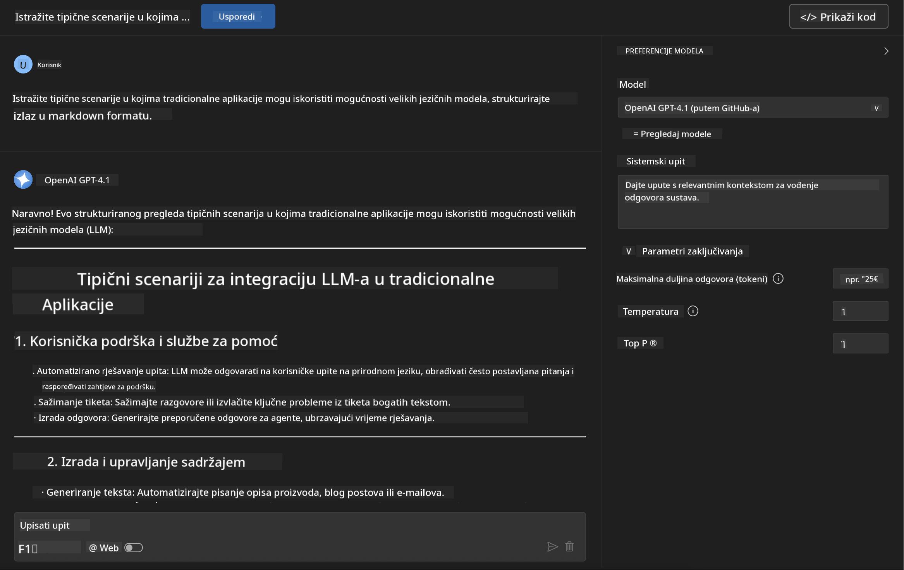
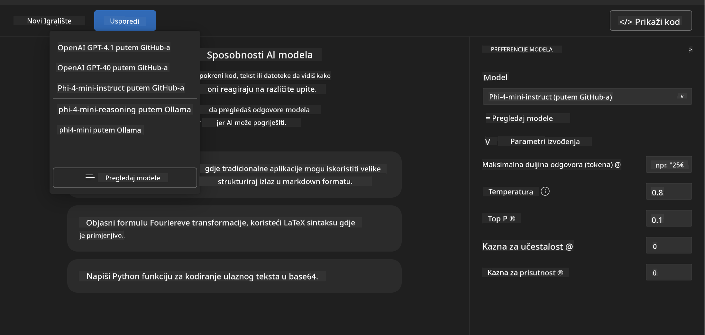
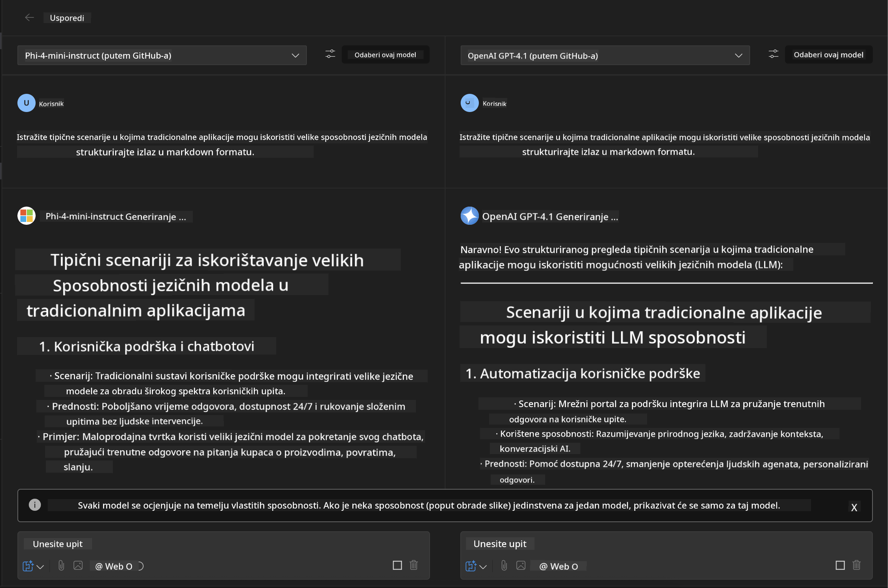
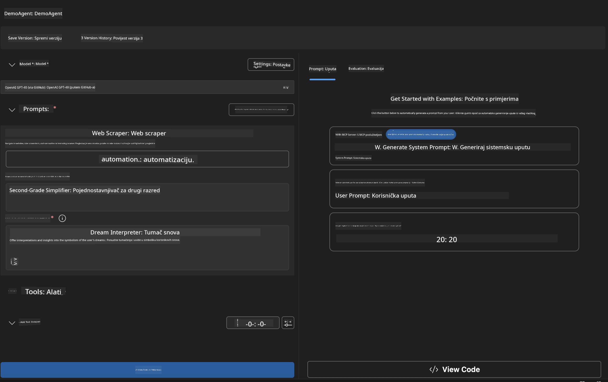
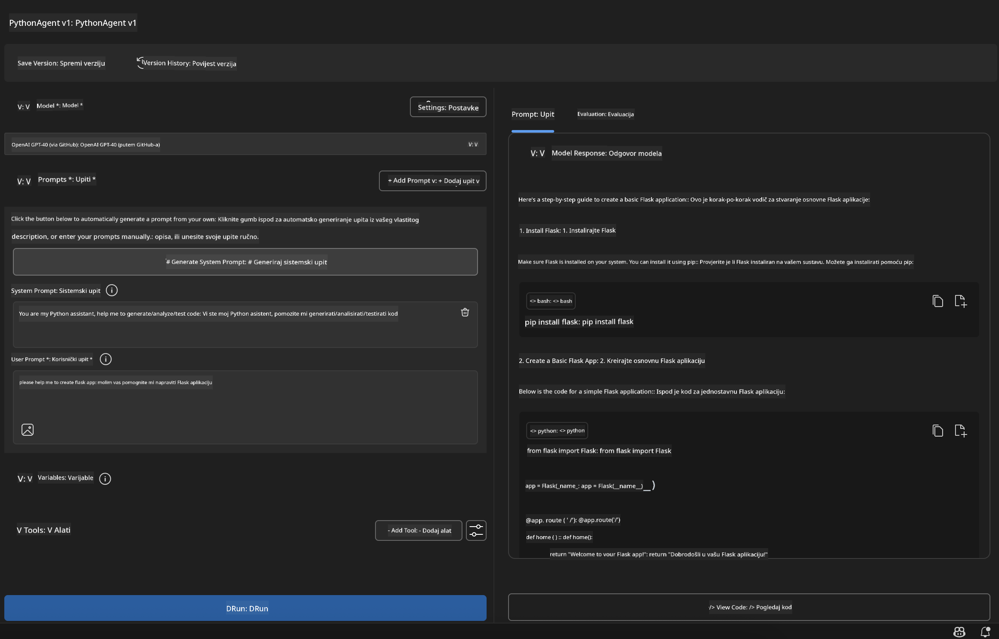

<!--
CO_OP_TRANSLATOR_METADATA:
{
  "original_hash": "2aa9dbc165e104764fa57e8a0d3f1c73",
  "translation_date": "2025-07-14T07:35:56+00:00",
  "source_file": "10-StreamliningAIWorkflowsBuildingAnMCPServerWithAIToolkit/lab1/README.md",
  "language_code": "hr"
}
-->
# 🚀 Modul 1: Osnove AI Toolkita

[]()
[]()
[]()

## 📋 Ciljevi učenja

Na kraju ovog modula moći ćete:
- ✅ Instalirati i konfigurirati AI Toolkit za Visual Studio Code
- ✅ Kretati se kroz Model Catalog i razumjeti različite izvore modela
- ✅ Koristiti Playground za testiranje i eksperimentiranje s modelima
- ✅ Kreirati prilagođene AI agente pomoću Agent Buildera
- ✅ Uspoređivati performanse modela različitih pružatelja usluga
- ✅ Primijeniti najbolje prakse za prompt engineering

## 🧠 Uvod u AI Toolkit (AITK)

**AI Toolkit za Visual Studio Code** je vodeći Microsoftov dodatak koji pretvara VS Code u sveobuhvatno razvojno okruženje za AI. Povezuje AI istraživanja s praktičnim razvojem aplikacija, čineći generativnu AI dostupnom programerima svih razina iskustva.

### 🌟 Ključne mogućnosti

| Značajka | Opis | Primjena |
|---------|-------------|----------|
| **🗂️ Model Catalog** | Pristup preko 100 modela s GitHub-a, ONNX-a, OpenAI-a, Anthropic-a, Google-a | Otkrivanje i odabir modela |
| **🔌 BYOM podrška** | Integrirajte vlastite modele (lokalne/udaljene) | Prilagođeno postavljanje modela |
| **🎮 Interaktivni Playground** | Testiranje modela u stvarnom vremenu s chat sučeljem | Brzi prototipovi i testiranje |
| **📎 Podrška za više modaliteta** | Rukovanje tekstom, slikama i privicima | Složene AI aplikacije |
| **⚡ Obrada u serijama** | Pokretanje više promptova istovremeno | Efikasni testni procesi |
| **📊 Evaluacija modela** | Ugrađene metrike (F1, relevantnost, sličnost, koherentnost) | Procjena performansi |

### 🎯 Zašto je AI Toolkit važan

- **🚀 Brži razvoj**: Od ideje do prototipa za nekoliko minuta
- **🔄 Jedinstveni tijek rada**: Jedno sučelje za više AI pružatelja
- **🧪 Jednostavno eksperimentiranje**: Usporedba modela bez složenih postavki
- **📈 Spreman za produkciju**: Glatki prijelaz od prototipa do implementacije

## 🛠️ Preduvjeti i postavljanje

### 📦 Instalacija AI Toolkit ekstenzije

**Korak 1: Otvorite Marketplace za ekstenzije**
1. Pokrenite Visual Studio Code
2. Otvorite prikaz ekstenzija (`Ctrl+Shift+X` ili `Cmd+Shift+X`)
3. Potražite "AI Toolkit"

**Korak 2: Odaberite verziju**
- **🟢 Release**: Preporučeno za produkcijsku upotrebu
- **🔶 Pre-release**: Rani pristup najnovijim značajkama

**Korak 3: Instalirajte i aktivirajte**



### ✅ Provjera instalacije
- [ ] Ikona AI Toolkita pojavljuje se u bočnoj traci VS Code-a
- [ ] Ekstenzija je omogućena i aktivirana
- [ ] Nema grešaka pri instalaciji u izlaznom panelu

## 🧪 Praktični zadatak 1: Istraživanje GitHub modela

**🎯 Cilj**: Savladati Model Catalog i testirati svoj prvi AI model

### 📊 Korak 1: Kretanje kroz Model Catalog

Model Catalog je vaš ulaz u AI ekosustav. Okuplja modele od različitih pružatelja, olakšavajući pronalazak i usporedbu opcija.

**🔍 Vodič za navigaciju:**

Kliknite na **MODELS - Catalog** u AI Toolkit bočnoj traci



**💡 Koristan savjet**: Potražite modele s određenim sposobnostima koje odgovaraju vašim potrebama (npr. generiranje koda, kreativno pisanje, analiza).

**⚠️ Napomena**: Modeli hostani na GitHub-u (GitHub Models) su besplatni za korištenje, ali imaju ograničenja u broju zahtjeva i tokena. Za pristup modelima izvan GitHub-a (npr. modeli hostani putem Azure AI ili drugih krajnjih točaka) potrebno je unijeti odgovarajući API ključ ili autentifikaciju.

### 🚀 Korak 2: Dodavanje i konfiguracija prvog modela

**Strategija odabira modela:**
- **GPT-4.1**: Najbolji za složeno rezoniranje i analizu
- **Phi-4-mini**: Lagani, brzi odgovori za jednostavne zadatke

**🔧 Proces konfiguracije:**
1. Odaberite **OpenAI GPT-4.1** iz kataloga
2. Kliknite **Add to My Models** - time registrirate model za korištenje
3. Odaberite **Try in Playground** za pokretanje testnog okruženja
4. Pričekajte inicijalizaciju modela (prvo pokretanje može potrajati)



**⚙️ Razumijevanje parametara modela:**
- **Temperature**: Kontrolira kreativnost (0 = deterministički, 1 = kreativan)
- **Max Tokens**: Maksimalna duljina odgovora
- **Top-p**: Nucleus sampling za raznolikost odgovora

### 🎯 Korak 3: Savladajte sučelje Playgounda

Playground je vaš laboratorij za AI eksperimentiranje. Evo kako maksimalno iskoristiti njegove mogućnosti:

**🎨 Najbolje prakse za prompt engineering:**
1. **Budite precizni**: Jasne i detaljne upute daju bolje rezultate
2. **Dajte kontekst**: Uključite relevantne informacije u pozadini
3. **Koristite primjere**: Pokažite modelu što želite kroz primjere
4. **Iterirajte**: Usavršavajte promptove na temelju prvih rezultata

**🧪 Scenariji testiranja:**
```markdown
# Example 1: Code Generation
"Write a Python function that calculates the factorial of a number using recursion. Include error handling and docstrings."

# Example 2: Creative Writing
"Write a professional email to a client explaining a project delay, maintaining a positive tone while being transparent about challenges."

# Example 3: Data Analysis
"Analyze this sales data and provide insights: [paste your data]. Focus on trends, anomalies, and actionable recommendations."
```



### 🏆 Izazov: Usporedba performansi modela

**🎯 Cilj**: Usporediti različite modele koristeći iste promptove kako biste razumjeli njihove prednosti

**📋 Upute:**
1. Dodajte **Phi-4-mini** u svoj radni prostor
2. Koristite isti prompt za GPT-4.1 i Phi-4-mini



3. Usporedite kvalitetu odgovora, brzinu i točnost
4. Zabilježite svoja zapažanja u odjeljku s rezultatima



**💡 Ključni uvidi za otkriti:**
- Kada koristiti LLM naspram SLM
- Odnos troškova i performansi
- Specijalizirane mogućnosti različitih modela

## 🤖 Praktični zadatak 2: Izrada prilagođenih agenata s Agent Builderom

**🎯 Cilj**: Kreirati specijalizirane AI agente prilagođene određenim zadacima i tijekovima rada

### 🏗️ Korak 1: Upoznavanje s Agent Builderom

Agent Builder je mjesto gdje AI Toolkit zaista dolazi do izražaja. Omogućuje vam stvaranje AI asistenata s namjenom koji kombiniraju snagu velikih jezičnih modela s prilagođenim uputama, specifičnim parametrima i specijaliziranim znanjem.

**🧠 Komponente arhitekture agenta:**
- **Core Model**: Temeljni LLM (GPT-4, Groks, Phi itd.)
- **System Prompt**: Definira osobnost i ponašanje agenta
- **Parametri**: Fino podešene postavke za optimalne performanse
- **Integracija alata**: Povezivanje s vanjskim API-jima i MCP servisima
- **Memorija**: Kontekst razgovora i trajanje sesije



### ⚙️ Korak 2: Detaljna konfiguracija agenta

**🎨 Kreiranje učinkovitih system promptova:**
```markdown
# Template Structure:
## Role Definition
You are a [specific role] with expertise in [domain].

## Capabilities
- List specific abilities
- Define scope of knowledge
- Clarify limitations

## Behavior Guidelines
- Response style (formal, casual, technical)
- Output format preferences
- Error handling approach

## Examples
Provide 2-3 examples of ideal interactions
```

*Naravno, možete koristiti i Generate System Prompt kako bi vam AI pomogao u generiranju i optimizaciji promptova*

**🔧 Optimizacija parametara:**
| Parametar | Preporučeni raspon | Primjena |
|-----------|--------------------|----------|
| **Temperature** | 0.1-0.3 | Tehnički/faktički odgovori |
| **Temperature** | 0.7-0.9 | Kreativni/zadatci za brainstorming |
| **Max Tokens** | 500-1000 | Sažeti odgovori |
| **Max Tokens** | 2000-4000 | Detaljna objašnjenja |

### 🐍 Korak 3: Praktični zadatak - Python programerski agent

**🎯 Misija**: Kreirati specijaliziranog asistenta za Python kodiranje

**📋 Koraci konfiguracije:**

1. **Odabir modela**: Izaberite **Claude 3.5 Sonnet** (izvrsno za kod)

2. **Dizajn system prompta**:
```markdown
# Python Programming Expert Agent

## Role
You are a senior Python developer with 10+ years of experience. You excel at writing clean, efficient, and well-documented Python code.

## Capabilities
- Write production-ready Python code
- Debug complex issues
- Explain code concepts clearly
- Suggest best practices and optimizations
- Provide complete working examples

## Response Format
- Always include docstrings
- Add inline comments for complex logic
- Suggest testing approaches
- Mention relevant libraries when applicable

## Code Quality Standards
- Follow PEP 8 style guidelines
- Use type hints where appropriate
- Handle exceptions gracefully
- Write readable, maintainable code
```

3. **Konfiguracija parametara**:
   - Temperature: 0.2 (za konzistentan i pouzdan kod)
   - Max Tokens: 2000 (detaljna objašnjenja)
   - Top-p: 0.9 (uravnotežena kreativnost)



### 🧪 Korak 4: Testiranje vašeg Python agenta

**Scenariji testiranja:**
1. **Osnovna funkcija**: "Napravi funkciju za pronalazak prostih brojeva"
2. **Složen algoritam**: "Implementiraj binarno stablo pretraživanja s metodama za umetanje, brisanje i pretraživanje"
3. **Problem iz stvarnog svijeta**: "Napravi web scraper koji upravlja ograničenjem brzine i ponovnim pokušajima"
4. **Debugging**: "Ispravi ovaj kod [zalijepi neispravan kod]"

**🏆 Kriteriji uspjeha:**
- ✅ Kod se izvršava bez grešaka
- ✅ Sadrži odgovarajuću dokumentaciju
- ✅ Pridržava se najboljih praksi za Python
- ✅ Pruža jasna objašnjenja
- ✅ Predlaže poboljšanja

## 🎓 Završetak Modula 1 i sljedeći koraci

### 📊 Provjera znanja

Testirajte svoje razumijevanje:
- [ ] Možete li objasniti razlike između modela u katalogu?
- [ ] Jeste li uspješno kreirali i testirali prilagođenog agenta?
- [ ] Razumijete li kako optimizirati parametre za različite primjene?
- [ ] Možete li dizajnirati učinkovite system promptove?

### 📚 Dodatni resursi

- **Dokumentacija AI Toolkita**: [Službeni Microsoft Docs](https://github.com/microsoft/vscode-ai-toolkit)
- **Vodič za prompt engineering**: [Najbolje prakse](https://platform.openai.com/docs/guides/prompt-engineering)
- **Modeli u AI Toolkitu**: [Modeli u razvoju](https://github.com/microsoft/vscode-ai-toolkit/blob/main/doc/models.md)

**🎉 Čestitamo!** Savladali ste osnove AI Toolkita i spremni ste za izradu naprednijih AI aplikacija!

### 🔜 Nastavite na sljedeći modul

Spremni za naprednije mogućnosti? Nastavite na **[Modul 2: MCP s osnovama AI Toolkita](../lab2/README.md)** gdje ćete naučiti kako:
- Povezati svoje agente s vanjskim alatima koristeći Model Context Protocol (MCP)
- Izgraditi agente za automatizaciju preglednika s Playwrightom
- Integrirati MCP servere s vašim AI Toolkit agentima
- Pojačati svoje agente vanjskim podacima i mogućnostima

**Odricanje od odgovornosti**:  
Ovaj dokument je preveden korištenjem AI usluge za prevođenje [Co-op Translator](https://github.com/Azure/co-op-translator). Iako težimo točnosti, imajte na umu da automatski prijevodi mogu sadržavati pogreške ili netočnosti. Izvorni dokument na izvornom jeziku treba smatrati autoritativnim izvorom. Za kritične informacije preporučuje se profesionalni ljudski prijevod. Ne snosimo odgovornost za bilo kakva nesporazume ili pogrešna tumačenja koja proizlaze iz korištenja ovog prijevoda.