<!--
CO_OP_TRANSLATOR_METADATA:
{
  "original_hash": "a22b7dd11cd7690f99f9195877cafdc3",
  "translation_date": "2025-07-14T08:03:07+00:00",
  "source_file": "10-StreamliningAIWorkflowsBuildingAnMCPServerWithAIToolkit/lab2/README.md",
  "language_code": "hr"
}
-->
# 🌐 Modul 2: Osnove MCP-a s AI Toolkit-om

[]()
[]()
[]()

## 📋 Ciljevi učenja

Na kraju ovog modula moći ćete:
- ✅ Razumjeti arhitekturu i prednosti Model Context Protocola (MCP)
- ✅ Istražiti Microsoftov MCP server ekosustav
- ✅ Integrirati MCP servere s AI Toolkit Agent Builderom
- ✅ Izgraditi funkcionalnog agenta za automatizaciju preglednika koristeći Playwright MCP
- ✅ Konfigurirati i testirati MCP alate unutar svojih agenata
- ✅ Izvesti i implementirati agente pokretane MCP-om za produkcijsku upotrebu

## 🎯 Nadogradnja na Modul 1

U Modulu 1 savladali smo osnove AI Toolkita i kreirali našeg prvog Python agenta. Sada ćemo vaše agente **podići na višu razinu** povezivanjem s vanjskim alatima i uslugama putem revolucionarnog **Model Context Protocola (MCP)**.

Zamislite to kao nadogradnju s običnog kalkulatora na pravi računalni sustav – vaši AI agenti dobit će mogućnosti da:
- 🌐 Pregledavaju i komuniciraju s web stranicama
- 📁 Pristupaju i upravljaju datotekama
- 🔧 Integriraju se s poslovnim sustavima
- 📊 Obradjuju podatke u stvarnom vremenu iz API-ja

## 🧠 Razumijevanje Model Context Protocola (MCP)

### 🔍 Što je MCP?

Model Context Protocol (MCP) je **"USB-C za AI aplikacije"** – revolucionarni otvoreni standard koji povezuje velike jezične modele (LLM) s vanjskim alatima, izvorima podataka i uslugama. Kao što je USB-C uklonio nered s kabelima pružajući jedan univerzalni priključak, MCP uklanja složenost AI integracija jedinstvenim standardiziranim protokolom.

### 🎯 Problem koji MCP rješava

**Prije MCP-a:**
- 🔧 Prilagođene integracije za svaki alat
- 🔄 Zaključavanje kod dobavljača s vlasničkim rješenjima  
- 🔒 Sigurnosne ranjivosti zbog ad-hoc veza
- ⏱️ Mjeseci razvoja za osnovne integracije

**S MCP-om:**
- ⚡ Plug-and-play integracija alata
- 🔄 Neovisna arhitektura o dobavljačima
- 🛡️ Ugrađene sigurnosne najbolje prakse
- 🚀 Dodavanje novih mogućnosti u nekoliko minuta

### 🏗️ Detaljna arhitektura MCP-a

MCP koristi **klijent-poslužitelj arhitekturu** koja stvara siguran i skalabilan ekosustav:

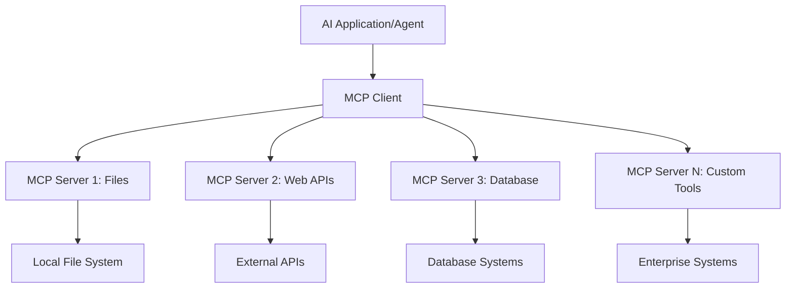

**🔧 Glavne komponente:**

| Komponenta | Uloga | Primjeri |
|------------|-------|----------|
| **MCP Hosts** | Aplikacije koje koriste MCP usluge | Claude Desktop, VS Code, AI Toolkit |
| **MCP Clients** | Rukovatelji protokolom (1:1 sa serverima) | Ugrađeni u host aplikacije |
| **MCP Servers** | Izlažu mogućnosti putem standardnog protokola | Playwright, Files, Azure, GitHub |
| **Transport Layer** | Metode komunikacije | stdio, HTTP, WebSockets |

## 🏢 Microsoftov MCP server ekosustav

Microsoft predvodi MCP ekosustav s opsežnim paketom enterprise servera koji zadovoljavaju stvarne poslovne potrebe.

### 🌟 Istaknuti Microsoft MCP serveri

#### 1. ☁️ Azure MCP Server  
**🔗 Repo**: [azure/azure-mcp](https://github.com/azure/azure-mcp)  
**🎯 Namjena**: Sveobuhvatno upravljanje Azure resursima s AI integracijom

**✨ Ključne značajke:**  
- Deklarativno upravljanje infrastrukturom  
- Praćenje resursa u stvarnom vremenu  
- Preporuke za optimizaciju troškova  
- Provjera usklađenosti sigurnosti

**🚀 Primjeri upotrebe:**  
- Infrastructure-as-Code uz AI pomoć  
- Automatsko skaliranje resursa  
- Optimizacija troškova u oblaku  
- Automatizacija DevOps procesa

#### 2. 📊 Microsoft Dataverse MCP  
**📚 Dokumentacija**: [Microsoft Dataverse Integration](https://go.microsoft.com/fwlink/?linkid=2320176)  
**🎯 Namjena**: Sučelje za poslovne podatke na prirodnom jeziku

**✨ Ključne značajke:**  
- Upiti baze podataka na prirodnom jeziku  
- Razumijevanje poslovnog konteksta  
- Prilagođeni predlošci za upite  
- Upravljanje podacima na razini poduzeća

**🚀 Primjeri upotrebe:**  
- Izvještavanje poslovne inteligencije  
- Analiza podataka o kupcima  
- Pregled prodajnog toka  
- Upiti za usklađenost podataka

#### 3. 🌐 Playwright MCP Server  
**🔗 Repo**: [microsoft/playwright-mcp](https://github.com/microsoft/playwright-mcp)  
**🎯 Namjena**: Automatizacija preglednika i web interakcije

**✨ Ključne značajke:**  
- Automatizacija na više preglednika (Chrome, Firefox, Safari)  
- Inteligentno prepoznavanje elemenata  
- Izrada screenshotova i PDF-ova  
- Praćenje mrežnog prometa

**🚀 Primjeri upotrebe:**  
- Automatizirani testni tijekovi  
- Web scraping i ekstrakcija podataka  
- Praćenje UI/UX-a  
- Automatizacija konkurentskih analiza

#### 4. 📁 Files MCP Server  
**🔗 Repo**: [microsoft/files-mcp-server](https://github.com/microsoft/files-mcp-server)  
**🎯 Namjena**: Inteligentne operacije nad datotečnim sustavom

**✨ Ključne značajke:**  
- Deklarativno upravljanje datotekama  
- Sinkronizacija sadržaja  
- Integracija kontrole verzija  
- Ekstrakcija metapodataka

**🚀 Primjeri upotrebe:**  
- Upravljanje dokumentacijom  
- Organizacija repozitorija koda  
- Radni tokovi objavljivanja sadržaja  
- Rukovanje datotekama u podatkovnim cjevovodima

#### 5. 📝 MarkItDown MCP Server  
**🔗 Repo**: [microsoft/markitdown](https://github.com/microsoft/markitdown)  
**🎯 Namjena**: Napredna obrada i manipulacija Markdown sadržajem

**✨ Ključne značajke:**  
- Bogato parsiranje Markdowna  
- Konverzija formata (MD ↔ HTML ↔ PDF)  
- Analiza strukture sadržaja  
- Obrada predložaka

**🚀 Primjeri upotrebe:**  
- Radni tokovi tehničke dokumentacije  
- Sustavi za upravljanje sadržajem  
- Generiranje izvještaja  
- Automatizacija baze znanja

#### 6. 📈 Clarity MCP Server  
**📦 Paket**: [@microsoft/clarity-mcp-server](https://www.npmjs.com/package/@microsoft/clarity-mcp-server)  
**🎯 Namjena**: Web analitika i uvidi u ponašanje korisnika

**✨ Ključne značajke:**  
- Analiza toplinskih mapa  
- Snimke korisničkih sesija  
- Metrike performansi  
- Analiza konverzijskog lijevka

**🚀 Primjeri upotrebe:**  
- Optimizacija web stranica  
- Istraživanje korisničkog iskustva  
- Analiza A/B testiranja  
- Poslovni dashboardi

### 🌍 Zajednički ekosustav

Osim Microsoftovih servera, MCP ekosustav uključuje:  
- **🐙 GitHub MCP**: Upravljanje repozitorijima i analiza koda  
- **🗄️ Database MCPs**: Integracije s PostgreSQL, MySQL, MongoDB  
- **☁️ Cloud Provider MCPs**: Alati za AWS, GCP, Digital Ocean  
- **📧 Communication MCPs**: Integracije sa Slackom, Teamsom, Emailom

## 🛠️ Praktična radionica: Izrada agenta za automatizaciju preglednika

**🎯 Cilj projekta**: Kreirati inteligentnog agenta za automatizaciju preglednika koristeći Playwright MCP server koji može navigirati web stranicama, izvlačiti informacije i izvoditi složene web interakcije.

### 🚀 Faza 1: Postavljanje temelja agenta

#### Korak 1: Inicijalizirajte svog agenta  
1. **Otvorite AI Toolkit Agent Builder**  
2. **Kreirajte novog agenta** s konfiguracijom:  
   - **Ime**: `BrowserAgent`  
   - **Model**: Odaberite GPT-4o  

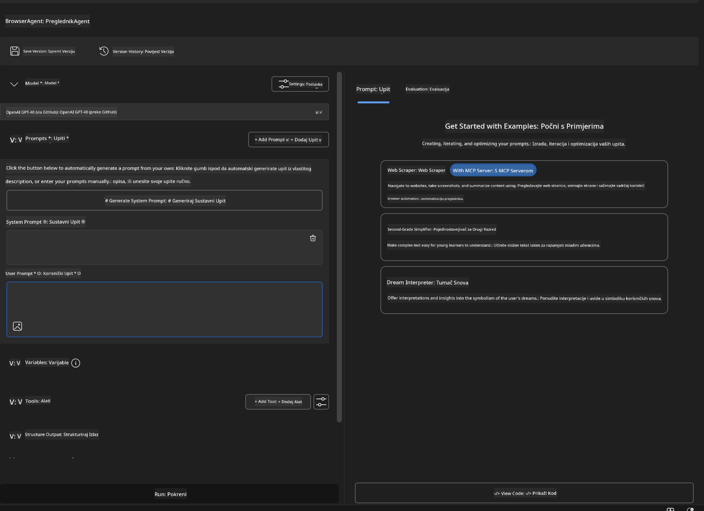

### 🔧 Faza 2: MCP integracijski tijek

#### Korak 3: Dodajte MCP server integraciju  
1. **Idite u odjeljak Tools** u Agent Builderu  
2. **Kliknite "Add Tool"** za otvaranje izbornika integracija  
3. **Odaberite "MCP Server"** iz dostupnih opcija  

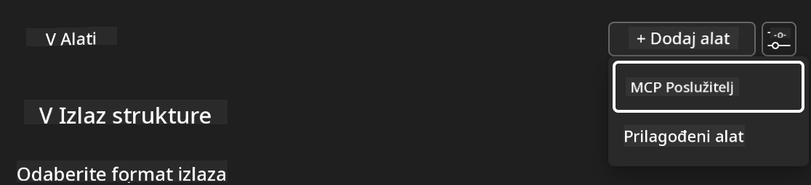

**🔍 Razumijevanje tipova alata:**  
- **Built-in Tools**: Unaprijed konfigurirane AI Toolkit funkcije  
- **MCP Servers**: Integracije vanjskih usluga  
- **Custom APIs**: Vaši vlastiti servisni endpointi  
- **Function Calling**: Izravan pristup funkcijama modela

#### Korak 4: Odabir MCP servera  
1. **Odaberite opciju "MCP Server"** za nastavak  
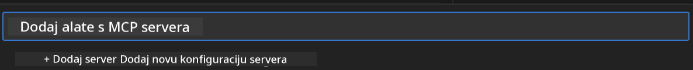

2. **Pregledajte MCP katalog** za dostupne integracije  
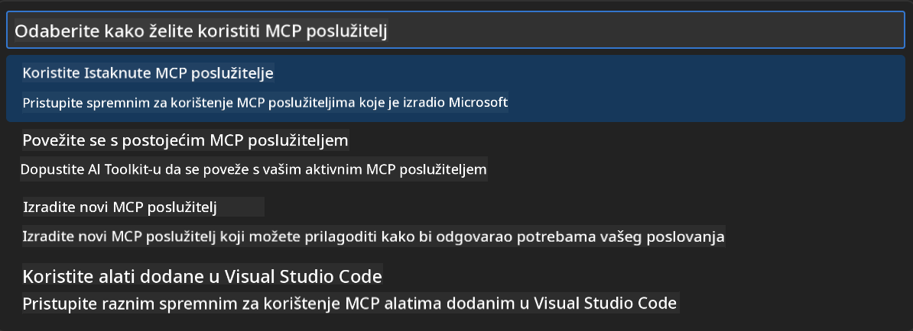

### 🎮 Faza 3: Konfiguracija Playwright MCP-a

#### Korak 5: Odaberite i konfigurirajte Playwright  
1. **Kliknite "Use Featured MCP Servers"** za pristup Microsoftovim verificiranim serverima  
2. **Odaberite "Playwright"** s liste  
3. **Prihvatite zadani MCP ID** ili prilagodite za svoje okruženje  

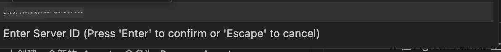

#### Korak 6: Omogućite Playwright mogućnosti  
**🔑 Ključni korak**: Odaberite **SVE** dostupne Playwright metode za maksimalnu funkcionalnost  

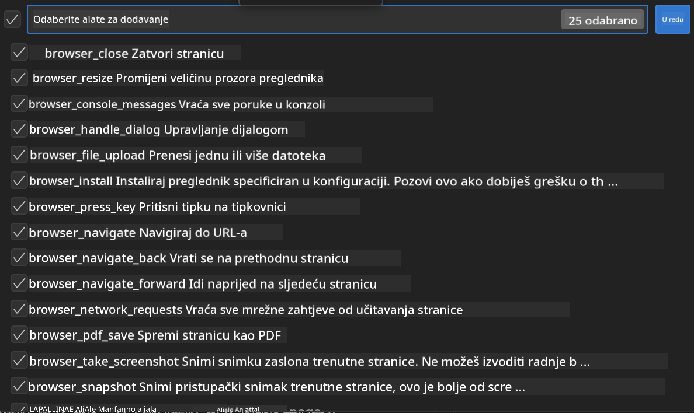

**🛠️ Neophodni Playwright alati:**  
- **Navigacija**: `goto`, `goBack`, `goForward`, `reload`  
- **Interakcija**: `click`, `fill`, `press`, `hover`, `drag`  
- **Ekstrakcija**: `textContent`, `innerHTML`, `getAttribute`  
- **Validacija**: `isVisible`, `isEnabled`, `waitForSelector`  
- **Snimanje**: `screenshot`, `pdf`, `video`  
- **Mreža**: `setExtraHTTPHeaders`, `route`, `waitForResponse`

#### Korak 7: Provjerite uspješnost integracije  
**✅ Pokazatelji uspjeha:**  
- Svi alati vidljivi u sučelju Agent Buildera  
- Nema poruka o greškama u integracijskom panelu  
- Status Playwright servera prikazuje "Connected"  

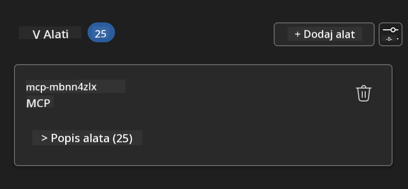

**🔧 Rješavanje uobičajenih problema:**  
- **Neuspjela veza**: Provjerite internetsku vezu i postavke vatrozida  
- **Nedostaju alati**: Provjerite jesu li sve mogućnosti odabrane tijekom postavljanja  
- **Greške u dozvolama**: Provjerite ima li VS Code potrebne sistemske dozvole

### 🎯 Faza 4: Napredno oblikovanje prompta

#### Korak 8: Dizajnirajte inteligentne sistemske promptove  
Kreirajte sofisticirane promptove koji koriste sve mogućnosti Playwrighta:

```markdown
# Web Automation Expert System Prompt

## Core Identity
You are an advanced web automation specialist with deep expertise in browser automation, web scraping, and user experience analysis. You have access to Playwright tools for comprehensive browser control.

## Capabilities & Approach
### Navigation Strategy
- Always start with screenshots to understand page layout
- Use semantic selectors (text content, labels) when possible
- Implement wait strategies for dynamic content
- Handle single-page applications (SPAs) effectively

### Error Handling
- Retry failed operations with exponential backoff
- Provide clear error descriptions and solutions
- Suggest alternative approaches when primary methods fail
- Always capture diagnostic screenshots on errors

### Data Extraction
- Extract structured data in JSON format when possible
- Provide confidence scores for extracted information
- Validate data completeness and accuracy
- Handle pagination and infinite scroll scenarios

### Reporting
- Include step-by-step execution logs
- Provide before/after screenshots for verification
- Suggest optimizations and alternative approaches
- Document any limitations or edge cases encountered

## Ethical Guidelines
- Respect robots.txt and rate limiting
- Avoid overloading target servers
- Only extract publicly available information
- Follow website terms of service
```

#### Korak 9: Kreirajte dinamične korisničke promptove  
Dizajnirajte promptove koji demonstriraju različite funkcionalnosti:

**🌐 Primjer web analize:**  
```markdown
Navigate to github.com/kinfey and provide a comprehensive analysis including:
1. Repository structure and organization
2. Recent activity and contribution patterns  
3. Documentation quality assessment
4. Technology stack identification
5. Community engagement metrics
6. Notable projects and their purposes

Include screenshots at key steps and provide actionable insights.
```

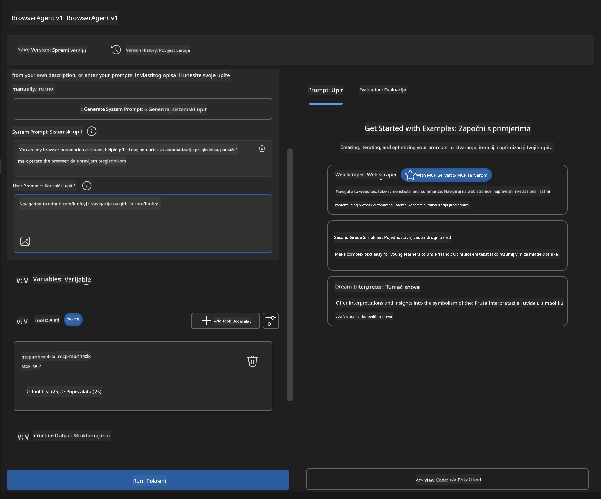

### 🚀 Faza 5: Izvršenje i testiranje

#### Korak 10: Pokrenite prvu automatizaciju  
1. **Kliknite "Run"** za pokretanje automatizacijskog slijeda  
2. **Pratite izvršenje u stvarnom vremenu**:  
   - Automatski se pokreće Chrome preglednik  
   - Agent navigira na ciljanu web stranicu  
   - Snimke zaslona bilježe svaki važan korak  
   - Rezultati analize prikazuju se u stvarnom vremenu  

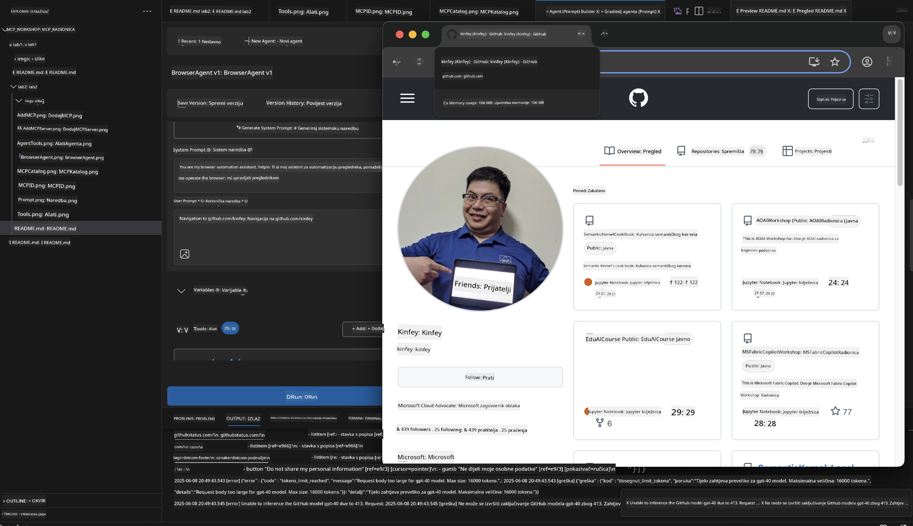

#### Korak 11: Analizirajte rezultate i uvide  
Pregledajte detaljnu analizu u sučelju Agent Buildera:

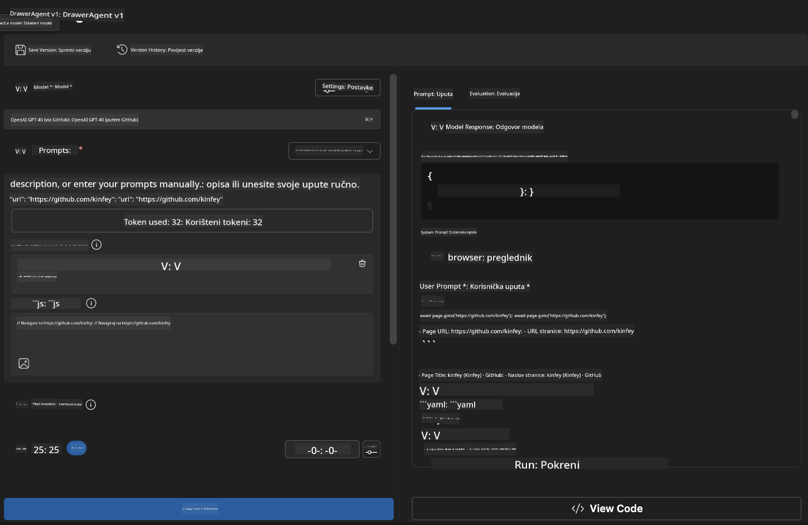

### 🌟 Faza 6: Napredne mogućnosti i implementacija

#### Korak 12: Izvoz i produkcijska implementacija  
Agent Builder podržava više opcija za implementaciju:

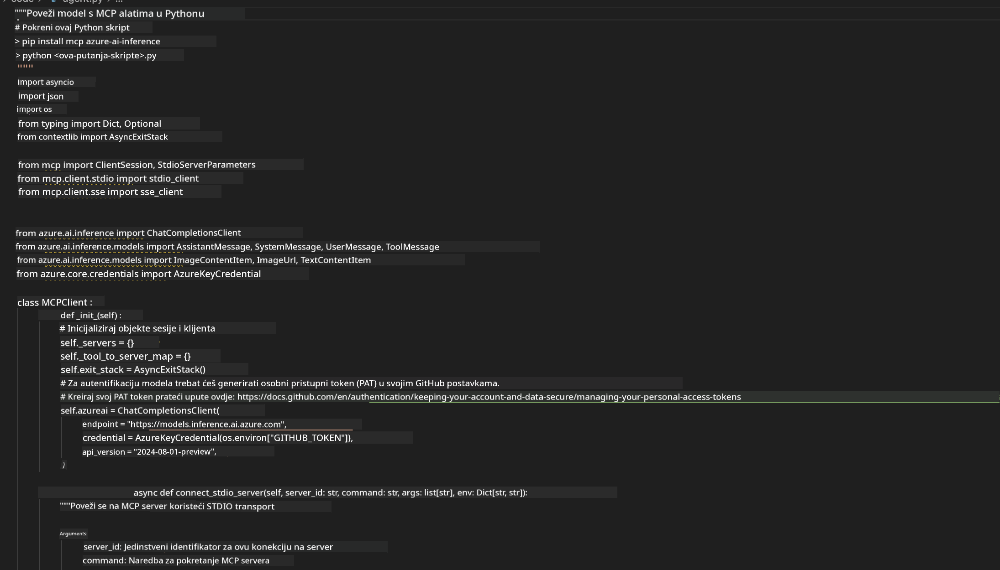

## 🎓 Sažetak Modula 2 i sljedeći koraci

### 🏆 Postignuće otključano: Majstor MCP integracije

**✅ Savladane vještine:**  
- [ ] Razumijevanje MCP arhitekture i prednosti  
- [ ] Snalaženje u Microsoftovom MCP server ekosustavu  
- [ ] Integracija Playwright MCP-a s AI Toolkitom  
- [ ] Izrada naprednih agenata za automatizaciju preglednika  
- [ ] Napredno oblikovanje promptova za web automatizaciju

### 📚 Dodatni resursi

- **🔗 MCP specifikacija**: [Službena dokumentacija protokola](https://modelcontextprotocol.io/)  
- **🛠️ Playwright API**: [Kompletan referentni vodič](https://playwright.dev/docs/api/class-playwright)  
- **🏢 Microsoft MCP serveri**: [Vodič za enterprise integraciju](https://github.com/microsoft/mcp-servers)  
- **🌍 Primjeri iz zajednice**: [Galerija MCP servera](https://github.com/modelcontextprotocol/servers)

**🎉 Čestitamo!** Uspješno ste savladali MCP integraciju i sada možete graditi produkcijski spremne AI agente s mogućnostima vanjskih alata!

### 🔜 Nastavite na sljedeći modul

Spremni za podizanje MCP vještina na višu razinu? Krenite na **[Modul 3: Napredni razvoj MCP-a s AI Toolkit-om](../lab3/README.md)** gdje ćete naučiti kako:  
- Kreirati vlastite prilagođene MCP servere  
- Konfigurirati i koristiti najnoviji MCP Python SDK  
- Postaviti MCP Inspector za otklanjanje pogrešaka  
- Ovladati naprednim radnim tokovima razvoja MCP servera
- Izgradite Weather MCP Server od nule

**Odricanje od odgovornosti**:  
Ovaj dokument je preveden korištenjem AI usluge za prevođenje [Co-op Translator](https://github.com/Azure/co-op-translator). Iako nastojimo postići točnost, imajte na umu da automatski prijevodi mogu sadržavati pogreške ili netočnosti. Izvorni dokument na izvornom jeziku treba smatrati autoritativnim izvorom. Za kritične informacije preporučuje se profesionalni ljudski prijevod. Ne snosimo odgovornost za bilo kakva nesporazume ili pogrešna tumačenja koja proizlaze iz korištenja ovog prijevoda.