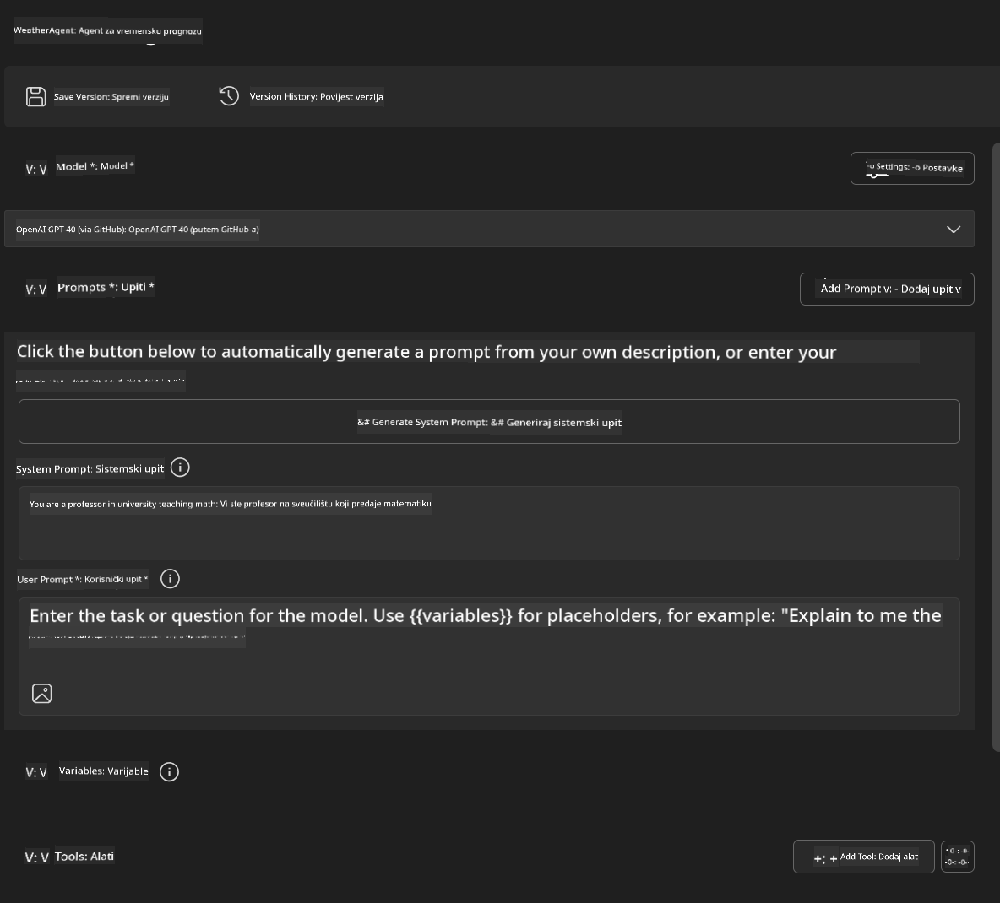
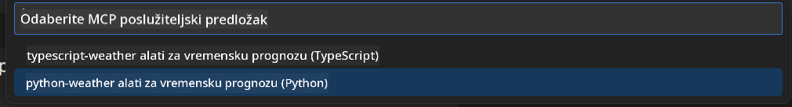
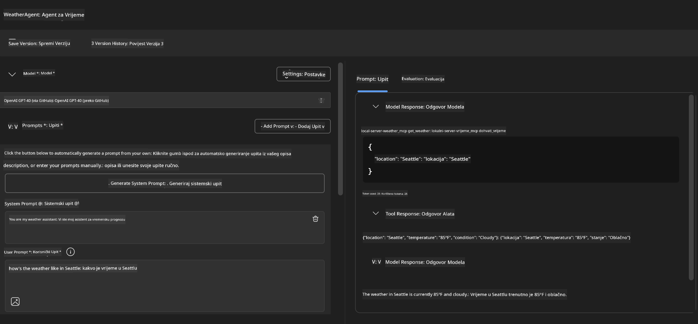
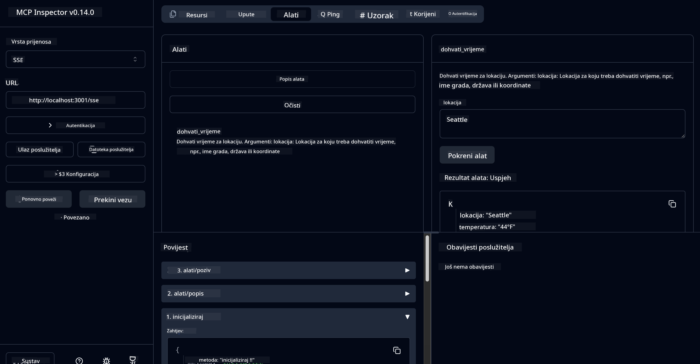

<!--
CO_OP_TRANSLATOR_METADATA:
{
  "original_hash": "dd8da3f75addcef453fe11f02a270217",
  "translation_date": "2025-07-14T08:20:29+00:00",
  "source_file": "10-StreamliningAIWorkflowsBuildingAnMCPServerWithAIToolkit/lab3/README.md",
  "language_code": "hr"
}
-->
# 🔧 Modul 3: Napredni razvoj MCP-a s AI Toolkitom


## 🎯 Ciljevi učenja

Do kraja ovog laboratorija moći ćete:

- ✅ Kreirati prilagođene MCP servere koristeći AI Toolkit
- ✅ Konfigurirati i koristiti najnoviji MCP Python SDK (v1.9.3)
- ✅ Postaviti i koristiti MCP Inspector za otklanjanje pogrešaka
- ✅ Otklanjati pogreške MCP servera u Agent Builder i Inspector okruženjima
- ✅ Razumjeti napredne radne tokove razvoja MCP servera

## 📋 Preduvjeti

- Završetak Lab 2 (Osnove MCP-a)
- VS Code s instaliranim AI Toolkit dodatkom
- Python 3.10+ okruženje
- Node.js i npm za postavljanje Inspectora

## 🏗️ Što ćete izraditi

U ovom laboratoriju izradit ćete **Weather MCP Server** koji demonstrira:
- Implementaciju prilagođenog MCP servera
- Integraciju s AI Toolkit Agent Builderom
- Profesionalne radne tokove za otklanjanje pogrešaka
- Moderni način korištenja MCP SDK-a

---

## 🔧 Pregled osnovnih komponenti

### 🐍 MCP Python SDK  
Model Context Protocol Python SDK pruža temelj za izradu prilagođenih MCP servera. Koristit ćete verziju 1.9.3 s poboljšanim mogućnostima otklanjanja pogrešaka.

### 🔍 MCP Inspector  
Snažan alat za otklanjanje pogrešaka koji omogućuje:  
- Praćenje servera u stvarnom vremenu  
- Vizualizaciju izvršavanja alata  
- Pregled mrežnih zahtjeva/odgovora  
- Interaktivno testno okruženje  

---

## 📖 Korak-po-korak implementacija

### Korak 1: Kreirajte WeatherAgent u Agent Builderu

1. **Pokrenite Agent Builder** u VS Codeu kroz AI Toolkit dodatak  
2. **Kreirajte novog agenta** s konfiguracijom:  
   - Ime agenta: `WeatherAgent`



### Korak 2: Inicijalizirajte MCP Server projekt

1. **Idite na Tools** → **Add Tool** u Agent Builderu  
2. **Odaberite "MCP Server"** iz ponuđenih opcija  
3. **Odaberite "Create A new MCP Server"**  
4. **Odaberite predložak `python-weather`**  
5. **Imenujte svoj server:** `weather_mcp`



### Korak 3: Otvorite i pregledajte projekt

1. **Otvorite generirani projekt** u VS Codeu  
2. **Pregledajte strukturu projekta:**  
   ```
   weather_mcp/
   ├── src/
   │   ├── __init__.py
   │   └── server.py
   ├── inspector/
   │   ├── package.json
   │   └── package-lock.json
   ├── .vscode/
   │   ├── launch.json
   │   └── tasks.json
   ├── pyproject.toml
   └── README.md
   ```

### Korak 4: Nadogradite na najnoviji MCP SDK

> **🔍 Zašto nadograditi?** Želimo koristiti najnoviji MCP SDK (v1.9.3) i Inspector servis (0.14.0) za poboljšane značajke i bolje mogućnosti otklanjanja pogrešaka.

#### 4a. Ažurirajte Python ovisnosti

**Uredite `pyproject.toml`:** ažurirajte [./code/weather_mcp/pyproject.toml](../../../../10-StreamliningAIWorkflowsBuildingAnMCPServerWithAIToolkit/lab3/code/weather_mcp/pyproject.toml)

#### 4b. Ažurirajte konfiguraciju Inspectora

**Uredite `inspector/package.json`:** ažurirajte [./code/weather_mcp/inspector/package.json](../../../../10-StreamliningAIWorkflowsBuildingAnMCPServerWithAIToolkit/lab3/code/weather_mcp/inspector/package.json)

#### 4c. Ažurirajte ovisnosti Inspectora

**Uredite `inspector/package-lock.json`:** ažurirajte [./code/weather_mcp/inspector/package-lock.json](../../../../10-StreamliningAIWorkflowsBuildingAnMCPServerWithAIToolkit/lab3/code/weather_mcp/inspector/package-lock.json)

> **📝 Napomena:** Ova datoteka sadrži opsežne definicije ovisnosti. Ispod je osnovna struktura - puni sadržaj osigurava pravilno rješavanje ovisnosti.

> **⚡ Potpuni Package Lock:** Cijeli package-lock.json sadrži oko 3000 redaka definicija ovisnosti. Gore je prikazana ključna struktura - koristite priloženu datoteku za potpunu rezoluciju ovisnosti.

### Korak 5: Konfigurirajte VS Code za otklanjanje pogrešaka

*Napomena: Molimo kopirajte datoteku na navedenu lokaciju kako biste zamijenili odgovarajuću lokalnu datoteku*

#### 5a. Ažurirajte konfiguraciju pokretanja

**Uredite `.vscode/launch.json`:**

```json
{
  "version": "0.2.0",
  "configurations": [
    {
      "name": "Attach to Local MCP",
      "type": "debugpy",
      "request": "attach",
      "connect": {
        "host": "localhost",
        "port": 5678
      },
      "presentation": {
        "hidden": true
      },
      "internalConsoleOptions": "neverOpen",
      "postDebugTask": "Terminate All Tasks"
    },
    {
      "name": "Launch Inspector (Edge)",
      "type": "msedge",
      "request": "launch",
      "url": "http://localhost:6274?timeout=60000&serverUrl=http://localhost:3001/sse#tools",
      "cascadeTerminateToConfigurations": [
        "Attach to Local MCP"
      ],
      "presentation": {
        "hidden": true
      },
      "internalConsoleOptions": "neverOpen"
    },
    {
      "name": "Launch Inspector (Chrome)",
      "type": "chrome",
      "request": "launch",
      "url": "http://localhost:6274?timeout=60000&serverUrl=http://localhost:3001/sse#tools",
      "cascadeTerminateToConfigurations": [
        "Attach to Local MCP"
      ],
      "presentation": {
        "hidden": true
      },
      "internalConsoleOptions": "neverOpen"
    }
  ],
  "compounds": [
    {
      "name": "Debug in Agent Builder",
      "configurations": [
        "Attach to Local MCP"
      ],
      "preLaunchTask": "Open Agent Builder",
    },
    {
      "name": "Debug in Inspector (Edge)",
      "configurations": [
        "Launch Inspector (Edge)",
        "Attach to Local MCP"
      ],
      "preLaunchTask": "Start MCP Inspector",
      "stopAll": true
    },
    {
      "name": "Debug in Inspector (Chrome)",
      "configurations": [
        "Launch Inspector (Chrome)",
        "Attach to Local MCP"
      ],
      "preLaunchTask": "Start MCP Inspector",
      "stopAll": true
    }
  ]
}
```

**Uredite `.vscode/tasks.json`:**

```
{
  "version": "2.0.0",
  "tasks": [
    {
      "label": "Start MCP Server",
      "type": "shell",
      "command": "python -m debugpy --listen 127.0.0.1:5678 src/__init__.py sse",
      "isBackground": true,
      "options": {
        "cwd": "${workspaceFolder}",
        "env": {
          "PORT": "3001"
        }
      },
      "problemMatcher": {
        "pattern": [
          {
            "regexp": "^.*$",
            "file": 0,
            "location": 1,
            "message": 2
          }
        ],
        "background": {
          "activeOnStart": true,
          "beginsPattern": ".*",
          "endsPattern": "Application startup complete|running"
        }
      }
    },
    {
      "label": "Start MCP Inspector",
      "type": "shell",
      "command": "npm run dev:inspector",
      "isBackground": true,
      "options": {
        "cwd": "${workspaceFolder}/inspector",
        "env": {
          "CLIENT_PORT": "6274",
          "SERVER_PORT": "6277",
        }
      },
      "problemMatcher": {
        "pattern": [
          {
            "regexp": "^.*$",
            "file": 0,
            "location": 1,
            "message": 2
          }
        ],
        "background": {
          "activeOnStart": true,
          "beginsPattern": "Starting MCP inspector",
          "endsPattern": "Proxy server listening on port"
        }
      },
      "dependsOn": [
        "Start MCP Server"
      ]
    },
    {
      "label": "Open Agent Builder",
      "type": "shell",
      "command": "echo ${input:openAgentBuilder}",
      "presentation": {
        "reveal": "never"
      },
      "dependsOn": [
        "Start MCP Server"
      ],
    },
    {
      "label": "Terminate All Tasks",
      "command": "echo ${input:terminate}",
      "type": "shell",
      "problemMatcher": []
    }
  ],
  "inputs": [
    {
      "id": "openAgentBuilder",
      "type": "command",
      "command": "ai-mlstudio.agentBuilder",
      "args": {
        "initialMCPs": [ "local-server-weather_mcp" ],
        "triggeredFrom": "vsc-tasks"
      }
    },
    {
      "id": "terminate",
      "type": "command",
      "command": "workbench.action.tasks.terminate",
      "args": "terminateAll"
    }
  ]
}
```

---

## 🚀 Pokretanje i testiranje vašeg MCP servera

### Korak 6: Instalirajte ovisnosti

Nakon promjena u konfiguraciji, pokrenite sljedeće naredbe:

**Instalirajte Python ovisnosti:**  
```bash
uv sync
```

**Instalirajte ovisnosti Inspectora:**  
```bash
cd inspector
npm install
```

### Korak 7: Otklanjanje pogrešaka s Agent Builderom

1. **Pritisnite F5** ili koristite konfiguraciju **"Debug in Agent Builder"**  
2. **Odaberite compound konfiguraciju** u debug panelu  
3. **Pričekajte da se server pokrene** i da se otvori Agent Builder  
4. **Testirajte svoj weather MCP server** s upitima na prirodnom jeziku

Unesite upit poput ovog

SYSTEM_PROMPT

```
You are my weather assistant
```

USER_PROMPT

```
How's the weather like in Seattle
```



### Korak 8: Otklanjanje pogrešaka s MCP Inspectorom

1. **Koristite konfiguraciju "Debug in Inspector"** (Edge ili Chrome)  
2. **Otvorite Inspector sučelje** na `http://localhost:6274`  
3. **Istražite interaktivno testno okruženje:**  
   - Pregled dostupnih alata  
   - Testiranje izvršavanja alata  
   - Praćenje mrežnih zahtjeva  
   - Otklanjanje pogrešaka odgovora servera  



---

## 🎯 Ključni ishodi učenja

Završetkom ovog laboratorija ste:

- [x] **Kreirali prilagođeni MCP server** koristeći AI Toolkit predloške  
- [x] **Nadogradili na najnoviji MCP SDK** (v1.9.3) za poboljšanu funkcionalnost  
- [x] **Konfigurirali profesionalne radne tokove za otklanjanje pogrešaka** za Agent Builder i Inspector  
- [x] **Postavili MCP Inspector** za interaktivno testiranje servera  
- [x] **Ovladali VS Code konfiguracijama za otklanjanje pogrešaka** u razvoju MCP-a  

## 🔧 Istražene napredne značajke

| Značajka | Opis | Primjena |
|---------|-------------|----------|
| **MCP Python SDK v1.9.3** | Najnovija implementacija protokola | Moderni razvoj servera |
| **MCP Inspector 0.14.0** | Interaktivni alat za otklanjanje pogrešaka | Testiranje servera u stvarnom vremenu |
| **VS Code Debugging** | Integrirano razvojno okruženje | Profesionalni radni tok za otklanjanje pogrešaka |
| **Agent Builder integracija** | Izravna veza s AI Toolkitom | End-to-end testiranje agenta |

## 📚 Dodatni resursi

- [MCP Python SDK Dokumentacija](https://modelcontextprotocol.io/docs/sdk/python)  
- [Vodič za AI Toolkit dodatak](https://code.visualstudio.com/docs/ai/ai-toolkit)  
- [VS Code dokumentacija za otklanjanje pogrešaka](https://code.visualstudio.com/docs/editor/debugging)  
- [Specifikacija Model Context Protocola](https://modelcontextprotocol.io/docs/concepts/architecture)  

---

**🎉 Čestitamo!** Uspješno ste završili Lab 3 i sada možete kreirati, otklanjati pogreške i implementirati prilagođene MCP servere koristeći profesionalne radne tokove razvoja.

### 🔜 Nastavite na sljedeći modul

Spremni ste primijeniti svoje MCP vještine u stvarnom razvojnom okruženju? Nastavite na **[Modul 4: Praktični razvoj MCP-a - Prilagođeni GitHub Clone Server](../lab4/README.md)** gdje ćete:  
- Izgraditi produkcijski spreman MCP server koji automatizira operacije GitHub repozitorija  
- Implementirati funkcionalnost kloniranja GitHub repozitorija putem MCP-a  
- Integrirati prilagođene MCP servere s VS Codeom i GitHub Copilot Agent Modeom  
- Testirati i implementirati prilagođene MCP servere u produkcijskim okruženjima  
- Naučiti praktičnu automatizaciju radnih tokova za developere

**Odricanje od odgovornosti**:  
Ovaj dokument je preveden korištenjem AI usluge za prevođenje [Co-op Translator](https://github.com/Azure/co-op-translator). Iako težimo točnosti, imajte na umu da automatski prijevodi mogu sadržavati pogreške ili netočnosti. Izvorni dokument na izvornom jeziku treba smatrati autoritativnim izvorom. Za kritične informacije preporučuje se profesionalni ljudski prijevod. Ne snosimo odgovornost za bilo kakva nesporazume ili pogrešna tumačenja koja proizlaze iz korištenja ovog prijevoda.