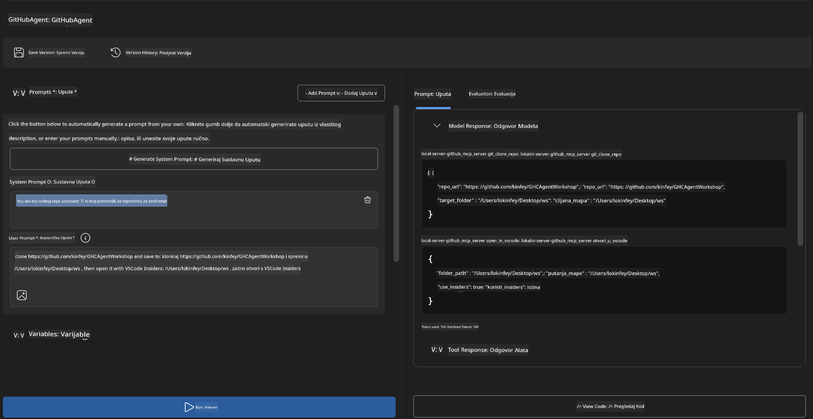

<!--
CO_OP_TRANSLATOR_METADATA:
{
  "original_hash": "f83bc722dc758efffd68667d6a1db470",
  "translation_date": "2025-06-10T06:58:39+00:00",
  "source_file": "10-StreamliningAIWorkflowsBuildingAnMCPServerWithAIToolkit/lab4/README.md",
  "language_code": "hr"
}
-->
# 🐙 Modul 4: Praktični razvoj MCP-a - Prilagođeni GitHub Clone Server


> **⚡ Brzi početak:** Izgradite proizvodni MCP server koji automatizira kloniranje GitHub repozitorija i integraciju s VS Code-om za samo 30 minuta!

## 🎯 Ciljevi učenja

Do kraja ovog laboratorija moći ćete:

- ✅ Kreirati prilagođeni MCP server za stvarne razvojne tokove rada
- ✅ Implementirati funkcionalnost kloniranja GitHub repozitorija putem MCP-a
- ✅ Integrirati prilagođene MCP servere s VS Code-om i Agent Builderom
- ✅ Koristiti GitHub Copilot Agent Mode s prilagođenim MCP alatima
- ✅ Testirati i implementirati prilagođene MCP servere u produkcijskim okruženjima

## 📋 Preduvjeti

- Završeni laboratoriji 1-3 (osnove MCP-a i napredni razvoj)
- Pretplata na GitHub Copilot ([dostupna besplatna registracija](https://github.com/github-copilot/signup))
- VS Code s AI Toolkit i GitHub Copilot ekstenzijama
- Instaliran i konfiguriran Git CLI

## 🏗️ Pregled projekta

### **Izazov stvarnog razvoja**
Kao developeri, često koristimo GitHub za kloniranje repozitorija i njihovo otvaranje u VS Code-u ili VS Code Insiders. Ovaj ručni proces uključuje:
1. Otvaranje terminala/command prompta
2. Navigaciju do željenog direktorija
3. Pokretanje naredbe `git clone`
4. Otvaranje VS Code-a u kloniranom direktoriju

**Naše MCP rješenje pojednostavljuje to u jednu pametnu naredbu!**

### **Što ćete izraditi**
**GitHub Clone MCP Server** (`git_mcp_server`) koji nudi:

| Značajka | Opis | Prednost |
|---------|-------------|---------|
| 🔄 **Pametno kloniranje repozitorija** | Klonira GitHub repozitorije uz provjeru valjanosti | Automatska provjera grešaka |
| 📁 **Inteligentno upravljanje direktorijima** | Sigurno provjerava i kreira direktorije | Sprječava prepisivanje podataka |
| 🚀 **Višestruka integracija s VS Code-om** | Otvara projekte u VS Code/Insiders | Besprijekoran prijelaz u radni tok |
| 🛡️ **Robusno rukovanje greškama** | Rješava mrežne, dozvole i putne probleme | Pouzdanost spremna za produkciju |

---

## 📖 Implementacija korak po korak

### Korak 1: Kreirajte GitHub Agenta u Agent Builderu

1. **Pokrenite Agent Builder** kroz AI Toolkit ekstenziju
2. **Kreirajte novog agenta** s ovom konfiguracijom:
   ```
   Agent Name: GitHubAgent
   ```

3. **Inicijalizirajte prilagođeni MCP server:**
   - Idite na **Tools** → **Add Tool** → **MCP Server**
   - Odaberite **"Create A new MCP Server"**
   - Izaberite **Python predložak** za maksimalnu fleksibilnost
   - **Ime servera:** `git_mcp_server`

### Korak 2: Konfigurirajte GitHub Copilot Agent Mode

1. **Otvorite GitHub Copilot** u VS Code-u (Ctrl/Cmd + Shift + P → "GitHub Copilot: Open")
2. **Odaberite Agent Model** u Copilot sučelju
3. **Izaberite Claude 3.7 model** za poboljšane sposobnosti rezoniranja
4. **Omogućite MCP integraciju** za pristup alatima

> **💡 Koristan savjet:** Claude 3.7 pruža bolje razumijevanje razvojnih tokova i obrazaca rukovanja greškama.

### Korak 3: Implementirajte osnovnu funkcionalnost MCP servera

**Koristite sljedeći detaljni prompt s GitHub Copilot Agent Mode:**

```
Create two MCP tools with the following comprehensive requirements:

🔧 TOOL A: clone_repository
Requirements:
- Clone any GitHub repository to a specified local folder
- Return the absolute path of the successfully cloned project
- Implement comprehensive validation:
  ✓ Check if target directory already exists (return error if exists)
  ✓ Validate GitHub URL format (https://github.com/user/repo)
  ✓ Verify git command availability (prompt installation if missing)
  ✓ Handle network connectivity issues
  ✓ Provide clear error messages for all failure scenarios

🚀 TOOL B: open_in_vscode
Requirements:
- Open specified folder in VS Code or VS Code Insiders
- Cross-platform compatibility (Windows/Linux/macOS)
- Use direct application launch (not terminal commands)
- Auto-detect available VS Code installations
- Handle cases where VS Code is not installed
- Provide user-friendly error messages

Additional Requirements:
- Follow MCP 1.9.3 best practices
- Include proper type hints and documentation
- Implement logging for debugging purposes
- Add input validation for all parameters
- Include comprehensive error handling
```

### Korak 4: Testirajte svoj MCP server

#### 4a. Testiranje u Agent Builderu

1. **Pokrenite debug konfiguraciju** za Agent Builder
2. **Konfigurirajte svog agenta s ovim sistemskim promptom:**

```
SYSTEM_PROMPT:
You are my intelligent coding repository assistant. You help developers efficiently clone GitHub repositories and set up their development environment. Always provide clear feedback about operations and handle errors gracefully.
```

3. **Testirajte s realističnim korisničkim scenarijima:**

```
USER_PROMPT EXAMPLES:

Scenario : Basic Clone and Open
"Clone {Your GitHub Repo link such as https://github.com/kinfey/GHCAgentWorkshop
 } and save to {The global path you specify}, then open it with VS Code Insiders"
```



**Očekivani rezultati:**
- ✅ Uspješno kloniranje s potvrdom putanje
- ✅ Automatsko pokretanje VS Code-a
- ✅ Jasne poruke o greškama za neispravne scenarije
- ✅ Ispravno rukovanje rubnim slučajevima

#### 4b. Testiranje u MCP Inspectoru


---

**🎉 Čestitamo!** Uspješno ste izradili praktični, proizvodni MCP server koji rješava stvarne izazove razvojnih tokova. Vaš prilagođeni GitHub clone server pokazuje snagu MCP-a u automatizaciji i povećanju produktivnosti developera.

### 🏆 Osvajanje značke:
- ✅ **MCP Developer** - Izradio prilagođeni MCP server
- ✅ **Workflow Automator** - Pojednostavio razvojne procese  
- ✅ **Integration Expert** - Povezao više razvojnih alata
- ✅ **Production Ready** - Izgradio rješenja spremna za produkciju

---

## 🎓 Završetak radionice: Vaše putovanje s Model Context Protocolom

**Poštovani sudioniku radionice,**

Čestitamo na završetku svih četiri modula radionice Model Context Protocol! Prošli ste dug put od razumijevanja osnovnih koncepata AI Toolkit-a do izgradnje proizvodnih MCP servera koji rješavaju stvarne razvojne izazove.

### 🚀 Pregled vašeg puta učenja:

**[Modul 1](../lab1/README.md)**: Počeli ste istraživati osnove AI Toolkit-a, testiranje modela i kreiranje prvog AI agenta.

**[Modul 2](../lab2/README.md)**: Naučili ste MCP arhitekturu, integrirali Playwright MCP i izgradili prvog agenta za automatizaciju preglednika.

**[Modul 3](../lab3/README.md)**: Napredovali ste u razvoju prilagođenih MCP servera s Weather MCP serverom i savladali alate za ispravljanje pogrešaka.

**[Modul 4](../lab4/README.md)**: Sada ste primijenili sve naučeno za izradu praktičnog alata za automatizaciju GitHub repozitorija.

### 🌟 Što ste savladali:

- ✅ **AI Toolkit ekosustav**: modeli, agenti i obrasci integracije
- ✅ **MCP arhitektura**: dizajn klijent-server, transportni protokoli i sigurnost
- ✅ **Razvojni alati**: od Playgrounda do Inspectora i produkcijske implementacije
- ✅ **Prilagođeni razvoj**: izgradnja, testiranje i implementacija vlastitih MCP servera
- ✅ **Praktične primjene**: rješavanje stvarnih izazova razvojnih tokova uz AI

### 🔮 Vaši sljedeći koraci:

1. **Izgradite vlastiti MCP server**: Primijenite ove vještine za automatizaciju vlastitih jedinstvenih tokova rada
2. **Pridružite se MCP zajednici**: Dijelite svoja rješenja i učite od drugih
3. **Istražite napredne integracije**: Povežite MCP servere s enterprise sustavima
4. **Doprinesite open source-u**: Pomozite u unapređenju MCP alata i dokumentacije

Zapamtite, ova radionica je tek početak. Ekosustav Model Context Protocol brzo se razvija, a vi ste sada opremljeni da budete na čelu AI-podržanih razvojnih alata.

**Hvala vam na sudjelovanju i predanosti učenju!**

Nadamo se da vam je ova radionica dala ideje koje će transformirati način na koji gradite i koristite AI alate u svom razvoju.

**Sretno kodiranje!**

---

**Odricanje od odgovornosti**:  
Ovaj dokument je preveden pomoću AI usluge za prijevod [Co-op Translator](https://github.com/Azure/co-op-translator). Iako nastojimo postići točnost, imajte na umu da automatski prijevodi mogu sadržavati pogreške ili netočnosti. Izvorni dokument na izvornom jeziku treba smatrati službenim i autoritativnim izvorom. Za kritične informacije preporučuje se profesionalni ljudski prijevod. Ne snosimo odgovornost za bilo kakva nesporazuma ili pogrešna tumačenja koja proizlaze iz korištenja ovog prijevoda.