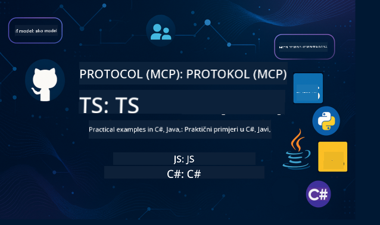

<!--
CO_OP_TRANSLATOR_METADATA:
{
  "original_hash": "866c8877136cb03e1efb9ad633a2f0a6",
  "translation_date": "2025-08-26T18:22:24+00:00",
  "source_file": "README.md",
  "language_code": "hr"
}
-->
 

Slijedite ove korake kako biste započeli korištenje ovih resursa:
1. **Forkajte repozitorij**: Kliknite 
2. **Klonirajte repozitorij**:   `git clone https://github.com/microsoft/mcp-for-beginners.git`
3. [**Pridružite se Azure AI Foundry Discordu i upoznajte stručnjake i kolege programere**](https://discord.com/invite/ByRwuEEgH4)

### 🌐 Podrška za više jezika

#### Podržano putem GitHub Action (Automatizirano i uvijek ažurirano)

 [Arapski](../ar/README.md) | [Bengalski](../bn/README.md) | [Bugarski](../bg/README.md) | [Burmanski (Mjanmar)](../my/README.md) | [Kineski (pojednostavljeni)](../zh/README.md) | [Kineski (tradicionalni, Hong Kong)](../hk/README.md) | [Kineski (tradicionalni, Macau)](../mo/README.md) | [Kineski (tradicionalni, Tajvan)](../tw/README.md) | [Hrvatski](./README.md) | [Češki](../cs/README.md) | [Danski](../da/README.md) | [Nizozemski](../nl/README.md) | [Finski](../fi/README.md) | [Francuski](../fr/README.md) | [Njemački](../de/README.md) | [Grčki](../el/README.md) | [Hebrejski](../he/README.md) | [Hindski](../hi/README.md) | [Mađarski](../hu/README.md) | [Indonezijski](../id/README.md) | [Talijanski](../it/README.md) | [Japanski](../ja/README.md) | [Korejski](../ko/README.md) | [Malajski](../ms/README.md) | [Marathi](../mr/README.md) | [Nepalski](../ne/README.md) | [Norveški](../no/README.md) | [Perzijski (Farsi)](../fa/README.md) | [Poljski](../pl/README.md) | [Portugalski (Brazil)](../br/README.md) | [Portugalski (Portugal)](../pt/README.md) | [Pandžapski (Gurmukhi)](../pa/README.md) | [Rumunjski](../ro/README.md) | [Ruski](../ru/README.md) | [Srpski (ćirilica)](../sr/README.md) | [Slovački](../sk/README.md) | [Slovenski](../sl/README.md) | [Španjolski](../es/README.md) | [Svahili](../sw/README.md) | [Švedski](../sv/README.md) | [Tagalog (Filipinski)](../tl/README.md) | [Tajlandski](../th/README.md) | [Turski](../tr/README.md) | [Ukrajinski](../uk/README.md) | [Urdu](../ur/README.md) | [Vijetnamski](../vi/README.md)

# 🚀 Kurikulum za Model Context Protocol (MCP) za početnike

## **Naučite MCP uz praktične primjere koda u C#, Java, JavaScript, Rust, Python i TypeScript**

## 🧠 Pregled kurikuluma za Model Context Protocol

**Model Context Protocol (MCP)** je napredni okvir dizajniran za standardizaciju interakcija između AI modela i klijentskih aplikacija. Ovaj otvoreni kurikulum nudi strukturirani put učenja, uključujući praktične primjere koda i stvarne primjene, u popularnim programskim jezicima kao što su C#, Java, JavaScript, TypeScript i Python.

Bez obzira jeste li AI programer, sistemski arhitekt ili softverski inženjer, ovaj vodič je vaš sveobuhvatni resurs za savladavanje osnova MCP-a i strategija implementacije.

## 🔗 Službeni MCP resursi

- 📘 [MCP Dokumentacija](https://modelcontextprotocol.io/) – Detaljni vodiči i korisnički priručnici  
- 📜 [MCP Specifikacija](https://modelcontextprotocol.io/docs/) – Arhitektura protokola i tehničke reference  
- 📜 [Originalna MCP Specifikacija](https://spec.modelcontextprotocol.io/) – Legacy tehničke reference (može sadržavati dodatne detalje)  
- 🧑‍💻 [MCP GitHub Repozitorij](https://github.com/modelcontextprotocol) – Open-source SDK-ovi, alati i primjeri koda
- 🌐 [MCP Zajednica](https://github.com/orgs/modelcontextprotocol/discussions) – Pridružite se raspravama i doprinesite zajednici

## 🧭 Pregled kurikuluma MCP-a

### 📚 Kompletna struktura kurikuluma

| Modul | Tema | Opis | Link |
|--------|-------|-------------|------|
| **Modul 1-3: Osnove** | | | |
| 00 | Uvod u MCP | Pregled Model Context Protocol-a i njegova važnost u AI procesima | [Pročitajte više](./00-Introduction/README.md) |
| 01 | Objašnjenje osnovnih pojmova | Detaljno istraživanje osnovnih MCP pojmova | [Pročitajte više](./01-CoreConcepts/README.md) |
| 02 | Sigurnost u MCP-u | Prijetnje sigurnosti i najbolje prakse | [Pročitajte više](./02-Security/README.md) |
| 03 | Početak rada s MCP-om | Postavljanje okruženja, osnovni serveri/klijenti, integracija | [Pročitajte više](./03-GettingStarted/README.md) |
| **Modul 3: Izrada vašeg prvog servera i klijenta** | | | |
| 3.1 | Prvi server | Izradite svoj prvi MCP server | [Vodič](./03-GettingStarted/01-first-server/README.md) |
| 3.2 | Prvi klijent | Razvijte osnovni MCP klijent | [Vodič](./03-GettingStarted/02-client/README.md) |
| 3.3 | Klijent s LLM | Integrirajte velike jezične modele | [Vodič](./03-GettingStarted/03-llm-client/README.md) |
| 3.4 | Integracija s VS Code | Koristite MCP servere u VS Code | [Vodič](./03-GettingStarted/04-vscode/README.md) |
| 3.5 | stdio Server | Izradite servere koristeći stdio transport | [Vodič](./03-GettingStarted/05-stdio-server/README.md) |
| 3.6 | HTTP Streaming | Implementirajte HTTP streaming u MCP-u | [Vodič](./03-GettingStarted/06-http-streaming/README.md) |
| 3.7 | AI Toolkit | Koristite AI Toolkit s MCP-om | [Vodič](./03-GettingStarted/07-aitk/README.md) |
| 3.8 | Testiranje | Testirajte svoju implementaciju MCP servera | [Vodič](./03-GettingStarted/08-testing/README.md) |
| 3.9 | Implementacija | Implementirajte MCP servere u produkciju | [Vodič](./03-GettingStarted/09-deployment/README.md) |
| **Modul 4-5: Praktično i napredno** | | | |
| 04 | Praktična implementacija | SDK-ovi, debugiranje, testiranje, predlošci za ponovnu upotrebu | [Pročitajte više](./04-PracticalImplementation/README.md) |
| 05 | Napredne teme u MCP-u | Multi-modalni AI, skaliranje, primjena u poduzećima | [Pročitajte više](./05-AdvancedTopics/README.md) |
| 5.1 | Integracija s Azureom | MCP integracija s Azureom | [Vodič](./05-AdvancedTopics/mcp-integration/README.md) |
| 5.2 | Multi-modalnost | Rad s više modaliteta | [Vodič](./05-AdvancedTopics/mcp-multi-modality/README.md) |
| 5.3 | OAuth2 Demo | Implementirajte OAuth2 autentifikaciju | [Vodič](./05-AdvancedTopics/mcp-oauth2-demo/README.md) |
| 5.4 | Root Contexts | Razumijevanje i implementacija root konteksta | [Vodič](./05-AdvancedTopics/mcp-root-contexts/README.md) |
| 5.5 | Usmjeravanje | Strategije usmjeravanja u MCP-u | [Vodič](./05-AdvancedTopics/mcp-routing/README.md) |
| 5.6 | Uzorkovanje | Tehnike uzorkovanja u MCP-u | [Vodič](./05-AdvancedTopics/mcp-sampling/README.md) |
| 5.7 | Skaliranje | Skaliranje MCP implementacija | [Vodič](./05-AdvancedTopics/mcp-scaling/README.md) |
| 5.8 | Sigurnost | Napredna razmatranja sigurnosti | [Vodič](./05-AdvancedTopics/mcp-security/README.md) |
| 5.9 | Web pretraživanje | Implementirajte mogućnosti web pretraživanja | [Vodič](./05-AdvancedTopics/web-search-mcp/README.md) |
| 5.10 | Streaming u stvarnom vremenu | Izradite funkcionalnost streaminga u stvarnom vremenu | [Vodič](./05-AdvancedTopics/mcp-realtimestreaming/README.md) |
| 5.11 | Pretraživanje u stvarnom vremenu | Implementirajte pretraživanje u stvarnom vremenu | [Vodič](./05-AdvancedTopics/mcp-realtimesearch/README.md) |
| 5.12 | Entra ID Auth | Autentifikacija s Microsoft Entra ID | [Vodič](./05-AdvancedTopics/mcp-security-entra/README.md) |
| 5.13 | Integracija s Foundryjem | Integracija s Azure AI Foundry | [Vodič](./05-AdvancedTopics/mcp-foundry-agent-integration/README.md) |
| 5.14 | Inženjering konteksta | Tehnike za učinkoviti inženjering konteksta | [Vodič](./05-AdvancedTopics/mcp-contextengineering/README.md) |
| **Modul 6-10: Zajednica i najbolje prakse** | | | |
| 06 | Doprinosi zajednici | Kako doprinijeti MCP ekosustavu | [Vodič](./06-CommunityContributions/README.md) |
| 07 | Uvidi iz rane primjene | Priče o stvarnoj implementaciji | [Vodič](./07-LessonsFromEarlyAdoption/README.md) |
| 08 | Najbolje prakse za MCP | Performanse, otpornost na greške, otpornost | [Vodič](./08-BestPractices/README.md) |
| 09 | Studije slučaja MCP-a | Primjeri praktične implementacije | [Vodič](./09-CaseStudy/README.md) |
| 10 | Praktična radionica | Izrada MCP servera s AI Toolkitom | [Laboratorij](./10-StreamliningAIWorkflowsBuildingAnMCPServerWithAIToolkit/README.md) |

### 💻 Primjeri projekata koda

#### Osnovni primjeri MCP kalkulatora

| Jezik | Opis | Link |
|----------|-------------|------|
| C# | Primjer MCP servera | [Pogledajte kod](./03-GettingStarted/samples/csharp/README.md) |
| Java | MCP Kalkulator | [Pogledajte kod](./03-GettingStarted/samples/java/calculator/README.md) |
| JavaScript | MCP Demo | [Pogledajte kod](./03-GettingStarted/samples/javascript/README.md) |
| Python | MCP Server | [Pogledajte kod](../../03-GettingStarted/samples/python/mcp_calculator_server.py) |
| TypeScript | MCP Primjer | [Pogledajte kod](./03-GettingStarted/samples/typescript/README.md) |
| Rust | MCP Primjer | [Pogledajte kod](./03-GettingStarted/samples/rust/README.md) |

#### Napredne MCP implementacije

| Jezik | Opis | Link |
|----------|-------------|------|
| C# | Napredni primjer | [View Code](./04-PracticalImplementation/samples/csharp/README.md) |
| Java s Springom | Primjer aplikacije u kontejneru | [View Code](./04-PracticalImplementation/samples/java/containerapp/README.md) |
| JavaScript | Napredni primjer | [View Code](./04-PracticalImplementation/samples/javascript/README.md) |
| Python | Složena implementacija | [View Code](../../04-PracticalImplementation/samples/python/READMEmd) |
| TypeScript | Primjer kontejnera | [View Code](./04-PracticalImplementation/samples/typescript/README.md) |

## 🎯 Preduvjeti za učenje MCP-a

Kako biste maksimalno iskoristili ovaj kurikulum, trebali biste imati:

- Osnovno znanje programiranja u barem jednom od sljedećih jezika: C#, Java, JavaScript, Python ili TypeScript
- Razumijevanje modela klijent-poslužitelj i API-ja
- Poznavanje REST i HTTP koncepata
- (Opcionalno) Pozadina u AI/ML konceptima

- Pridruživanje našim zajedničkim raspravama za podršku

## 📚 Vodič za učenje i resursi

Ovaj repozitorij uključuje nekoliko resursa koji će vam pomoći da se učinkovito snađete i učite:

### Vodič za učenje

Dostupan je sveobuhvatan [Vodič za učenje](./study_guide.md) koji će vam pomoći da se učinkovito snađete u ovom repozitoriju. Vodič uključuje:

- Vizualnu mapu kurikuluma koja prikazuje sve obrađene teme
- Detaljan pregled svakog dijela repozitorija
- Upute za korištenje uzoraka projekata
- Preporučene putanje učenja za različite razine vještina
- Dodatne resurse za dopunu vašeg procesa učenja

### Dnevnik promjena

Vodimo detaljan [Dnevnik promjena](./changelog.md) koji prati sve značajne ažuriranja materijala kurikuluma, uključujući:

- Dodavanje novog sadržaja
- Strukturne promjene
- Poboljšanja značajki
- Ažuriranja dokumentacije

## 🛠️ Kako učinkovito koristiti ovaj kurikulum

Svaka lekcija u ovom vodiču uključuje:

1. Jasna objašnjenja MCP koncepata  
2. Primjere koda uživo u više jezika  
3. Vježbe za izradu stvarnih MCP aplikacija  
4. Dodatne resurse za napredne učenike

## Događaji 

### [MCP Dev Days srpanj 2025](https://developer.microsoft.com/en-us/reactor/series/S-1563/)
#### [➡️Gledajte na zahtjev - MCP Dev Days](https://developer.microsoft.com/en-us/reactor/series/S-1563/)
Pripremite se za dva dana dubinskog tehničkog uvida, povezivanja zajednice i praktičnog učenja na MCP Dev Days, virtualnom događaju posvećenom Model Context Protocolu (MCP) — novom standardu koji povezuje AI modele i alate na koje se oslanjaju.
MCP Dev Days možete gledati registracijom na našoj stranici događaja: https://aka.ms/mcpdevdays. 

#### [Dan 1: MCP produktivnost, razvojni alati i zajednica:](https://developer.microsoft.com/en-us/reactor/series/S-1563/)

Posvećen je osnaživanju programera da koriste MCP u svom razvojnom tijeku rada i slavljenju nevjerojatne MCP zajednice. Pridružit će nam se članovi zajednice i partneri poput Arcade, Block, Okta i Neon kako bismo vidjeli kako surađuju s Microsoftom na oblikovanju otvorenog, proširivog MCP ekosustava. 
Prikazi stvarnog svijeta u VS Code, Visual Studio, GitHub Copilot i popularnim alatima zajednice
Praktični, kontekstualno vođeni razvojni tijekovi rada
Sesije vođene zajednicom i uvidi
Bilo da tek počinjete s MCP-om ili već gradite s njim, Dan 1 će postaviti temelje s inspiracijom i praktičnim savjetima.

#### [Dan 2: Izgradite MCP poslužitelje s povjerenjem](https://developer.microsoft.com/en-us/reactor/series/S-1563/)

Namijenjen je MCP graditeljima. Duboko ćemo zaroniti u strategije implementacije i najbolje prakse za stvaranje MCP poslužitelja i integraciju MCP-a u vaše AI tijekove rada.

#### Teme uključuju:

- Izgradnja MCP poslužitelja i njihova integracija u iskustva agenata
- Razvoj vođen promptovima
- Najbolje prakse sigurnosti
- Korištenje građevnih blokova poput Functions, ACA i API Management
- Poravnanje registra i alati (1P + 3P)

Ako ste programer, graditelj alata ili strateg za AI proizvode, ovaj dan je prepun uvida koji su vam potrebni za izgradnju skalabilnih, sigurnih i spremnih za budućnost MCP rješenja.

### MCP Boot Camp kolovoz 2025
Naučite u intenzivnim video sesijama kako stvoriti MCP poslužitelje, integrirati s VS Codeom i profesionalno implementirati na Azureu na temelju sadržaja iz MCP za početnike kurikuluma. Steknite praktične vještine u tehnologiji koju već koriste velike tvrtke.

#### [➡️Gledajte na zahtjev MCP Bootcamp | Engleski](https://developer.microsoft.com/en-us/reactor/series/s-1568/)
#### [➡️Gledajte na zahtjev MCP Bootcamp | Brazil](https://developer.microsoft.com/en-us/reactor/series/S-1566/)
#### [➡️Gledajte na zahtjev MCP Bootcamp | Španjolski](https://developer.microsoft.com/en-us/reactor/series/S-1567/)

## 🌟 Zahvala zajednici

Hvala Microsoft Valued Professionalu [Shivam Goyal](https://www.linkedin.com/in/shivam2003/) na doprinosu važnim uzorcima koda. 

## 📜 Informacije o licenci

Ovaj sadržaj licenciran je pod **MIT licencom**. Za uvjete i odredbe, pogledajte [LICENSE](../../LICENSE).

## 🤝 Smjernice za doprinos

Ovaj projekt pozdravlja doprinose i prijedloge. Većina doprinosa zahtijeva da se složite s
Ugovorom o licenci za doprinos (CLA) koji izjavljuje da imate pravo i zapravo dajete
nam prava za korištenje vašeg doprinosa. Za detalje, posjetite 
<https://cla.opensource.microsoft.com>.

Kada pošaljete pull request, CLA bot automatski će odrediti trebate li pružiti
CLA i označiti PR na odgovarajući način (npr. provjera statusa, komentar). Jednostavno slijedite upute
koje pruža bot. To ćete morati učiniti samo jednom za sve repozitorije koji koriste naš CLA.

Ovaj projekt usvojio je [Microsoft Open Source Code of Conduct](https://opensource.microsoft.com/codeofconduct/).
Za više informacija pogledajte [FAQ o kodeksu ponašanja](https://opensource.microsoft.com/codeofconduct/faq/) ili
kontaktirajte [opencode@microsoft.com](mailto:opencode@microsoft.com) s dodatnim pitanjima ili komentarima.

## 📂 Struktura repozitorija

Repozitorij je organiziran na sljedeći način:

- **Osnovni kurikulum (00-10)**: Glavni sadržaj organiziran u deset uzastopnih modula
- **images/**: Dijagrami i ilustracije korišteni kroz kurikulum
- **translations/**: Podrška za više jezika s automatiziranim prijevodima
- **translated_images/**: Lokalizirane verzije dijagrama i ilustracija
- **study_guide.md**: Sveobuhvatan vodič za navigaciju repozitorijem
- **changelog.md**: Zapis svih značajnih promjena u materijalima kurikuluma
- **mcp.json**: Konfiguracijska datoteka za MCP specifikaciju
- **CODE_OF_CONDUCT.md, LICENSE, SECURITY.md, SUPPORT.md**: Dokumenti za upravljanje projektom

## 🎒 Ostali tečajevi
Naš tim proizvodi i druge tečajeve! Pogledajte:

- [AI Agents For Beginners](https://github.com/microsoft/ai-agents-for-beginners?WT.mc_id=academic-105485-koreyst)
- [Generative AI for Beginners using .NET](https://github.com/microsoft/Generative-AI-for-beginners-dotnet?WT.mc_id=academic-105485-koreyst)
- [Generative AI for Beginners using JavaScript](https://github.com/microsoft/generative-ai-with-javascript?WT.mc_id=academic-105485-koreyst)
- [Generative AI for Beginners](https://github.com/microsoft/generative-ai-for-beginners?WT.mc_id=academic-105485-koreyst)
- [Generative AI for Beginners using Java](https://github.com/microsoft/generative-ai-for-beginners-java?WT.mc_id=academic-105485-koreyst)
- [ML for Beginners](https://aka.ms/ml-beginners?WT.mc_id=academic-105485-koreyst)
- [Data Science for Beginners](https://aka.ms/datascience-beginners?WT.mc_id=academic-105485-koreyst)
- [AI for Beginners](https://aka.ms/ai-beginners?WT.mc_id=academic-105485-koreyst)
- [Cybersecurity for Beginners](https://github.com/microsoft/Security-101?WT.mc_id=academic-96948-sayoung)
- [Web Dev for Beginners](https://aka.ms/webdev-beginners?WT.mc_id=academic-105485-koreyst)
- [IoT for Beginners](https://aka.ms/iot-beginners?WT.mc_id=academic-105485-koreyst)
- [XR Development for Beginners](https://github.com/microsoft/xr-development-for-beginners?WT.mc_id=academic-105485-koreyst)
- [Mastering GitHub Copilot for AI Paired Programming](https://aka.ms/GitHubCopilotAI?WT.mc_id=academic-105485-koreyst)
- [Mastering GitHub Copilot for C#/.NET Developers](https://github.com/microsoft/mastering-github-copilot-for-dotnet-csharp-developers?WT.mc_id=academic-105485-koreyst)
- [Choose Your Own Copilot Adventure](https://github.com/microsoft/CopilotAdventures?WT.mc_id=academic-105485-koreyst)

## ™️ Obavijest o zaštitnim znakovima

Ovaj projekt može sadržavati zaštitne znakove ili logotipe za projekte, proizvode ili usluge. Ovlaštena upotreba Microsoftovih
zaštitnih znakova ili logotipa podliježe i mora slijediti
[Microsoftove smjernice za zaštitne znakove i brend](https://www.microsoft.com/legal/intellectualproperty/trademarks/usage/general).
Upotreba Microsoftovih zaštitnih znakova ili logotipa u izmijenjenim verzijama ovog projekta ne smije uzrokovati zabunu ili implicirati Microsoftovo sponzorstvo.
Svaka upotreba zaštitnih znakova ili logotipa trećih strana podliježe politikama tih trećih strana.

---

**Odricanje od odgovornosti**:  
Ovaj dokument je preveden pomoću AI usluge za prevođenje [Co-op Translator](https://github.com/Azure/co-op-translator). Iako nastojimo osigurati točnost, imajte na umu da automatski prijevodi mogu sadržavati pogreške ili netočnosti. Izvorni dokument na izvornom jeziku treba smatrati autoritativnim izvorom. Za ključne informacije preporučuje se profesionalni prijevod od strane ljudskog prevoditelja. Ne preuzimamo odgovornost za bilo kakve nesporazume ili pogrešne interpretacije koje proizlaze iz korištenja ovog prijevoda.