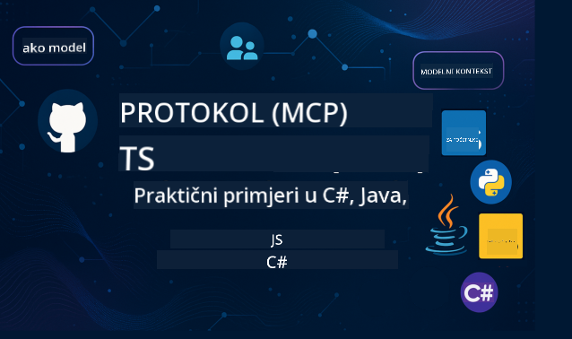

<!--
CO_OP_TRANSLATOR_METADATA:
{
  "original_hash": "2a21391378c12ecfef50f866329dfde0",
  "translation_date": "2025-05-17T05:36:09+00:00",
  "source_file": "README.md",
  "language_code": "hr"
}
-->

Pratite ove korake kako biste počeli koristiti ove resurse:
1. **Forkajte repozitorij**: Kliknite 
2. **Klonirajte repozitorij**: `git clone https://github.com/microsoft/mcp-for-beginners.git`
3. [**Pridružite se Microsoft Azure AI Foundry Discordu i upoznajte stručnjake i kolege programere**](https://discord.com/invite/ByRwuEEgH4)

### 🌐 Podrška za više jezika

#### Podržano putem GitHub Action (Automatizirano i uvijek ažurno)
[Francuski](../fr/README.md) | [Španjolski](../es/README.md) | [Njemački](../de/README.md) | [Ruski](../ru/README.md) | [Arapski](../ar/README.md) | [Perzijski (Farsi)](../fa/README.md) | [Urdu](../ur/README.md) | [Kineski (pojednostavljeni)](../zh/README.md) | [Kineski (tradicionalni, Makao)](../mo/README.md) | [Kineski (tradicionalni, Hong Kong)](../hk/README.md) | [Kineski (tradicionalni, Tajvan)](../tw/README.md) | [Japanski](../ja/README.md) | [Korejski](../ko/README.md) | [Hindski](../hi/README.md) | [Bengalski](../bn/README.md) | [Marathi](../mr/README.md) | [Nepalski](../ne/README.md) | [Punjabi (Gurmukhi)](../pa/README.md) | [Portugalski (Portugal)](../pt/README.md) | [Portugalski (Brazil)](../br/README.md) | [Talijanski](../it/README.md) | [Poljski](../pl/README.md) | [Turski](../tr/README.md) | [Grčki](../el/README.md) | [Tajlandski](../th/README.md) | [Švedski](../sv/README.md) | [Danski](../da/README.md) | [Norveški](../no/README.md) | [Finski](../fi/README.md) | [Nizozemski](../nl/README.md) | [Hebrejski](../he/README.md) | [Vijetnamski](../vi/README.md) | [Indonezijski](../id/README.md) | [Malajski](../ms/README.md) | [Tagalog (Filipinski)](../tl/README.md) | [Svahili](../sw/README.md) | [Mađarski](../hu/README.md) | [Češki](../cs/README.md) | [Slovački](../sk/README.md) | [Rumunjski](../ro/README.md) | [Bugarski](../bg/README.md) | [Srpski (ćirilica)](../sr/README.md) | [Hrvatski](./README.md) | [Slovenski](../sl/README.md)
# 🚀 Ultimativni vodič za kurikulum Model Context Protocola (MCP) za početnike

## **Naučite MCP uz praktične primjere koda u C#, Java, JavaScript, Python i TypeScript**

## 🧠 Pregled kurikuluma Model Context Protocola

**Model Context Protocol (MCP)** je napredni okvir dizajniran za standardizaciju interakcija između AI modela i klijentskih aplikacija. Ovaj open-source kurikulum nudi strukturirani put učenja, s praktičnim primjerima koda i stvarnim slučajevima upotrebe, kroz popularne programske jezike uključujući C#, Java, JavaScript, TypeScript i Python.

Bez obzira jeste li AI developer, sistemski arhitekt ili softverski inženjer, ovaj vodič je vaš sveobuhvatan resurs za savladavanje osnovnih MCP pojmova i strategija implementacije.

## 🔗 Službeni MCP resursi

- 📘 [MCP Dokumentacija](https://modelcontextprotocol.io/) – Detaljni tutorijali i korisnički vodiči  
- 📜 [MCP Specifikacija](https://spec.modelcontextprotocol.io/) – Arhitektura protokola i tehničke reference  
- 🧑‍💻 [MCP GitHub Repository](https://github.com/modelcontextprotocol) – Open-source SDK-ovi, alati i primjeri koda  

## 🧭 Kompletna struktura MCP kurikuluma

### 📌 [Uvod u MCP](./00-Introduction/README.md)

- Što je Model Context Protocol?
- Zašto je standardizacija važna u AI pipelineima
- Praktični slučajevi upotrebe i prednosti MCP-a

### 🧩 [Objašnjeni osnovni pojmovi](./01-CoreConcepts/README.md)

- Razumijevanje klijent-server arhitekture u MCP-u
- Ključne komponente protokola: zahtjevi, odgovori i sheme
- MCP obrasci razmjene poruka i podataka

### 🔐 [Sigurnost u MCP-u](./02-Security/readme.md)

- Identifikacija sigurnosnih prijetnji unutar MCP sustava
- Tehnike i najbolje prakse za osiguranje implementacija

### 🚀 [Početak rada s MCP-om](./03-GettingStarted/README.md)

- Postavljanje okruženja i konfiguracija
- Kreiranje osnovnih MCP servera i klijenata
- Integracija MCP-a s postojećim aplikacijama

#### 🧮 MCP Kalkulator projekti:

  
<strong>Istražite implementacije koda po jeziku</strong>

  - [C# MCP Server primjer](./03-GettingStarted/samples/csharp/README.md)
  - [Java MCP Kalkulator](./03-GettingStarted/samples/java/calculator/README.md)
  - [JavaScript MCP Demo](./03-GettingStarted/samples/javascript/README.md)
  - [Python MCP Server](../../03-GettingStarted/samples/python/mcp_calculator_server.py)
  - [TypeScript MCP primjer](./03-GettingStarted/samples/typescript/README.md)

### 🛠️ [Praktična implementacija](./04-PracticalImplementation/README.md)

- Korištenje SDK-ova u različitim jezicima
- Debugging, testiranje i validacija
- Izrada ponovljivih predložaka i tijekova rada

#### 💡 MCP Napredni kalkulator projekti:

  
<strong>Istražite napredne primjere</strong>

  - [Napredni C# primjer](./04-PracticalImplementation/samples/csharp/README.md)
  - [Java Container App primjer](./04-PracticalImplementation/samples/java/containerapp/README.md)
  - [JavaScript Napredni primjer](./04-PracticalImplementation/samples/javascript/README.md)
  - [Python Kompleksna implementacija](../../04-PracticalImplementation/samples/python/mcp_sample.py)
  - [TypeScript Container primjer](./04-PracticalImplementation/samples/typescript/README.md)

### 🎓 [Napredne teme u MCP-u](./05-AdvancedTopics/README.md)

- Multimodalni AI tijekovi rada i proširivost
- Sigurne strategije skaliranja
- MCP u poslovnim ekosustavima

### 🌍 [Doprinosi zajednice](./06-CommunityContributions/README.md)

- Kako doprinijeti kodu i dokumentaciji
- Suradnja putem GitHub-a
- Poboljšanja i povratne informacije vođene zajednicom

### 📈 [Uvidi iz ranog usvajanja](./07-CaseStudies/README.md)

- Implementacije u stvarnom svijetu i što je funkcioniralo
- Izgradnja i implementacija MCP-based rješenja
- Trendovi i buduća mapa puta

### 📏 [Najbolje prakse za MCP](./08-BestPractices/README.md)

- Tuning performansi i optimizacija
- Dizajniranje sustava MCP otpornih na greške
- Strategije testiranja i otpornosti

### 📊 [MCP Studije slučaja](./09-CaseStudy/Readme.md)

- Dubinski pregledi arhitekture MCP rješenja
- Plaveprinte implementacije i savjeti za integraciju
- Anotirani dijagrami i vodiči kroz projekte

## 🎯 Preduvjeti za učenje MCP-a

Da biste izvukli maksimum iz ovog kurikuluma, trebali biste imati:

- Osnovno znanje C#, Java ili Python
- Razumijevanje klijent-server modela i API-ja
- (Opcionalno) Poznavanje koncepta strojnog učenja

## 🛠️ Kako učinkovito koristiti ovaj kurikulum

Svaka lekcija u ovom vodiču uključuje:

1. Jasna objašnjenja MCP pojmova  
2. Primjere koda uživo u više jezika  
3. Vježbe za izgradnju stvarnih MCP aplikacija  
4. Dodatne resurse za napredne učenike  

## 📜 Informacije o licenci

Ovaj sadržaj je licenciran pod **MIT Licencom**. Za uvjete i odredbe, pogledajte [LICENSE](../../LICENSE).

## 🤝 Smjernice za doprinos

Ovaj projekt pozdravlja doprinose i prijedloge. Većina doprinosa zahtijeva da se složite s
Contributor License Agreement (CLA) u kojem izjavljujete da imate pravo na, i stvarno dajete, prava na korištenje vašeg doprinosa. Za detalje, posjetite <https://cla.opensource.microsoft.com>.

Kada pošaljete pull request, CLA bot će automatski odrediti trebate li dostaviti
CLA i ukrasiti PR odgovarajuće (npr. provjera statusa, komentar). Jednostavno slijedite upute
koje pruža bot. To ćete morati učiniti samo jednom za sve repozitorije koji koriste naš CLA.

Ovaj projekt je usvojio [Microsoft Open Source Code of Conduct](https://opensource.microsoft.com/codeofconduct/).
Za više informacija pogledajte [Code of Conduct FAQ](https://opensource.microsoft.com/codeofconduct/faq/) ili
kontaktirajte [opencode@microsoft.com](mailto:opencode@microsoft.com) s dodatnim pitanjima ili komentarima.

## ™️ Obavijest o zaštitnim znakovima

Ovaj projekt može sadržavati zaštitne znakove ili logotipe za projekte, proizvode ili usluge. Ovlaštena upotreba Microsoft
zaštitnih znakova ili logotipa podliježe i mora slijediti
[Microsoftove smjernice za zaštitne znakove i brend](https://www.microsoft.com/legal/intellectualproperty/trademarks/usage/general).
Upotreba Microsoftovih zaštitnih znakova ili logotipa u izmijenjenim verzijama ovog projekta ne smije izazvati zabunu ili implicirati sponzorstvo Microsofta.
Svaka upotreba zaštitnih znakova ili logotipa trećih strana podliježe politikama tih trećih strana.

**Odricanje od odgovornosti**:  
Ovaj dokument je preveden koristeći AI uslugu prevođenja [Co-op Translator](https://github.com/Azure/co-op-translator). Iako težimo ka točnosti, imajte na umu da automatski prijevodi mogu sadržavati pogreške ili netočnosti. Izvorni dokument na izvornom jeziku treba smatrati autoritativnim izvorom. Za kritične informacije preporučuje se profesionalni prijevod od strane čovjeka. Ne odgovaramo za nesporazume ili pogrešne interpretacije koje proizlaze iz korištenja ovog prijevoda.