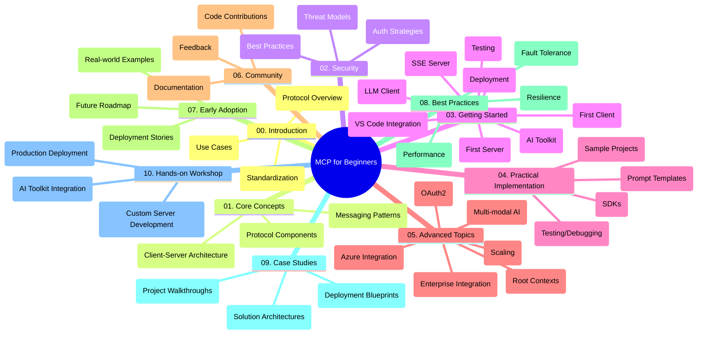

<!--
CO_OP_TRANSLATOR_METADATA:
{
  "original_hash": "a607d4febc94caee9a12b77795f7fc9a",
  "translation_date": "2025-07-13T15:19:07+00:00",
  "source_file": "study_guide.md",
  "language_code": "hr"
}
-->
# Model Context Protocol (MCP) za početnike - vodič za učenje

Ovaj vodič za učenje pruža pregled strukture i sadržaja repozitorija za kurikulum "Model Context Protocol (MCP) za početnike". Koristite ovaj vodič za efikasno snalaženje u repozitoriju i maksimalno iskorištavanje dostupnih resursa.

## Pregled repozitorija

Model Context Protocol (MCP) je standardizirani okvir za interakcije između AI modela i klijentskih aplikacija. Ovaj repozitorij nudi sveobuhvatan kurikulum s praktičnim primjerima koda u C#, Javi, JavaScriptu, Pythonu i TypeScriptu, namijenjen AI developerima, sistemskim arhitektima i softverskim inženjerima.

## Vizualna karta kurikuluma

## Struktura repozitorija

Repozitorij je organiziran u deset glavnih sekcija, od kojih se svaka fokusira na različite aspekte MCP-a:

1. **Uvod (00-Introduction/)**
   - Pregled Model Context Protocola
   - Zašto je standardizacija važna u AI procesima
   - Praktični primjeri i koristi

2. **Osnovni pojmovi (01-CoreConcepts/)**
   - Klijent-server arhitektura
   - Ključne komponente protokola
   - Obrasci razmjene poruka u MCP-u

3. **Sigurnost (02-Security/)**
   - Sigurnosne prijetnje u sustavima baziranim na MCP-u
   - Najbolje prakse za osiguranje implementacija
   - Strategije autentikacije i autorizacije

4. **Početak rada (03-GettingStarted/)**
   - Postavljanje i konfiguracija okruženja
   - Kreiranje osnovnih MCP servera i klijenata
   - Integracija s postojećim aplikacijama
   - Podsekcije za prvi server, prvi klijent, LLM klijent, integraciju s VS Code, SSE server, AI Toolkit, testiranje i deployment

5. **Praktična implementacija (04-PracticalImplementation/)**
   - Korištenje SDK-ova u različitim programskim jezicima
   - Tehnike debugiranja, testiranja i validacije
   - Izrada ponovljivih predložaka promptova i radnih tokova
   - Primjeri projekata s implementacijama

6. **Napredne teme (05-AdvancedTopics/)**
   - Multi-modalni AI radni tokovi i proširivost
   - Sigurne strategije skaliranja
   - MCP u enterprise ekosustavima
   - Specijalizirane teme uključujući Azure integraciju, multi-modalnost, OAuth2, root kontekste, rutiranje, uzorkovanje, skaliranje, sigurnost, integraciju web pretraživanja i streaming

7. **Doprinosi zajednice (06-CommunityContributions/)**
   - Kako doprinijeti kodom i dokumentacijom
   - Suradnja putem GitHub-a
   - Poboljšanja i povratne informacije vođene zajednicom

8. **Lekcije iz ranog usvajanja (07-LessonsfromEarlyAdoption/)**
   - Implementacije iz stvarnog svijeta i uspješne priče
   - Izgradnja i deployment rješenja baziranih na MCP-u
   - Trendovi i budući planovi

9. **Najbolje prakse (08-BestPractices/)**
   - Podešavanje performansi i optimizacija
   - Dizajn otpornog MCP sustava
   - Strategije testiranja i otpornosti

10. **Studije slučaja (09-CaseStudy/)**
    - Detaljni pregledi arhitektura MCP rješenja
    - Planovi za deployment i savjeti za integraciju
    - Annotirani dijagrami i vođeni pregledi projekata

11. **Praktična radionica (10-StreamliningAIWorkflowsBuildingAnMCPServerWithAIToolkit/)**
    - Sveobuhvatna radionica koja spaja MCP s Microsoftovim AI Toolkitom za VS Code
    - Izgradnja inteligentnih aplikacija koje povezuju AI modele s alatima iz stvarnog svijeta
    - Praktični moduli koji pokrivaju osnove, razvoj prilagođenog servera i strategije produkcijskog deploymenta

## Primjeri projekata

Repozitorij sadrži više primjera projekata koji demonstriraju implementaciju MCP-a u različitim programskim jezicima:

### Osnovni MCP kalkulator primjeri
- C# MCP server primjer
- Java MCP kalkulator
- JavaScript MCP demo
- Python MCP server
- TypeScript MCP primjer

### Napredni MCP kalkulator projekti
- Napredni C# primjer
- Java aplikacija u kontejneru
- JavaScript napredni primjer
- Python složena implementacija
- TypeScript kontejnerski primjer

## Dodatni resursi

Repozitorij uključuje prateće resurse:

- **Mapa Images**: Sadrži dijagrame i ilustracije korištene kroz kurikulum
- **Prijevodi**: Podrška za više jezika s automatskim prijevodima dokumentacije
- **Službeni MCP resursi**:
  - [MCP Dokumentacija](https://modelcontextprotocol.io/)
  - [MCP Specifikacija](https://spec.modelcontextprotocol.io/)
  - [MCP GitHub Repozitorij](https://github.com/modelcontextprotocol)

## Kako koristiti ovaj repozitorij

1. **Učenje po redu**: Slijedite poglavlja redom (od 00 do 10) za strukturirano učenje.
2. **Fokus na određeni jezik**: Ako vas zanima određeni programski jezik, istražite direktorije s primjerima za implementacije na željenom jeziku.
3. **Praktična implementacija**: Počnite s odjeljkom "Početak rada" za postavljanje okruženja i kreiranje prvog MCP servera i klijenta.
4. **Napredno istraživanje**: Kad savladate osnove, zaronite u napredne teme za proširenje znanja.
5. **Uključenje u zajednicu**: Pridružite se [Azure AI Foundry Discord](https://discord.com/invite/ByRwuEEgH4) kako biste se povezali s ekspertima i kolegama developerima.

## Doprinosi

Ovaj repozitorij poziva zajednicu na doprinos. Pogledajte odjeljak Doprinosi zajednice za upute kako doprinijeti.

---

*Ovaj vodič za učenje izrađen je 11. lipnja 2025. i pruža pregled repozitorija na taj datum. Sadržaj repozitorija mogao je biti ažuriran od tada.*

**Odricanje od odgovornosti**:  
Ovaj dokument je preveden korištenjem AI usluge za prevođenje [Co-op Translator](https://github.com/Azure/co-op-translator). Iako težimo točnosti, imajte na umu da automatski prijevodi mogu sadržavati pogreške ili netočnosti. Izvorni dokument na izvornom jeziku treba smatrati autoritativnim izvorom. Za kritične informacije preporučuje se profesionalni ljudski prijevod. Ne snosimo odgovornost za bilo kakva nesporazuma ili pogrešna tumačenja koja proizlaze iz korištenja ovog prijevoda.