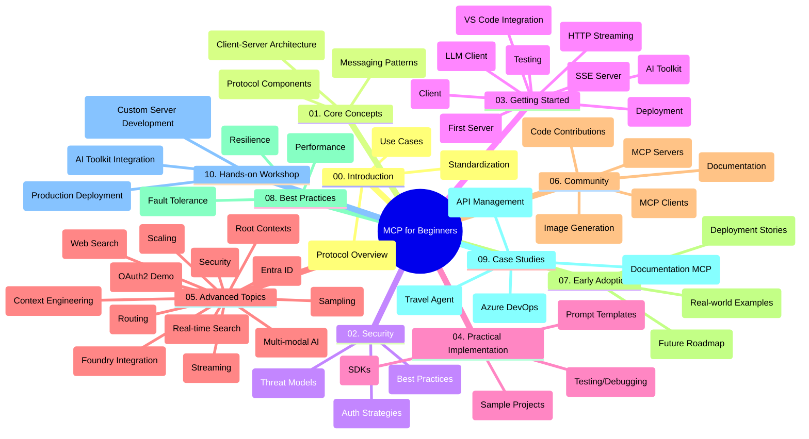

<!--
CO_OP_TRANSLATOR_METADATA:
{
  "original_hash": "5f321ea583cf087a94e47ee74c62b504",
  "translation_date": "2025-07-17T11:59:36+00:00",
  "source_file": "study_guide.md",
  "language_code": "hr"
}
-->
# Model Context Protocol (MCP) za početnike - vodič za učenje

Ovaj vodič za učenje pruža pregled strukture i sadržaja repozitorija za kurikulum "Model Context Protocol (MCP) za početnike". Koristite ovaj vodič za učinkovito snalaženje u repozitoriju i maksimalno iskorištavanje dostupnih resursa.

## Pregled repozitorija

Model Context Protocol (MCP) je standardizirani okvir za interakcije između AI modela i klijentskih aplikacija. Izvorno ga je stvorio Anthropic, a sada ga održava šira MCP zajednica putem službene GitHub organizacije. Ovaj repozitorij nudi sveobuhvatan kurikulum s praktičnim primjerima koda u C#, Javi, JavaScriptu, Pythonu i TypeScriptu, namijenjen AI developerima, sistemskim arhitektima i softverskim inženjerima.

## Vizualna karta kurikuluma

## Struktura repozitorija

Repozitorij je organiziran u deset glavnih sekcija, od kojih se svaka fokusira na različite aspekte MCP-a:

1. **Uvod (00-Introduction/)**
   - Pregled Model Context Protocola
   - Zašto je standardizacija važna u AI procesima
   - Praktične primjene i prednosti

2. **Osnovni pojmovi (01-CoreConcepts/)**
   - Klijent-server arhitektura
   - Ključne komponente protokola
   - Obrasci poruka u MCP-u

3. **Sigurnost (02-Security/)**
   - Sigurnosne prijetnje u sustavima temeljenim na MCP-u
   - Najbolje prakse za osiguranje implementacija
   - Strategije autentikacije i autorizacije

4. **Početak rada (03-GettingStarted/)**
   - Postavljanje i konfiguracija okruženja
   - Kreiranje osnovnih MCP servera i klijenata
   - Integracija s postojećim aplikacijama
   - Uključuje sekcije za:
     - Prvu implementaciju servera
     - Razvoj klijenta
     - Integraciju LLM klijenta
     - Integraciju u VS Code
     - Server-Sent Events (SSE) server
     - HTTP streaming
     - Integraciju AI Toolkit-a
     - Strategije testiranja
     - Smjernice za implementaciju

5. **Praktična implementacija (04-PracticalImplementation/)**
   - Korištenje SDK-ova u različitim programskim jezicima
   - Tehnike otklanjanja pogrešaka, testiranja i validacije
   - Izrada ponovljivih predložaka promptova i tijekova rada
   - Primjeri projekata s implementacijama

6. **Napredne teme (05-AdvancedTopics/)**
   - Tehnike inženjeringa konteksta
   - Integracija Foundry agenta
   - Višestruki modaliteti AI tijekova rada
   - Demonstracije OAuth2 autentikacije
   - Mogućnosti pretraživanja u stvarnom vremenu
   - Streaming u stvarnom vremenu
   - Implementacija root konteksta
   - Strategije usmjeravanja
   - Tehnike uzorkovanja
   - Pristupi skaliranju
   - Sigurnosni aspekti
   - Integracija Entra ID sigurnosti
   - Integracija web pretraživanja

7. **Doprinosi zajednice (06-CommunityContributions/)**
   - Kako doprinijeti kodom i dokumentacijom
   - Suradnja putem GitHub-a
   - Poboljšanja i povratne informacije vođene zajednicom
   - Korištenje različitih MCP klijenata (Claude Desktop, Cline, VSCode)
   - Rad s popularnim MCP serverima uključujući generiranje slika

8. **Lekcije iz ranog usvajanja (07-LessonsfromEarlyAdoption/)**
   - Implementacije iz stvarnog svijeta i uspješne priče
   - Izgradnja i implementacija rješenja temeljenih na MCP-u
   - Trendovi i budući planovi

9. **Najbolje prakse (08-BestPractices/)**
   - Podešavanje performansi i optimizacija
   - Dizajn otpornog MCP sustava
   - Strategije testiranja i otpornosti

10. **Studije slučaja (09-CaseStudy/)**
    - Studija slučaja: integracija Azure API Managementa
    - Studija slučaja: implementacija turističkog agenta
    - Studija slučaja: integracija Azure DevOps-a s YouTube-om
    - Primjeri implementacija s detaljnom dokumentacijom

11. **Praktična radionica (10-StreamliningAIWorkflowsBuildingAnMCPServerWithAIToolkit/)**
    - Sveobuhvatna praktična radionica koja kombinira MCP s AI Toolkit-om
    - Izgradnja inteligentnih aplikacija koje povezuju AI modele s alatima iz stvarnog svijeta
    - Praktični moduli koji pokrivaju osnove, razvoj prilagođenih servera i strategije produkcijske implementacije
    - Pristup učenju kroz laboratorijske vježbe s detaljnim uputama

## Dodatni resursi

Repozitorij uključuje prateće resurse:

- **Mapa slika**: Sadrži dijagrame i ilustracije korištene kroz kurikulum
- **Prijevodi**: Podrška za više jezika s automatskim prijevodima dokumentacije
- **Službeni MCP resursi**:
  - [MCP Dokumentacija](https://modelcontextprotocol.io/)
  - [MCP Specifikacija](https://spec.modelcontextprotocol.io/)
  - [MCP GitHub Repozitorij](https://github.com/modelcontextprotocol)

## Kako koristiti ovaj repozitorij

1. **Učenje po redu**: Slijedite poglavlja redom (od 00 do 10) za strukturirano učenje.
2. **Fokus na određeni jezik**: Ako vas zanima određeni programski jezik, istražite direktorije s primjerima za implementacije na željenom jeziku.
3. **Praktična implementacija**: Počnite sa sekcijom "Početak rada" za postavljanje okruženja i kreiranje prvog MCP servera i klijenta.
4. **Napredno istraživanje**: Kad savladate osnove, zaronite u napredne teme za proširenje znanja.
5. **Angažman u zajednici**: Pridružite se MCP zajednici putem GitHub diskusija i Discord kanala za povezivanje s ekspertima i kolegama developerima.

## MCP klijenti i alati

Kurikulum pokriva različite MCP klijente i alate:

1. **Službeni klijenti**:
   - Visual Studio Code
   - MCP u Visual Studio Code-u
   - Claude Desktop
   - Claude u VSCode-u
   - Claude API

2. **Klijenti zajednice**:
   - Cline (terminalski)
   - Cursor (uređivač koda)
   - ChatMCP
   - Windsurf

3. **Alati za upravljanje MCP-om**:
   - MCP CLI
   - MCP Manager
   - MCP Linker
   - MCP Router

## Popularni MCP serveri

Repozitorij predstavlja različite MCP servere, uključujući:

1. **Službeni referentni serveri**:
   - Filesystem
   - Fetch
   - Memory
   - Sequential Thinking

2. **Generiranje slika**:
   - Azure OpenAI DALL-E 3
   - Stable Diffusion WebUI
   - Replicate

3. **Alati za razvoj**:
   - Git MCP
   - Terminal Control
   - Code Assistant

4. **Specijalizirani serveri**:
   - Salesforce
   - Microsoft Teams
   - Jira & Confluence

## Doprinosi

Ovaj repozitorij pozdravlja doprinose iz zajednice. Pogledajte sekciju Doprinosi zajednice za upute kako učinkovito doprinositi MCP ekosustavu.

## Dnevnik promjena

| Datum | Promjene |
|-------|----------|
| 16. srpnja 2025. | - Ažurirana struktura repozitorija u skladu s trenutnim sadržajem - Dodana sekcija MCP klijenata i alata - Dodana sekcija popularnih MCP servera - Ažurirana vizualna karta kurikuluma sa svim aktualnim temama - Proširena sekcija naprednih tema sa svim specijaliziranim područjima - Ažurirane studije slučaja s aktualnim primjerima - Pojašnjen MCP kao protokol koji je stvorio Anthropic |
| 11. lipnja 2025. | - Prvotno kreiranje vodiča za učenje - Dodana vizualna karta kurikuluma - Nacrtana struktura repozitorija - Uključeni primjeri projekata i dodatni resursi |

---

*Ovaj vodič za učenje ažuriran je 16. srpnja 2025. i pruža pregled repozitorija na taj datum. Sadržaj repozitorija može biti ažuriran i nakon tog datuma.*

**Odricanje od odgovornosti**:  
Ovaj dokument je preveden korištenjem AI usluge za prevođenje [Co-op Translator](https://github.com/Azure/co-op-translator). Iako težimo točnosti, imajte na umu da automatski prijevodi mogu sadržavati pogreške ili netočnosti. Izvorni dokument na izvornom jeziku treba smatrati službenim i autoritativnim izvorom. Za kritične informacije preporučuje se profesionalni ljudski prijevod. Ne snosimo odgovornost za bilo kakva nesporazuma ili pogrešna tumačenja koja proizlaze iz korištenja ovog prijevoda.