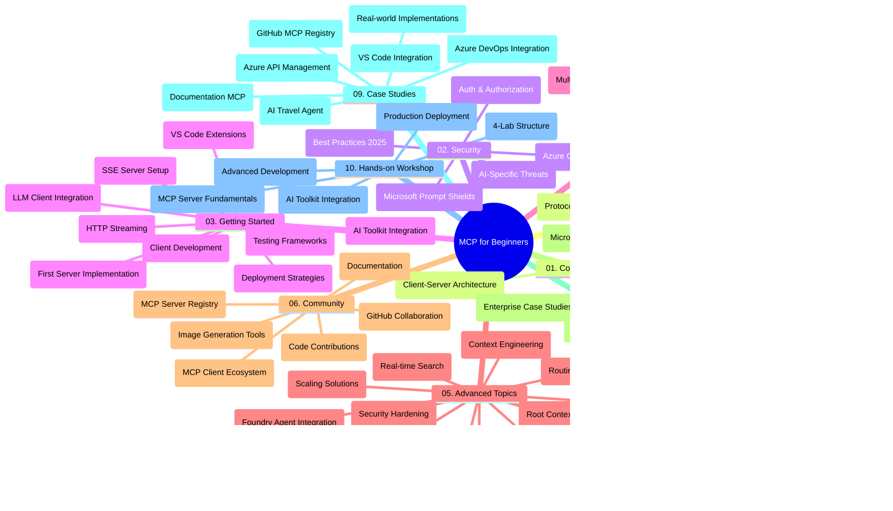

<!--
CO_OP_TRANSLATOR_METADATA:
{
  "original_hash": "719117a0a5f34ade7b5dfb61ee06fb13",
  "translation_date": "2025-09-26T19:14:11+00:00",
  "source_file": "study_guide.md",
  "language_code": "hr"
}
-->
# Protokol konteksta modela (MCP) za početnike - Vodič za učenje

Ovaj vodič za učenje pruža pregled strukture repozitorija i sadržaja za kurikulum "Protokol konteksta modela (MCP) za početnike". Koristite ovaj vodič kako biste učinkovito navigirali repozitorijem i maksimalno iskoristili dostupne resurse.

## Pregled repozitorija

Protokol konteksta modela (MCP) je standardizirani okvir za interakcije između AI modela i klijentskih aplikacija. Prvotno ga je kreirao Anthropic, a MCP sada održava šira MCP zajednica putem službene GitHub organizacije. Ovaj repozitorij pruža sveobuhvatan kurikulum s praktičnim primjerima koda u C#, Java, JavaScript, Python i TypeScript, namijenjen AI programerima, sistemskim arhitektima i softverskim inženjerima.

## Vizualna mapa kurikuluma

## Struktura repozitorija

Repozitorij je organiziran u deset glavnih sekcija, od kojih svaka pokriva različite aspekte MCP-a:

1. **Uvod (00-Introduction/)**
   - Pregled Protokola konteksta modela
   - Zašto je standardizacija važna u AI procesima
   - Praktični primjeri korištenja i prednosti

2. **Osnovni koncepti (01-CoreConcepts/)**
   - Arhitektura klijent-server
   - Ključne komponente protokola
   - Obrasci razmjene poruka u MCP-u

3. **Sigurnost (02-Security/)**
   - Sigurnosne prijetnje u sustavima temeljenim na MCP-u
   - Najbolje prakse za osiguranje implementacija
   - Strategije autentifikacije i autorizacije
   - **Sveobuhvatna dokumentacija o sigurnosti**:
     - MCP najbolje prakse za sigurnost 2025
     - Vodič za implementaciju sigurnosti sadržaja u Azureu
     - Kontrole i tehnike sigurnosti MCP-a
     - Brzi referentni vodič za najbolje prakse MCP-a
   - **Ključne teme sigurnosti**:
     - Napadi ubrizgavanjem prompta i trovanje alata
     - Otimanje sesije i problemi zbunjenog zamjenika
     - Ranljivosti prijenosa tokena
     - Prekomjerne dozvole i kontrola pristupa
     - Sigurnost opskrbnog lanca za AI komponente
     - Integracija Microsoft Prompt Shields

4. **Prvi koraci (03-GettingStarted/)**
   - Postavljanje i konfiguracija okruženja
   - Kreiranje osnovnih MCP servera i klijenata
   - Integracija s postojećim aplikacijama
   - Uključuje sekcije za:
     - Prvu implementaciju servera
     - Razvoj klijenta
     - Integraciju LLM klijenta
     - Integraciju s VS Code
     - Server-Sent Events (SSE) server
     - HTTP streaming
     - Integraciju AI alata
     - Strategije testiranja
     - Smjernice za implementaciju

5. **Praktična implementacija (04-PracticalImplementation/)**
   - Korištenje SDK-ova u različitim programskim jezicima
   - Tehnike za otklanjanje grešaka, testiranje i validaciju
   - Izrada predložaka prompta i radnih tijekova koji se mogu ponovno koristiti
   - Primjeri projekata s implementacijom

6. **Napredne teme (05-AdvancedTopics/)**
   - Tehnike inženjeringa konteksta
   - Integracija Foundry agenta
   - Multimodalni AI radni tijekovi
   - Demonstracije autentifikacije putem OAuth2
   - Sposobnosti pretraživanja u stvarnom vremenu
   - Streaming u stvarnom vremenu
   - Implementacija korijenskih konteksta
   - Strategije usmjeravanja
   - Tehnike uzorkovanja
   - Pristupi skaliranju
   - Sigurnosna razmatranja
   - Integracija sigurnosti Entra ID-a
   - Integracija web pretraživanja

7. **Doprinosi zajednice (06-CommunityContributions/)**
   - Kako doprinijeti kodu i dokumentaciji
   - Suradnja putem GitHuba
   - Poboljšanja i povratne informacije vođene zajednicom
   - Korištenje različitih MCP klijenata (Claude Desktop, Cline, VSCode)
   - Rad s popularnim MCP serverima uključujući generiranje slika

8. **Lekcije iz ranog usvajanja (07-LessonsfromEarlyAdoption/)**
   - Implementacije u stvarnom svijetu i priče o uspjehu
   - Izgradnja i implementacija rješenja temeljenih na MCP-u
   - Trendovi i buduća mapa puta
   - **Vodič za Microsoft MCP servere**: Sveobuhvatan vodič za 10 Microsoft MCP servera spremnih za produkciju, uključujući:
     - Microsoft Learn Docs MCP Server
     - Azure MCP Server (15+ specijaliziranih konektora)
     - GitHub MCP Server
     - Azure DevOps MCP Server
     - MarkItDown MCP Server
     - SQL Server MCP Server
     - Playwright MCP Server
     - Dev Box MCP Server
     - Azure AI Foundry MCP Server
     - Microsoft 365 Agents Toolkit MCP Server

9. **Najbolje prakse (08-BestPractices/)**
   - Podešavanje performansi i optimizacija
   - Dizajniranje sustava MCP otpornog na greške
   - Strategije testiranja i otpornosti

10. **Studije slučaja (09-CaseStudy/)**
    - **Sedam sveobuhvatnih studija slučaja** koje demonstriraju svestranost MCP-a u različitim scenarijima:
    - **Azure AI putnički agenti**: Orkestracija više agenata s Azure OpenAI i AI pretraživanjem
    - **Integracija Azure DevOpsa**: Automatizacija radnih tijekova s ažuriranjima podataka s YouTubea
    - **Dohvaćanje dokumentacije u stvarnom vremenu**: Python konzolni klijent s HTTP streamingom
    - **Interaktivni generator plana učenja**: Chainlit web aplikacija s konverzacijskim AI-jem
    - **Dokumentacija unutar uređivača**: Integracija s VS Code i GitHub Copilot radnim tijekovima
    - **Upravljanje API-jem u Azureu**: Integracija API-ja za poduzeća s kreiranjem MCP servera
    - **GitHub MCP Registry**: Razvoj ekosustava i platforma za agentičku integraciju
    - Primjeri implementacije koji obuhvaćaju integraciju u poduzeću, produktivnost programera i razvoj ekosustava

11. **Praktična radionica (10-StreamliningAIWorkflowsBuildingAnMCPServerWithAIToolkit/)**
    - Sveobuhvatna praktična radionica koja kombinira MCP s AI alatom
    - Izgradnja inteligentnih aplikacija koje povezuju AI modele s alatima iz stvarnog svijeta
    - Praktični moduli koji pokrivaju osnove, razvoj prilagođenih servera i strategije implementacije u produkciji
    - **Struktura laboratorija**:
      - Laboratorij 1: Osnove MCP servera
      - Laboratorij 2: Napredni razvoj MCP servera
      - Laboratorij 3: Integracija AI alata
      - Laboratorij 4: Implementacija u produkciji i skaliranje
    - Pristup učenju temeljen na laboratorijima s detaljnim uputama

## Dodatni resursi

Repozitorij uključuje podršku resursima:

- **Mapa slika**: Sadrži dijagrame i ilustracije korištene u cijelom kurikulumu
- **Prijevodi**: Podrška za više jezika s automatskim prijevodima dokumentacije
- **Službeni MCP resursi**:
  - [MCP Dokumentacija](https://modelcontextprotocol.io/)
  - [MCP Specifikacija](https://spec.modelcontextprotocol.io/)
  - [MCP GitHub Repozitorij](https://github.com/modelcontextprotocol)

## Kako koristiti ovaj repozitorij

1. **Sekvencijalno učenje**: Slijedite poglavlja redom (00 do 10) za strukturirano iskustvo učenja.
2. **Fokus na specifični jezik**: Ako vas zanima određeni programski jezik, istražite direktorije s primjerima implementacije u željenom jeziku.
3. **Praktična implementacija**: Započnite s odjeljkom "Prvi koraci" kako biste postavili svoje okruženje i kreirali svoj prvi MCP server i klijent.
4. **Napredno istraživanje**: Kada savladate osnove, zaronite u napredne teme kako biste proširili svoje znanje.
5. **Angažman zajednice**: Pridružite se MCP zajednici putem GitHub rasprava i Discord kanala kako biste se povezali s stručnjacima i drugim programerima.

## MCP klijenti i alati

Kurikulum pokriva različite MCP klijente i alate:

1. **Službeni klijenti**:
   - Visual Studio Code 
   - MCP u Visual Studio Code
   - Claude Desktop
   - Claude u VSCode 
   - Claude API

2. **Klijenti zajednice**:
   - Cline (temeljen na terminalu)
   - Cursor (uređivač koda)
   - ChatMCP
   - Windsurf

3. **Alati za upravljanje MCP-om**:
   - MCP CLI
   - MCP Manager
   - MCP Linker
   - MCP Router

## Popularni MCP serveri

Repozitorij uvodi različite MCP servere, uključujući:

1. **Službeni Microsoft MCP serveri**:
   - Microsoft Learn Docs MCP Server
   - Azure MCP Server (15+ specijaliziranih konektora)
   - GitHub MCP Server
   - Azure DevOps MCP Server
   - MarkItDown MCP Server
   - SQL Server MCP Server
   - Playwright MCP Server
   - Dev Box MCP Server
   - Azure AI Foundry MCP Server
   - Microsoft 365 Agents Toolkit MCP Server

2. **Referentni serveri**:
   - Filesystem
   - Fetch
   - Memory
   - Sequential Thinking

3. **Generiranje slika**:
   - Azure OpenAI DALL-E 3
   - Stable Diffusion WebUI
   - Replicate

4. **Alati za razvoj**:
   - Git MCP
   - Terminal Control
   - Code Assistant

5. **Specijalizirani serveri**:
   - Salesforce
   - Microsoft Teams
   - Jira & Confluence

## Doprinosi

Ovaj repozitorij pozdravlja doprinose zajednice. Pogledajte odjeljak Doprinosi zajednice za smjernice o tome kako učinkovito doprinijeti MCP ekosustavu.

## Promjene

| Datum | Promjene |
|------|---------|
| 26. rujna 2025 | - Dodana studija slučaja GitHub MCP Registry u odjeljak 09-CaseStudy - Ažurirane studije slučaja kako bi odražavale sedam sveobuhvatnih studija slučaja - Poboljšani opisi studija slučaja s detaljima implementacije - Ažurirana vizualna mapa kurikuluma kako bi uključila GitHub MCP Registry - Revidirana struktura vodiča za učenje kako bi odražavala fokus na razvoj ekosustava |
| 18. srpnja 2025 | - Ažurirana struktura repozitorija kako bi uključila Vodič za Microsoft MCP servere - Dodan sveobuhvatan popis 10 Microsoft MCP servera spremnih za produkciju - Poboljšan odjeljak Popularni MCP serveri s službenim Microsoft MCP serverima - Ažuriran odjeljak Studije slučaja s stvarnim primjerima datoteka - Dodani detalji strukture laboratorija za praktičnu radionicu |
| 16. srpnja 2025 | - Ažurirana struktura repozitorija kako bi odražavala trenutni sadržaj - Dodan odjeljak MCP klijenti i alati - Dodan odjeljak Popularni MCP serveri - Ažurirana vizualna mapa kurikuluma sa svim trenutnim temama - Poboljšan odjeljak Napredne teme sa svim specijaliziranim područjima - Ažurirane studije slučaja kako bi odražavale stvarne primjere - Pojašnjeno MCP podrijetlo kao kreacija Anthropic-a |
| 11. lipnja 2025 | - Početno kreiranje vodiča za učenje - Dodana vizualna mapa kurikuluma - Nacrtana struktura repozitorija - Uključeni primjeri projekata i dodatni resursi |

---

*Ovaj vodič za učenje ažuriran je 26. rujna 2025. i pruža pregled repozitorija na taj datum. Sadržaj repozitorija može biti ažuriran nakon ovog datuma.*

---

