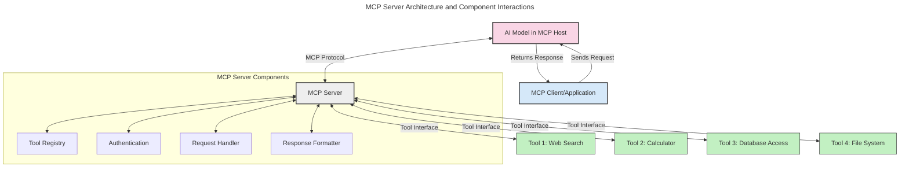
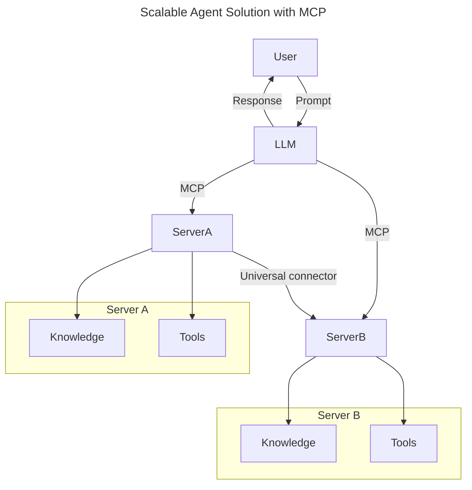
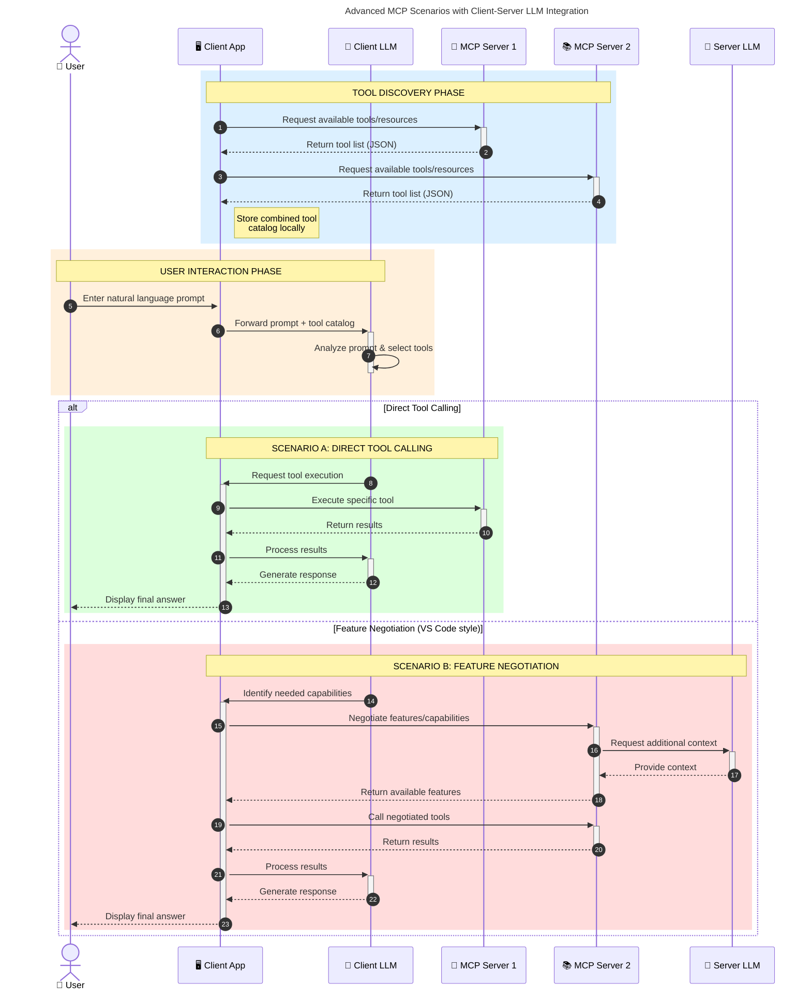

<!--
CO_OP_TRANSLATOR_METADATA:
{
  "original_hash": "105c2ddbb77bc38f7e9df009e1b06e45",
  "translation_date": "2025-07-04T18:28:11+00:00",
  "source_file": "00-Introduction/README.md",
  "language_code": "hu"
}
-->
# Bevezetés a Model Context Protocol (MCP) világába: Miért fontos a skálázható AI alkalmazásokhoz

A generatív AI alkalmazások nagy előrelépést jelentenek, hiszen gyakran lehetővé teszik a felhasználók számára, hogy természetes nyelvű utasításokkal kommunikáljanak az alkalmazással. Azonban, ahogy egyre több időt és erőforrást fektetünk ezekbe az alkalmazásokba, fontos, hogy könnyen integrálhassunk funkciókat és erőforrásokat úgy, hogy az egyszerűen bővíthető legyen, az alkalmazás több modellt is képes legyen kezelni, és a különböző modellbeli sajátosságokat is kezelni tudja. Röviden: a generatív AI alkalmazások fejlesztése kezdetben egyszerű, de ahogy nőnek és összetettebbé válnak, szükségessé válik egy jól definiált architektúra, és valószínűleg egy szabványra is támaszkodni kell, hogy az alkalmazások konzisztensen épüljenek fel. Itt lép be a képbe az MCP, amely rendszerez és szabványt biztosít.

---

## **🔍 Mi az a Model Context Protocol (MCP)?**

A **Model Context Protocol (MCP)** egy **nyílt, szabványosított interfész**, amely lehetővé teszi a nagy nyelvi modellek (LLM-ek) számára, hogy zökkenőmentesen kommunikáljanak külső eszközökkel, API-kkal és adatforrásokkal. Egy egységes architektúrát kínál, amely kibővíti az AI modellek képességeit a tanító adatokon túl, így okosabb, skálázhatóbb és reagálóképesebb AI rendszerek hozhatók létre.

---

## **🎯 Miért fontos a szabványosítás az AI-ban**

Ahogy a generatív AI alkalmazások egyre összetettebbé válnak, elengedhetetlen szabványokat alkalmazni, amelyek biztosítják a **skálázhatóságot, bővíthetőséget** és a **fenntarthatóságot**. Az MCP ezekre a kihívásokra ad választ az alábbi módokon:

- Egységesíti a modell-eszköz integrációkat
- Csökkenti az egyedi, törékeny megoldásokat
- Lehetővé teszi több modell egyidejű használatát egy ökoszisztémán belül

---

## **📚 Tanulási célok**

A cikk végére képes leszel:

- Meghatározni a **Model Context Protocol (MCP)** fogalmát és alkalmazási területeit
- Megérteni, hogyan szabványosítja az MCP a modell és eszköz közötti kommunikációt
- Azonosítani az MCP architektúra főbb elemeit
- Felfedezni az MCP valós vállalati és fejlesztői alkalmazásait

---

## **💡 Miért forradalmi a Model Context Protocol (MCP)**

### **🔗 Az MCP megoldja az AI interakciók széttagoltságát**

Az MCP előtt a modellek és eszközök integrálása:

- Egyedi kódot igényelt minden eszköz-modell párosra
- Nem szabványos API-kat használt minden szolgáltatónál
- Gyakori hibákat okozott frissítések során
- Rossz skálázhatóságot eredményezett több eszköz esetén

### **✅ Az MCP szabványosítás előnyei**

| **Előny**                | **Leírás**                                                                    |
|--------------------------|-------------------------------------------------------------------------------|
| Interoperabilitás        | Az LLM-ek zökkenőmentesen működnek együtt különböző gyártók eszközeivel       |
| Konzisztencia            | Egységes viselkedés platformok és eszközök között                             |
| Újrafelhasználhatóság    | Egyszer megépített eszközök több projektben és rendszerben is használhatók    |
| Gyorsított fejlesztés    | Csökkenti a fejlesztési időt szabványos, plug-and-play interfészekkel         |

---

## **🧱 Az MCP magas szintű architektúrája**

Az MCP egy **kliens-szerver modellt** követ, ahol:

- **MCP Hostok** futtatják az AI modelleket
- **MCP Kliensek** indítják a kéréseket
- **MCP Szerverek** szolgáltatják a kontextust, eszközöket és képességeket

### **Főbb komponensek:**

- **Erőforrások** – statikus vagy dinamikus adatok a modellek számára  
- **Promptok** – előre definiált munkafolyamatok irányított generáláshoz  
- **Eszközök** – végrehajtható funkciók, mint keresés, számítások  
- **Mintavételezés** – ügynöki viselkedés rekurzív interakciókon keresztül

---

## Hogyan működnek az MCP szerverek

Az MCP szerverek a következőképpen működnek:

- **Kérés folyamata**:  
    1. Az MCP kliens kérést küld az AI modellnek, amely egy MCP hoston fut.  
    2. Az AI modell felismeri, mikor van szüksége külső eszközökre vagy adatokra.  
    3. A modell a szabványosított protokoll segítségével kommunikál az MCP szerverrel.

- **MCP szerver funkciói**:  
    - Eszközregiszter: Nyilvántartja az elérhető eszközöket és képességeiket.  
    - Hitelesítés: Ellenőrzi az eszközhasználati jogosultságokat.  
    - Kéréskezelő: Feldolgozza a modellből érkező eszközkéréseket.  
    - Válaszformázó: Az eszközök kimenetét a modell által értelmezhető formátumba rendezi.

- **Eszközvégrehajtás**:  
    - A szerver továbbítja a kéréseket a megfelelő külső eszközökhöz  
    - Az eszközök végrehajtják speciális funkcióikat (keresés, számítás, adatbázis-lekérdezés stb.)  
    - Az eredményeket egységes formátumban visszaküldik a modellnek.

- **Válasz befejezése**:  
    - Az AI modell beépíti az eszközök eredményeit a válaszába.  
    - A végső választ visszaküldi a kliens alkalmazásnak.

## 👨‍💻 Hogyan építsünk MCP szervert (példákkal)

Az MCP szerverek lehetővé teszik az LLM képességek bővítését adatokkal és funkciókkal.

Készen állsz kipróbálni? Íme néhány példa egyszerű MCP szerver létrehozására különböző nyelveken:

- **Python példa**: https://github.com/modelcontextprotocol/python-sdk

- **TypeScript példa**: https://github.com/modelcontextprotocol/typescript-sdk

- **Java példa**: https://github.com/modelcontextprotocol/java-sdk

- **C#/.NET példa**: https://github.com/modelcontextprotocol/csharp-sdk

## 🌍 Az MCP valós alkalmazási esetei

Az MCP széles körű alkalmazásokat tesz lehetővé az AI képességek bővítésével:

| **Alkalmazás**             | **Leírás**                                                                    |
|----------------------------|-------------------------------------------------------------------------------|
| Vállalati adatintegráció   | LLM-ek összekapcsolása adatbázisokkal, CRM-ekkel vagy belső eszközökkel       |
| Ügynöki AI rendszerek      | Autonóm ügynökök eszközhozzáféréssel és döntéshozatali munkafolyamatokkal    |
| Többmodalitású alkalmazások| Szöveg, kép és hang eszközök kombinálása egyetlen egységes AI alkalmazásban   |
| Valós idejű adatintegráció | Élő adatok bevonása az AI interakciókba a pontosabb, aktuális eredményekért    |

### 🧠 MCP = Univerzális szabvány az AI interakciókhoz

A Model Context Protocol (MCP) olyan univerzális szabványként működik az AI interakciókban, mint ahogy az USB-C szabványosította az eszközök fizikai csatlakozását. Az AI világában az MCP egységes interfészt biztosít, amely lehetővé teszi, hogy a modellek (kliensek) zökkenőmentesen integrálódjanak külső eszközökkel és adatforrásokkal (szerverekkel). Ez megszünteti az egyedi, különböző protokollok szükségességét minden API vagy adatforrás esetén.

Az MCP-kompatibilis eszköz (MCP szerver) egységes szabványt követ. Ezek a szerverek listázzák az általuk kínált eszközöket vagy műveleteket, és végrehajtják azokat, amikor egy AI ügynök kéri. Az MCP-t támogató AI ügynök platformok képesek felfedezni a szerverek elérhető eszközeit, és ezen szabványos protokollon keresztül meghívni azokat.

### 💡 Tudáshoz való hozzáférés megkönnyítése

Az eszközök kínálatán túl az MCP megkönnyíti a tudáshoz való hozzáférést is. Lehetővé teszi, hogy az alkalmazások kontextust biztosítsanak a nagy nyelvi modelleknek (LLM-eknek) azáltal, hogy összekapcsolják őket különböző adatforrásokkal. Például egy MCP szerver képviselheti egy cég dokumentumtárát, így az ügynökök igény szerint lekérhetik a releváns információkat. Egy másik szerver speciális műveleteket végezhet, például e-mailek küldését vagy rekordok frissítését. Az ügynök szempontjából ezek egyszerűen csak eszközök: egyesek adatokat (tudás kontextust) szolgáltatnak, míg mások műveleteket hajtanak végre. Az MCP hatékonyan kezeli mindkettőt.

Az ügynök, amely csatlakozik egy MCP szerverhez, automatikusan megismeri a szerver elérhető képességeit és hozzáférhető adatait egy szabványos formátumon keresztül. Ez a szabványosítás dinamikus eszköz elérhetőséget tesz lehetővé. Például egy új MCP szerver hozzáadása az ügynök rendszeréhez azonnal használhatóvá teszi annak funkcióit anélkül, hogy az ügynök utasításait külön kellene módosítani.

Ez a gördülékeny integráció összhangban van a mermaid diagramon ábrázolt folyamattal, ahol a szerverek egyszerre szolgáltatnak eszközöket és tudást, biztosítva a rendszerek közötti zökkenőmentes együttműködést.

### 👉 Példa: Skálázható ügynök megoldás

### 🔄 Fejlett MCP forgatókönyvek kliens oldali LLM integrációval

Az alap MCP architektúrán túl léteznek fejlettebb esetek, ahol mind a kliens, mind a szerver tartalmaz LLM-et, lehetővé téve kifinomultabb interakciókat:

## 🔐 Az MCP gyakorlati előnyei

Az MCP használatának gyakorlati előnyei:

- **Frissesség**: A modellek hozzáférhetnek a tanító adatokon túli, naprakész információkhoz  
- **Képességbővítés**: A modellek speciális eszközöket használhatnak olyan feladatokra, amelyekre nem voltak betanítva  
- **Csökkentett tévesztések**: Külső adatforrások biztosítanak tényalapú hátteret  
- **Adatvédelem**: Érzékeny adatok biztonságos környezetben maradhatnak, nem kell beágyazni őket a promptokba

## 📌 Főbb tanulságok

A MCP használatának legfontosabb tanulságai:

- Az **MCP** szabványosítja, hogyan kommunikálnak az AI modellek eszközökkel és adatokkal  
- Elősegíti a **bővíthetőséget, konzisztenciát és interoperabilitást**  
- Az MCP segít **csökkenteni a fejlesztési időt, növelni a megbízhatóságot és bővíteni a modell képességeit**  
- A kliens-szerver architektúra **rugalmas, bővíthető AI alkalmazásokat tesz lehetővé**

## 🧠 Gyakorlat

Gondolj egy AI alkalmazásra, amelyet szívesen fejlesztenél.

- Milyen **külső eszközök vagy adatok** növelhetnék a képességeit?  
- Hogyan tehetné az MCP az integrációt **egyszerűbbé és megbízhatóbbá**?

## További források

- [MCP GitHub tárhely](https://github.com/modelcontextprotocol)

## Mi következik

Következő: [1. fejezet: Alapfogalmak](../01-CoreConcepts/README.md)

**Jogi nyilatkozat**:  
Ez a dokumentum az AI fordító szolgáltatás, a [Co-op Translator](https://github.com/Azure/co-op-translator) segítségével készült. Bár a pontosságra törekszünk, kérjük, vegye figyelembe, hogy az automatikus fordítások hibákat vagy pontatlanságokat tartalmazhatnak. Az eredeti dokumentum az anyanyelvén tekintendő hiteles forrásnak. Fontos információk esetén szakmai, emberi fordítást javaslunk. Nem vállalunk felelősséget a fordítás használatából eredő félreértésekért vagy téves értelmezésekért.