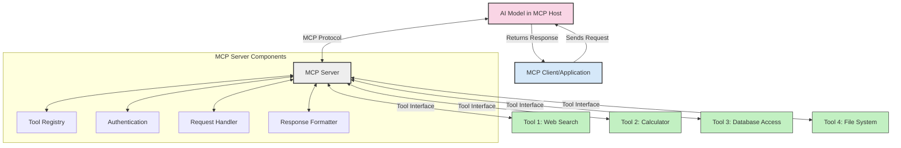
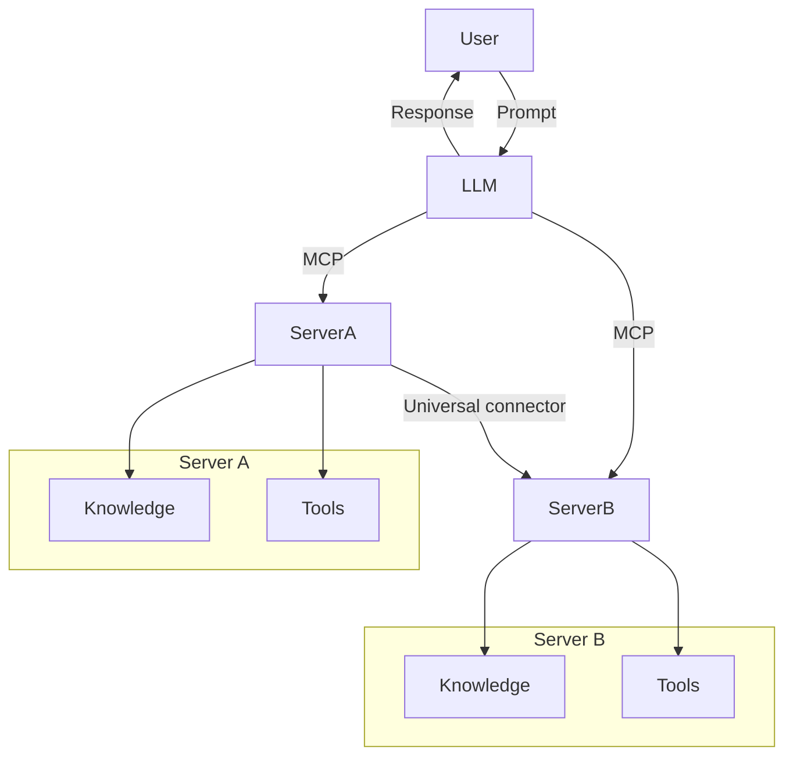

<!--
CO_OP_TRANSLATOR_METADATA:
{
  "original_hash": "1d88dee994dcbb3fa52c271d0c0817b5",
  "translation_date": "2025-05-20T22:17:44+00:00",
  "source_file": "00-Introduction/README.md",
  "language_code": "hu"
}
-->
# Bevezetés a Model Context Protocol (MCP) világába: Miért fontos a skálázható AI alkalmazásoknál

A generatív AI alkalmazások nagy előrelépést jelentenek, hiszen gyakran lehetővé teszik a felhasználók számára, hogy természetes nyelvű utasításokkal lépjenek kapcsolatba az alkalmazással. Azonban ahogy egyre több időt és erőforrást fektetünk ezekbe az appokba, fontos, hogy könnyen lehessen integrálni funkciókat és erőforrásokat úgy, hogy az bővíthető legyen, több modell is kezelhető legyen egyszerre, és a modellek különböző sajátosságait is kezelni tudja az alkalmazás. Röviden: a generatív AI alkalmazások fejlesztése egyszerűnek tűnik kezdetben, de ahogy nőnek és összetettebbé válnak, szükség van egy jól definiált architektúrára, és valószínűleg egy szabványra, amely biztosítja, hogy az appok egységes módon épüljenek fel. Itt jön képbe az MCP, amely rendszerezi a dolgokat és egy szabványt nyújt.

---

## **🔍 Mi az a Model Context Protocol (MCP)?**

A **Model Context Protocol (MCP)** egy **nyílt, szabványosított interfész**, amely lehetővé teszi, hogy a nagy nyelvi modellek (LLM-ek) zökkenőmentesen kommunikáljanak külső eszközökkel, API-kkal és adatforrásokkal. Egy egységes architektúrát biztosít, amely túlmutat a modellek tanító adataikon, így okosabb, skálázhatóbb és reagálóképesebb AI rendszerek építhetők.

---

## **🎯 Miért fontos a szabványosítás az AI területén**

Ahogy a generatív AI alkalmazások egyre összetettebbé válnak, elengedhetetlen szabványokat alkalmazni, amelyek biztosítják a **skálázhatóságot, bővíthetőséget** és a **fenntarthatóságot**. Az MCP ezekre a kihívásokra nyújt megoldást azzal, hogy:

- Egységesíti a modell-eszköz integrációkat
- Csökkenti az egyedi, törékeny megoldásokat
- Lehetővé teszi több modell párhuzamos működését egy ökoszisztémán belül

---

## **📚 Tanulási célok**

A cikk végére képes leszel:

- Meghatározni a **Model Context Protocol (MCP)** fogalmát és alkalmazási területeit
- Megérteni, hogyan szabványosítja az MCP a modell és eszköz közötti kommunikációt
- Felismerni az MCP architektúra fő komponenseit
- Felfedezni az MCP valós üzleti és fejlesztési alkalmazásait

---

## **💡 Miért forradalmi a Model Context Protocol (MCP)**

### **🔗 Az MCP megoldja az AI interakciók fragmentáltságát**

Az MCP előtt a modellek és eszközök integrálása a következő problémákat okozta:

- Egyedi kód írása minden modell-eszköz pároshoz
- Nem szabványos API-k minden szolgáltatónál
- Gyakori hibák és törések frissítések miatt
- Rossz skálázhatóság, ha több eszközt kellett kezelni

### **✅ Az MCP szabványosítás előnyei**

| **Előny**                | **Leírás**                                                                     |
|--------------------------|--------------------------------------------------------------------------------|
| Interoperabilitás        | Az LLM-ek zökkenőmentesen működnek együtt különböző gyártók eszközeivel       |
| Egységesség              | Egyforma viselkedés platformok és eszközök között                             |
| Újrahasznosíthatóság     | Egyszer megépített eszközök több projektben és rendszerben is használhatók     |
| Gyorsított fejlesztés    | Csökkenti a fejlesztési időt szabványos, plug-and-play interfészekkel         |

---

## **🧱 Az MCP architektúra magas szintű áttekintése**

Az MCP egy **kliens-szerver modellt** követ, ahol:

- **MCP Hostok** futtatják az AI modelleket
- **MCP Kliensek** indítják a kéréseket
- **MCP Szerverek** szolgáltatják a kontextust, eszközöket és képességeket

### **Fő komponensek:**

- **Erőforrások** – statikus vagy dinamikus adatok a modellek számára  
- **Promptek** – előre definiált munkafolyamatok az irányított generáláshoz  
- **Eszközök** – végrehajtható funkciók, mint például keresés vagy számítások  
- **Mintavételezés** – agentikus viselkedés rekurzív interakciókon keresztül

---

## Hogyan működnek az MCP szerverek

Az MCP szerverek a következőképpen működnek:

- **Kérés folyamata**:  
    1. Az MCP kliens kérést küld az MCP hoston futó AI modellnek.  
    2. A modell felismeri, mikor van szüksége külső eszközökre vagy adatokra.  
    3. A modell az MCP szerverrel kommunikál a szabványosított protokollon keresztül.

- **MCP szerver funkciói**:  
    - Eszközregiszter: Nyilvántartja a rendelkezésre álló eszközöket és képességeiket.  
    - Hitelesítés: Ellenőrzi az eszközhasználati jogosultságokat.  
    - Kéréskezelő: Feldolgozza a modellből érkező eszközkéréseket.  
    - Válaszformázó: Az eszközök eredményeit a modell által értelmezhető formátumba rendezi.

- **Eszköz végrehajtás**:  
    - A szerver továbbítja a kéréseket a megfelelő külső eszközökhöz  
    - Az eszközök végrehajtják speciális funkcióikat (keresés, számítás, adatbázis lekérdezés stb.)  
    - Az eredmények egységes formátumban visszakerülnek a modellhez.

- **Válasz befejezése**:  
    - Az AI modell beépíti az eszközök eredményeit a válaszába.  
    - A végső válasz visszaküldésre kerül a kliens alkalmazásnak.

## 👨‍💻 Hogyan építsünk MCP szervert (példákkal)

Az MCP szerverek lehetővé teszik az LLM képességek bővítését adatokkal és funkciókkal.

Kész kipróbálni? Íme példák egyszerű MCP szerver létrehozására különböző nyelveken:

- **Python példa**: https://github.com/modelcontextprotocol/python-sdk

- **TypeScript példa**: https://github.com/modelcontextprotocol/typescript-sdk

- **Java példa**: https://github.com/modelcontextprotocol/java-sdk

- **C#/.NET példa**: https://github.com/modelcontextprotocol/csharp-sdk

## 🌍 Valós alkalmazási példák MCP-vel

Az MCP széleskörű alkalmazásokat tesz lehetővé az AI képességek kiterjesztésével:

| **Alkalmazás**             | **Leírás**                                                                     |
|----------------------------|--------------------------------------------------------------------------------|
| Vállalati adatintegráció   | LLM-ek összekapcsolása adatbázisokkal, CRM rendszerekkel vagy belső eszközökkel |
| Agentikus AI rendszerek    | Autonóm ügynökök eszközhozzáféréssel és döntéshozatali munkafolyamatokkal     |
| Többmodalitású alkalmazások| Szöveg, kép és hang eszközök kombinálása egyetlen egységes AI alkalmazásban    |
| Valós idejű adatintegráció | Élő adatok bevonása az AI interakciókba a pontosabb, naprakész válaszokért     |

### 🧠 MCP = Univerzális szabvány az AI interakciókhoz

A Model Context Protocol (MCP) olyan univerzális szabványként működik az AI interakciók számára, mint ahogy az USB-C szabványosította az eszközök fizikai csatlakozását. Az AI világában az MCP egységes interfészt biztosít, amely lehetővé teszi, hogy a modellek (kliensek) zökkenőmentesen integrálódjanak külső eszközökkel és adatforrásokkal (szerverekkel). Így nincs szükség különböző, egyedi protokollokra minden API vagy adatforrás esetében.

Az MCP-kompatibilis eszköz (MCP szerver) egységes szabványt követ. Ezek a szerverek listázhatják az általuk kínált eszközöket vagy műveleteket, és végrehajtják azokat, amikor egy AI ügynök kérésére szükséges. Az MCP-t támogató AI ügynök platformok képesek felfedezni a szerverek eszközeit és a szabványos protokollon keresztül meghívni azokat.

### 💡 Tudáshoz való hozzáférés megkönnyítése

Az eszközök biztosítása mellett az MCP megkönnyíti a tudáshoz való hozzáférést is. Lehetővé teszi, hogy az alkalmazások kontextust adjanak a nagy nyelvi modelleknek (LLM-eknek) azáltal, hogy összekapcsolják őket különféle adatforrásokkal. Például egy MCP szerver képviselheti egy cég dokumentumtárát, így az ügynökök igény szerint lekérhetik a releváns információkat. Egy másik szerver speciális műveleteket végezhet, mint például e-mailek küldése vagy rekordok frissítése. Az ügynök szemszögéből ezek egyszerűen eszközök: egyesek adatokat (tudás kontextust) szolgáltatnak, míg mások műveleteket hajtanak végre. Az MCP hatékonyan kezeli mindkettőt.

Az ügynök, amely csatlakozik egy MCP szerverhez, automatikusan megismeri a szerver elérhető képességeit és adatait egy szabványos formátumon keresztül. Ez a szabványosítás dinamikus eszköz elérhetőséget tesz lehetővé. Például egy új MCP szerver hozzáadása az ügynök rendszeréhez azonnal használhatóvá teszi annak funkcióit további ügynök testreszabás nélkül.

Ez a gördülékeny integráció illeszkedik a mermaid diagram által ábrázolt folyamathoz, ahol a szerverek egyszerre szolgáltatnak eszközöket és tudást, biztosítva a rendszerek közötti zökkenőmentes együttműködést.

### 👉 Példa: Skálázható ügynök megoldás

## 🔐 Az MCP gyakorlati előnyei

Az MCP használatának gyakorlati előnyei:

- **Frissesség**: A modellek hozzáférhetnek a tanító adataikon túli, naprakész információkhoz  
- **Képességek bővítése**: A modellek speciális eszközöket használhatnak olyan feladatokra, amelyekre nem voltak kiképezve  
- **Csökkentett tévesztések**: Külső adatforrások biztosítják a tényalapú megalapozottságot  
- **Adatvédelem**: Az érzékeny adatok biztonságos környezetben maradhatnak, nem kell beágyazni őket a promptokba

## 📌 Fontos tanulságok

Az MCP használatának legfontosabb tanulságai:

- Az **MCP** szabványosítja az AI modellek eszközökkel és adatokkal való interakcióját  
- Támogatja a **bővíthetőséget, egységességet és interoperabilitást**  
- Segít **csökkenteni a fejlesztési időt, növelni a megbízhatóságot és kiterjeszteni a modell képességeit**  
- A kliens-szerver architektúra **lehetővé teszi a rugalmas, bővíthető AI alkalmazásokat**

## 🧠 Gyakorlat

Gondolj egy AI alkalmazásra, amit szívesen fejlesztenél.

- Milyen **külső eszközök vagy adatok** növelhetnék a képességeit?  
- Hogyan tehetné az MCP az integrációt **egyszerűbbé és megbízhatóbbá**?

## További források

- [MCP GitHub tárhely](https://github.com/modelcontextprotocol)

## Mi következik

Következő: [1. fejezet: Alapfogalmak](/01-CoreConcepts/README.md)

**Nyilatkozat**:  
Ezt a dokumentumot az AI fordító szolgáltatás, a [Co-op Translator](https://github.com/Azure/co-op-translator) segítségével fordítottuk le. Bár a pontosságra törekszünk, kérjük, vegye figyelembe, hogy az automatikus fordítások hibákat vagy pontatlanságokat tartalmazhatnak. Az eredeti dokumentum az anyanyelvén tekintendő hiteles forrásnak. Fontos információk esetén szakmai, emberi fordítást javaslunk. Nem vállalunk felelősséget a fordítás használatából eredő félreértésekért vagy téves értelmezésekért.