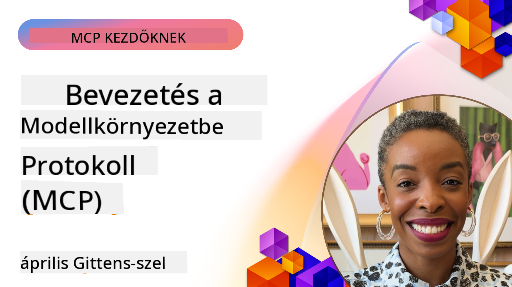
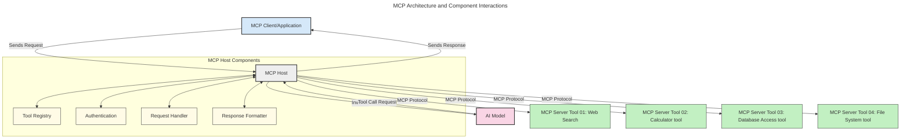

<!--
CO_OP_TRANSLATOR_METADATA:
{
  "original_hash": "0df1ee78a6dd8300f3a040ca5b411c2e",
  "translation_date": "2025-08-18T14:46:26+00:00",
  "source_file": "00-Introduction/README.md",
  "language_code": "hu"
}
-->
# Bevezetés a Model Context Protocol (MCP) protokollba: Miért fontos a skálázható AI alkalmazások számára?

_(Kattints a fenti képre a leckéhez tartozó videó megtekintéséhez)_

A generatív AI alkalmazások hatalmas előrelépést jelentenek, mivel gyakran lehetővé teszik a felhasználók számára, hogy természetes nyelvi utasításokkal lépjenek kapcsolatba az alkalmazással. Azonban, ahogy egyre több időt és erőforrást fektetünk ezekbe az alkalmazásokba, biztosítani kell, hogy a funkciók és erőforrások könnyen integrálhatók és bővíthetők legyenek, hogy az alkalmazás több modellt is támogathasson, és kezelni tudja a különböző modellek sajátosságait. Röviden: generatív AI alkalmazásokat létrehozni kezdetben egyszerű, de ahogy nőnek és bonyolultabbá válnak, szükségessé válik egy architektúra meghatározása, és valószínűleg egy szabványra kell támaszkodni, hogy az alkalmazások következetesen épüljenek fel. Itt jön képbe az MCP, amely rendszert visz a folyamatba, és szabványt biztosít.

---

## **🔍 Mi az a Model Context Protocol (MCP)?**

A **Model Context Protocol (MCP)** egy **nyílt, szabványosított interfész**, amely lehetővé teszi a Nagy Nyelvi Modellek (LLM-ek) számára, hogy zökkenőmentesen kommunikáljanak külső eszközökkel, API-kkal és adatforrásokkal. Egy következetes architektúrát biztosít, amely kiterjeszti az AI modellek funkcionalitását a tanítási adataikon túl, lehetővé téve az okosabb, skálázhatóbb és rugalmasabb AI rendszerek létrehozását.

---

## **🎯 Miért fontos a szabványosítás az AI-ban?**

Ahogy a generatív AI alkalmazások egyre összetettebbé válnak, elengedhetetlen olyan szabványok alkalmazása, amelyek biztosítják a **skálázhatóságot, bővíthetőséget, karbantarthatóságot**, és segítenek elkerülni a gyártófüggőséget. Az MCP ezeket az igényeket az alábbi módokon elégíti ki:

- Az eszközök és modellek integrációjának egységesítése
- Az egyedi, törékeny megoldások csökkentése
- Lehetővé teszi, hogy több különböző gyártótól származó modell egy ökoszisztémában működjön együtt

**Megjegyzés:** Bár az MCP nyílt szabványként hirdeti magát, jelenleg nincs terv arra, hogy az MCP-t bármely meglévő szabványügyi testület, például az IEEE, IETF, W3C, ISO vagy más testület szabványosítsa.

---

## **📚 Tanulási célok**

A cikk végére képes leszel:

- Meghatározni a **Model Context Protocol (MCP)** fogalmát és felhasználási eseteit
- Megérteni, hogyan szabványosítja az MCP a modellek és eszközök közötti kommunikációt
- Azonosítani az MCP architektúra alapvető elemeit
- Felfedezni az MCP valós alkalmazásait vállalati és fejlesztési környezetekben

---

## **💡 Miért forradalmi az MCP?**

### **🔗 Az MCP megoldja az AI interakciók széttagoltságát**

Az MCP előtt a modellek és eszközök integrációja a következőket igényelte:

- Egyedi kód minden eszköz-modell pároshoz
- Nem szabványos API-k minden gyártóhoz
- Gyakori hibák frissítések miatt
- Rossz skálázhatóság több eszköz esetén

### **✅ Az MCP szabványosítás előnyei**

| **Előny**                 | **Leírás**                                                                     |
|---------------------------|--------------------------------------------------------------------------------|
| Interoperabilitás         | Az LLM-ek zökkenőmentesen működnek különböző gyártók eszközeivel               |
| Következetesség           | Egységes viselkedés platformok és eszközök között                              |
| Újrafelhasználhatóság     | Egyszer létrehozott eszközök több projektben és rendszerben is használhatók    |
| Gyorsabb fejlesztés       | Csökkentett fejlesztési idő szabványos, plug-and-play interfészekkel          |

---

## **🧱 Az MCP architektúra magas szintű áttekintése**

Az MCP egy **kliens-szerver modell** szerint működik, ahol:

- Az **MCP Hostok** futtatják az AI modelleket
- Az **MCP Kliensek** kezdeményezik a kéréseket
- Az **MCP Szerverek** biztosítják a kontextust, eszközöket és képességeket

### **Főbb elemek:**

- **Erőforrások** – Statikus vagy dinamikus adatok a modellek számára  
- **Utasítások** – Előre meghatározott munkafolyamatok az irányított generáláshoz  
- **Eszközök** – Végrehajtható funkciók, mint például keresés, számítások  
- **Mintavételezés** – Ügynöki viselkedés rekurzív interakciókon keresztül  

---

## Hogyan működnek az MCP szerverek?

Az MCP szerverek az alábbi módon működnek:

- **Kérésfolyamat**:
    1. Egy végfelhasználó vagy az ő nevében eljáró szoftver kezdeményezi a kérést.
    2. Az **MCP Kliens** elküldi a kérést egy **MCP Hostnak**, amely kezeli az AI modell futtatását.
    3. Az **AI Modell** megkapja a felhasználói utasítást, és szükség esetén külső eszközökhöz vagy adatokhoz fordulhat.
    4. Az **MCP Host**, nem közvetlenül a modell, kommunikál a megfelelő **MCP Szerver(ek)kel** a szabványosított protokollon keresztül.
- **MCP Host funkciói**:
    - **Eszközregiszter**: Az elérhető eszközök és képességeik katalógusát tartja karban.
    - **Hitelesítés**: Ellenőrzi az eszközökhöz való hozzáférés jogosultságát.
    - **Kéréskezelő**: Feldolgozza a modellből érkező eszközkéréseket.
    - **Válaszformázó**: Az eszközök kimenetét a modell számára érthető formátumba rendezi.
- **MCP Szerver végrehajtás**:
    - Az **MCP Host** az eszközkéréseket egy vagy több **MCP Szerverhez** irányítja, amelyek speciális funkciókat biztosítanak (pl. keresés, számítások, adatbázis-lekérdezések).
    - Az **MCP Szerverek** végrehajtják a műveleteiket, és az eredményeket egységes formátumban küldik vissza az **MCP Hostnak**.
    - Az **MCP Host** formázza és továbbítja ezeket az eredményeket az **AI Modellnek**.
- **Válasz befejezése**:
    - Az **AI Modell** beépíti az eszközök kimenetét a végső válaszba.
    - Az **MCP Host** ezt a választ visszaküldi az **MCP Kliensnek**, amely eljuttatja azt a végfelhasználóhoz vagy a hívó szoftverhez.

## 👨‍💻 Hogyan építs MCP szervert (példákkal)

Az MCP szerverek lehetővé teszik az LLM-ek képességeinek kiterjesztését adatok és funkcionalitás biztosításával.

Készen állsz kipróbálni? Íme néhány nyelv- és stack-specifikus SDK, amelyek példákat tartalmaznak egyszerű MCP szerverek létrehozására különböző nyelveken/stackeken:

- **Python SDK**: https://github.com/modelcontextprotocol/python-sdk

- **TypeScript SDK**: https://github.com/modelcontextprotocol/typescript-sdk

- **Java SDK**: https://github.com/modelcontextprotocol/java-sdk

- **C#/.NET SDK**: https://github.com/modelcontextprotocol/csharp-sdk

---

## 🌍 Valós alkalmazási példák az MCP-re

Az MCP számos alkalmazást tesz lehetővé az AI képességeinek kiterjesztésével:

| **Alkalmazás**              | **Leírás**                                                                     |
|-----------------------------|--------------------------------------------------------------------------------|
| Vállalati adatintegráció    | LLM-ek összekapcsolása adatbázisokkal, CRM-ekkel vagy belső eszközökkel        |
| Ügynöki AI rendszerek       | Autonóm ügynökök engedélyezése eszközhozzáféréssel és döntéshozatali folyamatokkal |
| Multimodális alkalmazások   | Szöveg, kép és hang eszközök kombinálása egyetlen AI alkalmazásban             |
| Valós idejű adatintegráció  | Élő adatok bevonása az AI interakciókba a pontosabb, aktuális eredményekért    |

### 🧠 MCP = Univerzális szabvány az AI interakciókhoz

A Model Context Protocol (MCP) az AI interakciók univerzális szabványaként működik, hasonlóan ahhoz, ahogy az USB-C szabványosította az eszközök fizikai csatlakozását. Az AI világában az MCP egy következetes interfészt biztosít, amely lehetővé teszi a modellek (kliensek) számára, hogy zökkenőmentesen integrálódjanak külső eszközökkel és adatforrásokkal (szerverekkel). Ez megszünteti az egyedi protokollok szükségességét minden API-hoz vagy adatforráshoz.

---

## 📌 Főbb tanulságok

Az MCP használatának főbb tanulságai:

- Az **MCP** szabványosítja az AI modellek és eszközök közötti interakciókat
- Elősegíti a **bővíthetőséget, következetességet és interoperabilitást**
- Az MCP segít **csökkenteni a fejlesztési időt, javítani a megbízhatóságot és kiterjeszteni a modellek képességeit**
- A kliens-szerver architektúra **rugalmas, bővíthető AI alkalmazásokat tesz lehetővé**

---

## 🧠 Gyakorlat

Gondolj egy AI alkalmazásra, amelyet szeretnél létrehozni.

- Milyen **külső eszközök vagy adatok** növelhetnék a képességeit?
- Hogyan tehetné az MCP az integrációt **egyszerűbbé és megbízhatóbbá**?

---

## További források

- [MCP GitHub Repository](https://github.com/modelcontextprotocol)

---

## Mi következik?

Következő: [1. fejezet: Alapfogalmak](../01-CoreConcepts/README.md)

**Felelősség kizárása**:  
Ez a dokumentum az AI fordítási szolgáltatás, a [Co-op Translator](https://github.com/Azure/co-op-translator) segítségével lett lefordítva. Bár törekszünk a pontosságra, kérjük, vegye figyelembe, hogy az automatikus fordítások hibákat vagy pontatlanságokat tartalmazhatnak. Az eredeti dokumentum az eredeti nyelvén tekintendő hiteles forrásnak. Kritikus információk esetén javasolt professzionális emberi fordítást igénybe venni. Nem vállalunk felelősséget semmilyen félreértésért vagy téves értelmezésért, amely a fordítás használatából eredhet.