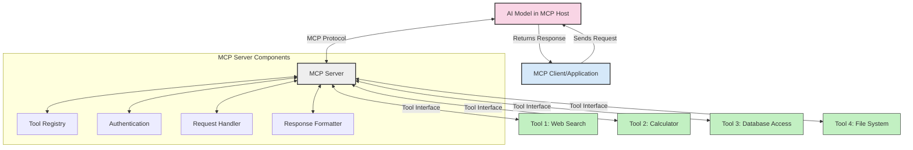
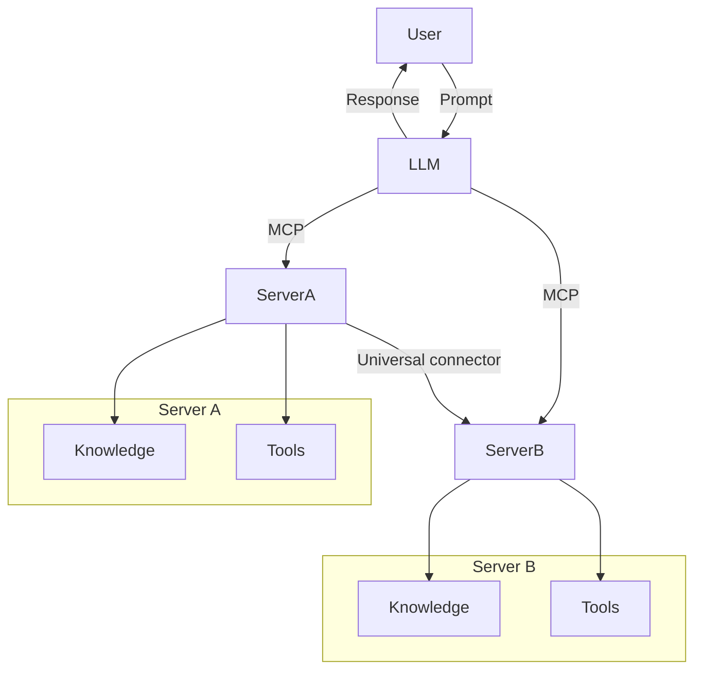

<!--
CO_OP_TRANSLATOR_METADATA:
{
  "original_hash": "02301140adbd807ecf0f17720fa307bc",
  "translation_date": "2025-05-17T06:07:48+00:00",
  "source_file": "00-Introduction/README.md",
  "language_code": "hu"
}
-->
# Bevezetés a Model Context Protocol (MCP) világába: Miért fontos a skálázható AI alkalmazások szempontjából

A generatív AI alkalmazások jelentős előrelépést jelentenek, mivel gyakran lehetővé teszik a felhasználók számára, hogy természetes nyelvi utasításokkal lépjenek kapcsolatba az alkalmazással. Azonban, ahogy egyre több időt és erőforrást fektetünk ezekbe az alkalmazásokba, fontos, hogy a funkciókat és erőforrásokat könnyen integrálhassuk, hogy az alkalmazás könnyen bővíthető legyen, több modell használatát is támogassa, és kezelje azok összetettségét. Röviden, a Gen AI alkalmazások építése kezdetben egyszerű, de ahogy növekednek és bonyolultabbá válnak, szükség van egy architektúra meghatározására, és valószínűleg egy szabványra is támaszkodnunk kell, hogy biztosítsuk az alkalmazások következetes építését. Itt jön képbe az MCP, amely rendet teremt és szabványt biztosít.

---

## **🔍 Mi az a Model Context Protocol (MCP)?**

A **Model Context Protocol (MCP)** egy **nyílt, szabványosított interfész**, amely lehetővé teszi a Nagy Nyelvi Modellek (LLM-ek) számára, hogy zökkenőmentesen lépjenek kapcsolatba külső eszközökkel, API-kkal és adatforrásokkal. Ez egy következetes architektúrát biztosít az AI modellek funkcióinak bővítéséhez a képzési adataikon túl, így okosabb, skálázhatóbb és rugalmasabb AI rendszereket hoz létre.

---

## **🎯 Miért fontos a szabványosítás az AI világában**

Ahogy a generatív AI alkalmazások egyre összetettebbé válnak, elengedhetetlen olyan szabványok bevezetése, amelyek biztosítják a **skálázhatóságot, bővíthetőséget** és **fenntarthatóságot**. Az MCP ezekre az igényekre ad választ azáltal, hogy:

- Egységesíti a modell-eszköz integrációkat
- Csökkenti a törékeny, egyedi megoldásokat
- Lehetővé teszi, hogy több modell egy ökoszisztémán belül együtt létezzen

---

## **📚 Tanulási célok**

A cikk végére képes leszel:

- Meghatározni a **Model Context Protocol (MCP)**-t és annak felhasználási eseteit
- Megérteni, hogyan szabványosítja az MCP a modell-eszköz kommunikációt
- Azonosítani az MCP architektúra alapvető elemeit
- Felfedezni az MCP valós alkalmazásait vállalati és fejlesztési környezetben

---

## **💡 Miért jelent áttörést a Model Context Protocol (MCP)**

### **🔗 Az MCP megoldja az AI interakciók töredezettségét**

Az MCP előtt a modellek eszközökkel való integrációja a következőket igényelte:

- Egyedi kód minden eszköz-modell párhoz
- Nem szabványos API-k minden egyes gyártóhoz
- Gyakori megszakítások a frissítések miatt
- Rossz skálázhatóság több eszközzel

### **✅ Az MCP szabványosítás előnyei**

| **Előny**                  | **Leírás**                                                                      |
|----------------------------|---------------------------------------------------------------------------------|
| Interoperabilitás          | Az LLM-ek zökkenőmentesen működnek különböző gyártók eszközeivel                |
| Következetesség            | Egységes viselkedés a platformok és eszközök között                             |
| Újrahasználhatóság         | Egyszer épített eszközök több projektben és rendszerben használhatók            |
| Gyorsított fejlesztés      | Csökkenti a fejlesztési időt a szabványos, plug-and-play interfészek használatával |

---

## **🧱 Magas szintű MCP architektúra áttekintés**

Az MCP egy **kliens-szerver modell** szerint működik, ahol:

- **MCP Hosts** futtatják az AI modelleket
- **MCP Clients** kezdeményezik a kéréseket
- **MCP Servers** biztosítják a kontextust, eszközöket és képességeket

### **Kulcsfontosságú elemek:**

- **Erőforrások** – Statikus vagy dinamikus adatok a modellek számára  
- **Utasítások** – Előre meghatározott munkafolyamatok az irányított generáláshoz  
- **Eszközök** – Végrehajtható funkciók, mint keresés, számítások  
- **Mintavétel** – Agentikus viselkedés rekurzív interakciók révén

---

## Hogyan működnek az MCP szerverek

Az MCP szerverek a következőképpen működnek:

- **Kérés folyamata**: 
    1. Az MCP Client küld egy kérést az AI Modellnek, amely egy MCP Hoston fut.
    2. Az AI Modell azonosítja, amikor külső eszközökre vagy adatokra van szüksége.
    3. A modell a szabványosított protokoll segítségével kommunikál az MCP Serverrel.

- **MCP szerver funkciói**:
    - Eszköznyilvántartás: Katalógust vezet a rendelkezésre álló eszközökről és képességeikről.
    - Hitelesítés: Ellenőrzi az eszköz hozzáférési jogosultságait.
    - Kéréskezelő: Feldolgozza a modellből érkező eszközkéréseket.
    - Válaszformázó: Az eszköz kimeneteket olyan formátumba rendezi, amelyet a modell megért.

- **Eszköz végrehajtás**: 
    - A szerver a kéréseket a megfelelő külső eszközökhöz irányítja
    - Az eszközök végrehajtják specializált funkcióikat (keresés, számítás, adatbázis lekérdezések stb.)
    - Az eredmények következetes formában kerülnek vissza a modellhez.

- **Válasz befejezése**: 
    - Az AI modell beépíti az eszköz kimeneteket a válaszába.
    - A végső válasz visszaküldésre kerül a kliens alkalmazásnak.

## 👨‍💻 Hogyan építsünk MCP szervert (példákkal)

Az MCP szerverek lehetővé teszik az LLM képességek bővítését adatok és funkciók biztosításával. 

Készen állsz kipróbálni? Íme néhány példa egyszerű MCP szerver létrehozására különböző nyelveken:

- **Python példa**: https://github.com/modelcontextprotocol/python-sdk

- **TypeScript példa**: https://github.com/modelcontextprotocol/typescript-sdk

- **Java példa**: https://github.com/modelcontextprotocol/java-sdk

- **C#/.NET példa**: https://github.com/modelcontextprotocol/csharp-sdk

## 🌍 Valós használati esetek az MCP-hez

Az MCP széles körű alkalmazásokat tesz lehetővé az AI képességek bővítésével:

| **Alkalmazás**                | **Leírás**                                                                      |
|------------------------------|---------------------------------------------------------------------------------|
| Vállalati adat integráció    | LLM-ek összekapcsolása adatbázisokkal, CRM-ekkel vagy belső eszközökkel         |
| Agentikus AI rendszerek      | Autonóm ügynökök engedélyezése eszköz hozzáféréssel és döntéshozatali munkafolyamatokkal |
| Multimodális alkalmazások    | Szöveg, kép és hang eszközök kombinálása egyetlen, egységes AI alkalmazásban    |
| Valós idejű adat integráció  | Élő adatok bevitele az AI interakciókba a pontosabb, aktuális kimenetekért      |

### 🧠 MCP = Univerzális szabvány az AI interakciókhoz

A Model Context Protocol (MCP) univerzális szabványként működik az AI interakciókhoz, hasonlóan ahhoz, ahogy a USB-C szabványosította a fizikai kapcsolódásokat az eszközök számára. Az AI világában az MCP következetes interfészt biztosít, lehetővé téve a modellek (kliensek) számára, hogy zökkenőmentesen integrálódjanak külső eszközökkel és adatforrásokkal (szerverekkel). Ez megszünteti a különböző, egyedi protokollok szükségességét minden API vagy adatforrás esetében.

Az MCP alatt egy MCP-kompatibilis eszköz (amelyet MCP szervernek nevezünk) egységes szabványt követ. Ezek a szerverek listázhatják az általuk kínált eszközöket vagy műveleteket, és végrehajthatják ezeket a műveleteket, amikor egy AI ügynök kéri őket. Az MCP-t támogató AI ügynök platformok képesek felfedezni a szerverek által elérhető eszközöket, és azokat ezen szabványos protokollon keresztül hívni.

### 💡 Tudás hozzáférésének lehetősége

Az eszközök kínálatán túl az MCP a tudáshoz való hozzáférést is elősegíti. Lehetővé teszi, hogy az alkalmazások kontextust biztosítsanak a nagy nyelvi modelleknek (LLM-eknek) azáltal, hogy különböző adatforrásokhoz kapcsolódnak. Például egy MCP szerver képviselheti egy vállalat dokumentumtárát, lehetővé téve az ügynökök számára, hogy igény szerint releváns információkat kérjenek le. Egy másik szerver kezelhet specifikus műveleteket, mint például e-mailek küldése vagy rekordok frissítése. Az ügynök szemszögéből nézve ezek egyszerűen eszközök, amelyeket használhat—néhány eszköz adatokat (tudás kontextust) ad vissza, míg mások műveleteket hajtanak végre. Az MCP mindkettőt hatékonyan kezeli.

Egy ügynök, amely csatlakozik egy MCP szerverhez, automatikusan megtanulja a szerver elérhető képességeit és hozzáférhető adatait egy szabványos formátumon keresztül. Ez a szabványosítás lehetővé teszi a dinamikus eszköz elérhetőséget. Például egy új MCP szerver hozzáadása az ügynök rendszeréhez azonnal használhatóvá teszi annak funkcióit anélkül, hogy további testreszabásra lenne szükség az ügynök utasításaiban.

Ez az egyszerűsített integráció összhangban van a mermaid diagram által bemutatott folyamattal, ahol a szerverek eszközöket és tudást biztosítanak, biztosítva a zökkenőmentes együttműködést a rendszerek között. 

### 👉 Példa: Skálázható ügynök megoldás

## 🔐 Az MCP gyakorlati előnyei

Íme néhány gyakorlati előny az MCP használatával kapcsolatban:

- **Frissesség**: A modellek hozzáférhetnek a legfrissebb információkhoz a képzési adataikon túl
- **Képesség bővítés**: A modellek kihasználhatják a specializált eszközöket olyan feladatokhoz, amelyekre nem lettek kiképezve
- **Csökkentett hallucinációk**: Külső adatforrások biztosítanak tényszerű alapot
- **Adatvédelem**: Az érzékeny adatok biztonságos környezetben maradhatnak, ahelyett, hogy beágyazódnának az utasításokba

## 📌 Főbb tanulságok

Az alábbiak a főbb tanulságok az MCP használatával kapcsolatban:

- Az **MCP** szabványosítja, hogyan lépnek kapcsolatba az AI modellek az eszközökkel és adatokkal
- Elősegíti a **bővíthetőséget, következetességet és interoperabilitást**
- Az MCP segít **csökkenteni a fejlesztési időt, javítani a megbízhatóságot és bővíteni a modell képességeit**
- A kliens-szerver architektúra **rugalmas, bővíthető AI alkalmazásokat tesz lehetővé**

## 🧠 Gyakorlat

Gondolj egy AI alkalmazásra, amelyet szívesen építenél.

- Milyen **külső eszközök vagy adatok** növelhetnék a képességeit?
- Hogyan tehetné az MCP az integrációt **egyszerűbbé és megbízhatóbbá?**

## További források

- [MCP GitHub Repository](https://github.com/modelcontextprotocol)

## Mi következik

Következő: [1. fejezet: Alapfogalmak](/01-CoreConcepts/README.md)

**Felelősségkizárás**:  
Ez a dokumentum a [Co-op Translator](https://github.com/Azure/co-op-translator) AI fordítási szolgáltatás használatával készült fordítást tartalmaz. Bár törekszünk a pontosságra, kérjük, vegye figyelembe, hogy az automatikus fordítások hibákat vagy pontatlanságokat tartalmazhatnak. Az eredeti dokumentum saját nyelvén tekintendő hiteles forrásnak. Kritikus információk esetén javasolt a professzionális emberi fordítás igénybevétele. Nem vállalunk felelősséget a fordítás használatából eredő félreértésekért vagy félreértelmezésekért.