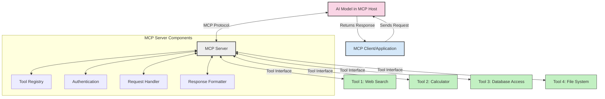
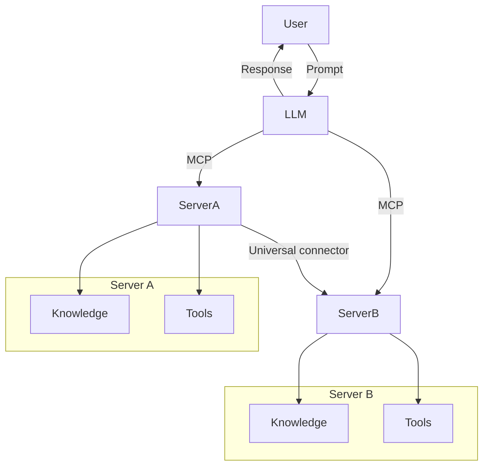

<!--
CO_OP_TRANSLATOR_METADATA:
{
  "original_hash": "cf84f987e1b771d2201408e110dfd2db",
  "translation_date": "2025-05-20T17:57:08+00:00",
  "source_file": "00-Introduction/README.md",
  "language_code": "hu"
}
-->
# Bevezetés a Model Context Protocol (MCP) világába: Miért fontos a skálázható AI alkalmazásokhoz

A generatív AI alkalmazások nagy előrelépést jelentenek, hiszen gyakran lehetővé teszik a felhasználók számára, hogy természetes nyelvű utasításokkal lépjenek interakcióba az alkalmazással. Azonban, ahogy egyre több időt és erőforrást fektetünk ezekbe az alkalmazásokba, fontos, hogy könnyen integrálhassunk funkciókat és erőforrásokat úgy, hogy az egyszerűen bővíthető legyen, az alkalmazás több modellt is képes legyen kezelni, és azok összetettségét is kezelni tudja. Röviden: a generatív AI alkalmazások fejlesztése könnyű a kezdetekben, de ahogy nőnek és összetettebbé válnak, el kell kezdeni egy architektúrát definiálni, és nagy valószínűséggel szükség lesz egy szabványra, hogy az alkalmazások konzisztensen épüljenek fel. Itt lép be az MCP, amely rendszerez és szabványt biztosít.

---

## **🔍 Mi az a Model Context Protocol (MCP)?**

A **Model Context Protocol (MCP)** egy **nyílt, szabványosított interfész**, amely lehetővé teszi, hogy a nagy nyelvi modellek (LLM-ek) zökkenőmentesen kommunikáljanak külső eszközökkel, API-kkal és adatforrásokkal. Egy egységes architektúrát kínál az AI modellek képességeinek kibővítésére a tanító adatokon túl, így okosabb, skálázhatóbb és gyorsabban reagáló AI rendszereket tesz lehetővé.

---

## **🎯 Miért fontos a szabványosítás az AI-ban**

Ahogy a generatív AI alkalmazások egyre összetettebbé válnak, elengedhetetlen olyan szabványok alkalmazása, amelyek biztosítják a **skálázhatóságot, bővíthetőséget** és a **fenntarthatóságot**. Az MCP ezeket a kihívásokat kezeli az alábbi módokon:

- Egységesíti a modell-eszköz integrációkat
- Csökkenti az egyedi, törékeny megoldásokat
- Lehetővé teszi, hogy több modell is együtt működjön egy rendszerben

---

## **📚 Tanulási célok**

A cikk végére képes leszel:

- Meghatározni a **Model Context Protocol (MCP)** fogalmát és alkalmazási területeit
- Megérteni, hogyan szabványosítja az MCP a modell és eszköz közötti kommunikációt
- Azonosítani az MCP architektúra főbb komponenseit
- Megvizsgálni az MCP valós alkalmazásait vállalati és fejlesztői környezetben

---

## **💡 Miért forradalmi a Model Context Protocol (MCP)**

### **🔗 Az MCP megoldja az AI interakciók széttöredezettségét**

Mielőtt az MCP megjelent volna, a modellek és eszközök integrálása a következőket igényelte:

- Egyedi kód írása minden eszköz-modell párosra
- Nem szabványos API-k minden szállítónál
- Gyakori megszakadások frissítések miatt
- Rossz skálázhatóság, ha több eszközt kellett kezelni

### **✅ Az MCP szabványosítás előnyei**

| **Előny**                | **Leírás**                                                                   |
|--------------------------|-------------------------------------------------------------------------------|
| Interoperabilitás        | Az LLM-ek zökkenőmentesen működnek különböző szállítók eszközeivel           |
| Konzisztencia            | Egységes viselkedés platformok és eszközök között                             |
| Újrafelhasználhatóság    | Egyszer épített eszközök több projektben és rendszerben is használhatók       |
| Gyorsított fejlesztés    | Csökkenti a fejlesztési időt szabványos, plug-and-play interfészek használatával |

---

## **🧱 MCP architektúra magas szinten**

Az MCP egy **kliens-szerver modellt** követ, ahol:

- **MCP Hosts** futtatják az AI modelleket
- **MCP Clients** indítják a kéréseket
- **MCP Servers** szolgáltatják a kontextust, eszközöket és képességeket

### **Fő komponensek:**

- **Resources** – statikus vagy dinamikus adatok a modellek számára  
- **Prompts** – előre definiált munkafolyamatok a vezérelt generáláshoz  
- **Tools** – futtatható funkciók, mint keresés, számítások  
- **Sampling** – ügynöki viselkedés rekurzív interakciókon keresztül

---

## Hogyan működnek az MCP szerverek

Az MCP szerverek a következőképpen működnek:

- **Kérés folyamata**:  
    1. Az MCP Client elküld egy kérést az AI modellnek, amely egy MCP Host-on fut.  
    2. Az AI modell felismeri, mikor van szüksége külső eszközökre vagy adatokra.  
    3. A modell a szabványosított protokoll segítségével kommunikál az MCP Serverrel.

- **MCP Server funkciói**:  
    - Eszközregiszter: Nyilvántartja az elérhető eszközöket és azok képességeit.  
    - Hitelesítés: Ellenőrzi az eszközhasználati jogosultságokat.  
    - Kéréskezelő: Feldolgozza a modell által küldött eszközhasználati kéréseket.  
    - Válaszformázó: Az eszközök eredményeit olyan formátumban adja vissza, amit a modell ért.

- **Eszközvégrehajtás**:  
    - A szerver továbbítja a kéréseket a megfelelő külső eszközöknek  
    - Az eszközök végrehajtják a speciális funkciókat (keresés, számítás, adatbázis lekérdezés stb.)  
    - Az eredményeket konzisztens formában adják vissza a modellnek.

- **Válasz befejezése**:  
    - Az AI modell beépíti az eszközök eredményeit a válaszába.  
    - A végső válasz visszaküldésre kerül a kliens alkalmazásnak.

## 👨‍💻 Hogyan építsünk MCP szervert (példákkal)

Az MCP szerverek lehetővé teszik, hogy bővítsd az LLM képességeit adatokkal és funkciókkal.

Készen állsz a kipróbálásra? Íme néhány példa egyszerű MCP szerver létrehozására különböző nyelveken:

- **Python példa**: https://github.com/modelcontextprotocol/python-sdk

- **TypeScript példa**: https://github.com/modelcontextprotocol/typescript-sdk

- **Java példa**: https://github.com/modelcontextprotocol/java-sdk

- **C#/.NET példa**: https://github.com/modelcontextprotocol/csharp-sdk

## 🌍 MCP valós használati esetek

Az MCP széles körű alkalmazásokat tesz lehetővé az AI képességek kiterjesztésével:

| **Alkalmazás**             | **Leírás**                                                                    |
|----------------------------|-------------------------------------------------------------------------------|
| Vállalati adat integráció  | LLM-ek csatlakoztatása adatbázisokhoz, CRM-ekhez vagy belső eszközökhöz       |
| Ügynöki AI rendszerek      | Autonóm ügynökök engedélyezése eszközhozzáféréssel és döntéshozatali folyamatokkal |
| Többmodalitású alkalmazások| Szöveg, kép és hang eszközök egyetlen egységes AI alkalmazásban való kombinálása |
| Valós idejű adat integráció| Élő adatok bevonása az AI interakciókba pontosabb, aktuális eredményekért      |

### 🧠 MCP = univerzális szabvány az AI interakciókhoz

A Model Context Protocol (MCP) egy univerzális szabványként működik az AI interakciókhoz, hasonlóan ahhoz, ahogy az USB-C egységesítette az eszközök fizikai csatlakozását. Az AI világában az MCP egységes interfészt biztosít, amely lehetővé teszi a modellek (kliensek) számára, hogy zökkenőmentesen integrálódjanak külső eszközökkel és adatforrásokkal (szerverekkel). Ez megszünteti az egyedi, változatos protokollok szükségességét minden API vagy adatforrás esetén.

Az MCP-kompatibilis eszköz (MCP szerver) egységes szabványt követ. Ezek a szerverek listázzák az általuk kínált eszközöket vagy műveleteket, és végrehajtják azokat, amikor egy AI ügynök kéri. Az MCP-t támogató AI ügynök platformok képesek felfedezni a szerverek által elérhető eszközöket, és ezen szabványos protokollon keresztül meghívni azokat.

### 💡 Tudáshoz való hozzáférés megkönnyítése

Az eszközök biztosítása mellett az MCP elősegíti a tudáshoz való hozzáférést is. Lehetővé teszi az alkalmazások számára, hogy kontextust biztosítsanak a nagy nyelvi modelleknek (LLM-eknek) különböző adatforrások összekapcsolásával. Például egy MCP szerver képviselheti egy vállalat dokumentumtárát, így az ügynökök igény szerint releváns információkat szerezhetnek be. Egy másik szerver kezelhet speciális műveleteket, mint e-mailek küldése vagy rekordok frissítése. Az ügynök szemszögéből ezek egyszerűen csak használható eszközök – egyesek adatokat (tudáskontextust) szolgáltatnak, míg mások műveleteket hajtanak végre. Az MCP hatékonyan kezeli mindkettőt.

Egy ügynök, amely csatlakozik egy MCP szerverhez, automatikusan megismeri a szerver elérhető képességeit és adatait egy szabványos formátumon keresztül. Ez a szabványosítás dinamikus eszköz elérhetőséget tesz lehetővé. Például, ha egy új MCP szervert adunk hozzá az ügynök rendszeréhez, annak funkciói azonnal használhatók lesznek további ügynök utasítások módosítása nélkül.

Ez az egyszerűsített integráció összhangban áll a mermaid diagram által ábrázolt folyamattal, ahol a szerverek egyszerre biztosítanak eszközöket és tudást, zökkenőmentes együttműködést garantálva a rendszerek között.

### 👉 Példa: skálázható ügynöki megoldás

## 🔐 Az MCP gyakorlati előnyei

Íme az MCP használatának gyakorlati előnyei:

- **Frissesség**: A modellek hozzáférhetnek naprakész információkhoz a tanító adatokon túl  
- **Képességek bővítése**: A modellek speciális eszközöket használhatnak olyan feladatokhoz, amelyekre nem voltak kiképezve  
- **Csökkentett tévesztések**: Külső adatforrások biztosítanak tényszerű alapot  
- **Adatvédelem**: Az érzékeny adatok biztonságos környezetben maradhatnak, nem kell beágyazni őket a promptokba

## 📌 Főbb tanulságok

Az MCP használatának fő tanulságai:

- Az **MCP** szabványosítja, hogyan lépnek kapcsolatba az AI modellek eszközökkel és adatokkal  
- Elősegíti a **bővíthetőséget, konzisztenciát és interoperabilitást**  
- Az MCP segít **csökkenteni a fejlesztési időt, növelni a megbízhatóságot és kiterjeszteni a modell képességeit**  
- A kliens-szerver architektúra **rugalmas, bővíthető AI alkalmazásokat tesz lehetővé**

## 🧠 Gyakorlat

Gondolj egy AI alkalmazásra, amelyet szeretnél fejleszteni.

- Milyen **külső eszközök vagy adatok** javíthatnák a képességeit?  
- Hogyan tehetné az MCP az integrációt **egyszerűbbé és megbízhatóbbá**?

## További források

- [MCP GitHub Repository](https://github.com/modelcontextprotocol)

## Mi következik

Következő: [1. fejezet: Alapfogalmak](/01-CoreConcepts/README.md)

**Nyilatkozat**:  
Ezt a dokumentumot az AI fordító szolgáltatás, a [Co-op Translator](https://github.com/Azure/co-op-translator) segítségével fordítottuk le. Bár igyekszünk a pontosságra, kérjük, vegye figyelembe, hogy az automatikus fordítások hibákat vagy pontatlanságokat tartalmazhatnak. Az eredeti dokumentum az anyanyelvén tekintendő hivatalos forrásnak. Fontos információk esetén szakmai emberi fordítást javaslunk. Nem vállalunk felelősséget az ebből a fordításból eredő félreértésekért vagy téves értelmezésekért.