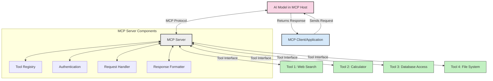
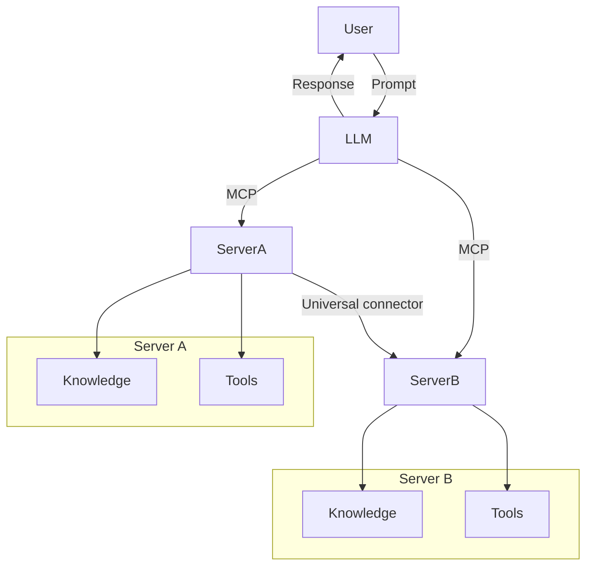
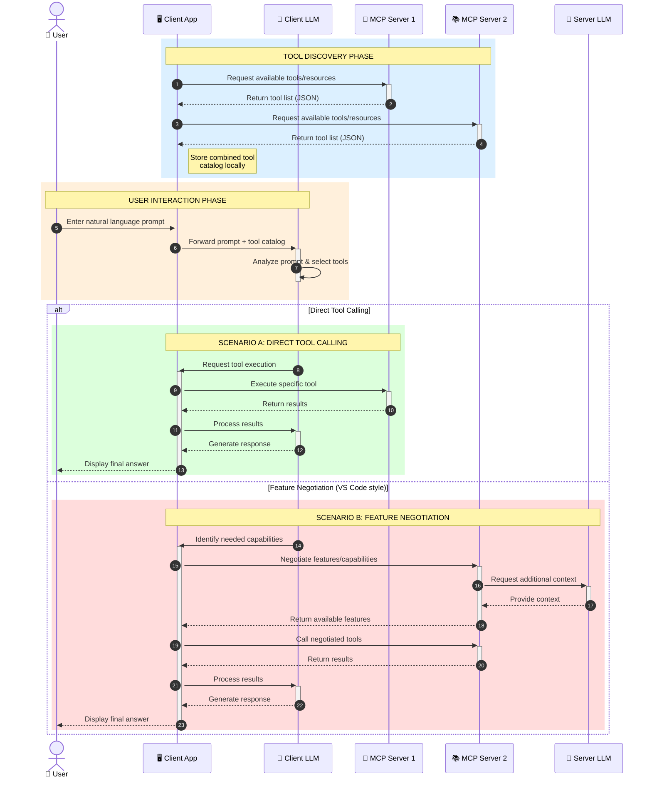

<!--
CO_OP_TRANSLATOR_METADATA:
{
  "original_hash": "25a94c681cf43612ff394d8cf78a74de",
  "translation_date": "2025-05-27T16:11:42+00:00",
  "source_file": "00-Introduction/README.md",
  "language_code": "hu"
}
-->
# Bevezetés a Model Context Protocol (MCP) világába: Miért fontos a skálázható AI alkalmazásokhoz

A generatív AI alkalmazások nagy előrelépést jelentenek, hiszen gyakran lehetővé teszik a felhasználók számára, hogy természetes nyelvű utasításokkal kommunikáljanak az appal. Azonban, ahogy egyre több időt és erőforrást fektetünk ezekbe az alkalmazásokba, fontos, hogy könnyen integrálható legyen a funkcionalitás és az erőforrások bővíthetősége, több modell egyidejű kezelése és a különböző modellek sajátosságainak kezelése. Röviden: a generatív AI alkalmazások fejlesztése kezdetben egyszerű, de ahogy nőnek és összetettebbé válnak, elengedhetetlen egy jól definiált architektúra kialakítása, és szükség lehet egy szabványra, amely biztosítja, hogy az alkalmazások következetesen épüljenek fel. Itt jön képbe az MCP, amely rendszerezi a folyamatokat és szabványt nyújt.

---

## **🔍 Mi az a Model Context Protocol (MCP)?**

A **Model Context Protocol (MCP)** egy **nyílt, szabványosított interfész**, amely lehetővé teszi a nagy nyelvi modellek (LLM-ek) számára, hogy zökkenőmentesen kommunikáljanak külső eszközökkel, API-kkal és adatforrásokkal. Egy egységes architektúrát kínál, amely túlmutat a modellek tanítási adataikon, így intelligensebb, skálázhatóbb és rugalmasabb AI rendszerek építhetők.

---

## **🎯 Miért fontos a szabványosítás az AI-ban**

Ahogy a generatív AI alkalmazások egyre összetettebbé válnak, elengedhetetlen szabványokat alkalmazni, amelyek biztosítják a **skálázhatóságot, bővíthetőséget** és a **fenntarthatóságot**. Az MCP ezeket a kihívásokat kezeli azáltal, hogy:

- Egységesíti a modell-eszköz integrációkat
- Csökkenti a törékeny, egyedi megoldásokat
- Lehetővé teszi több modell egyidejű működését egy ökoszisztémán belül

---

## **📚 Tanulási célok**

A cikk végére képes leszel:

- Meghatározni a **Model Context Protocol (MCP)** fogalmát és használati eseteit
- Megérteni, hogyan szabványosítja az MCP a modell-eszköz kommunikációt
- Azonosítani az MCP architektúra főbb elemeit
- Felfedezni az MCP valós vállalati és fejlesztői alkalmazásait

---

## **💡 Miért forradalmi a Model Context Protocol (MCP)**

### **🔗 Az MCP megoldja az AI interakciók töredezettségét**

MCP előtt a modellek és eszközök integrálása:

- Egyedi kódolást igényelt eszköz-modell páronként
- Nem szabványos API-kat használtak minden szolgáltatónál
- Gyakori hibákat okozott a frissítések miatt
- Rossz skálázhatóságot eredményezett több eszköz esetén

### **✅ Az MCP szabványosítás előnyei**

| **Előny**                | **Leírás**                                                                      |
|--------------------------|---------------------------------------------------------------------------------|
| Interoperabilitás        | Az LLM-ek zökkenőmentesen működnek együtt különböző szolgáltatók eszközeivel    |
| Következetesség          | Egységes viselkedés platformok és eszközök között                              |
| Újrafelhasználhatóság    | Egyszer megépített eszközök több projektben és rendszerben is használhatók     |
| Gyorsított fejlesztés    | Csökkenti a fejlesztési időt szabványos, plug-and-play interfészekkel          |

---

## **🧱 Az MCP architektúra magas szintű áttekintése**

Az MCP egy **kliens-szerver modellt** követ, ahol:

- **MCP Hostok** futtatják az AI modelleket
- **MCP Kliensek** kezdeményezik a kéréseket
- **MCP Szerverek** szolgáltatják a kontextust, eszközöket és képességeket

### **Fő komponensek:**

- **Erőforrások** – statikus vagy dinamikus adatok a modellek számára  
- **Promptok** – előre definiált munkafolyamatok az irányított generáláshoz  
- **Eszközök** – végrehajtható funkciók, mint keresés, számítások  
- **Mintavétel** – ügynöki viselkedés rekurzív interakciókon keresztül

---

## Hogyan működnek az MCP szerverek

Az MCP szerverek a következőképpen működnek:

- **Kérés folyamata**:  
    1. Az MCP kliens kérést küld az MCP Hoston futó AI modellnek.  
    2. A modell felismeri, mikor van szüksége külső eszközökre vagy adatokra.  
    3. A modell az MCP szerverrel kommunikál a szabványosított protokollon keresztül.

- **MCP szerver funkciói**:  
    - Eszköznyilvántartás: Karbantartja az elérhető eszközök és képességeik katalógusát.  
    - Hitelesítés: Ellenőrzi az eszközhozzáférési jogosultságokat.  
    - Kéréskezelő: Feldolgozza a modellből érkező eszközkéréseket.  
    - Válaszformázó: Olyan formátumba rendezi az eszközök eredményeit, amelyet a modell ért.

- **Eszközök végrehajtása**:  
    - A szerver a megfelelő külső eszközökhöz irányítja a kéréseket  
    - Az eszközök végrehajtják speciális funkcióikat (keresés, számítás, adatbázis-lekérdezések stb.)  
    - Az eredményeket egységes formátumban visszaküldik a modellnek.

- **Válasz befejezése**:  
    - Az AI modell beépíti az eszközök kimenetét a válaszába.  
    - A végleges válasz visszaküldésre kerül a kliens alkalmazásnak.

## 👨‍💻 Hogyan építsünk MCP szervert (példákkal)

Az MCP szerverek lehetővé teszik az LLM képességek bővítését adat- és funkciószolgáltatással.

Készen állsz kipróbálni? Íme néhány példa egyszerű MCP szerver létrehozására különböző nyelveken:

- **Python példa**: https://github.com/modelcontextprotocol/python-sdk

- **TypeScript példa**: https://github.com/modelcontextprotocol/typescript-sdk

- **Java példa**: https://github.com/modelcontextprotocol/java-sdk

- **C#/.NET példa**: https://github.com/modelcontextprotocol/csharp-sdk

## 🌍 Az MCP valós alkalmazási esetei

Az MCP széles körű alkalmazásokat tesz lehetővé az AI képességek kiterjesztésével:

| **Alkalmazás**              | **Leírás**                                                                      |
|-----------------------------|---------------------------------------------------------------------------------|
| Vállalati adatintegráció    | LLM-ek összekapcsolása adatbázisokkal, CRM-ekkel vagy belső eszközökkel         |
| Ügynöki AI rendszerek       | Autonóm ügynökök támogatása eszközhozzáféréssel és döntéshozatali munkafolyamatokkal |
| Többmodalitású alkalmazások | Szöveg, kép és hang eszközök egyesítése egyetlen AI alkalmazásban               |
| Valós idejű adat integráció | Élő adatok bevonása az AI interakciókba a pontosabb, aktuális eredményekért     |

### 🧠 MCP = Univerzális szabvány az AI interakciókhoz

A Model Context Protocol (MCP) olyan univerzális szabványként működik az AI interakciókban, mint ahogy az USB-C szabványosította az eszközök fizikai csatlakozását. Az AI világában az MCP egységes interfészt biztosít, amely lehetővé teszi, hogy a modellek (kliensek) zökkenőmentesen integrálódjanak külső eszközökkel és adatforrásokkal (szerverek). Ez megszünteti az egyedi, különféle protokollok szükségességét minden API vagy adatforrás esetén.

Az MCP-kompatibilis eszköz (azaz MCP szerver) egységes szabványt követ. Ezek a szerverek listázzák a rendelkezésre álló eszközöket vagy műveleteket, és végrehajtják azokat, amikor egy AI ügynök kéri. Az MCP-t támogató AI ügynök platformok képesek felfedezni a szerverek eszközeit és meghívni azokat a szabványos protokollon keresztül.

### 💡 Tudáshoz való hozzáférés elősegítése

Az eszközök kínálatán túl az MCP megkönnyíti a tudáshoz való hozzáférést is. Lehetővé teszi az alkalmazások számára, hogy kontextust biztosítsanak a nagy nyelvi modelleknek, összekapcsolva őket különféle adatforrásokkal. Például egy MCP szerver egy vállalati dokumentumtárat képviselhet, így az ügynökök releváns információkat kérhetnek le igény szerint. Egy másik szerver speciális műveleteket végezhet, mint például e-mailek küldése vagy rekordok frissítése. Az ügynök szempontjából ezek egyszerűen csak használható eszközök – egyesek adatot szolgáltatnak (tudás kontextus), míg mások műveleteket hajtanak végre. Az MCP hatékonyan kezeli mindkettőt.

Egy ügynök, amely kapcsolódik egy MCP szerverhez, automatikusan megismeri a szerver elérhető képességeit és adatait egy szabványos formátumon keresztül. Ez a szabványosítás dinamikus eszköz elérhetőséget tesz lehetővé. Például egy új MCP szerver hozzáadása az ügynök rendszeréhez azonnal használhatóvá teszi annak funkcióit további testreszabás nélkül.

Ez a gördülékeny integráció megfelel a mermaid diagram által ábrázolt folyamnak, ahol a szerverek eszközöket és tudást is biztosítanak, garantálva a rendszerek közötti zökkenőmentes együttműködést.

### 👉 Példa: Skálázható ügynöki megoldás

### 🔄 Fejlett MCP forgatókönyvek kliensoldali LLM integrációval

Az alap MCP architektúrán túl léteznek fejlettebb helyzetek, ahol mind kliens, mind szerver tartalmaz LLM-et, lehetővé téve összetettebb interakciókat:

## 🔐 Az MCP gyakorlati előnyei

Az MCP használatának gyakorlati előnyei:

- **Frissesség**: A modellek hozzáférnek a tanítási adatokon túli, naprakész információkhoz  
- **Képességbővítés**: A modellek speciális eszközöket használhatnak olyan feladatokhoz, amikre nem készültek fel  
- **Csökkentett tévesztések**: Külső adatforrások biztosítják a valós tényeken alapuló támogatást  
- **Adatvédelem**: Érzékeny adatok biztonságos környezetben maradhatnak, nem kell beágyazni őket a promptokba

## 📌 Főbb tanulságok

A MCP használatának legfontosabb tanulságai:

- Az **MCP** szabványosítja az AI modellek és eszközök, adatok közötti interakciókat  
- Elősegíti a **bővíthetőséget, következetességet és interoperabilitást**  
- Az MCP segít **csökkenteni a fejlesztési időt, javítani a megbízhatóságot és kiterjeszteni a modell képességeit**  
- A kliens-szerver architektúra **rugalmas, bővíthető AI alkalmazásokat tesz lehetővé**

## 🧠 Gyakorlat

Gondolkodj el egy olyan AI alkalmazáson, amelyet szeretnél fejleszteni.

- Milyen **külső eszközök vagy adatok** növelhetnék a képességeit?  
- Hogyan teheti az MCP az integrációt **egyszerűbbé és megbízhatóbbá**?

## További források

- [MCP GitHub tárhely](https://github.com/modelcontextprotocol)

## Mi következik

Következő: [1. fejezet: Alapfogalmak](/01-CoreConcepts/README.md)

**Nyilatkozat**:  
Ez a dokumentum az AI fordító szolgáltatás, a [Co-op Translator](https://github.com/Azure/co-op-translator) segítségével készült. Bár a pontosságra törekszünk, kérjük, vegye figyelembe, hogy az automatikus fordítások hibákat vagy pontatlanságokat tartalmazhatnak. Az eredeti dokumentum anyanyelvű változata tekintendő hivatalos forrásnak. Fontos információk esetén professzionális, emberi fordítást javaslunk. Nem vállalunk felelősséget a fordítás használatából eredő félreértésekért vagy téves értelmezésekért.