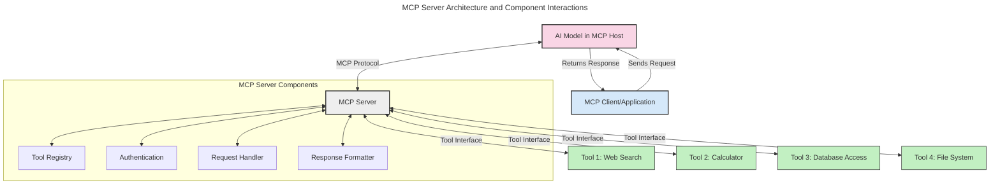
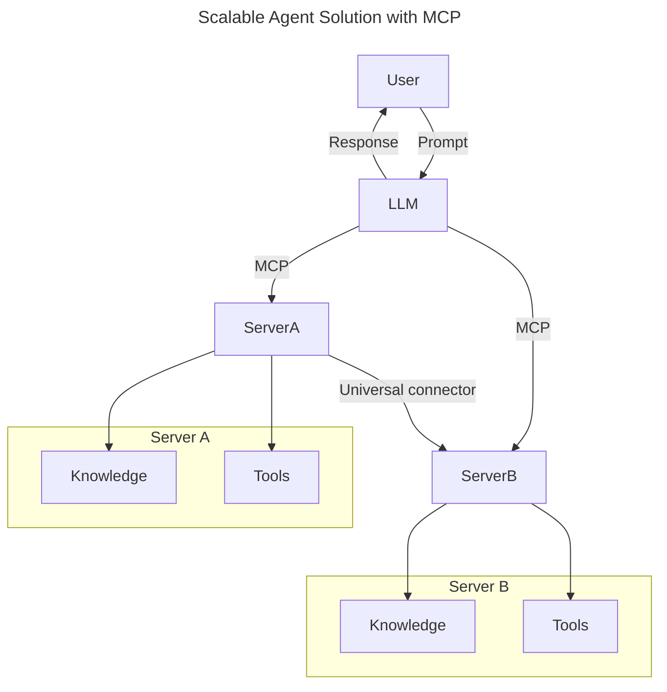
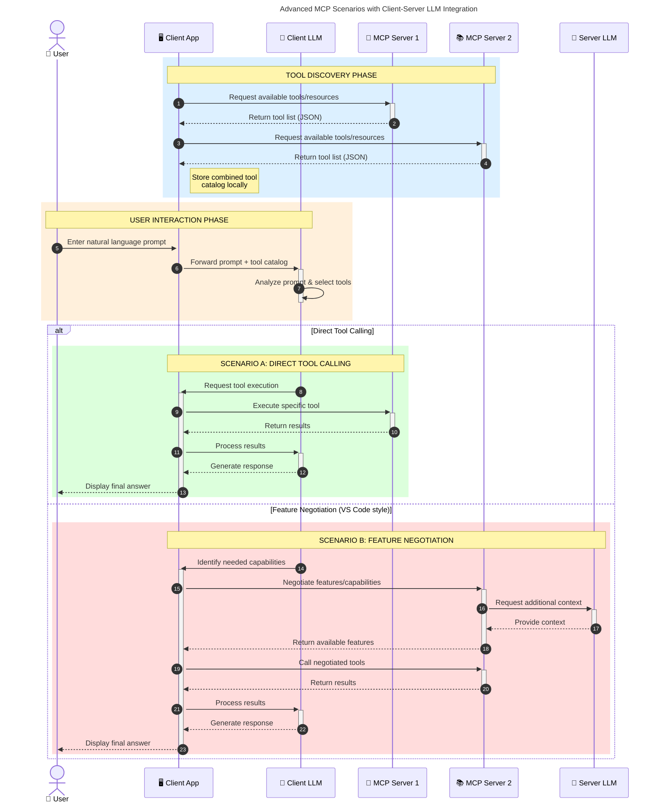

<!--
CO_OP_TRANSLATOR_METADATA:
{
  "original_hash": "1446979020432f512c883848d7eca144",
  "translation_date": "2025-05-29T21:53:04+00:00",
  "source_file": "00-Introduction/README.md",
  "language_code": "hu"
}
-->
# Bevezetés a Model Context Protocol (MCP) világába: Miért fontos a skálázható AI alkalmazásokhoz

A generatív AI alkalmazások nagy előrelépést jelentenek, hiszen gyakran lehetővé teszik a felhasználók számára, hogy természetes nyelvű utasításokkal kommunikáljanak az alkalmazással. Ugyanakkor, ahogy egyre több időt és erőforrást fektetünk ezekbe az alkalmazásokba, fontos, hogy könnyen lehessen új funkciókat és erőforrásokat integrálni, úgy, hogy az alkalmazás bővíthető maradjon, több modellt is kezelni tudjon, és meg tudjon birkózni a modellek különböző sajátosságaival. Röviden: a generatív AI alkalmazások fejlesztése egyszerűen indul, de ahogy nőnek és összetettebbé válnak, szükség van egy jól definiált architektúrára, és valószínűleg egy szabványra, amely biztosítja, hogy az alkalmazások következetesen épüljenek fel. Itt lép be az MCP, hogy rendszerezze a dolgokat és egy egységes szabványt nyújtson.

---

## **🔍 Mi az a Model Context Protocol (MCP)?**

A **Model Context Protocol (MCP)** egy **nyílt, szabványosított interfész**, amely lehetővé teszi a Nagy Nyelvi Modellek (LLM-ek) számára, hogy zökkenőmentesen kommunikáljanak külső eszközökkel, API-kkal és adatforrásokkal. Egységes architektúrát biztosít az AI modellek képességeinek bővítésére a tanulási adatokon túl, így okosabb, skálázhatóbb és reagálóképesebb AI rendszerek hozhatók létre.

---

## **🎯 Miért fontos a szabványosítás az AI területén**

Ahogy a generatív AI alkalmazások egyre összetettebbé válnak, elengedhetetlen szabványokat alkalmazni, amelyek biztosítják a **skálázhatóságot, bővíthetőséget** és a **fenntarthatóságot**. Az MCP ezeket a kihívásokat az alábbi módokon kezeli:

- Egységesíti a modell-eszköz integrációkat
- Csökkenti a törékeny, egyedi megoldásokat
- Lehetővé teszi, hogy több modell is együtt működjön egy ökoszisztémán belül

---

## **📚 Tanulási célok**

A cikk végére képes leszel:

- Meghatározni a **Model Context Protocol (MCP)** fogalmát és alkalmazási területeit
- Megérteni, hogyan szabványosítja az MCP a modell és eszköz közti kommunikációt
- Azonosítani az MCP architektúra fő komponenseit
- Megismerni az MCP valós vállalati és fejlesztési alkalmazásait

---

## **💡 Miért forradalmi a Model Context Protocol (MCP)**

### **🔗 Az MCP megoldja az AI interakciók széttagoltságát**

Az MCP előtt a modellek és eszközök integrálása során:

- Egyedi kódot kellett írni minden eszköz-modell párosra
- Nem szabványos API-kat használtak minden szolgáltatóhoz
- Gyakori volt az összeomlás frissítések miatt
- Nehezen skálázható volt több eszköz használata esetén

### **✅ Az MCP szabványosítás előnyei**

| **Előny**                | **Leírás**                                                                     |
|--------------------------|--------------------------------------------------------------------------------|
| Interoperabilitás        | Az LLM-ek zökkenőmentesen működnek együtt különböző szolgáltatók eszközeivel  |
| Következetesség          | Egységes viselkedés platformok és eszközök között                             |
| Újrafelhasználhatóság    | Egyszer megépített eszközök több projektben és rendszerben is használhatók    |
| Gyorsított fejlesztés    | Fejlesztési idő csökkentése szabványos, plug-and-play interfészekkel          |

---

## **🧱 MCP architektúra áttekintése magas szinten**

Az MCP egy **kliens-szerver modellt** követ, ahol:

- **MCP Hostok** futtatják az AI modelleket
- **MCP Kliensek** indítanak kéréseket
- **MCP Szerverek** szolgáltatják a kontextust, eszközöket és képességeket

### **Fő komponensek:**

- **Erőforrások** – statikus vagy dinamikus adatok a modellek számára  
- **Promptok** – előre definiált munkafolyamatok irányított generáláshoz  
- **Eszközök** – végrehajtható funkciók, mint keresés, számítások  
- **Mintavételezés** – ügynöki viselkedés rekurzív interakciókon keresztül

---

## Hogyan működnek az MCP szerverek

Az MCP szerverek a következő módon működnek:

- **Kérés folyamata**:  
    1. Az MCP kliens kérdést küld az MCP Hoston futó AI modellnek.  
    2. A modell felismeri, mikor van szüksége külső eszközökre vagy adatokra.  
    3. A modell a szabványosított protokoll segítségével kommunikál az MCP szerverrel.

- **MCP szerver funkciói**:  
    - Eszközregiszter: nyilvántartja a rendelkezésre álló eszközöket és képességeiket.  
    - Hitelesítés: ellenőrzi az eszközhozzáférési jogosultságokat.  
    - Kéréskezelő: feldolgozza a modell eszközigényeit.  
    - Válaszformázó: az eszközök kimenetét a modell által értelmezhető formátumba rendezi.

- **Eszközvégrehajtás**:  
    - A szerver továbbítja a kéréseket a megfelelő külső eszközökhöz  
    - Az eszközök végrehajtják specializált funkcióikat (keresés, számítás, adatbázis lekérdezés stb.)  
    - Az eredményeket egységes formátumban visszaküldik a modellnek.

- **Válasz lezárása**:  
    - Az AI modell beépíti az eszközök kimenetét a válaszába.  
    - A végső választ visszaküldi a kliens alkalmazásnak.

## 👨‍💻 Hogyan építsünk MCP szervert (példákkal)

Az MCP szerverek lehetővé teszik, hogy kiterjeszd az LLM képességeit adatokkal és funkciókkal.

Készen állsz a kipróbálásra? Íme példák egyszerű MCP szerver létrehozására különböző nyelveken:

- **Python példa**: https://github.com/modelcontextprotocol/python-sdk

- **TypeScript példa**: https://github.com/modelcontextprotocol/typescript-sdk

- **Java példa**: https://github.com/modelcontextprotocol/java-sdk

- **C#/.NET példa**: https://github.com/modelcontextprotocol/csharp-sdk

## 🌍 MCP valós használati esetek

Az MCP számos alkalmazást tesz lehetővé az AI képességek bővítésével:

| **Alkalmazás**               | **Leírás**                                                                   |
|-----------------------------|-------------------------------------------------------------------------------|
| Vállalati adat integráció   | LLM-ek összekapcsolása adatbázisokkal, CRM rendszerekkel vagy belső eszközökkel |
| Ügynöki AI rendszerek       | Autonóm ügynökök engedélyezése eszközhozzáféréssel és döntéshozatali folyamatokkal |
| Többmodalitású alkalmazások | Szöveg, kép és hang eszközök kombinálása egyetlen egységes AI alkalmazásban  |
| Valós idejű adat integráció | Élő adatok bevonása az AI interakciókba a pontosabb és aktuális válaszokért   |

### 🧠 MCP = univerzális szabvány az AI interakciókhoz

A Model Context Protocol (MCP) olyan univerzális szabványként működik az AI interakciókhoz, mint ahogy az USB-C szabványosította az eszközök fizikai csatlakozását. Az AI világában az MCP egységes interfészt biztosít, amely lehetővé teszi a modellek (kliensek) számára, hogy zökkenőmentesen integrálódjanak külső eszközökkel és adatforrásokkal (szerverekkel). Ez megszünteti az egyedi, eltérő protokollok szükségességét minden egyes API vagy adatforrás esetén.

Az MCP-kompatibilis eszköz (MCP szerver) egy egységes szabványt követ. Ezek a szerverek képesek listázni az általuk kínált eszközöket vagy műveleteket, és végrehajtani azokat, amikor egy AI ügynök kéri. Az MCP-t támogató AI ügynök platformok képesek felfedezni a szerverek eszközeit, és ezen szabványos protokoll segítségével meghívni azokat.

### 💡 Tudáshoz való hozzáférés megkönnyítése

Az eszközök kínálata mellett az MCP a tudáshoz való hozzáférést is elősegíti. Lehetővé teszi, hogy az alkalmazások kontextust biztosítsanak a nagy nyelvi modelleknek, összekapcsolva őket különféle adatforrásokkal. Például egy MCP szerver egy cég dokumentumtárát képviselheti, így az ügynökök igény szerint lekérhetik a releváns információkat. Egy másik szerver speciális műveleteket kezelhet, mint például e-mailek küldése vagy rekordok frissítése. Az ügynök számára ezek egyszerűen eszközök: egyesek adatokat (tudás kontextust) szolgáltatnak, mások műveleteket hajtanak végre. Az MCP hatékonyan kezeli mindkettőt.

Egy ügynök, amely csatlakozik egy MCP szerverhez, automatikusan megismeri a szerver elérhető képességeit és adatait egy szabványos formátumon keresztül. Ez a szabványosítás dinamikus eszközhozzáférést tesz lehetővé. Például egy új MCP szerver hozzáadása az ügynök rendszeréhez azonnal használhatóvá teszi annak funkcióit anélkül, hogy az ügynök utasításait külön módosítani kellene.

Ez a gördülékeny integráció megfelel a mermaid diagram által ábrázolt folyamathoz, ahol a szerverek egyszerre biztosítanak eszközöket és tudást, így biztosítva a zökkenőmentes együttműködést a rendszerek között.

### 👉 Példa: skálázható ügynöki megoldás

### 🔄 Fejlett MCP forgatókönyvek kliens oldali LLM integrációval

Az alap MCP architektúrán túl vannak fejlettebb esetek, amikor mind a kliens, mind a szerver tartalmaz LLM-et, lehetővé téve kifinomultabb interakciókat:

## 🔐 Az MCP gyakorlati előnyei

Az MCP használatának gyakorlati előnyei:

- **Frissesség**: A modellek hozzáférhetnek a tanulási adatokon túli, naprakész információkhoz  
- **Képességbővítés**: A modellek speciális eszközöket használhatnak olyan feladatokhoz, amelyekre nem voltak kiképezve  
- **Csökkentett tévesztések**: Külső adatforrások biztosítanak tényszerű alapot  
- **Adatvédelem**: Az érzékeny adatok biztonságos környezetben maradhatnak, nem kell beágyazni őket a promptokba

## 📌 Fontos összefoglalók

A MCP használatával kapcsolatos főbb tanulságok:

- Az **MCP** szabványosítja, hogyan kommunikálnak az AI modellek eszközökkel és adatokkal  
- Támogatja a **bővíthetőséget, következetességet és interoperabilitást**  
- Segít **csökkenteni a fejlesztési időt, növelni a megbízhatóságot és kiterjeszteni a modell képességeit**  
- A kliens-szerver architektúra **lehetővé teszi a rugalmas, bővíthető AI alkalmazásokat**

## 🧠 Gyakorlat

Gondolj egy AI alkalmazásra, amelyet szívesen fejlesztenél.

- Milyen **külső eszközök vagy adatok** növelhetnék a képességeit?  
- Hogyan tehetné az MCP az integrációt **egyszerűbbé és megbízhatóbbá**?

## További források

- [MCP GitHub Repository](https://github.com/modelcontextprotocol)

## Mi következik

Következő: [1. fejezet: Alapfogalmak](/01-CoreConcepts/README.md)

**Jogi nyilatkozat**:  
Ez a dokumentum az AI fordító szolgáltatás, a [Co-op Translator](https://github.com/Azure/co-op-translator) segítségével készült. Bár a pontosságra törekszünk, kérjük, vegye figyelembe, hogy az automatikus fordítások tartalmazhatnak hibákat vagy pontatlanságokat. Az eredeti dokumentum az anyanyelvén tekintendő hiteles forrásnak. Fontos információk esetén javasolt szakmai, emberi fordítást igénybe venni. Nem vállalunk felelősséget az ebből a fordításból eredő félreértésekért vagy téves értelmezésekért.