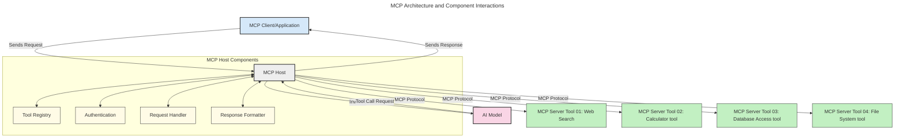
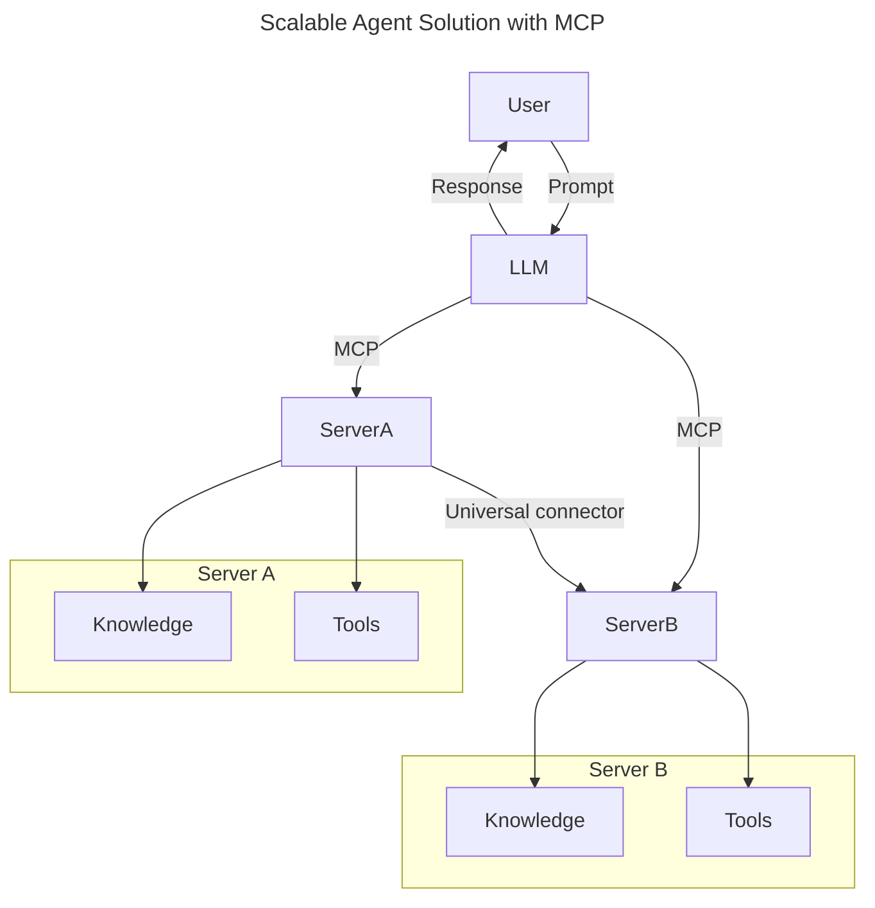
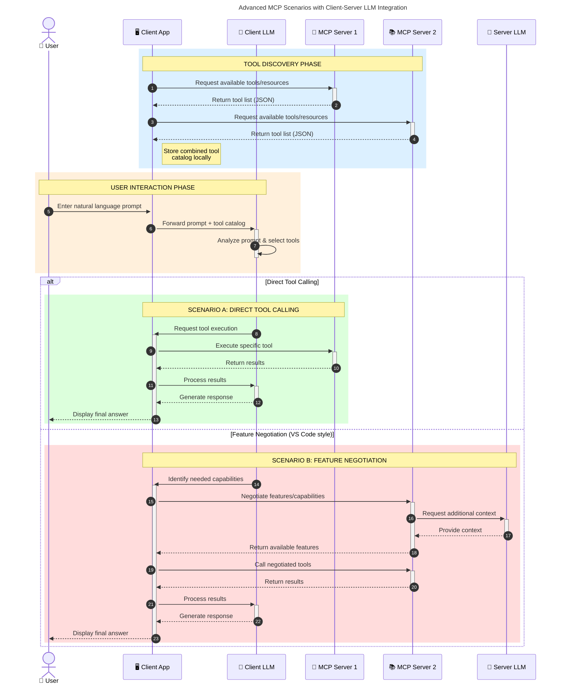

<!--
CO_OP_TRANSLATOR_METADATA:
{
  "original_hash": "0df1ee78a6dd8300f3a040ca5b411c2e",
  "translation_date": "2025-08-18T19:38:38+00:00",
  "source_file": "00-Introduction/README.md",
  "language_code": "hu"
}
-->
# Bevezetés a Model Context Protocol (MCP) világába: Miért fontos a skálázható AI alkalmazásokhoz?

_(Kattints a fenti képre a leckéhez tartozó videó megtekintéséhez)_

A generatív AI alkalmazások hatalmas előrelépést jelentenek, mivel gyakran lehetővé teszik, hogy a felhasználók természetes nyelvi utasításokkal lépjenek kapcsolatba az alkalmazással. Azonban, ahogy egyre több időt és erőforrást fektetünk ezekbe az alkalmazásokba, fontos biztosítani, hogy a funkciók és erőforrások könnyen integrálhatók legyenek, az alkalmazás több modell használatát is támogassa, és kezelje a különböző modellek sajátosságait. Röviden: a generatív AI alkalmazások építése kezdetben egyszerű, de ahogy növekednek és bonyolultabbá válnak, szükségessé válik egy architektúra meghatározása, és valószínűleg egy szabványra lesz szükség, hogy az alkalmazások következetesen épüljenek. Itt lép színre az MCP, amely rendszert hoz és szabványt biztosít.

---

## **🔍 Mi az a Model Context Protocol (MCP)?**

A **Model Context Protocol (MCP)** egy **nyílt, szabványosított interfész**, amely lehetővé teszi a Nagy Nyelvi Modellek (LLM-ek) számára, hogy zökkenőmentesen lépjenek kapcsolatba külső eszközökkel, API-kkal és adatforrásokkal. Egy következetes architektúrát biztosít, amely javítja az AI modellek funkcionalitását a tanítási adataikon túl, lehetővé téve okosabb, skálázhatóbb és érzékenyebb AI rendszerek létrehozását.

---

## **🎯 Miért fontos a szabványosítás az AI világában?**

Ahogy a generatív AI alkalmazások egyre bonyolultabbá válnak, elengedhetetlen olyan szabványok elfogadása, amelyek biztosítják a **skálázhatóságot, bővíthetőséget, fenntarthatóságot** és **a gyártóhoz való kötöttség elkerülését**. Az MCP ezekre az igényekre ad választ az alábbiak révén:

- A modellek és eszközök integrációjának egységesítése
- Törékeny, egyedi megoldások csökkentése
- Lehetővé teszi, hogy több gyártótól származó modellek egy ökoszisztémában együttműködjenek

**Megjegyzés:** Bár az MCP nyílt szabványként hirdeti magát, nincs terv arra, hogy az MCP-t bármely meglévő szabványosító testület, például IEEE, IETF, W3C, ISO vagy más testület által szabványosítsák.

---

## **📚 Tanulási célok**

A cikk végére képes leszel:

- Meghatározni a **Model Context Protocol (MCP)** fogalmát és felhasználási területeit
- Megérteni, hogyan szabványosítja az MCP a modellek és eszközök közötti kommunikációt
- Azonosítani az MCP architektúra alapvető elemeit
- Felfedezni az MCP valós alkalmazásait vállalati és fejlesztési környezetekben

---

## **💡 Miért számít áttörésnek a Model Context Protocol (MCP)?**

### **🔗 Az MCP megoldja az AI interakciók széttöredezettségét**

Az MCP előtt a modellek és eszközök integrációja az alábbiakat igényelte:

- Egyedi kód minden eszköz-modell párosra
- Nem szabványos API-k minden gyártóhoz
- Gyakori hibák frissítések miatt
- Rossz skálázhatóság több eszköz esetén

### **✅ Az MCP szabványosítás előnyei**

| **Előny**                  | **Leírás**                                                                     |
|----------------------------|--------------------------------------------------------------------------------|
| Interoperabilitás          | Az LLM-ek zökkenőmentesen működnek különböző gyártók eszközeivel               |
| Következetesség            | Egységes viselkedés platformok és eszközök között                              |
| Újrafelhasználhatóság      | Egyszer létrehozott eszközök több projektben és rendszerben is használhatók    |
| Gyorsabb fejlesztés        | Csökkenti a fejlesztési időt szabványos, plug-and-play interfészek révén       |

---

## **🧱 Az MCP architektúra magas szintű áttekintése**

Az MCP egy **kliens-szerver modellt** követ, ahol:

- **MCP Hostok** futtatják az AI modelleket
- **MCP Kliensek** kezdeményezik a kéréseket
- **MCP Szerverek** biztosítják a kontextust, eszközöket és képességeket

### **Főbb elemek:**

- **Erőforrások** – Statikus vagy dinamikus adatok a modellek számára  
- **Utasítások** – Előre meghatározott munkafolyamatok irányított generáláshoz  
- **Eszközök** – Végrehajtható funkciók, mint keresés, számítások  
- **Mintavétel** – Ügynöki viselkedés rekurzív interakciók révén  

---

## Hogyan működnek az MCP szerverek?

Az MCP szerverek az alábbi módon működnek:

- **Kérés folyamata**:
    1. A végfelhasználó vagy az ő nevében eljáró szoftver kezdeményezi a kérést.
    2. Az **MCP Kliens** elküldi a kérést az **MCP Hostnak**, amely kezeli az AI modell futtatását.
    3. Az **AI Modell** megkapja a felhasználói utasítást, és szükség esetén külső eszközökhöz vagy adatokhoz fordulhat egy vagy több eszközhívás révén.
    4. Az **MCP Host**, nem közvetlenül a modell, kommunikál a megfelelő **MCP Szerver(ekkel)** a szabványos protokoll használatával.
- **MCP Host funkciói**:
    - **Eszközregiszter**: Katalógust tart fenn az elérhető eszközökről és képességeikről.
    - **Hitelesítés**: Ellenőrzi az eszközhozzáférés engedélyeit.
    - **Kéréskezelő**: Feldolgozza a modellből érkező eszközkéréseket.
    - **Válaszformázó**: Az eszközök kimenetét a modell által érthető formátumba alakítja.
- **MCP Szerver végrehajtás**:
    - Az **MCP Host** az eszközhívásokat egy vagy több **MCP Szerverhez** irányítja, amelyek speciális funkciókat kínálnak (pl. keresés, számítások, adatbázis-lekérdezések).
    - Az **MCP Szerverek** végrehajtják a műveleteiket, és az eredményeket következetes formátumban visszaküldik az **MCP Hostnak**.
    - Az **MCP Host** formázza és továbbítja ezeket az eredményeket az **AI Modellnek**.
- **Válasz befejezése**:
    - Az **AI Modell** beépíti az eszközök kimenetét a végső válaszba.
    - Az **MCP Host** visszaküldi ezt a választ az **MCP Kliensnek**, amely eljuttatja azt a végfelhasználóhoz vagy a hívó szoftverhez.

## 👨‍💻 Hogyan építsünk MCP szervert (példákkal)

Az MCP szerverek lehetővé teszik az LLM képességek bővítését adatok és funkcionalitás biztosításával.

Készen állsz kipróbálni? Íme nyelv- és/vagy stack-specifikus SDK-k példákkal, amelyek bemutatják egyszerű MCP szerverek létrehozását különböző nyelveken/stackekben:

- **Python SDK**: https://github.com/modelcontextprotocol/python-sdk

- **TypeScript SDK**: https://github.com/modelcontextprotocol/typescript-sdk

- **Java SDK**: https://github.com/modelcontextprotocol/java-sdk

- **C#/.NET SDK**: https://github.com/modelcontextprotocol/csharp-sdk

## 🌍 Valós alkalmazási példák az MCP-re

Az MCP számos alkalmazást tesz lehetővé az AI képességek bővítésével:

| **Alkalmazás**              | **Leírás**                                                                     |
|-----------------------------|--------------------------------------------------------------------------------|
| Vállalati adatintegráció    | LLM-ek összekapcsolása adatbázisokkal, CRM-ekkel vagy belső eszközökkel         |
| Ügynöki AI rendszerek       | Autonóm ügynökök engedélyezése eszközhozzáféréssel és döntéshozatali munkafolyamatokkal |
| Multimodális alkalmazások   | Szöveg, kép és hang eszközök kombinálása egyetlen AI alkalmazásban              |
| Valós idejű adatintegráció  | Élő adatok bevonása az AI interakciókba pontosabb, aktuális kimenetek érdekében |

### 🧠 MCP = Univerzális szabvány az AI interakciókhoz

A Model Context Protocol (MCP) univerzális szabványként működik az AI interakciókhoz, hasonlóan ahhoz, ahogy a USB-C szabványosította az eszközök fizikai csatlakozását. Az AI világában az MCP következetes interfészt biztosít, amely lehetővé teszi a modellek (kliensek) számára, hogy zökkenőmentesen integrálódjanak külső eszközökkel és adatforrásokkal (szerverekkel). Ez megszünteti az egyedi protokollok szükségességét minden API-hoz vagy adatforráshoz.

Az MCP alatt egy MCP-kompatibilis eszköz (MCP szerverként említve) egy egységes szabványt követ. Ezek a szerverek felsorolhatják az általuk kínált eszközöket vagy műveleteket, és végrehajthatják azokat, amikor egy AI ügynök kéri. Az MCP-t támogató AI ügynök platformok képesek felfedezni a szerverek által kínált eszközöket, és azokat ezen szabványos protokollon keresztül meghívni.

### 💡 Tudáshozzáférés megkönnyítése

Az eszközök biztosításán túl az MCP megkönnyíti a tudáshozzáférést is. Lehetővé teszi, hogy az alkalmazások kontextust biztosítsanak a nagy nyelvi modelleknek (LLM-eknek) különböző adatforrásokhoz való kapcsolódás révén. Például egy MCP szerver képviselheti egy vállalat dokumentumtárát, lehetővé téve az ügynökök számára, hogy releváns információkat kérjenek le igény szerint. Egy másik szerver specifikus műveleteket kezelhet, mint például e-mailek küldése vagy rekordok frissítése. Az ügynök szempontjából ezek egyszerűen eszközök, amelyeket használhat—egyes eszközök adatokat adnak vissza (tudás kontextus), míg mások műveleteket hajtanak végre. Az MCP hatékonyan kezeli mindkettőt.

Egy ügynök, amely csatlakozik egy MCP szerverhez, automatikusan megtanulja a szerver elérhető képességeit és hozzáférhető adatait egy szabványos formátumon keresztül. Ez a szabványosítás lehetővé teszi a dinamikus eszközhozzáférést. Például egy új MCP szerver hozzáadása egy ügynök rendszeréhez azonnal használhatóvá teszi annak funkcióit anélkül, hogy további testreszabásra lenne szükség az ügynök utasításaiban.

Ez az egyszerűsített integráció összhangban van az alábbi diagram által bemutatott folyamattal, ahol a szerverek eszközöket és tudást biztosítanak, biztosítva a rendszerek közötti zökkenőmentes együttműködést.

### 👉 Példa: Skálázható ügynöki megoldás

### 🔄 Fejlett MCP forgatókönyvek kliensoldali LLM integrációval

Az alapvető MCP architektúrán túl vannak olyan fejlett forgatókönyvek, ahol mind a kliens, mind a szerver tartalmaz LLM-eket, lehetővé téve kifinomultabb interakciókat. Az alábbi diagramon a **Kliens alkalmazás** lehet egy IDE, amely számos MCP eszközt kínál az LLM számára:

## 🔐 Az MCP gyakorlati előnyei

Az MCP használatának gyakorlati előnyei:

- **Frissesség**: A modellek hozzáférhetnek naprakész információkhoz a tanítási adataikon túl
- **Képességbővítés**: A modellek speciális eszközöket használhatnak olyan feladatokhoz, amelyekre nem lettek kiképezve
- **Csökkentett hallucinációk**: Külső adatforrások biztosítják a tényeken alapuló alapozást
- **Adatvédelem**: Érzékeny adatok biztonságos környezetben maradhatnak, ahelyett, hogy utasításokba ágyazódnának

## 📌 Főbb tanulságok

Az MCP használatának főbb tanulságai:

- Az **MCP** szabványosítja, hogyan lépnek kapcsolatba az AI modellek az eszközökkel és adatokkal
- Elősegíti a **bővíthetőséget, következetességet és interoperabilitást**
- Az MCP segít **csökkenteni a fejlesztési időt, javítani a megbízhatóságot és bővíteni a modell képességeit**
- A kliens-szerver architektúra **rugalmas, bővíthető AI alkalmazásokat tesz lehetővé**

## 🧠 Gyakorlat

Gondolj egy AI alkalmazásra, amelyet szeretnél létrehozni.

- Milyen **külső eszközök vagy adatok** növelhetnék a képességeit?
- Hogyan tehetné az MCP az integrációt **egyszerűbbé és megbízhatóbbá**?

## További források

- [MCP GitHub Repository](https://github.com/modelcontextprotocol)

## Mi következik?

Következő: [1. fejezet: Alapfogalmak](../01-CoreConcepts/README.md)

**Felelősségkizárás**:  
Ez a dokumentum az [Co-op Translator](https://github.com/Azure/co-op-translator) AI fordítási szolgáltatás segítségével készült. Bár törekszünk a pontosságra, kérjük, vegye figyelembe, hogy az automatikus fordítások hibákat vagy pontatlanságokat tartalmazhatnak. Az eredeti dokumentum az eredeti nyelvén tekintendő hiteles forrásnak. Kritikus információk esetén javasolt a professzionális, emberi fordítás igénybevétele. Nem vállalunk felelősséget a fordítás használatából eredő félreértésekért vagy téves értelmezésekért.