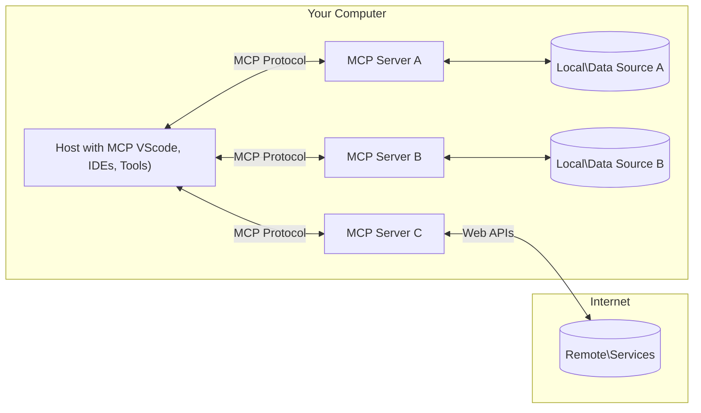

<!--
CO_OP_TRANSLATOR_METADATA:
{
  "original_hash": "355b12a5970c5c9e6db0bee970c751ba",
  "translation_date": "2025-07-13T16:18:16+00:00",
  "source_file": "01-CoreConcepts/README.md",
  "language_code": "hu"
}
-->
# 📖 MCP Alapfogalmak: A Model Context Protocol Mesteri Használata az AI Integrációhoz

A [Model Context Protocol (MCP)](https://github.com/modelcontextprotocol) egy erőteljes, szabványosított keretrendszer, amely optimalizálja a kommunikációt a Nagy Nyelvi Modellek (LLM-ek) és külső eszközök, alkalmazások, valamint adatforrások között. Ez az SEO-optimalizált útmutató végigvezet az MCP alapfogalmain, hogy megértsd a kliens-szerver architektúrát, a lényeges összetevőket, a kommunikáció mechanizmusait és a megvalósítás legjobb gyakorlatait.

## Áttekintés

Ebben a leckében megismerheted a Model Context Protocol (MCP) ökoszisztéma alapvető architektúráját és összetevőit. Megtanulod a kliens-szerver architektúrát, a kulcsfontosságú elemeket és a kommunikációs mechanizmusokat, amelyek az MCP interakciókat működtetik.

## 👩‍🎓 Fő Tanulási Célok

A lecke végére képes leszel:

- Megérteni az MCP kliens-szerver architektúrát.
- Azonosítani a Hosts, Clients és Servers szerepeit és felelősségeit.
- Elemezni az MCP rugalmasságát biztosító fő jellemzőket.
- Megérteni, hogyan áramlik az információ az MCP ökoszisztémában.
- Gyakorlati betekintést nyerni .NET, Java, Python és JavaScript kódpéldákon keresztül.

## 🔎 MCP Architektúra: Mélyebb Pillantás

Az MCP ökoszisztéma kliens-szerver modellre épül. Ez a moduláris felépítés lehetővé teszi, hogy az AI alkalmazások hatékonyan kommunikáljanak eszközökkel, adatbázisokkal, API-kkal és kontextuális erőforrásokkal. Nézzük meg ezt az architektúrát a fő összetevőkre bontva.

Az MCP alapvetően kliens-szerver architektúrát követ, ahol egy host alkalmazás több szerverhez is csatlakozhat:



- **MCP Hosts**: Olyan programok, mint a VSCode, Claude Desktop, IDE-k vagy AI eszközök, amelyek MCP-n keresztül szeretnének adatokat elérni
- **MCP Clients**: Protokoll kliensek, amelyek 1:1 kapcsolatot tartanak fenn a szerverekkel
- **MCP Servers**: Könnyűsúlyú programok, amelyek a szabványos Model Context Protocol segítségével specifikus képességeket tesznek elérhetővé
- **Helyi Adatforrások**: A számítógéped fájljai, adatbázisai és szolgáltatásai, amelyekhez az MCP szerverek biztonságosan hozzáférhetnek
- **Távoli Szolgáltatások**: Interneten elérhető külső rendszerek, amelyekhez az MCP szerverek API-kon keresztül csatlakozhatnak.

Az MCP Protokoll folyamatosan fejlődő szabvány, a legfrissebb frissítéseket a [protokoll specifikációban](https://modelcontextprotocol.io/specification/2025-06-18/) találod.

### 1. Hosts

A Model Context Protocol (MCP) esetében a Hosts kulcsszerepet töltenek be, mint a felhasználók elsődleges felületei a protokollal való interakcióhoz. A Hosts olyan alkalmazások vagy környezetek, amelyek kapcsolatot kezdeményeznek az MCP szerverekkel, hogy adatokat, eszközöket és promptokat érjenek el. Példák a Hosts-ra: integrált fejlesztői környezetek (IDE-k) mint a Visual Studio Code, AI eszközök, mint a Claude Desktop, vagy speciális feladatokra épített egyedi ügynökök.

**A Hosts** LLM alkalmazások, amelyek kapcsolatot kezdeményeznek. Ők:

- AI modellekkel dolgoznak vagy interakcióba lépnek válaszok generálásához.
- Kapcsolatot kezdeményeznek az MCP szerverekkel.
- Kezelik a beszélgetés menetét és a felhasználói felületet.
- Irányítják a jogosultságokat és biztonsági korlátozásokat.
- Kezelik a felhasználói beleegyezést az adatmegosztáshoz és az eszközök futtatásához.

### 2. Clients

A Clients alapvető összetevők, amelyek elősegítik a Hosts és az MCP szerverek közötti interakciót. A Clients közvetítőként működnek, lehetővé téve a Hosts számára, hogy hozzáférjenek és használják az MCP szerverek által nyújtott funkciókat. Fontos szerepük van a gördülékeny kommunikáció és hatékony adatcsere biztosításában az MCP architektúrában.

**A Clients** a host alkalmazáson belüli kapcsolódók. Ők:

- Kéréseket küldenek a szervereknek promptokkal/utasításokkal.
- Képességeket egyeztetnek a szerverekkel.
- Kezelik a modellek eszközhasználati kéréseit.
- Feldolgozzák és megjelenítik a válaszokat a felhasználóknak.

### 3. Servers

A Servers felelősek az MCP kliens kérések kezeléséért és a megfelelő válaszok biztosításáért. Különféle műveleteket végeznek, mint adatlekérés, eszközök futtatása és prompt generálás. A szerverek biztosítják, hogy a kliens és a host közötti kommunikáció hatékony és megbízható legyen, megőrizve az interakció folyamatának integritását.

**A Servers** olyan szolgáltatások, amelyek kontextust és képességeket biztosítanak. Ők:

- Regisztrálják az elérhető funkciókat (erőforrások, promptok, eszközök)
- Fogadják és végrehajtják a kliens eszközhívásait
- Kontextuális információkat szolgáltatnak a modell válaszainak javításához
- Visszaküldik az eredményeket a kliensnek
- Szükség esetén fenntartják az állapotot az interakciók között

A szervereket bárki fejlesztheti, hogy speciális funkciókkal bővítse a modell képességeit.

### 4. Server Features

A Model Context Protocol (MCP) szerverei alapvető építőelemeket kínálnak, amelyek gazdag interakciókat tesznek lehetővé a kliensek, hostok és nyelvi modellek között. Ezek a funkciók az MCP képességeit bővítik strukturált kontextus, eszközök és promptok biztosításával.

Az MCP szerverek a következő funkciókat kínálhatják:

#### 📑 Erőforrások

Az MCP-ben az erőforrások különféle kontextusokat és adatokat foglalnak magukban, amelyeket a felhasználók vagy AI modellek használhatnak. Ezek közé tartoznak:

- **Kontextuális adatok**: Információk és háttér, amelyeket a felhasználók vagy AI modellek döntéshozatalhoz és feladatvégzéshez használhatnak.
- **Tudásbázisok és dokumentumtárak**: Strukturált és strukturálatlan adatok gyűjteményei, például cikkek, kézikönyvek és kutatási anyagok, amelyek értékes betekintést nyújtanak.
- **Helyi fájlok és adatbázisok**: Helyileg tárolt adatok eszközökön vagy adatbázisokban, amelyek feldolgozhatók és elemezhetők.
- **API-k és webszolgáltatások**: Külső interfészek és szolgáltatások, amelyek további adatokat és funkciókat kínálnak, lehetővé téve az integrációt különféle online erőforrásokkal és eszközökkel.

Egy erőforrás például lehet egy adatbázis séma vagy egy fájl, amely így érhető el:

```text
file://log.txt
database://schema
```

### 🤖 Promptok

Az MCP promptjai különféle előre definiált sablonokat és interakciós mintákat tartalmaznak, amelyek célja a felhasználói munkafolyamatok egyszerűsítése és a kommunikáció javítása. Ezek közé tartoznak:

- **Sablonos üzenetek és munkafolyamatok**: Előre strukturált üzenetek és folyamatok, amelyek végigvezetik a felhasználókat adott feladatokon és interakciókon.
- **Előre definiált interakciós minták**: Szabványosított cselekvéssorozatok és válaszok, amelyek elősegítik a következetes és hatékony kommunikációt.
- **Speciális beszélgetési sablonok**: Testreszabható sablonok, amelyek adott típusú beszélgetésekhez igazodnak, biztosítva a releváns és kontextusban megfelelő interakciókat.

Egy prompt sablon így nézhet ki:

```markdown
Generate a product slogan based on the following {{product}} with the following {{keywords}}
```

#### ⛏️ Eszközök

Az MCP-ben az eszközök olyan funkciók, amelyeket az AI modell végrehajthat bizonyos feladatok elvégzésére. Ezek az eszközök arra szolgálnak, hogy bővítsék az AI modell képességeit strukturált és megbízható műveletek biztosításával. Fő jellemzők:

- **Az AI modell által végrehajtható funkciók**: Az eszközök futtatható funkciók, amelyeket az AI modell hívhat meg különféle feladatok elvégzésére.
- **Egyedi név és leírás**: Minden eszköznek egyedi neve és részletes leírása van, amely megmagyarázza a célját és működését.
- **Paraméterek és kimenetek**: Az eszközök specifikus paramétereket fogadnak és strukturált kimeneteket adnak vissza, biztosítva a következetes és kiszámítható eredményeket.
- **Diszkrét funkciók**: Az eszközök különálló funkciókat végeznek, mint például webes keresés, számítások vagy adatbázis lekérdezések.

Egy eszköz például így nézhet ki:

```typescript
server.tool(
  "GetProducts",
  {
    pageSize: z.string().optional(),
    pageCount: z.string().optional()
  }, () => {
    // return results from API
  }
)
```

## Client Funkciók

Az MCP-ben a kliensek több kulcsfontosságú funkciót kínálnak a szerverek számára, amelyek növelik a protokoll általános működését és interakcióját. Az egyik kiemelkedő funkció a Sampling.

### 👉 Sampling

- **Szerver által kezdeményezett ügynöki viselkedések**: A kliensek lehetővé teszik, hogy a szerverek autonóm módon indítsanak el bizonyos műveleteket vagy viselkedéseket, növelve a rendszer dinamikus képességeit.
- **Rekurzív LLM interakciók**: Ez a funkció lehetővé teszi a rekurzív interakciókat a nagy nyelvi modellekkel (LLM-ekkel), összetettebb és iteratív feladatfeldolgozást támogatva.
- **További modell kiegészítések kérése**: A szerverek kérhetnek további válaszokat a modelltől, biztosítva, hogy a válaszok alaposak és kontextusban relevánsak legyenek.

## Információáramlás az MCP-ben

A Model Context Protocol (MCP) strukturált információáramlást határoz meg a hostok, kliensek, szerverek és modellek között. Ennek megértése segít tisztázni, hogyan dolgozódnak fel a felhasználói kérések, és hogyan integrálódnak a külső eszközök és adatok a modell válaszaiba.

- **A Host kezdeményezi a kapcsolatot**  
  A host alkalmazás (például egy IDE vagy csevegőfelület) kapcsolatot létesít egy MCP szerverrel, általában STDIO, WebSocket vagy más támogatott átviteli módon keresztül.

- **Képességek egyeztetése**  
  A kliens (a hostban beágyazva) és a szerver információt cserélnek a támogatott funkciókról, eszközökről, erőforrásokról és protokoll verziókról. Ez biztosítja, hogy mindkét fél tisztában legyen a rendelkezésre álló képességekkel az adott munkamenetben.

- **Felhasználói kérés**  
  A felhasználó interakcióba lép a hosttal (például promptot vagy parancsot ad meg). A host összegyűjti ezt a bemenetet, és továbbítja a kliensnek feldolgozásra.

- **Erőforrás vagy eszköz használata**  
  - A kliens kérhet további kontextust vagy erőforrásokat a szervertől (például fájlokat, adatbázis bejegyzéseket vagy tudásbázis cikkeket), hogy gazdagítsa a modell megértését.
  - Ha a modell úgy ítéli meg, hogy eszközre van szükség (például adat lekéréséhez, számításhoz vagy API híváshoz), a kliens eszköz meghívási kérelmet küld a szervernek, megadva az eszköz nevét és paramétereit.

- **Szerver végrehajtás**  
  A szerver megkapja az erőforrás vagy eszköz kérést, végrehajtja a szükséges műveleteket (például függvény futtatása, adatbázis lekérdezés vagy fájl lekérése), majd strukturált formában visszaküldi az eredményeket a kliensnek.

- **Válasz generálása**  
  A kliens integrálja a szerver válaszait (erőforrás adatok, eszköz kimenetek stb.) a folyamatban lévő modell interakcióba. A modell ezeket az információkat felhasználva generál átfogó és kontextusban releváns választ.

- **Eredmény bemutatása**  
  A host megkapja a kliens végső kimenetét, és megjeleníti a felhasználónak, gyakran a modell által generált szöveget és az eszközök vagy erőforrások eredményeit együtt.

Ez a folyamat lehetővé teszi, hogy az MCP fejlett, interaktív és kontextusérzékeny AI alkalmazásokat támogasson, zökkenőmentesen összekapcsolva a modelleket külső eszközökkel és adatforrásokkal.

## Protokoll Részletek

Az MCP (Model Context Protocol) a [JSON-RPC 2.0](https://www.jsonrpc.org/) protokollra épül, amely szabványos, nyelvfüggetlen üzenetformátumot biztosít a hostok, kliensek és szerverek közötti kommunikációhoz. Ez az alap megbízható, strukturált és bővíthető interakciókat tesz lehetővé különböző platformokon és programozási nyelveken.

### Fő Protokoll Jellemzők

Az MCP kiterjeszti a JSON-RPC 2.0-t további konvenciókkal az eszköz meghívás, erőforrás hozzáférés és prompt kezelés terén. Több átviteli réteget támogat (STDIO, WebSocket, SSE), és biztonságos, bővíthető, nyelvfüggetlen kommunikációt tesz lehetővé az összetevők között.

#### 🧢 Alapprotokoll

- **JSON-RPC Üzenetformátum**: Minden kérés és válasz a JSON-RPC 2.0 specifikáción alapul, biztosítva az egységes szerkezetet a metódushívások, paraméterek, eredmények és hibakezelés számára.
- **Állapotmegőrző Kapcsolatok**: Az MCP munkamenetek több kérésen át megőrzik az állapotot, támogatva a folyamatos beszélgetéseket, kontextus felhalmozást és erőforrás kezelést.
- **Képességek Egyeztetése**: A kapcsolat létrehozásakor a kliensek és szerverek információt cserélnek a támogatott funkciókról, protokoll verziókról, elérhető eszközökről és erőforrásokról. Ez biztosítja, hogy mindkét fél ismerje a másik képességeit és ennek megfelelően alkalmazkodjon.

#### ➕ További Segédfunkciók

Az alábbiakban néhány további segédfunkció és protokoll kiterjesztés található, amelyeket az MCP kínál a fejlesztői élmény javítására és fejlett forgatókönyvek támogatására:

- **Konfiguráció
Az MCP több beépített koncepciót és mechanizmust tartalmaz a protokollon belüli biztonság és jogosultságkezelés érdekében:

1. **Eszköz jogosultságkezelés**:  
  Az ügyfelek megadhatják, hogy egy modell mely eszközöket használhatja egy munkamenet során. Ez biztosítja, hogy csak kifejezetten engedélyezett eszközök legyenek elérhetők, csökkentve a nem kívánt vagy veszélyes műveletek kockázatát. A jogosultságok dinamikusan állíthatók be a felhasználói preferenciák, szervezeti szabályzatok vagy az interakció kontextusa alapján.

2. **Hitelesítés**:  
  A szerverek hitelesítést kérhetnek az eszközökhöz, erőforrásokhoz vagy érzékeny műveletekhez való hozzáférés előtt. Ez magában foglalhat API kulcsokat, OAuth tokeneket vagy más hitelesítési módszereket. A megfelelő hitelesítés biztosítja, hogy csak megbízható ügyfelek és felhasználók használhassák a szerveroldali funkciókat.

3. **Érvényesítés**:  
  Minden eszköz meghívásakor paraméterellenőrzés történik. Minden eszköz meghatározza a várt típusokat, formátumokat és korlátokat a paramétereihez, és a szerver ennek megfelelően ellenőrzi a bejövő kéréseket. Ez megakadályozza, hogy hibás vagy rosszindulatú bemenetek érjék el az eszközök megvalósítását, és segít megőrizni a műveletek integritását.

4. **Korlátozás (Rate Limiting)**:  
  Az erőforrások visszaélésszerű használatának megakadályozása és a tisztességes hozzáférés biztosítása érdekében az MCP szerverek korlátozhatják az eszközhívások és erőforrás-hozzáférések gyakoriságát. A korlátok alkalmazhatók felhasználónként, munkamenetenként vagy globálisan, és védelmet nyújtanak a szolgáltatásmegtagadásos támadások vagy túlzott erőforrás-felhasználás ellen.

Ezeknek a mechanizmusoknak a kombinálásával az MCP biztonságos alapot nyújt a nyelvi modellek külső eszközökkel és adatforrásokkal való integrálásához, miközben a felhasználók és fejlesztők részletes kontrollt kapnak a hozzáférés és használat felett.

## Protokoll üzenetek

Az MCP kommunikáció strukturált JSON üzeneteket használ a világos és megbízható interakciók elősegítésére az ügyfelek, szerverek és modellek között. A fő üzenettípusok a következők:

- **Ügyfél kérés**  
  Az ügyféltől a szerver felé küldött üzenet, amely általában tartalmazza:
  - A felhasználó promptját vagy parancsát
  - A beszélgetés előzményeit a kontextus érdekében
  - Az eszköz konfigurációját és jogosultságait
  - Bármilyen további metaadatot vagy munkamenet-információt

- **Modell válasz**  
  A modelltől (az ügyfélen keresztül) visszaküldött üzenet, amely tartalmazza:
  - A prompt és a kontextus alapján generált szöveget vagy kiegészítést
  - Opcionális eszközhasználati utasításokat, ha a modell úgy ítéli meg, hogy eszközt kell hívni
  - Hivatkozásokat erőforrásokra vagy további kontextusra szükség szerint

- **Eszköz kérés**  
  Az ügyféltől a szerver felé küldött üzenet, amikor egy eszközt végre kell hajtani. Ez az üzenet tartalmazza:
  - A meghívandó eszköz nevét
  - Az eszköz által megkövetelt paramétereket (az eszköz sémája szerint érvényesítve)
  - Kontextuális információkat vagy azonosítókat a kérés nyomon követéséhez

- **Eszköz válasz**  
  A szervertől visszaküldött üzenet az eszköz végrehajtása után. Ez az üzenet tartalmazza:
  - Az eszköz végrehajtásának eredményeit (strukturált adat vagy tartalom)
  - Hibákat vagy állapotinformációkat, ha az eszközhívás sikertelen volt
  - Opcionálisan további metaadatokat vagy naplókat a végrehajtással kapcsolatban

Ezek a strukturált üzenetek biztosítják, hogy az MCP munkafolyamat minden lépése egyértelmű, nyomon követhető és bővíthető legyen, támogatva az összetett helyzeteket, mint a többszörös körös beszélgetések, eszközláncolás és megbízható hibakezelés.

## Főbb tanulságok

- Az MCP kliens-szerver architektúrát használ a modellek külső képességekkel való összekapcsolására
- Az ökoszisztéma ügyfelekből, hosztokból, szerverekből, eszközökből és adatforrásokból áll
- A kommunikáció történhet STDIO-n, SSE-n vagy WebSocketeken keresztül
- Az eszközök a funkcionalitás alapvető egységei, amelyeket a modellek elérhetnek
- A strukturált kommunikációs protokollok biztosítják a következetes interakciókat

## Gyakorlat

Tervezzen egy egyszerű MCP eszközt, amely hasznos lehet az Ön területén. Határozza meg:
1. Az eszköz nevét
2. Milyen paramétereket fogad el
3. Milyen kimenetet ad vissza
4. Hogyan használhatná egy modell ezt az eszközt a felhasználói problémák megoldására


---

## Mi következik

Következő: [Chapter 2: Security](../02-Security/README.md)

**Jogi nyilatkozat**:  
Ez a dokumentum az AI fordító szolgáltatás, a [Co-op Translator](https://github.com/Azure/co-op-translator) segítségével készült. Bár a pontosságra törekszünk, kérjük, vegye figyelembe, hogy az automatikus fordítások hibákat vagy pontatlanságokat tartalmazhatnak. Az eredeti dokumentum az anyanyelvén tekintendő hiteles forrásnak. Fontos információk esetén szakmai, emberi fordítást javaslunk. Nem vállalunk felelősséget a fordítás használatából eredő félreértésekért vagy téves értelmezésekért.