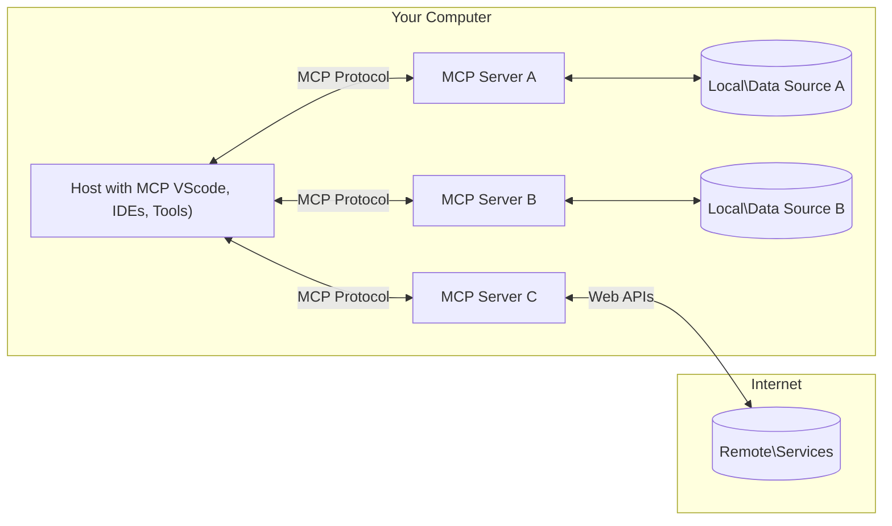

<!--
CO_OP_TRANSLATOR_METADATA:
{
  "original_hash": "b3b4a6ad10c3c0edbf7fa7cfa0ec496b",
  "translation_date": "2025-07-02T07:29:43+00:00",
  "source_file": "01-CoreConcepts/README.md",
  "language_code": "hu"
}
-->
# 📖 MCP Alapfogalmak: A Model Context Protocol elsajátítása az AI integrációhoz

A [Model Context Protocol (MCP)](https://github.com/modelcontextprotocol) egy hatékony, szabványosított keretrendszer, amely optimalizálja a kommunikációt a nagy nyelvi modellek (LLM-ek) és külső eszközök, alkalmazások, valamint adatforrások között. Ez a SEO-optimalizált útmutató végigvezet az MCP alapfogalmain, hogy megértsd a kliens-szerver architektúrát, a lényeges komponenseket, a kommunikáció működését és a megvalósítás legjobb gyakorlatait.

## Áttekintés

Ez a lecke feltárja a Model Context Protocol (MCP) ökoszisztéma alapvető architektúráját és összetevőit. Megismered a kliens-szerver modellt, a kulcsfontosságú elemeket és a kommunikációs mechanizmusokat, amelyek az MCP interakciókat működtetik.

## 👩‍🎓 Fő tanulási célok

A lecke végére képes leszel:

- Megérteni az MCP kliens-szerver architektúrát.
- Azonosítani a Hosts, Clients és Servers szerepeit és felelősségeit.
- Elemezni az MCP rugalmas integrációs rétegének fő jellemzőit.
- Megérteni az információáramlást az MCP ökoszisztémában.
- Gyakorlati betekintést nyerni .NET, Java, Python és JavaScript kódpéldákon keresztül.

## 🔎 MCP architektúra: Mélyebb betekintés

Az MCP ökoszisztéma kliens-szerver modellre épül. Ez a moduláris felépítés lehetővé teszi, hogy az AI alkalmazások hatékonyan kommunikáljanak eszközökkel, adatbázisokkal, API-kkal és kontextuális erőforrásokkal. Nézzük meg ezt az architektúrát a legfontosabb összetevőkre bontva.

Az MCP alapvetően kliens-szerver architektúrát követ, ahol egy host alkalmazás több szerverhez is kapcsolódhat:



- **MCP Hosts**: Olyan programok, mint a VSCode, Claude Desktop, IDE-k vagy AI eszközök, amelyek MCP-n keresztül szeretnének adatokat elérni
- **MCP Clients**: Protokoll kliensek, amelyek 1:1 kapcsolatot tartanak fenn a szerverekkel
- **MCP Servers**: Könnyűsúlyú programok, amelyek a szabványos Model Context Protocolon keresztül specifikus képességeket kínálnak
- **Helyi adatforrások**: A számítógéped fájljai, adatbázisai és szolgáltatásai, amelyeket az MCP szerverek biztonságosan elérhetnek
- **Távoli szolgáltatások**: Külső, interneten elérhető rendszerek, amelyekhez az MCP szerverek API-kon keresztül csatlakozhatnak

Az MCP protokoll egy folyamatosan fejlődő szabvány, a legfrissebb frissítéseket a [protokoll specifikációban](https://modelcontextprotocol.io/specification/2025-06-18/) találod.

### 1. Hosts

A Model Context Protocolban (MCP) a Hosts kulcsszerepet játszanak, mint a felhasználók elsődleges felületei a protokollal való interakcióhoz. A Hosts alkalmazások vagy környezetek, amelyek kapcsolatot kezdeményeznek az MCP szerverekkel, hogy adatokat, eszközöket és promptokat érjenek el. Például ilyenek az integrált fejlesztői környezetek (IDE-k) mint a Visual Studio Code, AI eszközök mint a Claude Desktop vagy egyedi, speciális feladatokra készült ügynökök.

**A Hosts** LLM alkalmazások, amelyek kapcsolatokat kezdeményeznek. Ők:

- AI modellekkel dolgoznak vagy interakcióba lépnek velük a válaszok generálásához.
- Kapcsolatot kezdeményeznek az MCP szerverekkel.
- Kezelik a beszélgetés menetét és a felhasználói felületet.
- Irányítják az engedélyeket és biztonsági korlátozásokat.
- Kezelik a felhasználói hozzájárulást az adatmegosztáshoz és eszközvégrehajtáshoz.

### 2. Clients

A Clients alapvető komponensek, amelyek elősegítik a Hosts és az MCP szerverek közötti interakciót. Közvetítőként működnek, lehetővé téve a Hosts számára, hogy hozzáférjenek és használják az MCP szerverek által kínált funkciókat. Fontos szerepük van a zökkenőmentes kommunikáció és az adatok hatékony cseréje biztosításában az MCP architektúrában.

**A Clients** a host alkalmazáson belüli kapcsolók. Ők:

- Kéréseket küldenek a szervereknek promptokkal/utasításokkal.
- Képességekről tárgyalnak a szerverekkel.
- Kezelik a modellektől érkező eszközvégrehajtási kéréseket.
- Feldolgozzák és megjelenítik a válaszokat a felhasználók számára.

### 3. Servers

A Servers felelősek az MCP kliensek kéréseinek kezeléséért és a megfelelő válaszok biztosításáért. Különböző műveleteket végeznek, mint adatlekérés, eszközvégrehajtás és prompt generálás. Biztosítják, hogy a kliensek és Hosts közötti kommunikáció hatékony és megbízható legyen, megőrizve az interakció folyamatának integritását.

**A Servers** szolgáltatások, amelyek kontextust és képességeket nyújtanak. Ők:

- Regisztrálják az elérhető funkciókat (erőforrások, promptok, eszközök)
- Fogadják és végrehajtják a kliens által indított eszközhívásokat
- Kontextuális információkat szolgáltatnak a modell válaszainak javítására
- Visszaküldik az eredményeket a kliensnek
- Szükség esetén fenntartják az állapotot az interakciók között

A szervereket bárki fejlesztheti, hogy speciális funkciókkal bővítse a modell képességeit.

### 4. Server Features

Az MCP szerverek alapvető építőelemeket biztosítanak, amelyek gazdag interakciókat tesznek lehetővé a kliensek, hostok és nyelvi modellek között. Ezek a funkciók az MCP képességeit bővítik strukturált kontextus, eszközök és promptok formájában.

Az MCP szerverek a következő funkciókat kínálhatják:

#### 📑 Erőforrások

Az MCP-ben az erőforrások különféle kontextusokat és adatokat foglalnak magukban, amelyeket a felhasználók vagy AI modellek hasznosíthatnak. Ezek közé tartoznak:

- **Kontextuális adatok**: Információk és háttér, amelyeket a felhasználók vagy modellek döntéshozatalhoz és feladatvégrehajtáshoz használhatnak.
- **Tudásbázisok és dokumentumtárak**: Strukturált és strukturálatlan adatok gyűjteményei, például cikkek, kézikönyvek és kutatási anyagok, amelyek értékes információkat nyújtanak.
- **Helyi fájlok és adatbázisok**: Helyileg tárolt adatok eszközökön vagy adatbázisokban, amelyek feldolgozásra és elemzésre elérhetők.
- **API-k és webszolgáltatások**: Külső interfészek és szolgáltatások, amelyek további adatokat és funkciókat kínálnak, lehetővé téve az online erőforrások és eszközök integrációját.

Egy erőforrás például lehet egy adatbázis séma vagy egy fájl, amely így érhető el:

```text
file://log.txt
database://schema
```

### 🤖 Promptok

Az MCP promptjai különféle előre definiált sablonokat és interakciós mintákat tartalmaznak, amelyek célja a felhasználói munkafolyamatok egyszerűsítése és a kommunikáció javítása. Ezek:

- **Sablonos üzenetek és munkafolyamatok**: Előre strukturált üzenetek és folyamatok, amelyek végigvezetik a felhasználókat specifikus feladatokon és interakciókon.
- **Előre definiált interakciós minták**: Standardizált cselekvéssorozatok és válaszok, amelyek biztosítják a következetes és hatékony kommunikációt.
- **Speciális beszélgetési sablonok**: Testreszabható sablonok, amelyek adott beszélgetéstípusokra vannak szabva, releváns és kontextusban helyes interakciókat biztosítva.

Egy prompt sablon így nézhet ki:

```markdown
Generate a product slogan based on the following {{product}} with the following {{keywords}}
```

#### ⛏️ Eszközök

Az MCP eszközök olyan funkciók, amelyeket az AI modell végrehajthat meghatározott feladatok elvégzésére. Ezek az eszközök növelik az AI modell képességeit strukturált és megbízható műveletek biztosításával. Fő jellemzők:

- **Funkciók az AI modell számára**: Az eszközök futtatható funkciók, amelyeket az AI modell hívhat meg különféle feladatok elvégzésére.
- **Egyedi név és leírás**: Minden eszköznek saját neve és részletes leírása van, amely bemutatja a célját és működését.
- **Paraméterek és kimenetek**: Az eszközök specifikus paramétereket fogadnak el és strukturált kimeneteket adnak vissza, biztosítva a következetes eredményeket.
- **Diszkrét funkciók**: Az eszközök elkülönült funkciókat végeznek, például webes kereséseket, számításokat vagy adatbázis-lekérdezéseket.

Egy eszköz például így nézhet ki:

```typescript
server.tool(
  "GetProducts",
  {
    pageSize: z.string().optional(),
    pageCount: z.string().optional()
  }, () => {
    // return results from API
  }
)
```

## Kliens funkciók

Az MCP-ben a kliensek több kulcsfontosságú funkciót kínálnak a szervereknek, amelyek növelik a protokoll működőképességét és az interakció minőségét. Ezek közül kiemelkedik a mintavételezés.

### 👉 Mintavételezés

- **Szerver által kezdeményezett agentikus viselkedések**: A kliensek lehetővé teszik, hogy a szerverek autonóm módon indítsanak el specifikus műveleteket vagy viselkedéseket, növelve a rendszer dinamikus képességeit.
- **Rekurzív LLM interakciók**: Ez a funkció lehetővé teszi a nagy nyelvi modellekkel való ismétlődő interakciókat, bonyolultabb és iteratív feladatfeldolgozást támogatva.
- **További modell-kiegészítések kérése**: A szerverek kérhetnek további válaszokat a modelltől, hogy a válaszok alaposabbak és kontextusban relevánsabbak legyenek.

## Információáramlás az MCP-ben

A Model Context Protocol (MCP) strukturált információáramlást határoz meg a hostok, kliensek, szerverek és modellek között. Ennek megértése segít tisztázni, hogyan dolgozódnak fel a felhasználói kérések, és hogyan integrálódnak a külső eszközök és adatok a modell válaszaiba.

- **Host kezdeményezi a kapcsolatot**  
  A host alkalmazás (például IDE vagy chat felület) kapcsolatot létesít egy MCP szerverrel, általában STDIO, WebSocket vagy más támogatott protokollon keresztül.

- **Képességek egyeztetése**  
  A kliens (a hostban) és a szerver információt cserélnek a támogatott funkciókról, eszközökről, erőforrásokról és protokoll verziókról. Ez biztosítja, hogy mindkét fél tisztában legyen a rendelkezésre álló képességekkel.

- **Felhasználói kérés**  
  A felhasználó interakcióba lép a hosttal (például promptot vagy parancsot ad meg). A host összegyűjti a bemenetet és továbbítja a kliensnek feldolgozásra.

- **Erőforrás vagy eszköz használata**  
  - A kliens kérhet további kontextust vagy erőforrásokat a szervertől (például fájlokat, adatbázis bejegyzéseket vagy tudásbázis cikkeket), hogy gazdagítsa a modell megértését.
  - Ha a modell úgy ítéli meg, hogy eszközre van szükség (például adatlekéréshez, számításhoz vagy API híváshoz), a kliens eszközhasználati kérést küld a szervernek, megadva az eszköz nevét és paramétereit.

- **Szerver végrehajtás**  
  A szerver fogadja az erőforrás vagy eszközkérést, végrehajtja a szükséges műveleteket (például függvény futtatása, adatbázis lekérdezése, fájl lekérése), majd strukturált formában visszaküldi az eredményeket a kliensnek.

- **Válasz generálás**  
  A kliens beépíti a szerver válaszait (erőforrás adatok, eszköz eredmények stb.) a folyamatban lévő modell interakcióba. A modell ezt az információt felhasználva generál átfogó és kontextusban releváns választ.

- **Eredmény bemutatása**  
  A host megkapja a kliens végső kimenetét, és megjeleníti a felhasználónak, gyakran a modell által generált szöveget és az eszközök vagy erőforrások eredményeit együtt.

Ez a folyamat lehetővé teszi, hogy az MCP fejlett, interaktív és kontextusérzékeny AI alkalmazásokat támogasson azáltal, hogy zökkenőmentesen kapcsolja össze a modelleket külső eszközökkel és adatforrásokkal.

## Protokoll részletek

Az MCP (Model Context Protocol) a [JSON-RPC 2.0](https://www.jsonrpc.org/) fölé épül, szabványos, nyelvfüggetlen üzenetformátumot biztosítva a hostok, kliensek és szerverek közötti kommunikációhoz. Ez az alap megbízható, strukturált és bővíthető interakciókat tesz lehetővé különböző platformokon és programozási nyelveken.

### Fő protokoll jellemzők

Az MCP kiterjeszti a JSON-RPC 2.0-t további konvenciókkal az eszközök meghívásához, erőforrás-hozzáféréshez és prompt kezeléshez. Több transzport réteget támogat (STDIO, WebSocket, SSE), és lehetővé teszi a biztonságos, bővíthető és nyelvfüggetlen kommunikációt az összetevők között.

#### 🧢 Alapprotokoll

- **JSON-RPC üzenetformátum**: Minden kérés és válasz a JSON-RPC 2.0 specifikáción alapul, biztosítva az egységes szerkezetet a metódushívásokhoz, paraméterekhez, eredményekhez és hibakezeléshez.
- **Állapotmegőrző kapcsolatok**: Az MCP munkamenetek több kérésen át megőrzik az állapotot, támogatva a folyamatos beszélgetéseket, kontextus felhalmozást és erőforrás-kezelést.
- **Képességek egyeztetése**: Kapcsolatfelvételkor a kliensek és szerverek információt cserélnek a támogatott funkciókról, protokoll verziókról, elérhető eszközökről és erőforrásokról. Ez biztosítja, hogy mindkét fél értse a másik képességeit és ennek megfelelően alkalmazkodjon.

#### ➕ További eszközök

Az MCP további eszközöket és protokoll kiterjesztéseket kínál a fejlesztői élmény javítására és fejlett forgatókönyvek támogatására:

- **Konfigurációs opciók**: Dinamikus munkamenet-paraméterek beállítása, mint például eszközengedélyek, erőforrás-hozzáférés és modellbeállítások, az egyes interakciókhoz igazítva

**Jogi nyilatkozat**:  
Ez a dokumentum az AI fordítószolgáltatás, a [Co-op Translator](https://github.com/Azure/co-op-translator) segítségével készült. Bár a pontosságra törekszünk, kérjük, vegye figyelembe, hogy az automatikus fordítások hibákat vagy pontatlanságokat tartalmazhatnak. Az eredeti dokumentum anyanyelvű változata tekintendő hiteles forrásnak. Kritikus információk esetén szakmai, emberi fordítást javaslunk. Nem vállalunk felelősséget az ebből a fordításból eredő félreértésekért vagy félreértelmezésekért.