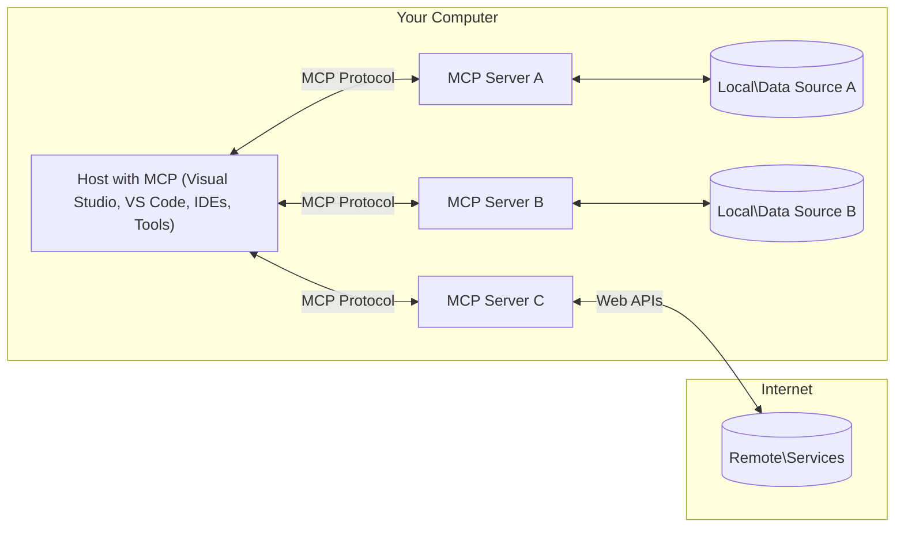

<!--
CO_OP_TRANSLATOR_METADATA:
{
  "original_hash": "904b59de1de9264801242d90a42cdd9d",
  "translation_date": "2025-09-05T11:25:52+00:00",
  "source_file": "01-CoreConcepts/README.md",
  "language_code": "hu"
}
-->
# MCP Alapfogalmak: A Model Context Protocol elsajátítása AI integrációhoz

[](https://youtu.be/earDzWGtE84)

_(Kattints a fenti képre a leckéhez tartozó videó megtekintéséhez)_

A [Model Context Protocol (MCP)](https://github.com/modelcontextprotocol) egy erőteljes, szabványosított keretrendszer, amely optimalizálja a kommunikációt a Nagy Nyelvi Modellek (LLM-ek) és külső eszközök, alkalmazások, valamint adatforrások között. 
Ez az útmutató végigvezet az MCP alapfogalmain. Megismerheted a kliens-szerver architektúrát, az alapvető komponenseket, a kommunikáció mechanizmusait és a megvalósítás legjobb gyakorlatait.

- **Felhasználói beleegyezés**: Minden adat-hozzáférés és művelet végrehajtása előtt explicit felhasználói jóváhagyás szükséges. A felhasználóknak pontosan érteniük kell, hogy milyen adatokat érnek el, és milyen műveleteket hajtanak végre, miközben részletesen szabályozhatják az engedélyeket és jogosultságokat.

- **Adatvédelem**: A felhasználói adatok csak explicit beleegyezéssel érhetők el, és az interakció teljes életciklusa alatt szigorú hozzáférés-ellenőrzéssel kell védeni őket. A megvalósításoknak meg kell akadályozniuk az illetéktelen adatátvitelt, és szigorú adatvédelmi határokat kell fenntartaniuk.

- **Eszközhasználat biztonsága**: Minden eszköz meghívása explicit felhasználói beleegyezést igényel, amely tisztázza az eszköz funkcionalitását, paramétereit és lehetséges hatásait. Megbízható biztonsági határokat kell létrehozni az akaratlan, nem biztonságos vagy rosszindulatú eszközhasználat megelőzésére.

- **Szállítási réteg biztonsága**: Minden kommunikációs csatornának megfelelő titkosítási és hitelesítési mechanizmusokat kell alkalmaznia. A távoli kapcsolatoknak biztonságos szállítási protokollokat és megfelelő hitelesítési kezelést kell megvalósítaniuk.

#### Megvalósítási irányelvek:

- **Engedélykezelés**: Valósíts meg részletes engedélyezési rendszereket, amelyek lehetővé teszik a felhasználók számára, hogy szabályozzák, mely szerverek, eszközök és erőforrások érhetők el.
- **Hitelesítés és jogosultságkezelés**: Használj biztonságos hitelesítési módszereket (OAuth, API kulcsok) megfelelő tokenkezeléssel és lejárati idővel.  
- **Bemeneti validáció**: Validáld az összes paramétert és adatbevitelt meghatározott sémák szerint az injekciós támadások megelőzése érdekében.
- **Audit naplózás**: Tarts átfogó naplókat minden műveletről a biztonsági monitorozás és megfelelőség érdekében.

## Áttekintés

Ez a lecke bemutatja a Model Context Protocol (MCP) ökoszisztéma alapvető architektúráját és komponenseit. Megismerheted a kliens-szerver architektúrát, kulcsfontosságú elemeket és kommunikációs mechanizmusokat, amelyek az MCP interakciókat működtetik.

## Fő tanulási célok

A lecke végére képes leszel:

- Megérteni az MCP kliens-szerver architektúrát.
- Azonosítani a Hostok, Kliensek és Szerverek szerepeit és felelősségeit.
- Elemezni az MCP-t rugalmas integrációs réteggé tevő alapvető funkciókat.
- Megérteni, hogyan áramlik az információ az MCP ökoszisztémában.
- Gyakorlati betekintést nyerni .NET, Java, Python és JavaScript kódpéldákon keresztül.

## MCP Architektúra: Mélyebb betekintés

Az MCP ökoszisztéma egy kliens-szerver modellen alapul. Ez a moduláris struktúra lehetővé teszi az AI alkalmazások számára, hogy hatékonyan kommunikáljanak eszközökkel, adatbázisokkal, API-kkal és kontextuális erőforrásokkal. Nézzük meg részletesen az architektúra alapvető elemeit.

Az MCP alapja egy kliens-szerver architektúra, ahol egy host alkalmazás több szerverhez is csatlakozhat:



- **MCP Hostok**: Programok, mint például VSCode, Claude Desktop, IDE-k vagy AI eszközök, amelyek MCP-n keresztül szeretnének adatokat elérni.
- **MCP Kliensek**: Protokoll kliensek, amelyek 1:1 kapcsolatot tartanak fenn a szerverekkel.
- **MCP Szerverek**: Könnyű programok, amelyek az MCP szabványosított protokollján keresztül specifikus képességeket biztosítanak.
- **Helyi adatforrások**: A számítógéped fájljai, adatbázisai és szolgáltatásai, amelyeket az MCP szerverek biztonságosan elérhetnek.
- **Távoli szolgáltatások**: Interneten keresztül elérhető külső rendszerek, amelyekhez az MCP szerverek API-kon keresztül csatlakozhatnak.

Az MCP Protokoll egy folyamatosan fejlődő szabvány, amely dátum-alapú verziózást használ (YYYY-MM-DD formátum). Az aktuális protokoll verzió **2025-06-18**. A legfrissebb frissítéseket a [protokoll specifikációban](https://modelcontextprotocol.io/specification/2025-06-18/) találhatod.

### 1. Hostok

A Model Context Protocol (MCP) esetében a **Hostok** olyan AI alkalmazások, amelyek a protokollal való interakció elsődleges felületét biztosítják a felhasználók számára. A Hostok koordinálják és kezelik a kapcsolódásokat több MCP szerverhez, dedikált MCP klienseket létrehozva minden szerverkapcsolathoz. A Hostok példái:

- **AI Alkalmazások**: Claude Desktop, Visual Studio Code, Claude Code
- **Fejlesztési környezetek**: IDE-k és kódszerkesztők MCP integrációval  
- **Egyedi alkalmazások**: Célzottan fejlesztett AI ügynökök és eszközök

**Hostok** olyan alkalmazások, amelyek az AI modellek interakcióit koordinálják. Feladataik:

- **AI modellek irányítása**: LLM-ek végrehajtása vagy interakciója válaszok generálására és AI munkafolyamatok koordinálására.
- **Klienskapcsolatok kezelése**: Egy MCP kliens létrehozása és fenntartása minden MCP szerverkapcsolathoz.
- **Felhasználói felület irányítása**: Beszélgetés folyamatának, felhasználói interakcióknak és válaszok megjelenítésének kezelése.  
- **Biztonság érvényesítése**: Engedélyek, biztonsági korlátok és hitelesítés kezelése.
- **Felhasználói beleegyezés kezelése**: Felhasználói jóváhagyás kezelése az adatmegosztás és eszközhasználat során.

### 2. Kliensek

**Kliensek** alapvető komponensek, amelyek dedikált egy-az-egyben kapcsolatokat tartanak fenn a Hostok és MCP szerverek között. Minden MCP klienst a Host hoz létre, hogy egy adott MCP szerverhez csatlakozzon, biztosítva a szervezett és biztonságos kommunikációs csatornákat. Több kliens lehetővé teszi a Hostok számára, hogy egyszerre több szerverhez csatlakozzanak.

**Kliensek** a host alkalmazáson belüli csatlakozó komponensek. Feladataik:

- **Protokoll kommunikáció**: JSON-RPC 2.0 kérések küldése szervereknek utasításokkal és promptokkal.
- **Képességek egyeztetése**: A támogatott funkciók és protokoll verziók egyeztetése a szerverekkel az inicializálás során.
- **Eszközhasználat kezelése**: Eszközhasználati kérések kezelése modellektől és válaszok feldolgozása.
- **Valós idejű frissítések**: Értesítések és valós idejű frissítések kezelése szerverektől.
- **Válaszok feldolgozása**: Szerver válaszok feldolgozása és formázása a felhasználók számára történő megjelenítéshez.

### 3. Szerverek

**Szerverek** olyan programok, amelyek kontextust, eszközöket és képességeket biztosítanak MCP kliensek számára. Lokálisan (ugyanazon a gépen, mint a Host) vagy távolról (külső platformokon) futtathatók, és felelősek a klienskérések kezeléséért és strukturált válaszok biztosításáért. A szerverek az MCP szabványosított protokollján keresztül specifikus funkcionalitást biztosítanak.

**Szerverek** szolgáltatások, amelyek kontextust és képességeket biztosítanak. Feladataik:

- **Funkció regisztráció**: Elérhető primitívek (erőforrások, promptok, eszközök) regisztrálása és kliens számára történő biztosítása.
- **Kérések feldolgozása**: Eszközhasználati, erőforrás- és promptkérések fogadása és végrehajtása kliensektől.
- **Kontextus biztosítása**: Kontextuális információ és adatok biztosítása a modellek válaszainak javítására.
- **Állapotkezelés**: Munkamenet állapotának fenntartása és állapotfüggő interakciók kezelése, ha szükséges.
- **Valós idejű értesítések**: Értesítések küldése a képességek változásairól és frissítésekről a csatlakozott klienseknek.

A szervereket bárki fejlesztheti, hogy a modellek képességeit speciális funkcionalitással bővítse, és támogatják mind a helyi, mind a távoli telepítési forgatókönyveket.

### 4. Szerver Primitívek

A Model Context Protocol (MCP) szerverei három alapvető **primitívet** biztosítanak, amelyek meghatározzák a kliensek, hostok és nyelvi modellek közötti gazdag interakciók alapvető építőelemeit. Ezek a primitívek specifikálják a protokollon keresztül elérhető kontextuális információk és műveletek típusait.

Az MCP szerverek az alábbi három alapvető primitív bármely kombinációját biztosíthatják:

#### Erőforrások

**Erőforrások** olyan adatforrások, amelyek kontextuális információt biztosítanak AI alkalmazások számára. Statikus vagy dinamikus tartalmat képviselnek, amelyek javítják a modellek megértését és döntéshozatalát:

- **Kontextuális adatok**: Strukturált információ és kontextus AI modellek számára.
- **Tudásbázisok**: Dokumentumtárak, cikkek, kézikönyvek és kutatási anyagok.
- **Helyi adatforrások**: Fájlok, adatbázisok és helyi rendszerinformációk.  
- **Külső adatok**: API válaszok, webszolgáltatások és távoli rendszeradatok.
- **Dinamikus tartalom**: Valós idejű adatok, amelyek külső körülmények alapján frissülnek.

Az erőforrásokat URI-k azonosítják, és felfedezhetők a `resources/list` és lekérhetők a `resources/read` metódusokkal:

```text
file://documents/project-spec.md
database://production/users/schema
api://weather/current
```

#### Promptok

**Promptok** újrahasználható sablonok, amelyek segítenek strukturálni a nyelvi modellekkel való interakciókat. Szabványosított interakciós mintákat és sablonos munkafolyamatokat biztosítanak:

- **Sablon-alapú interakciók**: Előre strukturált üzenetek és beszélgetésindítók.
- **Munkafolyamat sablonok**: Szabványosított sorozatok gyakori feladatokhoz és interakciókhoz.
- **Few-shot példák**: Példa-alapú sablonok a modellek utasításához.
- **Rendszerpromptok**: Alapvető promptok, amelyek meghatározzák a modellek viselkedését és kontextusát.
- **Dinamikus sablonok**: Paraméterezett promptok, amelyek specifikus kontextusokhoz igazodnak.

A promptok támogatják a változóhelyettesítést, és felfedezhetők a `prompts/list` és lekérhetők a `prompts/get` metódusokkal:

```markdown
Generate a {{task_type}} for {{product}} targeting {{audience}} with the following requirements: {{requirements}}
```

#### Eszközök

**Eszközök** végrehajtható funkciók, amelyeket AI modellek hívhatnak meg specifikus műveletek végrehajtására. Az MCP ökoszisztéma "igéi"-t képviselik, lehetővé téve a modellek számára, hogy külső rendszerekkel interakcióba lépjenek:

- **Végrehajtható funkciók**: Diszkrét műveletek, amelyeket modellek meghívhatnak specifikus paraméterekkel.
- **Külső rendszerintegráció**: API hívások, adatbázis lekérdezések, fájlműveletek, számítások.
- **Egyedi azonosító**: Minden eszköznek van egy egyedi neve, leírása és paraméter sémája.
- **Strukturált I/O**: Az eszközök validált paramétereket fogadnak el, és strukturált, típusos válaszokat adnak vissza.
- **Műveleti képességek**: Lehetővé teszik a modellek számára, hogy valós műveleteket hajtsanak végre és élő adatokat érjenek el.

Az eszközök JSON Schema-val vannak definiálva a paraméter validációhoz, és felfedezhetők a `tools/list` és végrehajthatók a `tools/call` metódusokkal:

```typescript
server.tool(
  "search_products", 
  {
    query: z.string().describe("Search query for products"),
    category: z.string().optional().describe("Product category filter"),
    max_results: z.number().default(10).describe("Maximum results to return")
  }, 
  async (params) => {
    // Execute search and return structured results
    return await productService.search(params);
  }
);
```

## Kliens Primitívek

A Model Context Protocol (MCP) esetében a **kliensek** primitíveket biztosíthatnak, amelyek lehetővé teszik a szerverek számára, hogy további képességeket kérjenek a host alkalmazástól. Ezek a kliensoldali primitívek gazdagabb, interaktívabb szervermegvalósításokat tesznek lehetővé, amelyek hozzáférhetnek az AI modellek képességeihez és a felhasználói interakciókhoz.

### Mintavételezés

**Mintavételezés** lehetővé teszi a szerverek számára, hogy nyelvi modell kiegészítéseket kérjenek a kliens AI alkalmazásától. Ez a primitív lehetővé teszi a szerverek számára, hogy hozzáférjenek az LLM képességekhez anélkül, hogy saját modellfüggőségeket beágyaznának:

- **Modellfüggetlen hozzáférés**: A szerverek kiegészítéseket kérhetnek anélkül, hogy LLM SDK-kat tartalmaznának vagy modellhozzáférést kezelnének.
- **Szerver-kezdeményezett AI**: Lehetővé teszi a szerverek számára, hogy önállóan generáljanak tartalmat a kliens AI modelljével.
- **Rekurzív LLM interakciók**: Támogatja az összetett forgatókönyveket, ahol a szerverek AI segítséget igényelnek a feldolgozáshoz.
- **Dinamikus tartalomgenerálás**: Lehetővé teszi a szerverek számára, hogy kontextuális válaszokat hozzanak létre a host modelljének segítségével.

A mintavételezést a `sampling/complete` metódus indítja, ahol a szerverek kiegészítési kéréseket küldenek a klienseknek.

### Információkérés  

**Információkérés** lehetővé teszi a szerverek számára, hogy további információt vagy megerősítést kérjenek a felhasználóktól a kliens felületén keres
- **JSON-RPC 2.0 Protokoll**: Az összes kommunikáció szabványosított JSON-RPC 2.0 üzenetformátumot használ metódushívásokhoz, válaszokhoz és értesítésekhez  
- **Életciklus-kezelés**: Kezeli a kapcsolat inicializálását, a képességek egyeztetését és az ülések lezárását kliensek és szerverek között  
- **Szerver primitívek**: Lehetővé teszi a szerverek számára, hogy alapvető funkciókat biztosítsanak eszközökön, erőforrásokon és promptokon keresztül  
- **Kliens primitívek**: Lehetővé teszi a szerverek számára, hogy mintavételezést kérjenek LLM-ekből, felhasználói bemenetet kérjenek, és naplóüzeneteket küldjenek  
- **Valós idejű értesítések**: Támogatja az aszinkron értesítéseket dinamikus frissítésekhez lekérdezés nélkül  

#### Főbb jellemzők:

- **Protokoll verzió egyeztetés**: Dátum alapú verziózást (ÉÉÉÉ-HH-NN) használ a kompatibilitás biztosítására  
- **Képesség-felfedezés**: A kliensek és szerverek az inicializálás során megosztják a támogatott funkciók információit  
- **Állapotmegőrző ülések**: Több interakció során fenntartja a kapcsolat állapotát a kontextus folytonossága érdekében  

### Szállítási réteg

A **Szállítási réteg** kezeli a kommunikációs csatornákat, az üzenetek keretezését és az MCP résztvevők közötti hitelesítést:

#### Támogatott szállítási mechanizmusok:

1. **STDIO szállítás**:
   - Standard bemeneti/kimeneti adatfolyamokat használ közvetlen folyamatkommunikációhoz  
   - Optimális helyi folyamatokhoz ugyanazon a gépen, hálózati terhelés nélkül  
   - Gyakran használják helyi MCP szerver implementációkhoz  

2. **Streamelhető HTTP szállítás**:
   - HTTP POST-ot használ kliens-szerver üzenetekhez  
   - Opcionális Server-Sent Events (SSE) a szerver-kliens irányú adatfolyamhoz  
   - Lehetővé teszi a távoli szerverekkel való kommunikációt hálózatokon keresztül  
   - Támogatja a szabványos HTTP hitelesítést (bearer tokenek, API kulcsok, egyedi fejlécek)  
   - Az MCP az OAuth használatát javasolja a biztonságos token alapú hitelesítéshez  

#### Szállítási absztrakció:

A szállítási réteg elválasztja a kommunikáció részleteit az adatrétegtől, lehetővé téve ugyanazon JSON-RPC 2.0 üzenetformátum használatát minden szállítási mechanizmus esetén. Ez az absztrakció lehetővé teszi az alkalmazások számára, hogy zökkenőmentesen váltsanak helyi és távoli szerverek között.

### Biztonsági szempontok

Az MCP implementációknak több kritikus biztonsági elvet kell követniük annak érdekében, hogy minden protokollművelet során biztonságos, megbízható és védett interakciókat biztosítsanak:

- **Felhasználói beleegyezés és irányítás**: A felhasználóknak kifejezett beleegyezést kell adniuk, mielőtt bármilyen adatot elérnek vagy műveletet végrehajtanak. Egyértelmű irányítással kell rendelkezniük arról, hogy milyen adatokat osztanak meg, és mely műveleteket engedélyezik, intuitív felhasználói felületek segítségével az aktivitások áttekintéséhez és jóváhagyásához.  

- **Adatvédelem**: A felhasználói adatokat csak kifejezett beleegyezéssel szabad megosztani, és megfelelő hozzáférés-vezérléssel kell védeni. Az MCP implementációknak meg kell akadályozniuk az illetéktelen adatátvitelt, és biztosítaniuk kell az adatvédelem fenntartását minden interakció során.  

- **Eszközbiztonság**: Mielőtt bármilyen eszközt meghívnának, kifejezett felhasználói beleegyezés szükséges. A felhasználóknak világos megértéssel kell rendelkezniük az egyes eszközök funkcionalitásáról, és szigorú biztonsági határokat kell érvényesíteni az akaratlan vagy nem biztonságos eszközhasználat megelőzése érdekében.  

Ezeknek a biztonsági elveknek a követésével az MCP biztosítja a felhasználói bizalom, az adatvédelem és a biztonság fenntartását minden protokoll interakció során, miközben lehetővé teszi a fejlett AI integrációkat.

## Kódpéldák: Főbb komponensek

Az alábbiakban népszerű programozási nyelveken találhatók kódpéldák, amelyek bemutatják, hogyan lehet megvalósítani az MCP szerver főbb komponenseit és eszközeit.

### .NET példa: Egyszerű MCP szerver létrehozása eszközökkel

Itt egy gyakorlati .NET kódpélda, amely bemutatja, hogyan lehet egy egyszerű MCP szervert megvalósítani egyedi eszközökkel. Ez a példa bemutatja, hogyan lehet eszközöket definiálni és regisztrálni, kéréseket kezelni, és a szervert az MCP segítségével csatlakoztatni.

```csharp
using System;
using System.Threading.Tasks;
using ModelContextProtocol.Server;
using ModelContextProtocol.Server.Transport;
using ModelContextProtocol.Server.Tools;

public class WeatherServer
{
    public static async Task Main(string[] args)
    {
        // Create an MCP server
        var server = new McpServer(
            name: "Weather MCP Server",
            version: "1.0.0"
        );
        
        // Register our custom weather tool
        server.AddTool<string, WeatherData>("weatherTool", 
            description: "Gets current weather for a location",
            execute: async (location) => {
                // Call weather API (simplified)
                var weatherData = await GetWeatherDataAsync(location);
                return weatherData;
            });
        
        // Connect the server using stdio transport
        var transport = new StdioServerTransport();
        await server.ConnectAsync(transport);
        
        Console.WriteLine("Weather MCP Server started");
        
        // Keep the server running until process is terminated
        await Task.Delay(-1);
    }
    
    private static async Task<WeatherData> GetWeatherDataAsync(string location)
    {
        // This would normally call a weather API
        // Simplified for demonstration
        await Task.Delay(100); // Simulate API call
        return new WeatherData { 
            Temperature = 72.5,
            Conditions = "Sunny",
            Location = location
        };
    }
}

public class WeatherData
{
    public double Temperature { get; set; }
    public string Conditions { get; set; }
    public string Location { get; set; }
}
```

### Java példa: MCP szerver komponensek

Ez a példa ugyanazt az MCP szervert és eszközregisztrációt mutatja be, mint a fenti .NET példa, de Java nyelven megvalósítva.

```java
import io.modelcontextprotocol.server.McpServer;
import io.modelcontextprotocol.server.McpToolDefinition;
import io.modelcontextprotocol.server.transport.StdioServerTransport;
import io.modelcontextprotocol.server.tool.ToolExecutionContext;
import io.modelcontextprotocol.server.tool.ToolResponse;

public class WeatherMcpServer {
    public static void main(String[] args) throws Exception {
        // Create an MCP server
        McpServer server = McpServer.builder()
            .name("Weather MCP Server")
            .version("1.0.0")
            .build();
            
        // Register a weather tool
        server.registerTool(McpToolDefinition.builder("weatherTool")
            .description("Gets current weather for a location")
            .parameter("location", String.class)
            .execute((ToolExecutionContext ctx) -> {
                String location = ctx.getParameter("location", String.class);
                
                // Get weather data (simplified)
                WeatherData data = getWeatherData(location);
                
                // Return formatted response
                return ToolResponse.content(
                    String.format("Temperature: %.1f°F, Conditions: %s, Location: %s", 
                    data.getTemperature(), 
                    data.getConditions(), 
                    data.getLocation())
                );
            })
            .build());
        
        // Connect the server using stdio transport
        try (StdioServerTransport transport = new StdioServerTransport()) {
            server.connect(transport);
            System.out.println("Weather MCP Server started");
            // Keep server running until process is terminated
            Thread.currentThread().join();
        }
    }
    
    private static WeatherData getWeatherData(String location) {
        // Implementation would call a weather API
        // Simplified for example purposes
        return new WeatherData(72.5, "Sunny", location);
    }
}

class WeatherData {
    private double temperature;
    private String conditions;
    private String location;
    
    public WeatherData(double temperature, String conditions, String location) {
        this.temperature = temperature;
        this.conditions = conditions;
        this.location = location;
    }
    
    public double getTemperature() {
        return temperature;
    }
    
    public String getConditions() {
        return conditions;
    }
    
    public String getLocation() {
        return location;
    }
}
```

### Python példa: MCP szerver építése

Ez a példa a fastmcp-t használja, ezért győződjön meg róla, hogy először telepítette:

```python
pip install fastmcp
```  
Kódrészlet:

```python
#!/usr/bin/env python3
import asyncio
from fastmcp import FastMCP
from fastmcp.transports.stdio import serve_stdio

# Create a FastMCP server
mcp = FastMCP(
    name="Weather MCP Server",
    version="1.0.0"
)

@mcp.tool()
def get_weather(location: str) -> dict:
    """Gets current weather for a location."""
    return {
        "temperature": 72.5,
        "conditions": "Sunny",
        "location": location
    }

# Alternative approach using a class
class WeatherTools:
    @mcp.tool()
    def forecast(self, location: str, days: int = 1) -> dict:
        """Gets weather forecast for a location for the specified number of days."""
        return {
            "location": location,
            "forecast": [
                {"day": i+1, "temperature": 70 + i, "conditions": "Partly Cloudy"}
                for i in range(days)
            ]
        }

# Register class tools
weather_tools = WeatherTools()

# Start the server
if __name__ == "__main__":
    asyncio.run(serve_stdio(mcp))
```

### JavaScript példa: MCP szerver létrehozása

Ez a példa bemutatja, hogyan lehet MCP szervert létrehozni JavaScriptben, és hogyan lehet két időjárással kapcsolatos eszközt regisztrálni.

```javascript
// Using the official Model Context Protocol SDK
import { McpServer } from "@modelcontextprotocol/sdk/server/mcp.js";
import { StdioServerTransport } from "@modelcontextprotocol/sdk/server/stdio.js";
import { z } from "zod"; // For parameter validation

// Create an MCP server
const server = new McpServer({
  name: "Weather MCP Server",
  version: "1.0.0"
});

// Define a weather tool
server.tool(
  "weatherTool",
  {
    location: z.string().describe("The location to get weather for")
  },
  async ({ location }) => {
    // This would normally call a weather API
    // Simplified for demonstration
    const weatherData = await getWeatherData(location);
    
    return {
      content: [
        { 
          type: "text", 
          text: `Temperature: ${weatherData.temperature}°F, Conditions: ${weatherData.conditions}, Location: ${weatherData.location}` 
        }
      ]
    };
  }
);

// Define a forecast tool
server.tool(
  "forecastTool",
  {
    location: z.string(),
    days: z.number().default(3).describe("Number of days for forecast")
  },
  async ({ location, days }) => {
    // This would normally call a weather API
    // Simplified for demonstration
    const forecast = await getForecastData(location, days);
    
    return {
      content: [
        { 
          type: "text", 
          text: `${days}-day forecast for ${location}: ${JSON.stringify(forecast)}` 
        }
      ]
    };
  }
);

// Helper functions
async function getWeatherData(location) {
  // Simulate API call
  return {
    temperature: 72.5,
    conditions: "Sunny",
    location: location
  };
}

async function getForecastData(location, days) {
  // Simulate API call
  return Array.from({ length: days }, (_, i) => ({
    day: i + 1,
    temperature: 70 + Math.floor(Math.random() * 10),
    conditions: i % 2 === 0 ? "Sunny" : "Partly Cloudy"
  }));
}

// Connect the server using stdio transport
const transport = new StdioServerTransport();
server.connect(transport).catch(console.error);

console.log("Weather MCP Server started");
```

Ez a JavaScript példa bemutatja, hogyan lehet MCP klienst létrehozni, amely csatlakozik egy szerverhez, küld egy promptot, és feldolgozza a választ, beleértve az esetleges eszközhívásokat is.

## Biztonság és jogosultságkezelés

Az MCP számos beépített koncepciót és mechanizmust tartalmaz a biztonság és jogosultságkezelés érdekében a protokoll teljes működése során:

1. **Eszköz jogosultságkezelés**:  
   A kliensek meghatározhatják, hogy egy modell mely eszközöket használhatja egy munkamenet során. Ez biztosítja, hogy csak kifejezetten engedélyezett eszközök legyenek elérhetők, csökkentve a nem kívánt vagy nem biztonságos műveletek kockázatát. A jogosultságok dinamikusan konfigurálhatók a felhasználói preferenciák, szervezeti szabályzatok vagy az interakció kontextusa alapján.  

2. **Hitelesítés**:  
   A szerverek hitelesítést kérhetnek, mielőtt hozzáférést biztosítanak eszközökhöz, erőforrásokhoz vagy érzékeny műveletekhez. Ez magában foglalhat API kulcsokat, OAuth tokeneket vagy más hitelesítési sémákat. A megfelelő hitelesítés biztosítja, hogy csak megbízható kliensek és felhasználók hívhassák meg a szerveroldali képességeket.  

3. **Érvényesítés**:  
   Az összes eszközhívás paraméterének érvényesítése kötelező. Minden eszköz meghatározza a paraméterek elvárt típusait, formátumait és korlátait, a szerver pedig ennek megfelelően érvényesíti a beérkező kéréseket. Ez megakadályozza a hibás vagy rosszindulatú bemenetek elérését az eszközimplementációkhoz, és segít fenntartani a műveletek integritását.  

4. **Sebességkorlátozás**:  
   Az MCP szerverek sebességkorlátozást alkalmazhatnak az eszközhívásokra és az erőforrások elérésére, hogy megakadályozzák a visszaéléseket és biztosítsák a szerver erőforrásainak méltányos használatát. A sebességkorlátozások alkalmazhatók felhasználónként, munkamenetenként vagy globálisan, és segítenek megvédeni a szolgáltatásmegtagadási támadások vagy túlzott erőforrás-felhasználás ellen.  

Ezeknek a mechanizmusoknak a kombinálásával az MCP biztonságos alapot nyújt a nyelvi modellek külső eszközökkel és adatforrásokkal való integrálásához, miközben finomhangolt hozzáférés- és használatvezérlést biztosít a felhasználók és fejlesztők számára.

## Protokoll üzenetek és kommunikációs folyamat

Az MCP kommunikáció strukturált **JSON-RPC 2.0** üzeneteket használ a gazdagépek, kliensek és szerverek közötti világos és megbízható interakciók megkönnyítésére. A protokoll különböző üzenetmintákat határoz meg a különböző művelettípusokhoz:

### Alapvető üzenettípusok:

#### **Inicializáló üzenetek**
- **`initialize` kérés**: Kapcsolatot létesít, és egyezteti a protokoll verzióját és képességeit  
- **`initialize` válasz**: Megerősíti a támogatott funkciókat és a szerverinformációkat  
- **`notifications/initialized`**: Jelzi, hogy az inicializálás befejeződött, és a munkamenet készen áll  

#### **Felfedező üzenetek**
- **`tools/list` kérés**: Felfedezi a szerver által elérhető eszközöket  
- **`resources/list` kérés**: Listázza az elérhető erőforrásokat (adatforrásokat)  
- **`prompts/list` kérés**: Lekéri az elérhető prompt sablonokat  

#### **Végrehajtási üzenetek**  
- **`tools/call` kérés**: Egy adott eszközt hajt végre a megadott paraméterekkel  
- **`resources/read` kérés**: Tartalmat kér le egy adott erőforrásból  
- **`prompts/get` kérés**: Lekér egy prompt sablont opcionális paraméterekkel  

#### **Kliensoldali üzenetek**
- **`sampling/complete` kérés**: A szerver LLM kiegészítést kér a klienstől  
- **`elicitation/request`**: A szerver felhasználói bemenetet kér a kliens felületén keresztül  
- **Naplózó üzenetek**: A szerver strukturált naplóüzeneteket küld a kliensnek  

#### **Értesítési üzenetek**
- **`notifications/tools/list_changed`**: A szerver értesíti a klienst az eszközváltozásokról  
- **`notifications/resources/list_changed`**: A szerver értesíti a klienst az erőforrásváltozásokról  
- **`notifications/prompts/list_changed`**: A szerver értesíti a klienst a promptváltozásokról  

### Üzenetstruktúra:

Az összes MCP üzenet a JSON-RPC 2.0 formátumot követi:  
- **Kérő üzenetek**: Tartalmazzák az `id`, `method` és opcionálisan a `params` mezőket  
- **Válasz üzenetek**: Tartalmazzák az `id` mezőt, valamint vagy a `result`, vagy az `error` mezőt  
- **Értesítési üzenetek**: Tartalmazzák a `method` és opcionálisan a `params` mezőket (nincs `id`, és válasz sem várható)  

Ez a strukturált kommunikáció biztosítja a megbízható, nyomon követhető és bővíthető interakciókat, amelyek támogatják az olyan fejlett forgatókönyveket, mint a valós idejű frissítések, eszközláncolás és robusztus hibakezelés.

## Főbb tanulságok

- **Architektúra**: Az MCP kliens-szerver architektúrát használ, ahol a gazdagépek több klienskapcsolatot kezelnek a szerverekkel  
- **Résztvevők**: Az ökoszisztéma gazdagépeket (AI alkalmazások), klienseket (protokoll csatlakozók) és szervereket (képességszolgáltatók) tartalmaz  
- **Szállítási mechanizmusok**: A kommunikáció támogatja az STDIO-t (helyi) és a Streamelhető HTTP-t opcionális SSE-vel (távoli)  
- **Alapvető primitívek**: A szerverek eszközöket (végrehajtható funkciók), erőforrásokat (adatforrások) és promptokat (sablonok) tesznek elérhetővé  
- **Kliens primitívek**: A szerverek kérhetnek mintavételezést (LLM kiegészítések), felhasználói bemenetet (elicitation) és naplózást a kliensektől  
- **Protokoll alapok**: JSON-RPC 2.0-ra épül, dátum alapú verziózással (aktuális: 2025-06-18)  
- **Valós idejű képességek**: Támogatja az értesítéseket dinamikus frissítésekhez és valós idejű szinkronizációhoz  
- **Biztonság az első**: Kifejezett felhasználói beleegyezés, adatvédelem és biztonságos szállítás alapkövetelmények  

## Gyakorlat

Tervezzen egy egyszerű MCP eszközt, amely hasznos lenne az Ön szakterületén. Határozza meg:  
1. Az eszköz nevét  
2. A paramétereket, amelyeket elfogad  
3. A kimenetet, amelyet visszaad  
4. Hogyan használhatná egy modell ezt az eszközt a felhasználói problémák megoldására  

---

## Mi következik

Következő: [2. fejezet: Biztonság](../02-Security/README.md)

---

**Felelősség kizárása**:  
Ez a dokumentum az AI fordítási szolgáltatás, a [Co-op Translator](https://github.com/Azure/co-op-translator) segítségével lett lefordítva. Bár törekszünk a pontosságra, kérjük, vegye figyelembe, hogy az automatikus fordítások hibákat vagy pontatlanságokat tartalmazhatnak. Az eredeti dokumentum az eredeti nyelvén tekintendő hiteles forrásnak. Kritikus információk esetén javasolt professzionális emberi fordítást igénybe venni. Nem vállalunk felelősséget semmilyen félreértésért vagy téves értelmezésért, amely a fordítás használatából eredhet.