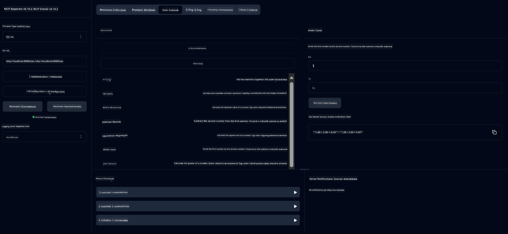

<!--
CO_OP_TRANSLATOR_METADATA:
{
  "original_hash": "fa635ae747c9b4d5c2f61c6c46cb695f",
  "translation_date": "2025-07-17T19:12:19+00:00",
  "source_file": "03-GettingStarted/01-first-server/README.md",
  "language_code": "hu"
}
-->
# Első lépések az MCP-vel

Üdvözlünk az első lépéseidnél a Model Context Protocol (MCP) használatában! Akár új vagy az MCP-ben, akár mélyebb ismeretekre vágysz, ez az útmutató végigvezet a legfontosabb beállításokon és fejlesztési folyamatokon. Megtudhatod, hogyan teszi lehetővé az MCP az AI modellek és alkalmazások zökkenőmentes integrációját, és hogyan készítheted elő gyorsan a környezeted MCP-alapú megoldások építéséhez és teszteléséhez.

> TLDR; Ha AI alkalmazásokat fejlesztesz, tudod, hogy eszközöket és egyéb erőforrásokat adhatsz a LLM-hez (nagy nyelvi modell), hogy az tudásosabb legyen. Ha azonban ezeket az eszközöket és erőforrásokat egy szerveren helyezed el, az alkalmazás és a szerver képességeit bármely kliens használhatja LLM-mel vagy anélkül.

## Áttekintés

Ez a lecke gyakorlati útmutatást nyújt az MCP környezetek beállításához és az első MCP alkalmazások elkészítéséhez. Megtanulod, hogyan állítsd be a szükséges eszközöket és keretrendszereket, hogyan építs alap MCP szervereket, készíts hoszt alkalmazásokat, és teszteld a megvalósításaidat.

A Model Context Protocol (MCP) egy nyílt protokoll, amely szabványosítja, hogyan biztosítanak az alkalmazások kontextust az LLM-ek számára. Gondolj az MCP-re úgy, mint egy USB-C portra az AI alkalmazások számára – szabványos módot kínál az AI modellek különböző adatforrásokhoz és eszközökhöz való csatlakoztatására.

## Tanulási célok

A lecke végére képes leszel:

- MCP fejlesztési környezeteket beállítani C#, Java, Python, TypeScript és Rust nyelveken
- Alapvető MCP szervereket építeni és telepíteni egyedi funkciókkal (erőforrások, promptok és eszközök)
- Host alkalmazásokat létrehozni, amelyek csatlakoznak MCP szerverekhez
- MCP implementációkat tesztelni és hibakeresni

## MCP környezet beállítása

Mielőtt elkezdenéd az MCP-vel való munkát, fontos előkészíteni a fejlesztői környezetet és megérteni az alapvető munkafolyamatot. Ez a rész végigvezet az első beállítási lépéseken, hogy zökkenőmentesen indulhass az MCP-vel.

### Előfeltételek

Mielőtt belevágnál az MCP fejlesztésbe, győződj meg róla, hogy rendelkezel az alábbiakkal:

- **Fejlesztési környezet**: A választott nyelvhez (C#, Java, Python, TypeScript vagy Rust)
- **IDE/Szerkesztő**: Visual Studio, Visual Studio Code, IntelliJ, Eclipse, PyCharm vagy bármely modern kódszerkesztő
- **Csomagkezelők**: NuGet, Maven/Gradle, pip, npm/yarn vagy Cargo
- **API kulcsok**: Az AI szolgáltatásokhoz, amelyeket a host alkalmazásokban tervezel használni

## Alapvető MCP szerver felépítés

Egy MCP szerver általában tartalmazza:

- **Szerver konfiguráció**: port, hitelesítés és egyéb beállítások
- **Erőforrások**: adatok és kontextus, amelyeket a LLM-ek elérhetnek
- **Eszközök**: funkciók, amelyeket a modellek meghívhatnak
- **Promptok**: sablonok szöveg generálásához vagy strukturálásához

Íme egy egyszerű példa TypeScript-ben:

```typescript
import { McpServer, ResourceTemplate } from "@modelcontextprotocol/sdk/server/mcp.js";
import { StdioServerTransport } from "@modelcontextprotocol/sdk/server/stdio.js";
import { z } from "zod";

// Create an MCP server
const server = new McpServer({
  name: "Demo",
  version: "1.0.0"
});

// Add an addition tool
server.tool("add",
  { a: z.number(), b: z.number() },
  async ({ a, b }) => ({
    content: [{ type: "text", text: String(a + b) }]
  })
);

// Add a dynamic greeting resource
server.resource(
  "file",
  // The 'list' parameter controls how the resource lists available files. Setting it to undefined disables listing for this resource.
  new ResourceTemplate("file://{path}", { list: undefined }),
  async (uri, { path }) => ({
    contents: [{
      uri: uri.href,
      text: `File, ${path}!`
    }]
// Add a file resource that reads the file contents
server.resource(
  "file",
  new ResourceTemplate("file://{path}", { list: undefined }),
  async (uri, { path }) => {
    let text;
    try {
      text = await fs.readFile(path, "utf8");
    } catch (err) {
      text = `Error reading file: ${err.message}`;
    }
    return {
      contents: [{
        uri: uri.href,
        text
      }]
    };
  }
);

server.prompt(
  "review-code",
  { code: z.string() },
  ({ code }) => ({
    messages: [{
      role: "user",
      content: {
        type: "text",
        text: `Please review this code:\n\n${code}`
      }
    }]
  })
);

// Start receiving messages on stdin and sending messages on stdout
const transport = new StdioServerTransport();
await server.connect(transport);
```

A fenti kódban:

- Importáljuk az MCP TypeScript SDK szükséges osztályait.
- Létrehozunk és konfigurálunk egy új MCP szerver példányt.
- Regisztrálunk egy egyedi eszközt (`calculator`) egy kezelőfüggvénnyel.
- Elindítjuk a szervert, hogy fogadja a bejövő MCP kéréseket.

## Tesztelés és hibakeresés

Mielőtt elkezdenéd tesztelni az MCP szerveredet, fontos megismerni a rendelkezésre álló eszközöket és a hibakeresés legjobb gyakorlatait. A hatékony tesztelés biztosítja, hogy a szerver a várakozásoknak megfelelően működjön, és segít gyorsan azonosítani és megoldani a problémákat. A következő rész ajánlott módszereket ismertet az MCP megvalósításod ellenőrzéséhez.

Az MCP eszközöket kínál a szerverek teszteléséhez és hibakereséséhez:

- **Inspector eszköz**, ez a grafikus felület lehetővé teszi, hogy csatlakozz a szerveredhez, és teszteld az eszközöket, promptokat és erőforrásokat.
- **curl**, parancssori eszközzel is csatlakozhatsz a szerverhez, vagy más klienssel, amely HTTP parancsokat tud létrehozni és futtatni.

### MCP Inspector használata

Az [MCP Inspector](https://github.com/modelcontextprotocol/inspector) egy vizuális tesztelő eszköz, amely segít:

1. **Szerver képességek felfedezése**: automatikusan felismeri az elérhető erőforrásokat, eszközöket és promptokat
2. **Eszköz végrehajtás tesztelése**: különböző paraméterek kipróbálása és valós idejű válaszok megtekintése
3. **Szerver metaadatok megtekintése**: szerver információk, sémák és konfigurációk vizsgálata

```bash
# ex TypeScript, installing and running MCP Inspector
npx @modelcontextprotocol/inspector node build/index.js
```

A fenti parancsok futtatásakor az MCP Inspector elindít egy helyi webes felületet a böngésződben. Egy irányítópultot fogsz látni, amely megjeleníti a regisztrált MCP szervereidet, azok elérhető eszközeit, erőforrásait és promptjait. Az interfész lehetővé teszi az eszközök interaktív tesztelését, a szerver metaadatainak megtekintését és a valós idejű válaszok megjelenítését, így könnyebbé téve az MCP szerver megvalósítások ellenőrzését és hibakeresését.

Íme egy képernyőkép arról, hogyan nézhet ki:


## Gyakori beállítási problémák és megoldások

| Probléma | Lehetséges megoldás |
|----------|---------------------|
| Kapcsolat elutasítva | Ellenőrizd, hogy a szerver fut-e és a port helyes-e |
| Eszköz végrehajtási hibák | Nézd át a paraméter ellenőrzést és a hibakezelést |
| Hitelesítési hibák | Ellenőrizd az API kulcsokat és jogosultságokat |
| Séma érvényesítési hibák | Győződj meg róla, hogy a paraméterek megfelelnek a definiált sémának |
| Szerver nem indul | Ellenőrizd a port ütközéseket vagy hiányzó függőségeket |
| CORS hibák | Állíts be megfelelő CORS fejléceket a cross-origin kérésekhez |
| Hitelesítési problémák | Ellenőrizd a token érvényességét és jogosultságait |

## Helyi fejlesztés

Helyi fejlesztés és tesztelés során közvetlenül a gépeden futtathatod az MCP szervereket:

1. **Indítsd el a szerver folyamatot**: futtasd az MCP szerver alkalmazásodat
2. **Hálózat beállítása**: győződj meg róla, hogy a szerver elérhető a várt porton
3. **Csatlakoztasd a klienseket**: használj helyi kapcsolati URL-eket, például `http://localhost:3000`

```bash
# Example: Running a TypeScript MCP server locally
npm run start
# Server running at http://localhost:3000
```

## Első MCP szervered elkészítése

Korábban már áttekintettük a [Alapvető fogalmakat](/01-CoreConcepts/README.md), most itt az ideje, hogy ezt a tudást gyakorlatba ültessük.

### Mit tud egy szerver?

Mielőtt elkezdenénk a kódolást, emlékeztessük magunkat arra, hogy mit tud egy szerver:

Egy MCP szerver például:

- Hozzáférhet helyi fájlokhoz és adatbázisokhoz
- Csatlakozhat távoli API-khoz
- Végezhet számításokat
- Integrálódhat más eszközökkel és szolgáltatásokkal
- Felhasználói felületet biztosíthat az interakcióhoz

Nagyszerű, most, hogy tudjuk, mit tehetünk vele, kezdjünk el kódolni.

## Gyakorlat: Szerver létrehozása

Egy szerver létrehozásához kövesd az alábbi lépéseket:

- Telepítsd az MCP SDK-t.
- Hozz létre egy projektet, és állítsd be a projekt struktúráját.
- Írd meg a szerver kódját.
- Teszteld a szervert.

### -1- Projekt létrehozása

#### TypeScript

```sh
# Create project directory and initialize npm project
mkdir calculator-server
cd calculator-server
npm init -y
```

#### Python

```sh
# Create project dir
mkdir calculator-server
cd calculator-server
# Open the folder in Visual Studio Code - Skip this if you are using a different IDE
code .
```

#### .NET

```sh
dotnet new console -n McpCalculatorServer
cd McpCalculatorServer
```

#### Java

Java esetén hozz létre egy Spring Boot projektet:

```bash
curl https://start.spring.io/starter.zip \
  -d dependencies=web \
  -d javaVersion=21 \
  -d type=maven-project \
  -d groupId=com.example \
  -d artifactId=calculator-server \
  -d name=McpServer \
  -d packageName=com.microsoft.mcp.sample.server \
  -o calculator-server.zip
```

Csomag kicsomagolása:

```bash
unzip calculator-server.zip -d calculator-server
cd calculator-server
# optional remove the unused test
rm -rf src/test/java
```

Add hozzá a következő teljes konfigurációt a *pom.xml* fájlodhoz:

```xml
<?xml version="1.0" encoding="UTF-8"?>
<project xmlns="http://maven.apache.org/POM/4.0.0"
    xmlns:xsi="http://www.w3.org/2001/XMLSchema-instance"
    xsi:schemaLocation="http://maven.apache.org/POM/4.0.0 http://maven.apache.org/xsd/maven-4.0.0.xsd">
    <modelVersion>4.0.0</modelVersion>
    
    <!-- Spring Boot parent for dependency management -->
    <parent>
        <groupId>org.springframework.boot</groupId>
        <artifactId>spring-boot-starter-parent</artifactId>
        <version>3.5.0</version>
        <relativePath />
    </parent>

    <!-- Project coordinates -->
    <groupId>com.example</groupId>
    <artifactId>calculator-server</artifactId>
    <version>0.0.1-SNAPSHOT</version>
    <name>Calculator Server</name>
    <description>Basic calculator MCP service for beginners</description>

    <!-- Properties -->
    <properties>
        <java.version>21</java.version>
        <maven.compiler.source>21</maven.compiler.source>
        <maven.compiler.target>21</maven.compiler.target>
    </properties>

    <!-- Spring AI BOM for version management -->
    <dependencyManagement>
        <dependencies>
            <dependency>
                <groupId>org.springframework.ai</groupId>
                <artifactId>spring-ai-bom</artifactId>
                <version>1.0.0-SNAPSHOT</version>
                <type>pom</type>
                <scope>import</scope>
            </dependency>
        </dependencies>
    </dependencyManagement>

    <!-- Dependencies -->
    <dependencies>
        <dependency>
            <groupId>org.springframework.ai</groupId>
            <artifactId>spring-ai-starter-mcp-server-webflux</artifactId>
        </dependency>
        <dependency>
            <groupId>org.springframework.boot</groupId>
            <artifactId>spring-boot-starter-actuator</artifactId>
        </dependency>
        <dependency>
         <groupId>org.springframework.boot</groupId>
         <artifactId>spring-boot-starter-test</artifactId>
         <scope>test</scope>
      </dependency>
    </dependencies>

    <!-- Build configuration -->
    <build>
        <plugins>
            <plugin>
                <groupId>org.springframework.boot</groupId>
                <artifactId>spring-boot-maven-plugin</artifactId>
            </plugin>
            <plugin>
                <groupId>org.apache.maven.plugins</groupId>
                <artifactId>maven-compiler-plugin</artifactId>
                <configuration>
                    <release>21</release>
                </configuration>
            </plugin>
        </plugins>
    </build>

    <!-- Repositories for Spring AI snapshots -->
    <repositories>
        <repository>
            <id>spring-milestones</id>
            <name>Spring Milestones</name>
            <url>https://repo.spring.io/milestone</url>
            <snapshots>
                <enabled>false</enabled>
            </snapshots>
        </repository>
        <repository>
            <id>spring-snapshots</id>
            <name>Spring Snapshots</name>
            <url>https://repo.spring.io/snapshot</url>
            <releases>
                <enabled>false</enabled>
            </releases>
        </repository>
    </repositories>
</project>
```

#### Rust

```sh
mkdir calculator-server
cd calculator-server
cargo init
```

### -2- Függőségek hozzáadása

Most, hogy létrehoztad a projektet, adjuk hozzá a függőségeket:

#### TypeScript

```sh
# If not already installed, install TypeScript globally
npm install typescript -g

# Install the MCP SDK and Zod for schema validation
npm install @modelcontextprotocol/sdk zod
npm install -D @types/node typescript
```

#### Python

```sh
# Create a virtual env and install dependencies
python -m venv venv
venv\Scripts\activate
pip install "mcp[cli]"
```

#### Java

```bash
cd calculator-server
./mvnw clean install -DskipTests
```

#### Rust

```sh
cargo add rmcp --features server,transport-io
cargo add serde
cargo add tokio --features rt-multi-thread
```

### -3- Projekt fájlok létrehozása

#### TypeScript

Hozz létre egy *package.json* fájlt a következő tartalommal:

```json
{
  "name": "calculator-server",
  "version": "1.0.0",
  "main": "index.js",
  "type": "module",
  "scripts": {
    "start": "tsc && node ./build/index.js",
    "build": "tsc && node ./build/index.js"
  },
  "keywords": [],
  "author": "",
  "license": "ISC",
  "description": "A simple calculator server using Model Context Protocol",
  "dependencies": {
    "@modelcontextprotocol/sdk": "^1.16.0",
    "zod": "^3.25.76"
  },
  "devDependencies": {
    "@types/node": "^24.0.14",
    "typescript": "^5.8.3"
  }
}
```

Hozz létre egy *tsconfig.json* fájlt az alábbi tartalommal:

```json
{
  "compilerOptions": {
    "target": "ES2022",
    "module": "Node16",
    "moduleResolution": "Node16",
    "outDir": "./build",
    "rootDir": "./src",
    "strict": true,
    "esModuleInterop": true,
    "skipLibCheck": true,
    "forceConsistentCasingInFileNames": true
  },
  "include": ["src/**/*"],
  "exclude": ["node_modules"]
}
```

Hozz létre egy könyvtárat a forráskódod számára:

```sh
mkdir src
touch src/index.ts
```

#### Python

Hozz létre egy *server.py* fájlt:

```sh
touch server.py
```

#### .NET

Telepítsd a szükséges NuGet csomagokat:

```sh
dotnet add package ModelContextProtocol --prerelease
dotnet add package Microsoft.Extensions.Hosting
```

#### Java

Java Spring Boot projektek esetén a projekt struktúra automatikusan létrejön.

#### Rust

Rust esetén egy *src/main.rs* fájl alapértelmezés szerint létrejön, amikor futtatod a `cargo init` parancsot. Nyisd meg a fájlt, és töröld az alapértelmezett kódot.

### -4- Szerver kód létrehozása

#### TypeScript

Hozz létre egy *index.ts* fájlt, és add hozzá az alábbi kódot:

```typescript
import { McpServer, ResourceTemplate } from "@modelcontextprotocol/sdk/server/mcp.js";
import { StdioServerTransport } from "@modelcontextprotocol/sdk/server/stdio.js";
import { z } from "zod";
 
// Create an MCP server
const server = new McpServer({
  name: "Calculator MCP Server",
  version: "1.0.0"
});
```

Most van egy szervered, de nem sokat csinál, javítsuk ezt.

#### Python

```python
# server.py
from mcp.server.fastmcp import FastMCP

# Create an MCP server
mcp = FastMCP("Demo")
```

#### .NET

```csharp
using Microsoft.Extensions.DependencyInjection;
using Microsoft.Extensions.Hosting;
using Microsoft.Extensions.Logging;
using ModelContextProtocol.Server;
using System.ComponentModel;

var builder = Host.CreateApplicationBuilder(args);
builder.Logging.AddConsole(consoleLogOptions =>
{
    // Configure all logs to go to stderr
    consoleLogOptions.LogToStandardErrorThreshold = LogLevel.Trace;
});

builder.Services
    .AddMcpServer()
    .WithStdioServerTransport()
    .WithToolsFromAssembly();
await builder.Build().RunAsync();

// add features
```

#### Java

Java esetén hozd létre a fő szerver komponenseket. Először módosítsd a fő alkalmazás osztályt:

*src/main/java/com/microsoft/mcp/sample/server/McpServerApplication.java*:

```java
package com.microsoft.mcp.sample.server;

import org.springframework.ai.tool.ToolCallbackProvider;
import org.springframework.ai.tool.method.MethodToolCallbackProvider;
import org.springframework.boot.SpringApplication;
import org.springframework.boot.autoconfigure.SpringBootApplication;
import org.springframework.context.annotation.Bean;
import com.microsoft.mcp.sample.server.service.CalculatorService;

@SpringBootApplication
public class McpServerApplication {

    public static void main(String[] args) {
        SpringApplication.run(McpServerApplication.class, args);
    }
    
    @Bean
    public ToolCallbackProvider calculatorTools(CalculatorService calculator) {
        return MethodToolCallbackProvider.builder().toolObjects(calculator).build();
    }
}
```

Hozd létre a számológép szolgáltatást *src/main/java/com/microsoft/mcp/sample/server/service/CalculatorService.java*:

```java
package com.microsoft.mcp.sample.server.service;

import org.springframework.ai.tool.annotation.Tool;
import org.springframework.stereotype.Service;

/**
 * Service for basic calculator operations.
 * This service provides simple calculator functionality through MCP.
 */
@Service
public class CalculatorService {

    /**
     * Add two numbers
     * @param a The first number
     * @param b The second number
     * @return The sum of the two numbers
     */
    @Tool(description = "Add two numbers together")
    public String add(double a, double b) {
        double result = a + b;
        return formatResult(a, "+", b, result);
    }

    /**
     * Subtract one number from another
     * @param a The number to subtract from
     * @param b The number to subtract
     * @return The result of the subtraction
     */
    @Tool(description = "Subtract the second number from the first number")
    public String subtract(double a, double b) {
        double result = a - b;
        return formatResult(a, "-", b, result);
    }

    /**
     * Multiply two numbers
     * @param a The first number
     * @param b The second number
     * @return The product of the two numbers
     */
    @Tool(description = "Multiply two numbers together")
    public String multiply(double a, double b) {
        double result = a * b;
        return formatResult(a, "*", b, result);
    }

    /**
     * Divide one number by another
     * @param a The numerator
     * @param b The denominator
     * @return The result of the division
     */
    @Tool(description = "Divide the first number by the second number")
    public String divide(double a, double b) {
        if (b == 0) {
            return "Error: Cannot divide by zero";
        }
        double result = a / b;
        return formatResult(a, "/", b, result);
    }

    /**
     * Calculate the power of a number
     * @param base The base number
     * @param exponent The exponent
     * @return The result of raising the base to the exponent
     */
    @Tool(description = "Calculate the power of a number (base raised to an exponent)")
    public String power(double base, double exponent) {
        double result = Math.pow(base, exponent);
        return formatResult(base, "^", exponent, result);
    }

    /**
     * Calculate the square root of a number
     * @param number The number to find the square root of
     * @return The square root of the number
     */
    @Tool(description = "Calculate the square root of a number")
    public String squareRoot(double number) {
        if (number < 0) {
            return "Error: Cannot calculate square root of a negative number";
        }
        double result = Math.sqrt(number);
        return String.format("√%.2f = %.2f", number, result);
    }

    /**
     * Calculate the modulus (remainder) of division
     * @param a The dividend
     * @param b The divisor
     * @return The remainder of the division
     */
    @Tool(description = "Calculate the remainder when one number is divided by another")
    public String modulus(double a, double b) {
        if (b == 0) {
            return "Error: Cannot divide by zero";
        }
        double result = a % b;
        return formatResult(a, "%", b, result);
    }

    /**
     * Calculate the absolute value of a number
     * @param number The number to find the absolute value of
     * @return The absolute value of the number
     */
    @Tool(description = "Calculate the absolute value of a number")
    public String absolute(double number) {
        double result = Math.abs(number);
        return String.format("|%.2f| = %.2f", number, result);
    }

    /**
     * Get help about available calculator operations
     * @return Information about available operations
     */
    @Tool(description = "Get help about available calculator operations")
    public String help() {
        return "Basic Calculator MCP Service\n\n" +
               "Available operations:\n" +
               "1. add(a, b) - Adds two numbers\n" +
               "2. subtract(a, b) - Subtracts the second number from the first\n" +
               "3. multiply(a, b) - Multiplies two numbers\n" +
               "4. divide(a, b) - Divides the first number by the second\n" +
               "5. power(base, exponent) - Raises a number to a power\n" +
               "6. squareRoot(number) - Calculates the square root\n" + 
               "7. modulus(a, b) - Calculates the remainder of division\n" +
               "8. absolute(number) - Calculates the absolute value\n\n" +
               "Example usage: add(5, 3) will return 5 + 3 = 8";
    }

    /**
     * Format the result of a calculation
     */
    private String formatResult(double a, String operator, double b, double result) {
        return String.format("%.2f %s %.2f = %.2f", a, operator, b, result);
    }
}
```

**Opcionális komponensek egy éles szolgáltatáshoz:**

Hozd létre az indítási konfigurációt *src/main/java/com/microsoft/mcp/sample/server/config/StartupConfig.java*:

```java
package com.microsoft.mcp.sample.server.config;

import org.springframework.boot.CommandLineRunner;
import org.springframework.context.annotation.Bean;
import org.springframework.context.annotation.Configuration;

@Configuration
public class StartupConfig {
    
    @Bean
    public CommandLineRunner startupInfo() {
        return args -> {
            System.out.println("\n" + "=".repeat(60));
            System.out.println("Calculator MCP Server is starting...");
            System.out.println("SSE endpoint: http://localhost:8080/sse");
            System.out.println("Health check: http://localhost:8080/actuator/health");
            System.out.println("=".repeat(60) + "\n");
        };
    }
}
```

Hozd létre az egészségügyi vezérlőt *src/main/java/com/microsoft/mcp/sample/server/controller/HealthController.java*:

```java
package com.microsoft.mcp.sample.server.controller;

import org.springframework.http.ResponseEntity;
import org.springframework.web.bind.annotation.GetMapping;
import org.springframework.web.bind.annotation.RestController;
import java.time.LocalDateTime;
import java.util.HashMap;
import java.util.Map;

@RestController
public class HealthController {
    
    @GetMapping("/health")
    public ResponseEntity<Map<String, Object>> healthCheck() {
        Map<String, Object> response = new HashMap<>();
        response.put("status", "UP");
        response.put("timestamp", LocalDateTime.now().toString());
        response.put("service", "Calculator MCP Server");
        return ResponseEntity.ok(response);
    }
}
```

Hozd létre a kivételkezelőt *src/main/java/com/microsoft/mcp/sample/server/exception/GlobalExceptionHandler.java*:

```java
package com.microsoft.mcp.sample.server.exception;

import org.springframework.http.HttpStatus;
import org.springframework.http.ResponseEntity;
import org.springframework.web.bind.annotation.ExceptionHandler;
import org.springframework.web.bind.annotation.RestControllerAdvice;

@RestControllerAdvice
public class GlobalExceptionHandler {

    @ExceptionHandler(IllegalArgumentException.class)
    public ResponseEntity<ErrorResponse> handleIllegalArgumentException(IllegalArgumentException ex) {
        ErrorResponse error = new ErrorResponse(
            "Invalid_Input", 
            "Invalid input parameter: " + ex.getMessage());
        return new ResponseEntity<>(error, HttpStatus.BAD_REQUEST);
    }

    public static class ErrorResponse {
        private String code;
        private String message;

        public ErrorResponse(String code, String message) {
            this.code = code;
            this.message = message;
        }

        // Getters
        public String getCode() { return code; }
        public String getMessage() { return message; }
    }
}
```

Hozz létre egy egyedi bannert *src/main/resources/banner.txt*:

```text
_____      _            _       _             
 / ____|    | |          | |     | |            
| |     __ _| | ___ _   _| | __ _| |_ ___  _ __ 
| |    / _` | |/ __| | | | |/ _` | __/ _ \| '__|
| |___| (_| | | (__| |_| | | (_| | || (_) | |   
 \_____\__,_|_|\___|\__,_|_|\__,_|\__\___/|_|   
                                                
Calculator MCP Server v1.0
Spring Boot MCP Application
```

</details>

### -5- Eszköz és erőforrás hozzáadása

Adj hozzá egy eszközt és egy erőforrást a következő kód hozzáadásával:

#### TypeScript

```typescript
server.tool(
  "add",
  { a: z.number(), b: z.number() },
  async ({ a, b }) => ({
    content: [{ type: "text", text: String(a + b) }]
  })
);

server.resource(
  "greeting",
  new ResourceTemplate("greeting://{name}", { list: undefined }),
  async (uri, { name }) => ({
    contents: [{
      uri: uri.href,
      text: `Hello, ${name}!`
    }]
  })
);
```

Az eszközöd paramétereket vesz `a` és `b`, és egy olyan függvényt futtat, amely a következő formátumú választ ad:

```typescript
{
  contents: [{
    type: "text", content: "some content"
  }]
}
```

Az erőforrásod egy "greeting" nevű stringen keresztül érhető el, és egy `name` paramétert fogad, amely hasonló választ ad, mint az eszköz:

```typescript
{
  uri: "<href>",
  text: "a text"
}
```

#### Python

```python
# Add an addition tool
@mcp.tool()
def add(a: int, b: int) -> int:
    """Add two numbers"""
    return a + b


# Add a dynamic greeting resource
@mcp.resource("greeting://{name}")
def get_greeting(name: str) -> str:
    """Get a personalized greeting"""
    return f"Hello, {name}!"
```

A fenti kódban:

- Definiáltunk egy `add` nevű eszközt, amely `a` és `p` paramétereket vár, mindkettő egész szám.
- Létrehoztunk egy `greeting` nevű erőforrást, amely `name` paramétert fogad.

#### .NET

Add hozzá ezt a Program.cs fájlhoz:

```csharp
[McpServerToolType]
public static class CalculatorTool
{
    [McpServerTool, Description("Adds two numbers")]
    public static string Add(int a, int b) => $"Sum {a + b}";
}
```

#### Java

Az eszközök már létre lettek hozva az előző lépésben.

### -6- Végleges kód

Adjuk hozzá a szükséges utolsó kódot, hogy a szerver elindulhasson:

#### TypeScript

```typescript
// Start receiving messages on stdin and sending messages on stdout
const transport = new StdioServerTransport();
await server.connect(transport);
```

Íme a teljes kód:

```typescript
// index.ts
import { McpServer, ResourceTemplate } from "@modelcontextprotocol/sdk/server/mcp.js";
import { StdioServerTransport } from "@modelcontextprotocol/sdk/server/stdio.js";
import { z } from "zod";

// Create an MCP server
const server = new McpServer({
  name: "Calculator MCP Server",
  version: "1.0.0"
});

// Add an addition tool
server.tool(
  "add",
  { a: z.number(), b: z.number() },
  async ({ a, b }) => ({
    content: [{ type: "text", text: String(a + b) }]
  })
);

// Add a dynamic greeting resource
server.resource(
  "greeting",
  new ResourceTemplate("greeting://{name}", { list: undefined }),
  async (uri, { name }) => ({
    contents: [{
      uri: uri.href,
      text: `Hello, ${name}!`
    }]
  })
);

// Start receiving messages on stdin and sending messages on stdout
const transport = new StdioServerTransport();
server.connect(transport);
```

#### Python

```python
# server.py
from mcp.server.fastmcp import FastMCP

# Create an MCP server
mcp = FastMCP("Demo")


# Add an addition tool
@mcp.tool()
def add(a: int, b: int) -> int:
    """Add two numbers"""
    return a + b


# Add a dynamic greeting resource
@mcp.resource("greeting://{name}")
def get_greeting(name: str) -> str:
    """Get a personalized greeting"""
    return f"Hello, {name}!"

# Main execution block - this is required to run the server
if __name__ == "__main__":
    mcp.run()
```

#### .NET

Hozz létre egy Program.cs fájlt az alábbi tartalommal:

```csharp
using Microsoft.Extensions.DependencyInjection;
using Microsoft.Extensions.Hosting;
using Microsoft.Extensions.Logging;
using ModelContextProtocol.Server;
using System.ComponentModel;

var builder = Host.CreateApplicationBuilder(args);
builder.Logging.AddConsole(consoleLogOptions =>
{
    // Configure all logs to go to stderr
    consoleLogOptions.LogToStandardErrorThreshold = LogLevel.Trace;
});

builder.Services
    .AddMcpServer()
    .WithStdioServerTransport()
    .WithToolsFromAssembly();
await builder.Build().RunAsync();

[McpServerToolType]
public static class CalculatorTool
{
    [McpServerTool, Description("Adds two numbers")]
    public static string Add(int a, int b) => $"Sum {a + b}";
}
```

#### Java

A teljes fő alkalmazás osztály így nézzen ki:

```java
// McpServerApplication.java
package com.microsoft.mcp.sample.server;

import org.springframework.ai.tool.ToolCallbackProvider;
import org.springframework.ai.tool.method.MethodToolCallbackProvider;
import org.springframework.boot.SpringApplication;
import org.springframework.boot.autoconfigure.SpringBootApplication;
import org.springframework.context.annotation.Bean;
import com.microsoft.mcp.sample.server.service.CalculatorService;

@SpringBootApplication
public class McpServerApplication {

    public static void main(String[] args) {
        SpringApplication.run(McpServerApplication.class, args);
    }
    
    @Bean
    public ToolCallbackProvider calculatorTools(CalculatorService calculator) {
        return MethodToolCallbackProvider.builder().toolObjects(calculator).build();
    }
}
```

#### Rust

A Rust szerver végleges kódja így nézzen ki:

```rust
use rmcp::{
    ServerHandler, ServiceExt,
    handler::server::{router::tool::ToolRouter, tool::Parameters},
    model::{ServerCapabilities, ServerInfo},
    schemars, tool, tool_handler, tool_router,
    transport::stdio,
};
use std::error::Error;

#[derive(Debug, serde::Deserialize, schemars::JsonSchema)]
pub struct CalculatorRequest {
    pub a: f64,
    pub b: f64,
}

#[derive(Debug, Clone)]
pub struct Calculator {
    tool_router: ToolRouter<Self>,
}

#[tool_router]
impl Calculator {
    pub fn new() -> Self {
        Self {
            tool_router: Self::tool_router(),
        }
    }
    
    #[tool(description = "Adds a and b")]
    async fn add(
        &self,
        Parameters(CalculatorRequest { a, b }): Parameters<CalculatorRequest>,
    ) -> String {
        (a + b).to_string()
    }
}

#[tool_handler]
impl ServerHandler for Calculator {
    fn get_info(&self) -> ServerInfo {
        ServerInfo {
            instructions: Some("A simple calculator tool".into()),
            capabilities: ServerCapabilities::builder().enable_tools().build(),
            ..Default::default()
        }
    }
}

#[tokio::main]
async fn main() -> Result<(), Box<dyn Error>> {
    let service = Calculator::new().serve(stdio()).await?;
    service.waiting().await?;
    Ok(())
}
```

### -7- Szerver tesztelése

Indítsd el a szervert a következő paranccsal:

#### TypeScript

```sh
npm run build
```

#### Python

```sh
mcp run server.py
```

> Az MCP Inspector használatához használd a `mcp dev server.py` parancsot, amely automatikusan elindítja az Inspectort és biztosítja a szükséges proxy session tokent. Ha a `mcp run server.py` parancsot használod, manuálisan kell elindítanod az Inspectort és beállítanod a kapcsolatot.

#### .NET

Győződj meg róla, hogy a projekt könyvtárában vagy:

```sh
cd McpCalculatorServer
dotnet run
```

#### Java

```bash
./mvnw clean install -DskipTests
java -jar target/calculator-server-0.0.1-SNAPSHOT.jar
```

### -8- Futtatás az Inspectorral

Az Inspector egy nagyszerű eszköz, amely elindítja a szervered, és lehetővé teszi, hogy interakcióba lépj vele, így tesztelheted, hogy működik-e. Indítsuk el:

> [!NOTE]
> A "command" mezőben eltérő lehet a parancs, mert az a te futtatókörnyezetedhez tartozó szerver indítási parancsot tartalmazza.

### TypeScript

```sh
cargo fmt
cargo run
```

Vagy add hozzá a *package.json*-hoz így: `"inspector": "npx @modelcontextprotocol/inspector node build/index.js"`, majd futtasd a `npm run inspect` parancsot.

A Python egy Node.js eszközt, az inspectort csomagolja be. Lehet hívni ezt az eszközt így:

```sh
mcp dev server.py
```

A következő szakasz a szerverrel való interakcióról szól.

A következő felhasználói felületet kell látnod:


### .NET

Győződj meg róla, hogy a projekt könyvtáradban vagy:

```sh
cd McpCalculatorServer
npx @modelcontextprotocol/inspector dotnet run
```

### Java

Győződj meg róla, hogy a calculator szervered fut.  
Ezután indítsd el az Inspectort:

```cmd
npx @modelcontextprotocol/inspector
```

Az Inspector webes felületén:

1. Válaszd az "SSE" szállítási típust
2. Állítsd be az URL-t: `http://localhost:8080/sse`
3. Kattints a "Connect" gombra



**Most már csatlakoztál a szerverhez**  
**A Java szerver tesztelési szakasza most befejeződött**


- [Kotlin SDK](https://github.com/modelcontextprotocol/kotlin-sdk) - A hivatalos Kotlin megvalósítás
- [Swift SDK](https://github.com/modelcontextprotocol/swift-sdk) - A Loopwork AI-val együttműködésben karbantartva
- [Rust SDK](https://github.com/modelcontextprotocol/rust-sdk) - A hivatalos Rust megvalósítás

## Főbb tanulságok

- Az MCP fejlesztői környezet beállítása egyszerű a nyelvspecifikus SDK-kkal
- MCP szerverek építése eszközök létrehozását és regisztrálását jelenti egyértelmű sémákkal
- A tesztelés és hibakeresés elengedhetetlen a megbízható MCP megvalósításhoz

## Minták

- [Java Számológép](../samples/java/calculator/README.md)
- [.Net Számológép](../../../../03-GettingStarted/samples/csharp)
- [JavaScript Számológép](../samples/javascript/README.md)
- [TypeScript Számológép](../samples/typescript/README.md)
- [Python Számológép](../../../../03-GettingStarted/samples/python)

## Feladat

Hozz létre egy egyszerű MCP szervert egy általad választott eszközzel:

1. Valósítsd meg az eszközt a kedvenc nyelveden (.NET, Java, Python vagy JavaScript).
2. Határozd meg a bemeneti paramétereket és a visszatérési értékeket.
3. Futtasd az inspector eszközt, hogy megbizonyosodj róla, a szerver a vártak szerint működik.
4. Teszteld a megvalósítást különböző bemenetekkel.

## Megoldás

[Megoldás](./solution/README.md)

## További források

- [Ügynökök építése Model Context Protocol segítségével az Azure-on](https://learn.microsoft.com/azure/developer/ai/intro-agents-mcp)
- [Távoli MCP az Azure Container Apps segítségével (Node.js/TypeScript/JavaScript)](https://learn.microsoft.com/samples/azure-samples/mcp-container-ts/mcp-container-ts/)
- [.NET OpenAI MCP Ügynök](https://learn.microsoft.com/samples/azure-samples/openai-mcp-agent-dotnet/openai-mcp-agent-dotnet/)

## Mi következik?

Következő: [MCP kliensek használatának megkezdése](../02-client/README.md)

**Felelősségkizárás**:  
Ez a dokumentum az [Co-op Translator](https://github.com/Azure/co-op-translator) AI fordítási szolgáltatás segítségével készült. Bár törekszünk a pontosságra, kérjük, vegye figyelembe, hogy az automatikus fordítások hibákat vagy pontatlanságokat tartalmazhatnak. Az eredeti dokumentum az eredeti nyelvén tekintendő hiteles forrásnak. Kritikus információk esetén javasolt a professzionális, emberi fordítás igénybevétele. Nem vállalunk felelősséget a fordítás használatából eredő félreértésekért vagy téves értelmezésekért.