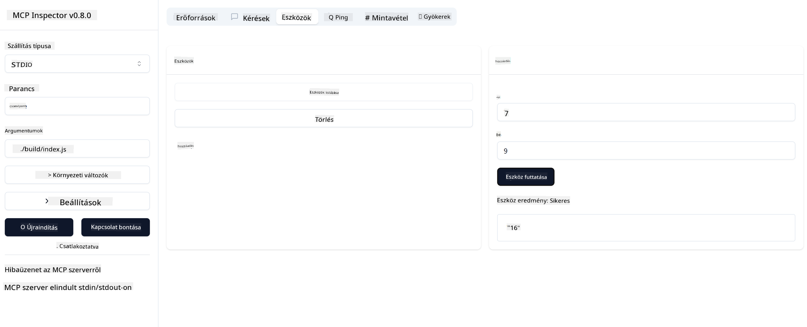

<!--
CO_OP_TRANSLATOR_METADATA:
{
  "original_hash": "ba767f2f54d704d19bb886389228d285",
  "translation_date": "2025-07-04T18:31:39+00:00",
  "source_file": "03-GettingStarted/01-first-server/README.md",
  "language_code": "hu"
}
-->
# MCP használatának megkezdése

Üdvözlünk az első lépéseidnél a Model Context Protocol (MCP) használatában! Akár új vagy az MCP-ben, akár mélyíteni szeretnéd a tudásodat, ez az útmutató végigvezet a legfontosabb beállításokon és fejlesztési folyamatokon. Megtudhatod, hogyan teszi lehetővé az MCP az AI modellek és alkalmazások zökkenőmentes integrációját, és megtanulhatod, hogyan készítheted elő gyorsan a környezeted MCP-alapú megoldások építéséhez és teszteléséhez.

> TLDR; Ha AI alkalmazásokat fejlesztesz, tudod, hogy eszközöket és egyéb erőforrásokat adhatsz hozzá a LLM-hez (nagy nyelvi modell), hogy az tudásosabb legyen. Ha azonban ezeket az eszközöket és erőforrásokat egy szerveren helyezed el, az alkalmazás és a szerver képességeit bármely kliens használhatja LLM-mel vagy anélkül.

## Áttekintés

Ez a lecke gyakorlati útmutatást nyújt az MCP környezetek beállításához és az első MCP alkalmazások elkészítéséhez. Megtanulod, hogyan állítsd be a szükséges eszközöket és keretrendszereket, hogyan építs alap MCP szervereket, készíts hoszt alkalmazásokat, és teszteld a megvalósításaidat.

A Model Context Protocol (MCP) egy nyílt protokoll, amely szabványosítja, hogyan biztosítanak az alkalmazások kontextust a LLM-ek számára. Gondolj az MCP-re úgy, mint egy USB-C portra az AI alkalmazások számára – szabványos módot ad arra, hogy AI modelleket különböző adatforrásokhoz és eszközökhöz csatlakoztass.

## Tanulási célok

A lecke végére képes leszel:

- MCP fejlesztői környezetek beállítása C#, Java, Python, TypeScript és JavaScript nyelveken
- Alap MCP szerverek építése és telepítése egyedi funkciókkal (erőforrások, promptok és eszközök)
- Hoszt alkalmazások létrehozása, amelyek kapcsolódnak MCP szerverekhez
- MCP megvalósítások tesztelése és hibakeresése

## MCP környezet beállítása

Mielőtt elkezdenéd az MCP-vel való munkát, fontos előkészíteni a fejlesztői környezetet és megérteni az alapvető munkafolyamatot. Ez a rész végigvezet az első beállítási lépéseken, hogy gördülékenyen indulhass az MCP-vel.

### Előfeltételek

Mielőtt belevágnál az MCP fejlesztésbe, győződj meg róla, hogy rendelkezel:

- **Fejlesztői környezet**: a választott nyelvhez (C#, Java, Python, TypeScript vagy JavaScript)
- **IDE/Szerkesztő**: Visual Studio, Visual Studio Code, IntelliJ, Eclipse, PyCharm vagy bármilyen modern kódszerkesztő
- **Csomagkezelők**: NuGet, Maven/Gradle, pip vagy npm/yarn
- **API kulcsok**: bármely AI szolgáltatáshoz, amit a hoszt alkalmazásaidban használni tervezel

## Alap MCP szerver felépítés

Egy MCP szerver általában tartalmazza:

- **Szerver konfiguráció**: port, hitelesítés és egyéb beállítások
- **Erőforrások**: adatok és kontextus, amelyeket a LLM-ek elérhetnek
- **Eszközök**: funkciók, amelyeket a modellek meghívhatnak
- **Promptok**: sablonok szöveg generálásához vagy strukturálásához

Íme egy egyszerűsített példa TypeScript-ben:

```typescript
import { Server, Tool, Resource } from "@modelcontextprotocol/typescript-server-sdk";

// Create a new MCP server
const server = new Server({
  port: 3000,
  name: "Example MCP Server",
  version: "1.0.0"
});

// Register a tool
server.registerTool({
  name: "calculator",
  description: "Performs basic calculations",
  parameters: {
    expression: {
      type: "string",
      description: "The math expression to evaluate"
    }
  },
  handler: async (params) => {
    const result = eval(params.expression);
    return { result };
  }
});

// Start the server
server.start();
```

A fenti kódban:

- Importáljuk a szükséges osztályokat az MCP TypeScript SDK-ból.
- Létrehozunk és konfigurálunk egy új MCP szerver példányt.
- Regisztrálunk egy egyedi eszközt (`calculator`) egy kezelő függvénnyel.
- Elindítjuk a szervert, hogy figyelje a bejövő MCP kéréseket.

## Tesztelés és hibakeresés

Mielőtt elkezdenéd tesztelni az MCP szerveredet, fontos megismerni a rendelkezésre álló eszközöket és a hibakeresés legjobb gyakorlatait. A hatékony tesztelés biztosítja, hogy a szerver a várakozásoknak megfelelően működjön, és segít gyorsan azonosítani és megoldani a problémákat. A következő rész ajánlott megközelítéseket mutat be az MCP megvalósításod ellenőrzéséhez.

Az MCP eszközöket kínál a szerverek teszteléséhez és hibakereséséhez:

- **Inspector eszköz**, ez a grafikus felület lehetővé teszi, hogy csatlakozz a szerveredhez, és teszteld az eszközeidet, promptjaidat és erőforrásaidat.
- **curl**, parancssori eszközzel is csatlakozhatsz a szerverhez, vagy más klienssel, amely HTTP parancsokat tud létrehozni és futtatni.

### MCP Inspector használata

Az [MCP Inspector](https://github.com/modelcontextprotocol/inspector) egy vizuális tesztelő eszköz, amely segít:

1. **Szerver képességek felfedezése**: automatikusan felismeri az elérhető erőforrásokat, eszközöket és promptokat
2. **Eszköz végrehajtás tesztelése**: különböző paraméterek kipróbálása és valós idejű válaszok megtekintése
3. **Szerver metaadatok megtekintése**: szerver információk, sémák és konfigurációk vizsgálata

```bash
# ex TypeScript, installing and running MCP Inspector
npx @modelcontextprotocol/inspector node build/index.js
```

A fenti parancsok futtatásakor az MCP Inspector elindít egy helyi webes felületet a böngésződben. Egy irányítópultot fogsz látni, amely megjeleníti a regisztrált MCP szervereidet, azok elérhető eszközeit, erőforrásait és promptjait. A felület lehetővé teszi az eszközök interaktív tesztelését, a szerver metaadatainak megtekintését és a valós idejű válaszok megjelenítését, így könnyebbé téve az MCP szerver megvalósítások ellenőrzését és hibakeresését.

Íme egy képernyőkép arról, hogyan nézhet ki:


## Gyakori beállítási problémák és megoldások

| Probléma | Lehetséges megoldás |
|----------|---------------------|
| Kapcsolat elutasítva | Ellenőrizd, hogy a szerver fut-e és a port helyes-e |
| Eszköz végrehajtási hibák | Nézd át a paraméterellenőrzést és a hibakezelést |
| Hitelesítési hibák | Ellenőrizd az API kulcsokat és jogosultságokat |
| Séma érvényesítési hibák | Győződj meg róla, hogy a paraméterek megfelelnek a definiált sémának |
| Szerver nem indul | Ellenőrizd a portütközéseket vagy hiányzó függőségeket |
| CORS hibák | Állíts be megfelelő CORS fejléceket a keresztforrásos kérésekhez |
| Hitelesítési problémák | Ellenőrizd a token érvényességét és jogosultságait |

## Helyi fejlesztés

Helyi fejlesztéshez és teszteléshez közvetlenül a gépeden is futtathatod az MCP szervereket:

1. **Indítsd el a szerver folyamatot**: futtasd az MCP szerver alkalmazásodat
2. **Hálózat beállítása**: győződj meg róla, hogy a szerver elérhető a várt porton
3. **Csatlakoztasd a klienseket**: használj helyi kapcsolódási URL-eket, például `http://localhost:3000`

```bash
# Example: Running a TypeScript MCP server locally
npm run start
# Server running at http://localhost:3000
```

## Első MCP szervered felépítése

Korábban már áttekintettük a [Core concepts](/01-CoreConcepts/README.md) témakört, most pedig ideje alkalmazni a megszerzett tudást.

### Mit tud egy szerver

Mielőtt kódolni kezdenénk, emlékezzünk rá, mit tud egy szerver:

Egy MCP szerver például képes:

- Helyi fájlokhoz és adatbázisokhoz hozzáférni
- Távoli API-khoz csatlakozni
- Számításokat végezni
- Más eszközökkel és szolgáltatásokkal integrálódni
- Felhasználói felületet biztosítani az interakcióhoz

Remek, most, hogy tudjuk, mit várhatunk tőle, kezdjünk neki a kódolásnak.

## Gyakorlat: Szerver létrehozása

A szerver létrehozásához kövesd az alábbi lépéseket:

- Telepítsd az MCP SDK-t.
- Hozz létre egy projektet és állítsd be a projekt struktúráját.
- Írd meg a szerver kódját.
- Teszteld a szervert.

### -1- SDK telepítése

Ez kicsit eltér a választott futtatókörnyezettől függően, válassz az alábbiak közül:

A generatív AI képes szöveget, képeket, sőt kódot is generálni.

<details>
  <summary>TypeScript</summary>

  ```sh
  npm install @modelcontextprotocol/sdk zod
  npm install -D @types/node typescript
  ```

</details>

<details>
<summary>Python</summary>

```sh
# For server development
pip install "mcp[cli]"
```

</details>

<details>
<summary>.NET</summary>

```sh
dotnet new console -n McpCalculatorServer
cd McpCalculatorServer
```

</details>

<details>
<summary>Java</summary>

Java esetén hozz létre egy Spring Boot projektet:

```bash
curl https://start.spring.io/starter.zip \
  -d dependencies=web \
  -d javaVersion=21 \
  -d type=maven-project \
  -d groupId=com.example \
  -d artifactId=calculator-server \
  -d name=McpServer \
  -d packageName=com.microsoft.mcp.sample.server \
  -o calculator-server.zip
```

Csomagold ki a zip fájlt:

```bash
unzip calculator-server.zip -d calculator-server
cd calculator-server
# optional remove the unused test
rm -rf src/test/java
```

Add hozzá a következő teljes konfigurációt a *pom.xml* fájlodhoz:

```xml
<?xml version="1.0" encoding="UTF-8"?>
<project xmlns="http://maven.apache.org/POM/4.0.0"
    xmlns:xsi="http://www.w3.org/2001/XMLSchema-instance"
    xsi:schemaLocation="http://maven.apache.org/POM/4.0.0 http://maven.apache.org/xsd/maven-4.0.0.xsd">
    <modelVersion>4.0.0</modelVersion>
    
    <!-- Spring Boot parent for dependency management -->
    <parent>
        <groupId>org.springframework.boot</groupId>
        <artifactId>spring-boot-starter-parent</artifactId>
        <version>3.5.0</version>
        <relativePath />
    </parent>

    <!-- Project coordinates -->
    <groupId>com.example</groupId>
    <artifactId>calculator-server</artifactId>
    <version>0.0.1-SNAPSHOT</version>
    <name>Calculator Server</name>
    <description>Basic calculator MCP service for beginners</description>

    <!-- Properties -->
    <properties>
        <java.version>21</java.version>
        <maven.compiler.source>21</maven.compiler.source>
        <maven.compiler.target>21</maven.compiler.target>
    </properties>

    <!-- Spring AI BOM for version management -->
    <dependencyManagement>
        <dependencies>
            <dependency>
                <groupId>org.springframework.ai</groupId>
                <artifactId>spring-ai-bom</artifactId>
                <version>1.0.0-SNAPSHOT</version>
                <type>pom</type>
                <scope>import</scope>
            </dependency>
        </dependencies>
    </dependencyManagement>

    <!-- Dependencies -->
    <dependencies>
        <dependency>
            <groupId>org.springframework.ai</groupId>
            <artifactId>spring-ai-starter-mcp-server-webflux</artifactId>
        </dependency>
        <dependency>
            <groupId>org.springframework.boot</groupId>
            <artifactId>spring-boot-starter-actuator</artifactId>
        </dependency>
        <dependency>
         <groupId>org.springframework.boot</groupId>
         <artifactId>spring-boot-starter-test</artifactId>
         <scope>test</scope>
      </dependency>
    </dependencies>

    <!-- Build configuration -->
    <build>
        <plugins>
            <plugin>
                <groupId>org.springframework.boot</groupId>
                <artifactId>spring-boot-maven-plugin</artifactId>
            </plugin>
            <plugin>
                <groupId>org.apache.maven.plugins</groupId>
                <artifactId>maven-compiler-plugin</artifactId>
                <configuration>
                    <release>21</release>
                </configuration>
            </plugin>
        </plugins>
    </build>

    <!-- Repositories for Spring AI snapshots -->
    <repositories>
        <repository>
            <id>spring-milestones</id>
            <name>Spring Milestones</name>
            <url>https://repo.spring.io/milestone</url>
            <snapshots>
                <enabled>false</enabled>
            </snapshots>
        </repository>
        <repository>
            <id>spring-snapshots</id>
            <name>Spring Snapshots</name>
            <url>https://repo.spring.io/snapshot</url>
            <releases>
                <enabled>false</enabled>
            </releases>
        </repository>
    </repositories>
</project>
```

</details>

### -2- Projekt létrehozása

Miután telepítetted az SDK-t, hozzuk létre a projektet:

<details>
  <summary>TypeScript</summary>

  ```sh
  mkdir src
  npm install -y
  ```

</details>

<details>
  <summary>Python</summary>

  ```sh
  python -m venv venv
  venv\Scripts\activate
  ```

</details>

<details>
<summary>Java</summary>

```bash
cd calculator-server
./mvnw clean install -DskipTests
```

</details>

### -3- Projektfájlok létrehozása

<details>
  <summary>TypeScript</summary>
  
  Hozz létre egy *package.json* fájlt a következő tartalommal:
  
  ```json
  {
     "type": "module",
     "bin": {
       "weather": "./build/index.js"
     },
     "scripts": {
       "build": "tsc && node build/index.js"
     },
     "files": [
       "build"
     ]
  }
  ```

  Hozz létre egy *tsconfig.json* fájlt a következő tartalommal:

  ```json
  {
    "compilerOptions": {
      "target": "ES2022",
      "module": "Node16",
      "moduleResolution": "Node16",
      "outDir": "./build",
      "rootDir": "./src",
      "strict": true,
      "esModuleInterop": true,
      "skipLibCheck": true,
      "forceConsistentCasingInFileNames": true
    },
    "include": ["src/**/*"],
    "exclude": ["node_modules"]
  }
  ```

</details>

<details>
<summary>Python</summary>

Hozz létre egy *server.py* fájlt
</details>

<details>
<summary>.NET</summary>

Telepítsd a szükséges NuGet csomagokat:

```sh
dotnet add package ModelContextProtocol --prerelease
dotnet add package Microsoft.Extensions.Hosting
```

</details>

<details>
<summary>Java</summary>

Java Spring Boot projektek esetén a projekt struktúra automatikusan létrejön.

</details>

### -4- Szerverkód írása

<details>
  <summary>TypeScript</summary>
  
  Hozz létre egy *index.ts* fájlt, és írd bele a következő kódot:

  ```typescript
  import { McpServer, ResourceTemplate } from "@modelcontextprotocol/sdk/server/mcp.js";
  import { StdioServerTransport } from "@modelcontextprotocol/sdk/server/stdio.js";
  import { z } from "zod";
   
  // Create an MCP server
  const server = new McpServer({
    name: "Demo",
    version: "1.0.0"
  });
  ```

 Most már van egy szervered, de még nem csinál sokat, javítsuk ki ezt.
</details>

<details>
<summary>Python</summary>

```python
# server.py
from mcp.server.fastmcp import FastMCP

# Create an MCP server
mcp = FastMCP("Demo")
```

</details>

<details>
<summary>.NET</summary>

```csharp
using Microsoft.Extensions.DependencyInjection;
using Microsoft.Extensions.Hosting;
using Microsoft.Extensions.Logging;
using ModelContextProtocol.Server;
using System.ComponentModel;

var builder = Host.CreateApplicationBuilder(args);
builder.Logging.AddConsole(consoleLogOptions =>
{
    // Configure all logs to go to stderr
    consoleLogOptions.LogToStandardErrorThreshold = LogLevel.Trace;
});

builder.Services
    .AddMcpServer()
    .WithStdioServerTransport()
    .WithToolsFromAssembly();
await builder.Build().RunAsync();

// add features
```

</details>

<details>
<summary>Java</summary>

Java esetén hozd létre a szerver alap komponenseit. Először módosítsd a fő alkalmazás osztályt:

*src/main/java/com/microsoft/mcp/sample/server/McpServerApplication.java*:

```java
package com.microsoft.mcp.sample.server;

import org.springframework.ai.tool.ToolCallbackProvider;
import org.springframework.ai.tool.method.MethodToolCallbackProvider;
import org.springframework.boot.SpringApplication;
import org.springframework.boot.autoconfigure.SpringBootApplication;
import org.springframework.context.annotation.Bean;
import com.microsoft.mcp.sample.server.service.CalculatorService;

@SpringBootApplication
public class McpServerApplication {

    public static void main(String[] args) {
        SpringApplication.run(McpServerApplication.class, args);
    }
    
    @Bean
    public ToolCallbackProvider calculatorTools(CalculatorService calculator) {
        return MethodToolCallbackProvider.builder().toolObjects(calculator).build();
    }
}
```

Hozd létre a kalkulátor szolgáltatást *src/main/java/com/microsoft/mcp/sample/server/service/CalculatorService.java*:

```java
package com.microsoft.mcp.sample.server.service;

import org.springframework.ai.tool.annotation.Tool;
import org.springframework.stereotype.Service;

/**
 * Service for basic calculator operations.
 * This service provides simple calculator functionality through MCP.
 */
@Service
public class CalculatorService {

    /**
     * Add two numbers
     * @param a The first number
     * @param b The second number
     * @return The sum of the two numbers
     */
    @Tool(description = "Add two numbers together")
    public String add(double a, double b) {
        double result = a + b;
        return formatResult(a, "+", b, result);
    }

    /**
     * Subtract one number from another
     * @param a The number to subtract from
     * @param b The number to subtract
     * @return The result of the subtraction
     */
    @Tool(description = "Subtract the second number from the first number")
    public String subtract(double a, double b) {
        double result = a - b;
        return formatResult(a, "-", b, result);
    }

    /**
     * Multiply two numbers
     * @param a The first number
     * @param b The second number
     * @return The product of the two numbers
     */
    @Tool(description = "Multiply two numbers together")
    public String multiply(double a, double b) {
        double result = a * b;
        return formatResult(a, "*", b, result);
    }

    /**
     * Divide one number by another
     * @param a The numerator
     * @param b The denominator
     * @return The result of the division
     */
    @Tool(description = "Divide the first number by the second number")
    public String divide(double a, double b) {
        if (b == 0) {
            return "Error: Cannot divide by zero";
        }
        double result = a / b;
        return formatResult(a, "/", b, result);
    }

    /**
     * Calculate the power of a number
     * @param base The base number
     * @param exponent The exponent
     * @return The result of raising the base to the exponent
     */
    @Tool(description = "Calculate the power of a number (base raised to an exponent)")
    public String power(double base, double exponent) {
        double result = Math.pow(base, exponent);
        return formatResult(base, "^", exponent, result);
    }

    /**
     * Calculate the square root of a number
     * @param number The number to find the square root of
     * @return The square root of the number
     */
    @Tool(description = "Calculate the square root of a number")
    public String squareRoot(double number) {
        if (number < 0) {
            return "Error: Cannot calculate square root of a negative number";
        }
        double result = Math.sqrt(number);
        return String.format("√%.2f = %.2f", number, result);
    }

    /**
     * Calculate the modulus (remainder) of division
     * @param a The dividend
     * @param b The divisor
     * @return The remainder of the division
     */
    @Tool(description = "Calculate the remainder when one number is divided by another")
    public String modulus(double a, double b) {
        if (b == 0) {
            return "Error: Cannot divide by zero";
        }
        double result = a % b;
        return formatResult(a, "%", b, result);
    }

    /**
     * Calculate the absolute value of a number
     * @param number The number to find the absolute value of
     * @return The absolute value of the number
     */
    @Tool(description = "Calculate the absolute value of a number")
    public String absolute(double number) {
        double result = Math.abs(number);
        return String.format("|%.2f| = %.2f", number, result);
    }

    /**
     * Get help about available calculator operations
     * @return Information about available operations
     */
    @Tool(description = "Get help about available calculator operations")
    public String help() {
        return "Basic Calculator MCP Service\n\n" +
               "Available operations:\n" +
               "1. add(a, b) - Adds two numbers\n" +
               "2. subtract(a, b) - Subtracts the second number from the first\n" +
               "3. multiply(a, b) - Multiplies two numbers\n" +
               "4. divide(a, b) - Divides the first number by the second\n" +
               "5. power(base, exponent) - Raises a number to a power\n" +
               "6. squareRoot(number) - Calculates the square root\n" + 
               "7. modulus(a, b) - Calculates the remainder of division\n" +
               "8. absolute(number) - Calculates the absolute value\n\n" +
               "Example usage: add(5, 3) will return 5 + 3 = 8";
    }

    /**
     * Format the result of a calculation
     */
    private String formatResult(double a, String operator, double b, double result) {
        return String.format("%.2f %s %.2f = %.2f", a, operator, b, result);
    }
}
```

**Opcionális komponensek egy éles környezethez:**

Hozd létre az indítási konfigurációt *src/main/java/com/microsoft/mcp/sample/server/config/StartupConfig.java*:

```java
package com.microsoft.mcp.sample.server.config;

import org.springframework.boot.CommandLineRunner;
import org.springframework.context.annotation.Bean;
import org.springframework.context.annotation.Configuration;

@Configuration
public class StartupConfig {
    
    @Bean
    public CommandLineRunner startupInfo() {
        return args -> {
            System.out.println("\n" + "=".repeat(60));
            System.out.println("Calculator MCP Server is starting...");
            System.out.println("SSE endpoint: http://localhost:8080/sse");
            System.out.println("Health check: http://localhost:8080/actuator/health");
            System.out.println("=".repeat(60) + "\n");
        };
    }
}
```

Hozd létre az egészségügyi kontrollert *src/main/java/com/microsoft/mcp/sample/server/controller/HealthController.java*:

```java
package com.microsoft.mcp.sample.server.controller;

import org.springframework.http.ResponseEntity;
import org.springframework.web.bind.annotation.GetMapping;
import org.springframework.web.bind.annotation.RestController;
import java.time.LocalDateTime;
import java.util.HashMap;
import java.util.Map;

@RestController
public class HealthController {
    
    @GetMapping("/health")
    public ResponseEntity<Map<String, Object>> healthCheck() {
        Map<String, Object> response = new HashMap<>();
        response.put("status", "UP");
        response.put("timestamp", LocalDateTime.now().toString());
        response.put("service", "Calculator MCP Server");
        return ResponseEntity.ok(response);
    }
}
```

Hozd létre a kivételkezelőt *src/main/java/com/microsoft/mcp/sample/server/exception/GlobalExceptionHandler.java*:

```java
package com.microsoft.mcp.sample.server.exception;

import org.springframework.http.HttpStatus;
import org.springframework.http.ResponseEntity;
import org.springframework.web.bind.annotation.ExceptionHandler;
import org.springframework.web.bind.annotation.RestControllerAdvice;

@RestControllerAdvice
public class GlobalExceptionHandler {

    @ExceptionHandler(IllegalArgumentException.class)
    public ResponseEntity<ErrorResponse> handleIllegalArgumentException(IllegalArgumentException ex) {
        ErrorResponse error = new ErrorResponse(
            "Invalid_Input", 
            "Invalid input parameter: " + ex.getMessage());
        return new ResponseEntity<>(error, HttpStatus.BAD_REQUEST);
    }

    public static class ErrorResponse {
        private String code;
        private String message;

        public ErrorResponse(String code, String message) {
            this.code = code;
            this.message = message;
        }

        // Getters
        public String getCode() { return code; }
        public String getMessage() { return message; }
    }
}
```

Hozz létre egy egyedi bannert *src/main/resources/banner.txt*:

```text
_____      _            _       _             
 / ____|    | |          | |     | |            
| |     __ _| | ___ _   _| | __ _| |_ ___  _ __ 
| |    / _` | |/ __| | | | |/ _` | __/ _ \| '__|
| |___| (_| | | (__| |_| | | (_| | || (_) | |   
 \_____\__,_|_|\___|\__,_|_|\__,_|\__\___/|_|   
                                                
Calculator MCP Server v1.0
Spring Boot MCP Application
```

</details>

### -5- Eszköz és erőforrás hozzáadása

Adj hozzá egy eszközt és egy erőforrást a következő kód beillesztésével:

<details>
  <summary>TypeScript</summary>

  ```typescript
    server.tool("add",
    { a: z.number(), b: z.number() },
    async ({ a, b }) => ({
      content: [{ type: "text", text: String(a + b) }]
    })
  );

  server.resource(
    "greeting",
    new ResourceTemplate("greeting://{name}", { list: undefined }),
    async (uri, { name }) => ({
      contents: [{
        uri: uri.href,
        text: `Hello, ${name}!`
      }]
    })
  );
  ```

  Az eszközöd paraméterei `a` és `b`, és egy olyan függvényt futtat, amely a következő formátumú választ ad:

  ```typescript
  {
    contents: [{
      type: "text", content: "some content"
    }]
  }
  ```

  Az erőforrásod a "greeting" stringen keresztül érhető el, és egy `name` paramétert fogad, hasonló választ ad, mint az eszköz:

  ```typescript
  {
    uri: "<href>",
    text: "a text"
  }
  ```

</details>

<details>
<summary>Python</summary>

```python
# Add an addition tool
@mcp.tool()
def add(a: int, b: int) -> int:
    """Add two numbers"""
    return a + b


# Add a dynamic greeting resource
@mcp.resource("greeting://{name}")
def get_greeting(name: str) -> str:
    """Get a personalized greeting"""
    return f"Hello, {name}!"
```

A fenti kódban:

- Definiáltunk egy `add` nevű eszközt, amely `a` és `p` paramétereket vár, mindkettő egész szám.
- Létrehoztunk egy `greeting` nevű erőforrást, amely `name` paramétert fogad.

</details>

<details>
<summary>.NET</summary>

Add ezt a Program.cs fájlodhoz:

```csharp
[McpServerToolType]
public static class CalculatorTool
{
    [McpServerTool, Description("Adds two numbers")]
    public static string Add(int a, int b) => $"Sum {a + b}";
}
```

</details>

<details>
<summary>Java</summary>

Az eszközök már létre lettek hozva az előző lépésben.

</details>

### -6 Végleges kód

Add hozzá az utolsó szükséges kódot, hogy a szerver elindulhasson:

<details>
<summary>TypeScript</summary>

```typescript
// Start receiving messages on stdin and sending messages on stdout
const transport = new StdioServerTransport();
await server.connect(transport);
```

Íme a teljes kód:

```typescript
// index.ts
import { McpServer, ResourceTemplate } from "@modelcontextprotocol/sdk/server/mcp.js";
import { StdioServerTransport } from "@modelcontextprotocol/sdk/server/stdio.js";
import { z } from "zod";

// Create an MCP server
const server = new McpServer({
  name: "Demo",
  version: "1.0.0"
});

// Add an addition tool
server.tool("add",
  { a: z.number(), b: z.number() },
  async ({ a, b }) => ({
    content: [{ type: "text", text: String(a + b) }]
  })
);

// Add a dynamic greeting resource
server.resource(
  "greeting",
  new ResourceTemplate("greeting://{name}", { list: undefined }),
  async (uri, { name }) => ({
    contents: [{
      uri: uri.href,
      text: `Hello, ${name}!`
    }]
  })
);

// Start receiving messages on stdin and sending messages on stdout
const transport = new StdioServerTransport();
await server.connect(transport);
```

</details>

<details>
<summary>Python</summary>

```python
# server.py
from mcp.server.fastmcp import FastMCP

# Create an MCP server
mcp = FastMCP("Demo")


# Add an addition tool
@mcp.tool()
def add(a: int, b: int) -> int:
    """Add two numbers"""
    return a + b


# Add a dynamic greeting resource
@mcp.resource("greeting://{name}")
def get_greeting(name: str) -> str:
    """Get a personalized greeting"""
    return f"Hello, {name}!"
```

</details>

<details>
<summary>.NET</summary>

Hozz létre egy Program.cs fájlt a következő tartalommal:

```csharp
using Microsoft.Extensions.DependencyInjection;
using Microsoft.Extensions.Hosting;
using Microsoft.Extensions.Logging;
using ModelContextProtocol.Server;
using System.ComponentModel;

var builder = Host.CreateApplicationBuilder(args);
builder.Logging.AddConsole(consoleLogOptions =>
{
    // Configure all logs to go to stderr
    consoleLogOptions.LogToStandardErrorThreshold = LogLevel.Trace;
});

builder.Services
    .AddMcpServer()
    .WithStdioServerTransport()
    .WithToolsFromAssembly();
await builder.Build().RunAsync();

[McpServerToolType]
public static class CalculatorTool
{
    [McpServerTool, Description("Adds two numbers")]
    public static string Add(int a, int b) => $"Sum {a + b}";
}
```

</details>

<details>
<summary>Java</summary>

A teljes fő alkalmazás osztályod így nézzen ki:

```java
// McpServerApplication.java
package com.microsoft.mcp.sample.server;

import org.springframework.ai.tool.ToolCallbackProvider;
import org.springframework.ai.tool.method.MethodToolCallbackProvider;
import org.springframework.boot.SpringApplication;
import org.springframework.boot.autoconfigure.SpringBootApplication;
import org.springframework.context.annotation.Bean;
import com.microsoft.mcp.sample.server.service.CalculatorService;

@SpringBootApplication
public class McpServerApplication {

    public static void main(String[] args) {
        SpringApplication.run(McpServerApplication.class, args);
    }
    
    @Bean
    public ToolCallbackProvider calculatorTools(CalculatorService calculator) {
        return MethodToolCallbackProvider.builder().toolObjects(calculator).build();
    }
}
```

</details>

### -7- Szerver tesztelése

Indítsd el a szervert a következő paranccsal:

<details>
<summary>TypeScript</summary>

```sh
npm run build
```

</details>

<details>
<summary>Python</summary>

```sh
mcp run server.py
```

</details>

<details>
<summary>.NET</summary>

Győződj meg róla, hogy a projekt könyvtáradban vagy:

```sh
cd McpCalculatorServer
dotnet run
```

</details>

<details>
<summary>Java</summary>

```bash
./mvnw clean install -DskipTests
java -jar target/calculator-server-0.0.1-SNAPSHOT.jar
```

</details>

### -8- Futtatás az inspectort használva

Az inspector egy nagyszerű eszköz, amely elindítja a szervered, és lehetővé teszi, hogy interakcióba lépj vele, így tesztelheted a működését. Indítsuk el:

> [!NOTE]
> A "command" mezőben eltérően jelenhet meg, mivel az adott futtatókörnyezethez tartozó szerverindító parancsot tartalmazza.

<details>
<summary>TypeScript</summary>

```sh
npx @modelcontextprotocol/inspector node build/index.js
```

vagy add hozzá a *package.json*-hoz így: `"inspector": "npx @modelcontextprotocol/inspector node build/index.js"` majd futtasd `npm run inspect` parancsot

A következő felhasználói felületet kell látnod:


1. Csatlakozz a szerverhez a Connect gomb megnyomásával
  Miután csatlakoztál a szerverhez, a következőt kell látnod:

  

1. Válaszd ki a "Tools" menüt, majd a "listTools" opciót, ekkor meg kell jelennie az "Add" opciónak, válaszd ki az "Add"-ot, és töltsd ki a paraméterértékeket.

  A következő választ kell látnod, azaz az "add" eszköz eredményét:

  

Gratulálunk, sikeresen létrehoztad és futtattad az első szerveredet!

### Hivatalos SDK-k

Az MCP hivatalos SDK-kat biztosít több nyelvhez:

- [C# SDK](https://github.com/modelcontextprotocol/csharp-sdk) – Microsoft együttműködésével karbantartva
- [Java SDK](https://github.com/modelcontextprotocol/java-sdk) – Spring AI együttműködésével karbantartva
- [TypeScript SDK](https://github.com/modelcontextprotocol/typescript-sdk) – Hivatalos TypeScript megvalósítás
- [Python SDK](https://github.com/modelcontextprotocol/python-sdk) – Hivatalos Python megvalósítás
- [Kotlin SDK](https://github.com/modelcontextprotocol/kotlin-sdk) – Hivatalos Kotlin megvalósítás
- [Swift SDK](https://github.com/modelcontextprotocol/swift-sdk) – Loopwork AI együttműködésével karbantartva
- [Rust SDK](https://github.com/modelcontextprotocol/rust-sdk) – Hivatalos Rust megvalósítás

## Főbb tanulságok

- Az MCP fejlesztői környezet beállítása egyszerű a nyelvspecifikus SDK-kkal
- MCP szerverek építése eszközök létrehozását és regisztrálását jelenti egyértelmű sémákkal
- A tesztelés és hibakeresés elengedhetetlen a megbízható MCP megvalósításokhoz

## Minták

- [Java Számológép](../samples/java/calculator/README.md)
- [.Net Számológép](../../../../03-GettingStarted/samples/csharp)
- [JavaScript Számológép](../samples/javascript/README.md)
- [TypeScript Számológép](../samples/typescript/README.md)
- [Python Számológép](../../../../03-GettingStarted/samples/python)

## Feladat

Hozz létre egy egyszerű MCP szervert egy általad választott eszközzel:

1. Valósítsd meg az eszközt a preferált nyelveden (.NET, Java, Python vagy JavaScript).
2. Határozd meg a bemeneti paramétereket és a visszatérési értékeket.
3. Futtasd az inspector eszközt, hogy megbizonyosodj róla, a szerver a vártnak megfelelően működik.
4. Teszteld a megvalósítást különböző bemenetekkel.

## Megoldás

[Megoldás](./solution/README.md)

## További források

- [Ügynökök építése Model Context Protocol segítségével Azure-on](https://learn.microsoft.com/azure/developer/ai/intro-agents-mcp)
- [Távoli MCP Azure Container Apps használatával (Node.js/TypeScript/JavaScript)](https://learn.microsoft.com/samples/azure-samples/mcp-container-ts/mcp-container-ts/)
- [.NET OpenAI MCP Ügynök](https://learn.microsoft.com/samples/azure-samples/openai-mcp-agent-dotnet/openai-mcp-agent-dotnet/)

## Mi következik

Következő: [MCP kliensek használatának megkezdése](../02-client/README.md)

**Jogi nyilatkozat**:  
Ez a dokumentum az AI fordító szolgáltatás, a [Co-op Translator](https://github.com/Azure/co-op-translator) segítségével készült. Bár a pontosságra törekszünk, kérjük, vegye figyelembe, hogy az automatikus fordítások hibákat vagy pontatlanságokat tartalmazhatnak. Az eredeti dokumentum az anyanyelvén tekintendő hiteles forrásnak. Fontos információk esetén szakmai, emberi fordítást javaslunk. Nem vállalunk felelősséget a fordítás használatából eredő félreértésekért vagy téves értelmezésekért.