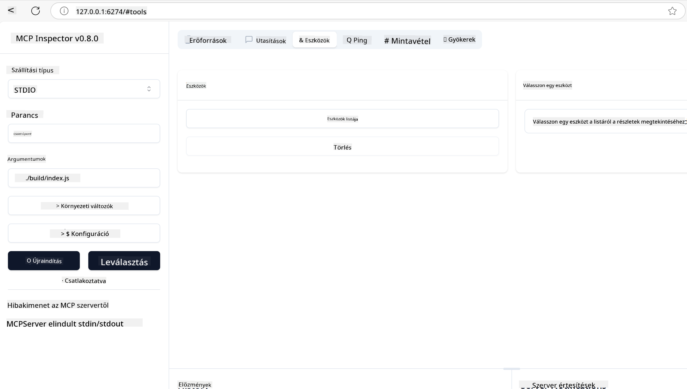

<!--
CO_OP_TRANSLATOR_METADATA:
{
  "original_hash": "5331ffd328a54b90f76706c52b673e27",
  "translation_date": "2025-05-17T08:50:32+00:00",
  "source_file": "03-GettingStarted/01-first-server/README.md",
  "language_code": "hu"
}
-->
# Az MCP használatának kezdő lépései

Üdvözöljük a Model Context Protocol (MCP) világában! Akár új az MCP, akár szeretné elmélyíteni tudását, ez az útmutató végigvezeti Önt a lényeges beállítási és fejlesztési folyamaton. Felfedezheti, hogyan teszi lehetővé az MCP a zökkenőmentes integrációt AI modellek és alkalmazások között, és megtudhatja, hogyan készítheti el gyorsan környezetét az MCP-alapú megoldások építéséhez és teszteléséhez.

> Röviden: Ha AI alkalmazásokat épít, tudja, hogy eszközöket és egyéb erőforrásokat adhat hozzá a LLM-hez (nagy nyelvi modell), hogy az LLM-t tudatosabbá tegye. Ha azonban ezeket az eszközöket és erőforrásokat egy szerverre helyezi, az alkalmazás és a szerver képességeit bármely kliens használhatja LLM-mel vagy anélkül.

## Áttekintés

Ez a lecke gyakorlati útmutatást nyújt az MCP környezetek beállításához és az első MCP alkalmazások építéséhez. Megtanulja, hogyan állítsa be a szükséges eszközöket és keretrendszereket, építsen alapvető MCP szervereket, hozzon létre gazda alkalmazásokat, és tesztelje a megvalósításait.

A Model Context Protocol (MCP) egy nyílt protokoll, amely szabványosítja, hogyan biztosítanak az alkalmazások kontextust a LLM-ek számára. Gondoljon az MCP-re úgy, mint egy USB-C port az AI alkalmazásokhoz - szabványos módot biztosít az AI modellek különböző adatforrásokhoz és eszközökhöz való csatlakoztatására.

## Tanulási célok

A lecke végére képes lesz:

- Fejlesztési környezetek beállítása MCP-hez C#, Java, Python, TypeScript és JavaScript nyelveken
- Alapvető MCP szerverek építése és telepítése egyedi funkciókkal (erőforrások, kérdések és eszközök)
- Gazda alkalmazások létrehozása, amelyek csatlakoznak az MCP szerverekhez
- MCP megvalósítások tesztelése és hibakeresése

## MCP környezet beállítása

Mielőtt elkezdene dolgozni az MCP-vel, fontos, hogy felkészítse fejlesztési környezetét, és megértse az alapvető munkafolyamatot. Ez a szakasz végigvezeti az első beállítási lépéseken, hogy zökkenőmentesen indulhasson az MCP-vel.

### Előfeltételek

Mielőtt belevágna az MCP fejlesztésébe, győződjön meg arról, hogy rendelkezik:

- **Fejlesztési környezet**: A választott nyelvéhez (C#, Java, Python, TypeScript vagy JavaScript)
- **IDE/Szerkesztő**: Visual Studio, Visual Studio Code, IntelliJ, Eclipse, PyCharm vagy bármely modern kódszerkesztő
- **Csomagkezelők**: NuGet, Maven/Gradle, pip vagy npm/yarn
- **API kulcsok**: Azokhoz az AI szolgáltatásokhoz, amelyeket a gazda alkalmazásaiban tervez használni

## Alapvető MCP szerver struktúra

Egy MCP szerver általában tartalmazza:

- **Szerver konfiguráció**: Port beállítása, hitelesítés és egyéb beállítások
- **Erőforrások**: Adatok és kontextus, amelyek elérhetővé válnak a LLM-ek számára
- **Eszközök**: Funkcionalitás, amelyet a modellek hívhatnak
- **Kérdések**: Sablonok szöveg generálásához vagy strukturálásához

Itt van egy egyszerű példa TypeScriptben:

```typescript
import { Server, Tool, Resource } from "@modelcontextprotocol/typescript-server-sdk";

// Create a new MCP server
const server = new Server({
  port: 3000,
  name: "Example MCP Server",
  version: "1.0.0"
});

// Register a tool
server.registerTool({
  name: "calculator",
  description: "Performs basic calculations",
  parameters: {
    expression: {
      type: "string",
      description: "The math expression to evaluate"
    }
  },
  handler: async (params) => {
    const result = eval(params.expression);
    return { result };
  }
});

// Start the server
server.start();
```

A fenti kódban:

- Importáljuk a szükséges osztályokat az MCP TypeScript SDK-ból.
- Létrehozunk és konfigurálunk egy új MCP szerver példányt.
- Regisztrálunk egy egyedi eszközt (`calculator`) egy kezelő funkcióval.
- Elindítjuk a szervert, hogy hallgassa az érkező MCP kéréseket.

## Tesztelés és hibakeresés

Mielőtt elkezdené tesztelni az MCP szervert, fontos megérteni a rendelkezésre álló eszközöket és a hibakeresés legjobb gyakorlatait. A hatékony tesztelés biztosítja, hogy a szerver a vártnak megfelelően viselkedjen, és segít gyorsan azonosítani és megoldani a problémákat. A következő szakasz a javasolt megközelítéseket ismerteti az MCP megvalósításának érvényesítéséhez.

Az MCP eszközöket biztosít a szerverek teszteléséhez és hibakereséséhez:

- **Inspector eszköz**, ez a grafikus felület lehetővé teszi, hogy csatlakozzon a szerverhez, és tesztelje az eszközeit, kérdéseit és erőforrásait.
- **curl**, csatlakozhat a szerverhez parancssori eszközökkel, mint például a curl, vagy más kliensekkel, amelyek képesek HTTP parancsokat létrehozni és futtatni.

### MCP Inspector használata

Az [MCP Inspector](https://github.com/modelcontextprotocol/inspector) egy vizuális tesztelő eszköz, amely segít:

1. **Szerver képességek felfedezése**: Automatikusan felismeri a rendelkezésre álló erőforrásokat, eszközöket és kérdéseket
2. **Eszköz végrehajtás tesztelése**: Próbáljon ki különböző paramétereket és nézze meg a válaszokat valós időben
3. **Szerver metaadatok megtekintése**: Vizsgálja meg a szerver információit, sémákat és konfigurációkat

```bash
# ex TypeScript, installing and running MCP Inspector
npx @modelcontextprotocol/inspector node build/index.js
```

Amikor futtatja a fenti parancsokat, az MCP Inspector elindít egy helyi webes felületet a böngészőjében. Várhatóan egy műszerfalat fog látni, amely megjeleníti a regisztrált MCP szervereit, azok elérhető eszközeit, erőforrásait és kérdéseit. A felület lehetővé teszi az interaktív eszköz végrehajtás tesztelését, a szerver metaadatok vizsgálatát és a valós idejű válaszok megtekintését, megkönnyítve ezzel az MCP szerver megvalósítások érvényesítését és hibakeresését.

Itt van egy képernyőkép, hogyan nézhet ki:



## Gyakori beállítási problémák és megoldások

| Probléma | Lehetséges megoldás |
|-------|-------------------|
| Kapcsolat megtagadva | Ellenőrizze, hogy a szerver fut-e, és a port helyes-e |
| Eszköz végrehajtási hibák | Ellenőrizze a paraméterek érvényesítését és a hibakezelést |
| Hitelesítési hibák | Ellenőrizze az API kulcsokat és jogosultságokat |
| Séma érvényesítési hibák | Győződjön meg arról, hogy a paraméterek megfelelnek a meghatározott sémának |
| Szerver nem indul | Ellenőrizze a port ütközéseket vagy a hiányzó függőségeket |
| CORS hibák | Állítsa be a megfelelő CORS fejlécet a kereszt-origin kérésekhez |
| Hitelesítési problémák | Ellenőrizze a token érvényességét és jogosultságokat |

## Helyi fejlesztés

A helyi fejlesztéshez és teszteléshez közvetlenül a gépén futtathatja az MCP szervereket:

1. **Indítsa el a szerver folyamatot**: Futtassa az MCP szerver alkalmazását
2. **Hálózat konfigurálása**: Biztosítsa, hogy a szerver elérhető legyen a várt porton
3. **Kliensek csatlakoztatása**: Használjon helyi kapcsolati URL-eket, mint `http://localhost:3000`

```bash
# Example: Running a TypeScript MCP server locally
npm run start
# Server running at http://localhost:3000
```

## Az első MCP szerver építése

Korábban már lefedtük a [Alapvető fogalmakat](/01-CoreConcepts/README.md), most itt az ideje, hogy ezt a tudást gyakorlatba ültessük.

### Mit tud egy szerver csinálni

Mielőtt elkezdenénk kódolni, emlékeztessük magunkat, mit tud egy szerver csinálni:

Egy MCP szerver például:

- Hozzáférhet helyi fájlokhoz és adatbázisokhoz
- Kapcsolódhat távoli API-khoz
- Végezhet számításokat
- Integrálódhat más eszközökkel és szolgáltatásokkal
- Felhasználói felületet biztosíthat az interakcióhoz

Nagyszerű, most hogy tudjuk, mit tudunk csinálni vele, kezdjük el a kódolást.

## Gyakorlat: Szerver létrehozása

A szerver létrehozásához kövesse ezeket a lépéseket:

- Telepítse az MCP SDK-t.
- Hozzon létre egy projektet és állítsa be a projekt struktúráját.
- Írja meg a szerver kódot.
- Tesztelje a szervert.

### -1- Telepítse az SDK-t

Ez kissé eltér a választott futtatókörnyezet alapján, így válassza ki az alábbi futtatókörnyezetek egyikét:

A generatív AI képes szöveget, képeket és akár kódot is generálni.
Ön október 2023-ig terjedő adatok alapján van kiképezve.

### -2- Projekt létrehozása

Most, hogy telepítette az SDK-t, hozzunk létre egy projektet:

### -3- Projekt fájlok létrehozása

### -4- Szerver kód létrehozása

### -5- Eszköz és erőforrás hozzáadása

Adjon hozzá egy eszközt és egy erőforrást a következő kód hozzáadásával:

### -6- Végleges kód

Adjuk hozzá az utolsó kódot, amire szükségünk van, hogy a szerver elindulhasson:

### -7- Tesztelje a szervert

Indítsa el a szervert a következő parancs használatával:

### -8- Futtatás az inspector segítségével

Az inspector egy nagyszerű eszköz, amely elindítja a szerverét, és lehetővé teszi az interakciót vele, így tesztelheti, hogy működik-e. Indítsuk el:

> [!NOTE]
> eltérhet a "parancs" mezőben, mivel tartalmazza a szerver futtatásának parancsát az Ön konkrét futtatókörnyezetével

A következő felhasználói felületet kell látnia:


1. Csatlakozzon a szerverhez a Csatlakozás gomb megnyomásával 
  Miután csatlakozik a szerverhez, a következőt kell látnia:

  

1. Válassza az "Eszközök" és a "listTools" lehetőséget, az "Add" megjelenik, válassza az "Add" lehetőséget, és töltse ki a paraméter értékeket.

  A következő választ kell látnia, azaz az "add" eszköz eredményét:

  

Gratulálunk, sikerült létrehoznia és futtatnia az első szerverét!

### Hivatalos SDK-k

Az MCP hivatalos SDK-kat biztosít több nyelvhez:
- [C# SDK](https://github.com/modelcontextprotocol/csharp-sdk) - A Microsofttal együttműködve karbantartva
- [Java SDK](https://github.com/modelcontextprotocol/java-sdk) - A Spring AI-vel együttműködve karbantartva
- [TypeScript SDK](https://github.com/modelcontextprotocol/typescript-sdk) - A hivatalos TypeScript megvalósítás
- [Python SDK](https://github.com/modelcontextprotocol/python-sdk) - A hivatalos Python megvalósítás
- [Kotlin SDK](https://github.com/modelcontextprotocol/kotlin-sdk) - A hivatalos Kotlin megvalósítás
- [Swift SDK](https://github.com/modelcontextprotocol/swift-sdk) - A Loopwork AI-vel együttműködve karbantartva
- [Rust SDK](https://github.com/modelcontextprotocol/rust-sdk) - A hivatalos Rust megvalósítás

## Főbb tanulságok

- Az MCP fejlesztési környezet beállítása egyszerű a nyelv-specifikus SDK-kkal
- MCP szerverek építése eszközök létrehozását és egyértelmű sémák regisztrálását jelenti
- A tesztelés és hibakeresés elengedhetetlen a megbízható MCP megvalósításokhoz

## Minták

- [Java Számológép](../samples/java/calculator/README.md)
- [.Net Számológép](../../../../03-GettingStarted/samples/csharp)
- [JavaScript Számológép](../samples/javascript/README.md)
- [TypeScript Számológép](../samples/typescript/README.md)
- [Python Számológép](../../../../03-GettingStarted/samples/python)

## Feladat

Hozzon létre egy egyszerű MCP szervert egy választott eszközzel:
1. Valósítsa meg az eszközt a preferált nyelvén (.NET, Java, Python vagy JavaScript).
2. Határozza meg a bemeneti paramétereket és a visszatérési értékeket.
3. Futtassa az inspector eszközt, hogy megbizonyosodjon arról, hogy a szerver a várt módon működik.
4. Tesztelje a megvalósítást különböző bemenetekkel.

## Megoldás

[Megoldás](./solution/README.md)

## További források

- [MCP GitHub Repository](https://github.com/microsoft/mcp-for-beginners)

## Mi következik

Következő: [MCP kliensek használatának kezdő lépései](/03-GettingStarted/02-client/README.md)

**Felelősség kizárása**:  
Ezt a dokumentumot a [Co-op Translator](https://github.com/Azure/co-op-translator) AI fordítószolgáltatással fordították le. Bár igyekszünk a pontosságra törekedni, kérjük, vegye figyelembe, hogy az automatikus fordítások hibákat vagy pontatlanságokat tartalmazhatnak. Az eredeti dokumentum az eredeti nyelvén tekintendő hiteles forrásnak. Kritikus információk esetén javasolt a professzionális emberi fordítás igénybevétele. Nem vállalunk felelősséget a fordítás használatából eredő félreértésekért vagy félremagyarázásokért.