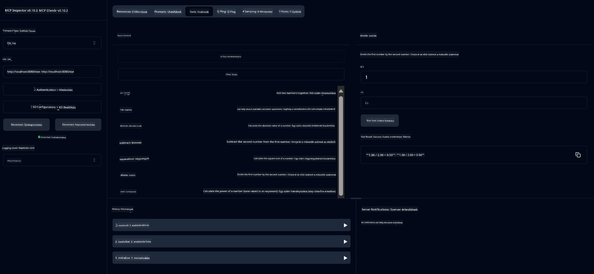

<!--
CO_OP_TRANSLATOR_METADATA:
{
  "original_hash": "ed9cab32cc67c12d8969b407aa47100a",
  "translation_date": "2025-07-13T17:56:08+00:00",
  "source_file": "03-GettingStarted/01-first-server/solution/java/README.md",
  "language_code": "hu"
}
-->
# Alap Számológép MCP Szolgáltatás

Ez a szolgáltatás alapvető számológép műveleteket biztosít a Model Context Protocol (MCP) segítségével, Spring Boot és WebFlux transport használatával. Egyszerű példaként készült kezdők számára, akik az MCP megvalósításokat tanulják.

További információkért lásd a [MCP Server Boot Starter](https://docs.spring.io/spring-ai/reference/api/mcp/mcp-server-boot-starter-docs.html) referencia dokumentációt.


## A szolgáltatás használata

A szolgáltatás az alábbi API végpontokat teszi elérhetővé az MCP protokollon keresztül:

- `add(a, b)`: Két szám összeadása
- `subtract(a, b)`: Az első számból kivonja a másodikat
- `multiply(a, b)`: Két szám szorzása
- `divide(a, b)`: Az első szám osztása a másodikkal (nulla ellenőrzéssel)
- `power(base, exponent)`: Hatványozás
- `squareRoot(number)`: Négyzetgyök számítása (negatív szám ellenőrzéssel)
- `modulus(a, b)`: Maradékos osztás
- `absolute(number)`: Abszolút érték számítása

## Függőségek

A projekt az alábbi kulcsfontosságú függőségeket igényli:

```xml
<dependency>
    <groupId>org.springframework.ai</groupId>
    <artifactId>spring-ai-starter-mcp-server-webflux</artifactId>
</dependency>
```

## A projekt építése

A projekt Maven használatával építhető:
```bash
./mvnw clean install -DskipTests
```

## A szerver indítása

### Java használatával

```bash
java -jar target/calculator-server-0.0.1-SNAPSHOT.jar
```

### MCP Inspector használata

Az MCP Inspector egy hasznos eszköz az MCP szolgáltatásokkal való interakcióhoz. A számológép szolgáltatás használatához:

1. **Telepítsd és indítsd el az MCP Inspectort** egy új terminál ablakban:
   ```bash
   npx @modelcontextprotocol/inspector
   ```

2. **Nyisd meg a webes felületet** az alkalmazás által megjelenített URL-re kattintva (általában http://localhost:6274)

3. **Állítsd be a kapcsolatot**:
   - Állítsd a transport típust "SSE"-re
   - Állítsd be az URL-t a futó szerver SSE végpontjára: `http://localhost:8080/sse`
   - Kattints a "Connect" gombra

4. **Használd az eszközöket**:
   - Kattints a "List Tools"-ra az elérhető számológép műveletek megtekintéséhez
   - Válassz egy eszközt, majd kattints a "Run Tool"-ra a művelet végrehajtásához



**Jogi nyilatkozat**:  
Ez a dokumentum az AI fordító szolgáltatás, a [Co-op Translator](https://github.com/Azure/co-op-translator) segítségével készült. Bár a pontosságra törekszünk, kérjük, vegye figyelembe, hogy az automatikus fordítások hibákat vagy pontatlanságokat tartalmazhatnak. Az eredeti dokumentum az anyanyelvén tekintendő hiteles forrásnak. Fontos információk esetén szakmai, emberi fordítást javaslunk. Nem vállalunk felelősséget az ebből a fordításból eredő félreértésekért vagy téves értelmezésekért.