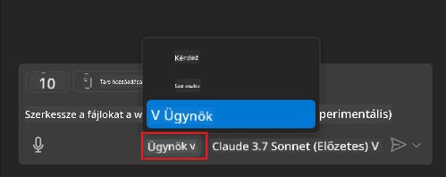
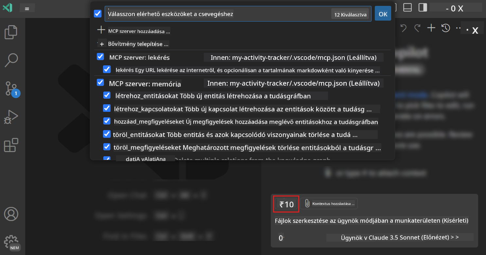
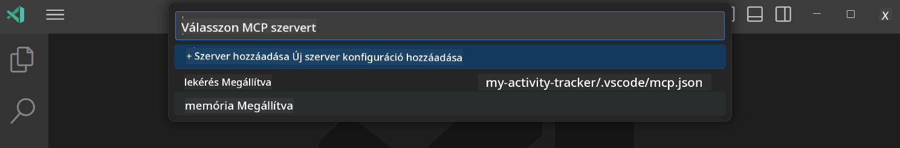
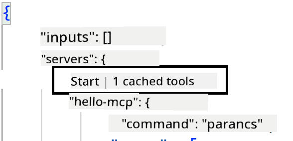
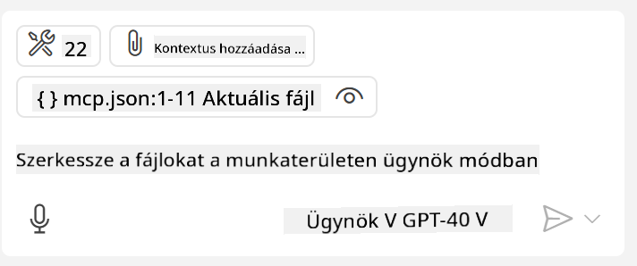

<!--
CO_OP_TRANSLATOR_METADATA:
{
  "original_hash": "d940b5e0af75e3a3a4d1c3179120d1d9",
  "translation_date": "2025-08-26T18:12:06+00:00",
  "source_file": "03-GettingStarted/04-vscode/README.md",
  "language_code": "hu"
}
-->
# GitHub Copilot Agent mód használata egy szerver fogyasztására

A Visual Studio Code és a GitHub Copilot kliensként működhet, és képes egy MCP szervert fogyasztani. Miért lenne ez hasznos, kérdezhetnéd? Nos, ez azt jelenti, hogy az MCP szerver bármilyen funkciója mostantól elérhető az IDE-n belül. Képzeld el például, hogy hozzáadod a GitHub MCP szerverét, így természetes nyelvű utasításokkal vezérelheted a GitHubot ahelyett, hogy konkrét parancsokat írnál a terminálba. Vagy gondolj bármire, ami javíthatja a fejlesztői élményt, mindezt természetes nyelvvel irányítva. Most már látod, miért előnyös ez, igaz?

## Áttekintés

Ez a lecke bemutatja, hogyan használhatod a Visual Studio Code-ot és a GitHub Copilot Agent módját egy MCP szerver kliensként való használatához.

## Tanulási célok

A lecke végére képes leszel:

- MCP szervert fogyasztani a Visual Studio Code-on keresztül.
- Eszközöket futtatni a GitHub Copilot segítségével.
- Beállítani a Visual Studio Code-ot az MCP szerverek megtalálására és kezelésére.

## Használat

Kétféleképpen vezérelheted az MCP szervert:

- Felhasználói felületen keresztül, ennek módját később bemutatjuk ebben a fejezetben.
- Terminálon keresztül, ahol a `code` végrehajtható fájlt használhatod:

  Az MCP szerver felhasználói profilhoz való hozzáadásához használd a --add-mcp parancssori opciót, és add meg a JSON szerverkonfigurációt a következő formában: {\"name\":\"server-name\",\"command\":...}.

  ```
  code --add-mcp "{\"name\":\"my-server\",\"command\": \"uvx\",\"args\": [\"mcp-server-fetch\"]}"
  ```

### Képernyőképek





A következő szakaszokban részletesebben beszélünk arról, hogyan használjuk a vizuális felületet.

## Megközelítés

Íme, hogyan kell megközelíteni ezt magas szinten:

- Konfigurálj egy fájlt az MCP szerver megtalálásához.
- Indítsd el vagy csatlakozz a szerverhez, hogy megjelenítse a képességeit.
- Használd ezeket a képességeket a GitHub Copilot Chat felületén keresztül.

Remek, most, hogy megértettük a folyamatot, próbáljunk meg egy MCP szervert használni a Visual Studio Code-on keresztül egy gyakorlat során.

## Gyakorlat: Szerver fogyasztása

Ebben a gyakorlatban beállítjuk a Visual Studio Code-ot, hogy megtalálja az MCP szerveredet, így az használható lesz a GitHub Copilot Chat felületén keresztül.

### -0- Előkészítő lépés: MCP szerverek felfedezésének engedélyezése

Lehet, hogy engedélyezned kell az MCP szerverek felfedezését.

1. Lépj a `File -> Preferences -> Settings` menüpontra a Visual Studio Code-ban.

1. Keresd meg az "MCP" kifejezést, és engedélyezd a `chat.mcp.discovery.enabled` beállítást a settings.json fájlban.

### -1- Konfigurációs fájl létrehozása

Kezdd egy konfigurációs fájl létrehozásával a projekt gyökérkönyvtárában. Szükséged lesz egy MCP.json nevű fájlra, amelyet egy .vscode nevű mappába kell helyezned. Így kell kinéznie:

```text
.vscode
|-- mcp.json
```

Ezután nézzük meg, hogyan adhatunk hozzá egy szerverbejegyzést.

### -2- Szerver konfigurálása

Add hozzá a következő tartalmat az *mcp.json* fájlhoz:

```json
{
    "inputs": [],
    "servers": {
       "hello-mcp": {
           "command": "node",
           "args": [
               "build/index.js"
           ]
       }
    }
}
```

A fenti példa egy egyszerű példát mutat be egy Node.js-ben írt szerver indítására. Más futtatókörnyezetek esetén add meg a megfelelő parancsot a `command` és `args` használatával.

### -3- Szerver indítása

Most, hogy hozzáadtál egy bejegyzést, indítsd el a szervert:

1. Keresd meg a bejegyzést az *mcp.json* fájlban, és győződj meg róla, hogy megtalálod a "lejátszás" ikont:

    

1. Kattints a "lejátszás" ikonra. Látnod kell, hogy a GitHub Copilot Chat eszközikonja növeli az elérhető eszközök számát. Ha rákattintasz az eszközikonra, látni fogod a regisztrált eszközök listáját. Kipipálhatod vagy kiveheted az egyes eszközöket attól függően, hogy szeretnéd-e, hogy a GitHub Copilot használja őket kontextusként:

  

1. Egy eszköz futtatásához írj be egy olyan promptot, amelyről tudod, hogy illeszkedik az egyik eszköz leírására, például egy ilyen promptot: "add 22 to 1":

  

  Látnod kell egy választ, amely 23-at mond.

## Feladat

Próbálj meg hozzáadni egy szerverbejegyzést az *mcp.json* fájlodhoz, és győződj meg róla, hogy el tudod indítani/leállítani a szervert. Győződj meg róla, hogy kommunikálni tudsz a szerver eszközeivel a GitHub Copilot Chat felületén keresztül.

## Megoldás

[Megoldás](./solution/README.md)

## Főbb tanulságok

A fejezet főbb tanulságai a következők:

- A Visual Studio Code kiváló kliens, amely lehetővé teszi több MCP szerver és azok eszközeinek fogyasztását.
- A GitHub Copilot Chat felület az, ahol a szerverekkel interakcióba lépsz.
- Kérhetsz bemeneteket, például API kulcsokat, amelyeket az MCP szervernek továbbíthatsz a szerverbejegyzés konfigurálásakor az *mcp.json* fájlban.

## Minták

- [Java Számológép](../samples/java/calculator/README.md)
- [.Net Számológép](../../../../03-GettingStarted/samples/csharp)
- [JavaScript Számológép](../samples/javascript/README.md)
- [TypeScript Számológép](../samples/typescript/README.md)
- [Python Számológép](../../../../03-GettingStarted/samples/python)

## További források

- [Visual Studio dokumentáció](https://code.visualstudio.com/docs/copilot/chat/mcp-servers)

## Mi következik?

- Következő: [Stdio szerver létrehozása](../05-stdio-server/README.md)

---

**Felelősség kizárása**:  
Ez a dokumentum az AI fordítási szolgáltatás [Co-op Translator](https://github.com/Azure/co-op-translator) segítségével lett lefordítva. Bár törekszünk a pontosságra, kérjük, vegye figyelembe, hogy az automatikus fordítások hibákat vagy pontatlanságokat tartalmazhatnak. Az eredeti dokumentum az eredeti nyelvén tekintendő hiteles forrásnak. Fontos információk esetén javasolt professzionális emberi fordítást igénybe venni. Nem vállalunk felelősséget semmilyen félreértésért vagy téves értelmezésért, amely a fordítás használatából eredhet.