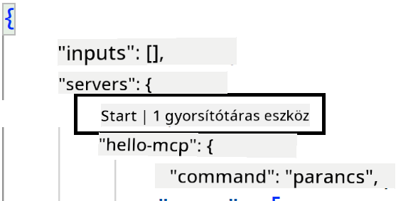
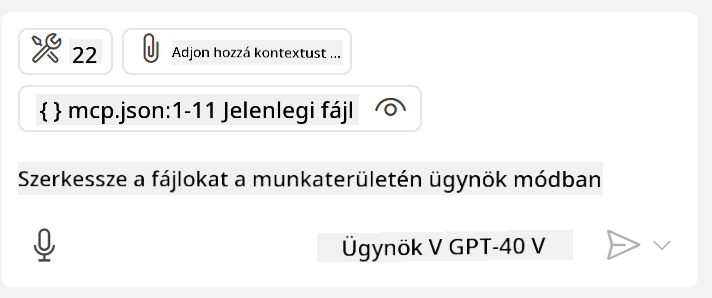
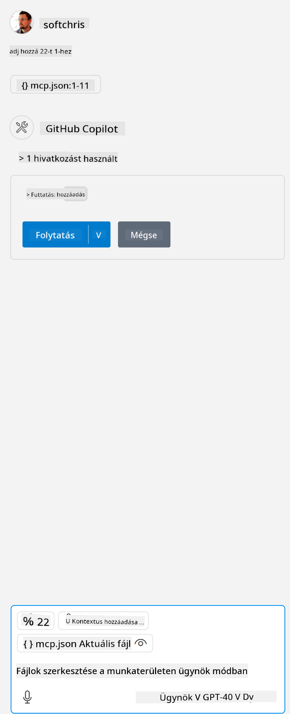

<!--
CO_OP_TRANSLATOR_METADATA:
{
  "original_hash": "c37fabfbc0dcbc9a4afb6d17e7d3be9f",
  "translation_date": "2025-05-17T11:14:11+00:00",
  "source_file": "03-GettingStarted/04-vscode/README.md",
  "language_code": "hu"
}
-->
Beszéljünk többet arról, hogyan használjuk a vizuális felületet a következő szakaszokban.

## Megközelítés

Így kell ezt magas szinten megközelítenünk:

- Konfiguráljunk egy fájlt az MCP Server megtalálásához.
- Indítsuk el/Csatlakozzunk a szerverhez, hogy listázza a képességeit.
- Használjuk ezeket a képességeket a GitHub Copilot chat felületén keresztül.

Nagyszerű, most, hogy értjük a folyamatot, próbáljunk meg használni egy MCP Servert a Visual Studio Code-on keresztül egy gyakorlat során.

## Gyakorlat: Szerver fogyasztása

Ebben a gyakorlatban konfiguráljuk a Visual Studio Code-ot, hogy megtalálja az MCP szerveredet, így az használható lesz a GitHub Copilot chat felületén keresztül.

### -0- Előkészítő lépés, az MCP szerverek felfedezésének engedélyezése

Lehet, hogy engedélyezned kell az MCP szerverek felfedezését.

1. Menj a `File -> Preferences -> Settings` in Visual Studio Code.

1. Search for "MCP" and enable `chat.mcp.discovery.enabled` beállításához a settings.json fájlban.

### -1- Konfigurációs fájl létrehozása

Kezdd azzal, hogy létrehozol egy konfigurációs fájlt a projekted gyökérkönyvtárában, szükséged lesz egy MCP.json nevű fájlra, amit egy .vscode nevű mappába kell helyezned. Ennek így kell kinéznie:

```text
.vscode
|-- mcp.json
```

Ezután nézzük meg, hogyan adhatunk hozzá egy szerver bejegyzést.

### -2- Szerver konfigurálása

Add hozzá a következő tartalmat az *mcp.json*-hoz:

```json
{
    "inputs": [],
    "servers": {
       "hello-mcp": {
           "command": "cmd",
           "args": [
               "/c", "node", "<absolute path>\\build\\index.js"
           ]
       }
    }
}
```

Az alábbi egyszerű példa bemutatja, hogyan indítsunk el egy Node.js-ben írt szervert, más futtatókörnyezetek esetén adjuk meg a megfelelő parancsot a szerver indításához a `command` and `args` használatával.

### -3- A szerver indítása

Most, hogy hozzáadtál egy bejegyzést, indítsuk el a szervert:

1. Keresd meg a bejegyzést az *mcp.json*-ban, és győződj meg róla, hogy megtalálod a "lejátszás" ikont:

  

1. Kattints a "lejátszás" ikonra, látnod kell, hogy a GitHub Copilot chat eszköz ikonján nő az elérhető eszközök száma. Ha rákattintasz az eszköz ikonra, látni fogod a regisztrált eszközök listáját. Kiválaszthatod, hogy melyik eszközt szeretnéd, hogy a GitHub Copilot kontextusként használja:

  

1. Egy eszköz futtatásához írj be egy olyan promptot, amelyről tudod, hogy egyezik valamelyik eszközöd leírásával, például egy ilyen promptot: "add 22 to 1":

  

  Válaszként 23-at kell látnod.

## Feladat

Próbálj meg hozzáadni egy szerver bejegyzést az *mcp.json* fájlodhoz, és győződj meg róla, hogy el tudod indítani/leállítani a szervert. Győződj meg arról is, hogy tudsz kommunikálni a szervered eszközeivel a GitHub Copilot chat felületén keresztül.

## Megoldás

[Megoldás](./solution/README.md)

## Főbb tanulságok

A fejezet főbb tanulságai a következők:

- A Visual Studio Code kiváló kliens, amely lehetővé teszi több MCP szerver és azok eszközeinek használatát.
- A GitHub Copilot chat felülete az, ahol kapcsolatba léphetsz a szerverekkel.
- Kérhetsz a felhasználótól bemeneteket, mint például API kulcsokat, amelyeket átadhatsz az MCP szervernek a szerver bejegyzés konfigurálásakor az *mcp.json* fájlban.

## Minták

- [Java Számológép](../samples/java/calculator/README.md)
- [.Net Számológép](../../../../03-GettingStarted/samples/csharp)
- [JavaScript Számológép](../samples/javascript/README.md)
- [TypeScript Számológép](../samples/typescript/README.md)
- [Python Számológép](../../../../03-GettingStarted/samples/python)

## További források

- [Visual Studio dokumentáció](https://code.visualstudio.com/docs/copilot/chat/mcp-servers)

## Mi következik

- Következő: [SSE szerver létrehozása](/03-GettingStarted/05-sse-server/README.md)

**Felelősség kizárása**:  
Ez a dokumentum az AI fordítási szolgáltatás [Co-op Translator](https://github.com/Azure/co-op-translator) használatával lett lefordítva. Bár törekszünk a pontosságra, kérjük, vegye figyelembe, hogy az automatikus fordítások hibákat vagy pontatlanságokat tartalmazhatnak. Az eredeti dokumentum az eredeti nyelvén tekintendő hiteles forrásnak. Fontos információk esetén javasolt a professzionális emberi fordítás igénybevétele. Nem vállalunk felelősséget a fordítás használatából eredő félreértésekért vagy téves értelmezésekért.